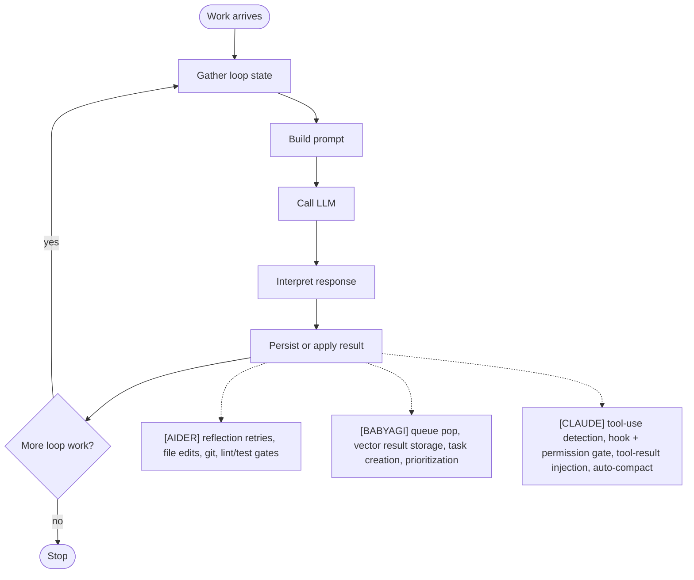
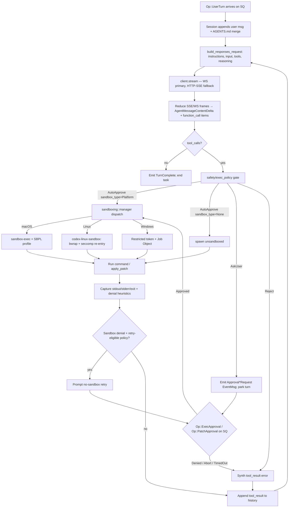
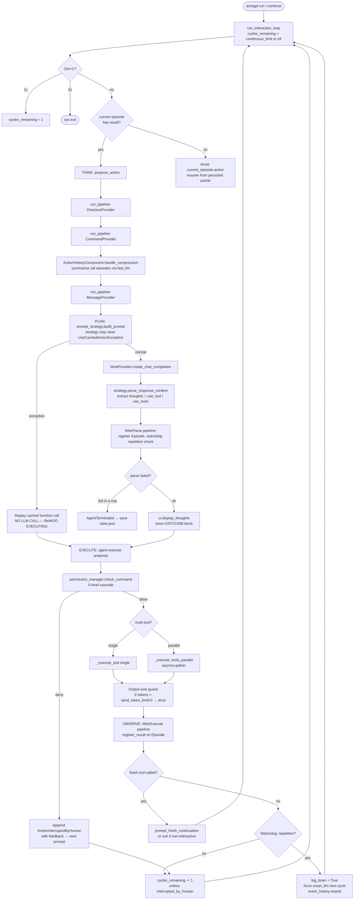
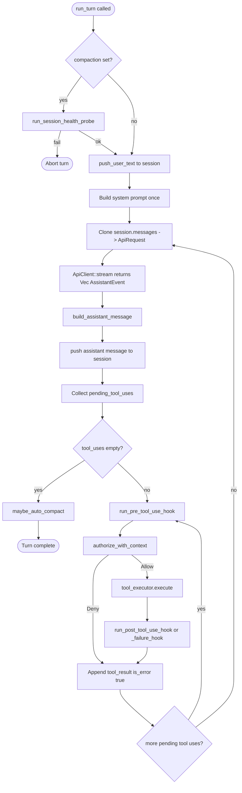
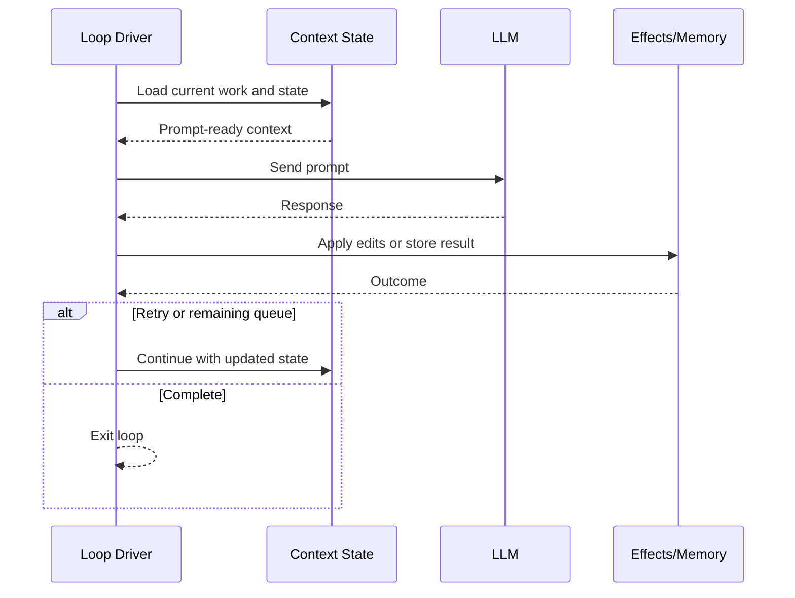
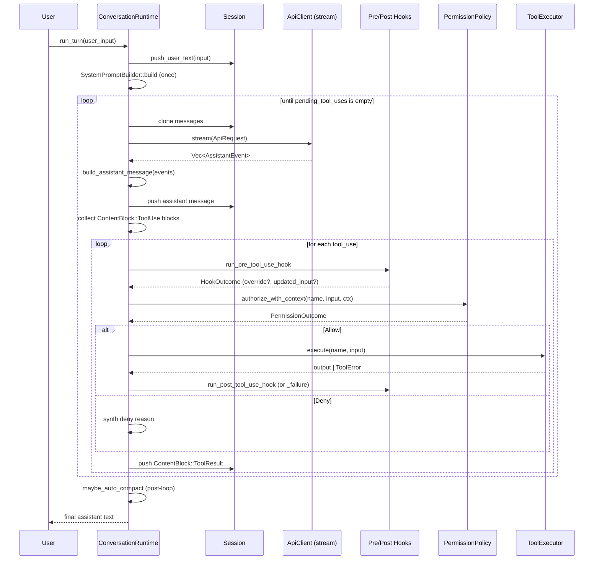

# Agentic Loop
> Module: 01_core_loop | Status: Phase 7 | Last Agent: Phase 7 Specialist Synthesis

## 1. Overview
An agentic loop is the repeatable control structure that accepts work, gathers context, invokes a model, applies or records the result, and decides whether another pass is needed.

[AIDER] uses an interactive code-edit loop: user input is preprocessed, prompt chunks are assembled, the model response is parsed into edits or tool-like shell suggestions, file updates are applied, optional git commits are made, and failures can be reflected into another model pass.

[BABYAGI] uses a minimal objective-driven task loop: pop one task from an in-memory queue, execute it with an LLM prompt, store the result in vector memory, create new tasks, reprioritize the queue, and repeat until the queue is empty.

[CODEX] uses a **sandbox-constrained, queue-mediated loop** driven by a Submission/Event protocol pair (`codex-rs/protocol/src/protocol.rs`). UI front-ends submit `Op` values onto a Submission Queue (SQ); the `core` crate emits `EventMsg` values on an Event Queue (EQ). One user request arrives as `Op::UserTurn`, opens a single active turn, and runs cycles of *(Responses-API stream → tool-call dispatch → safety gate + sandbox orchestration → tool result back into history)* until the model emits a final assistant message with no further tool calls and the turn closes with `EventMsg::TurnComplete`. The defining invariants are: (1) only the OpenAI **Responses API** is used (no Chat Completions branch in `core/src/client.rs`), with a WebSocket-primary / HTTP-SSE fallback transport that pins to HTTP after `UPGRADE_REQUIRED`; (2) every shell command and `apply_patch` flows through `core/src/safety.rs` / `core/src/exec_policy.rs` and the per-OS sandbox dispatcher in `codex-rs/sandboxing/src/manager.rs` before execution (see [sandboxing.md](../07_permissions_and_governance/sandboxing.md)); (3) **approval is a wire-protocol round-trip**, not an in-process callback — the loop emits `EventMsg::ExecApprovalRequest` / `EventMsg::ApplyPatchApprovalRequest` and parks until `Op::ExecApproval { id, turn_id, decision }` / `Op::PatchApproval { id, decision }` arrives, which lets the same `core` crate drive a TUI, headless `exec`, MCP-server-as-Codex, and IDE/app-server front-ends.

[CLAUDE] uses a tool-use loop driven by a single canonical entry point — `ConversationRuntime::run_turn(user_input, prompter)` (claw-code: `rust/crates/runtime/src/conversation.rs:314`). One user turn enters the loop, and the loop iterates `(LLM call → tool-use detection → permission gate → tool execution → tool-result injection)` until the assistant produces a response with **zero** `ToolUse` content blocks. That zero-tool-use response is the **termination condition** (`conversation.rs:396-398`). The loop is bounded by `max_iterations` (default `usize::MAX`) and followed by an optional auto-compaction pass (`conversation.rs:181, 502, 690-704`).

[CLINE] uses an **IDE-embedded, per-action-approval loop** implemented as a VS Code extension (`src/core/task/index.ts`). The loop is entered via `startTask()` (new task) or `resumeTaskFromHistory()` (resume), which both call `initiateTaskLoop()`. The inner `recursivelyMakeClineRequests()` performs one full API round-trip: context loading → compaction check → system prompt assembly → API request → stream processing → tool-use block parsing via `parseAssistantMessageV2()` → per-tool human approval via the `ask()` blocking primitive → tool execution → result collection → next iteration. The **defining invariant** is per-action approval: every tool use (file write, command, browser action, MCP call) is presented to the user via an approval UI before execution, blocking the loop via `pWaitFor()` polling at 100ms intervals until the user responds. Auto-approval modes (`yoloModeToggled`, granular `autoApprovalSettings`) can bypass individual gates. The loop terminates when the LLM calls `attempt_completion`, the user aborts, or the consecutive-mistake limit is reached. (Cline research §1.)

[ROO] uses a **mode-multiplexed variant** of the Cline loop. The same `recursivelyMakeClineRequests` loop runs, but the active **mode** (`architect`, `code`, `debug`, `ask`, `orchestrator`, or a custom mode) swaps the system prompt's leading `roleDefinition` line, the allowed-tool surface (via `TOOL_GROUPS` + `isToolAllowedForMode` validation), and optionally the LLM provider (via per-mode API config). The `orchestrator` mode has `groups: []` — it can only use `ALWAYS_AVAILABLE_TOOLS` (`switch_mode`, `new_task`, `attempt_completion`, etc.), turning the loop into a pure coordination engine. Mode switches happen via the `switch_mode` tool (in-place, same task) or `new_task` (Boomerang delegation — see [multi_agent_patterns.md](../06_orchestration/multi_agent_patterns.md)). Roo also replaces Cline's Plan/Act binary toggle with the generalized mode framework and **removes browser automation** from the loop (pushing it to MCP servers). (Roo research §1, §4.)

[AUTOGPT] uses an **autonomous goal-seeking loop** centered on a `propose_action` / `execute` pair driven by a configurable **prompt strategy** (`classic/original_autogpt/autogpt/agents/agent.py:266-339, 373-460`; `app/main.py:607-787`). One outer `while cycles_remaining > 0` loop iterates until self-termination (`finish` tool raises `AgentFinished`), user interrupt (`Ctrl+C` once → graceful stop, twice → exit), 3 consecutive `InvalidAgentResponseError`s (`AgentTerminated`), or a configured `--continuous-limit`. Inside each cycle, `propose_action` runs **three component pipelines** (`DirectiveProvider.{get_constraints,get_resources,get_best_practices}`, `CommandProvider.get_commands`, `MessageProvider.get_messages`), lazily compresses old episodes via `ActionHistoryComponent`, calls one of seven **swappable prompt strategies** (`one_shot`, `plan_execute`, `rewoo`, `reflexion`, `tree_of_thoughts`, `lats`, `multi_agent_debate`) to build the prompt, dispatches `MultiProvider.create_chat_completion`, and parses the response into `(thoughts, use_tool|use_tools)`. The `AfterParse` pipeline registers the action in episodic memory and runs `WatchdogComponent` loop detection. `execute` then runs the `PermissionManager` 5-level cascade per tool, dispatches single or parallel (`asyncio.gather`) tool calls through the `Command` registry, replaces oversized results with an error (`> send_token_limit // 3`), and the `AfterExecute` pipeline writes the `ActionResult` back onto the current `Episode`. Observation is **implicit** — there is no separate observe step; the next cycle's prompt assembly reads previous results from `event_history`. The defining invariant is the *strategy state machine*: `parse_response_content` is allowed to mutate `current_phase` (e.g. ReWOO `PLANNING → EXECUTING → SYNTHESIZING`), and `build_prompt` may raise `UseCachedActionException` to skip the LLM call entirely (ReWOO `EXECUTING` replays cached `AssistantFunctionCall`s, the source of ReWOO's claimed "5x token efficiency"). (AutoGPT research §1, §2.)

## 2. Blueprint Specification
Core loop contract:

| Element | Specification |
| --- | --- |
| Goal input | A user message, objective, or task description. |
| Working state | Conversation/files/validation state [AIDER]; task deque plus completed-result memory [BABYAGI]; `Session::messages` plus `TokenUsage` plus optional `Session::compaction` marker [CLAUDE]; `apiConversationHistory` + `clineMessages` (UI) + `taskState` (abort, didRejectTool, consecutiveMistakeCount, askResponse) [CLINE] [ROO]. |
| Context assembly | Ordered prompt chunks with files, repo map, history, reminders [AIDER]; objective, current task, and top recalled completed task names [BABYAGI]; system prompt built once outside the loop, then `ApiRequest { system_prompt, messages: session.messages.clone() }` re-cloned every iteration [CLAUDE]; registry-based prompt builder with variant support; system prompt includes `roleDefinition` (mode-dependent [ROO]), environment details (OS, shell, cwd, open tabs), MCP hub, rules (`.clinerules` [CLINE] / `.roo/rules-${mode}/*` [ROO]), and `.clineignore`/`.rooignore` restrictions [CLINE] [ROO]. |
| Model call | Routed through model settings and edit format [AIDER]; centralized `openai_call()` helper for prompt functions [BABYAGI]; `ApiClient::stream(request) -> Vec<AssistantEvent>` reduced into one assistant message per iteration [CLAUDE]; `attemptApiRequest()` waits for MCP servers, streams response via `StreamResponseHandler → parseAssistantMessageV2() → AssistantMessageContent[]` (text or tool_use blocks) [CLINE] [ROO]. |
| Result handling | Parse edits, apply updates, commit, lint/test, reflect on failures [AIDER]; save execution result, create tasks, reprioritize tasks [BABYAGI]; for every `ContentBlock::ToolUse` block, run pre-hook → permission gate → tool executor → post-hook → append `ContentBlock::ToolResult` to the session [CLAUDE]; each tool-use block routed to `ToolExecutor → ToolExecutorCoordinator → IFullyManagedTool` handler; partial blocks shown in UI as they stream; complete blocks checked against `isToolAllowedForMode` [ROO] and `didRejectTool` state; approval via `ask()` → user approve/reject → `pushToolResult()` [CLINE] [ROO]. |
| Loop continuation | Reflected messages trigger up to three additional passes [AIDER]; remaining queued tasks trigger the next iteration [BABYAGI]; non-empty `pending_tool_uses` triggers another iteration; an empty list breaks the loop [CLAUDE]; accumulated `userMessageContent[]` tool results become the next user message, continuing the loop; if no tools were used, `formatResponse.noToolsUsed()` nudges the LLM toward `attempt_completion` [CLINE] [ROO]. |
| Post-loop | None [AIDER]; queue exhausted [BABYAGI]; `maybe_auto_compact()` may rewrite the session if cumulative `input_tokens >= CLAUDE_CODE_AUTO_COMPACT_INPUT_TOKENS` (default `100_000`) [CLAUDE]; `EventMsg::TurnComplete` emitted; auto-compaction via `core/src/compact.rs` may run when the next request would breach the input-token cap, replacing older history with a Memento-style summary plus the most recent user messages up to `COMPACT_USER_MESSAGE_MAX_TOKENS = 20_000`; pre-compaction history retained as `ghost_snapshots` so `Op::Undo` can rewind across the boundary [CODEX]; auto-condense (`summarize_task`) when context nears capacity [CLINE] [ROO]; standard truncation removes a quarter of conversation from `conversationHistoryDeletedRange` [CLINE] [ROO]. |

## 3. Logic Flow
1. Accept the next unit of work.
2. Normalize input and gather context.
3. Invoke the model with the current prompt contract.
4. Convert the model response into state changes.
5. Run any validation, persistence, or memory updates.
6. Decide whether to stop, continue, or reflect errors into another pass.

[AIDER] treats malformed edits, file discovery, lint failures, and test failures as possible `reflected_message` inputs, with confirmation gates for lint and test repair.

[BABYAGI] treats task execution as text production, then lets task creation and prioritization prompts mutate the future queue.

[CODEX] treats each iteration as a Responses-API streaming round followed by sandbox-aware dispatch. The per-iteration sequence is:
1. **`Op::UserTurn` arrives** on the SQ; `Session` appends the user message; AGENTS.md / `AGENTS.override.md` content (root → leaf, joined under `--- project-doc ---`, capped at `project_doc_max_bytes`) is injected into instructions if not already current (`core/src/agents_md.rs`).
2. **`build_responses_request()`** assembles `model`, `instructions`, `input` (full conversation), `tools` (via `create_tools_json_for_responses_api`), `reasoning` (effort + summary), `verbosity`, and optional `output_schema`.
3. **`client.stream`** opens WebSocket (or HTTP-SSE fallback) and reduces frames into `AgentMessageContentDelta` text and `function_call` items. `EventMsg::AgentMessage*` events stream to UI.
4. **If no tool calls** → emit `EventMsg::TurnComplete`, end task.
5. **For each tool call**, the orchestrator (`core/src/tools/orchestrator.rs`) runs the safety gate:
   - For `apply_patch`: `safety.rs::assess_patch_safety(action, AskForApproval, SandboxPolicy, fs_policy, cwd, windows_sandbox_level)` → `AutoApprove { sandbox_type } | AskUser | Reject`.
   - For shell-family tools: `exec_policy.rs` builds `ExecApprovalRequirement`, also yielding auto-approve / ask / reject branches.
6. **On `AskUser`**: emit `EventMsg::ExecApprovalRequest` / `ApplyPatchApprovalRequest` and **park the turn** until matching `Op::ExecApproval { id, turn_id, decision }` / `Op::PatchApproval { id, decision }` lands on the SQ. `ReviewDecision` may be `Approved | ApprovedForSession | ApprovedExecpolicyAmendment | NetworkPolicyAmendment | Denied | TimedOut | Abort`.
7. **On `AutoApprove(sandbox_type=<platform>)`**: dispatch via `codex-rs/sandboxing/src/manager.rs` to Seatbelt (macOS), `codex-linux-sandbox` helper + `bwrap` + seccomp re-entry (Linux), or restricted-token + Job Object (Windows). On `AutoApprove(sandbox_type=None)` (i.e. `DangerFullAccess` / `ExternalSandbox`): spawn directly.
8. **Capture** stdout/stderr/exit + sandbox-denial heuristics. On denial, depending on `AskForApproval`, optionally emit a no-sandbox-retry approval prompt.
9. **Append** structured `tool_result` (or `EventMsg::McpToolCall{Begin,End}` for MCP) to history; loop back to step 2.
10. **Mid-task auto-compaction** may trigger between iterations when the next request would exceed the input-token cap; uses `InitialContextInjection::BeforeLastUserMessage` so AGENTS.md content sits immediately above the live query in the rebuilt history.

[CLAUDE] treats every assistant response as either "final text" or "more tool-use." The detailed per-iteration sequence is:
1. **Pre-turn health probe**: if `session.compaction.is_some()`, run `run_session_health_probe`; abort the turn on probe failure (`conversation.rs:295-326`).
2. **Append user input** to the session as a `ContentBlock::Text` block via `Session::push_user_text` (`conversation.rs:333`).
3. **Build system prompt once** outside the loop via `SystemPromptBuilder::build` (`prompt.rs:144-166`).
4. **Iteration N starts**: clone `session.messages`, send `ApiRequest { system_prompt, messages }` to `ApiClient::stream` (`conversation.rs:352-362`).
5. **Reduce the event stream**: walk `Vec<AssistantEvent>` (`TextDelta`, `ToolUse`, `Usage`, `PromptCache`, `MessageStop`) into a single assistant message, then push it to the session (`conversation.rs:706-753`).
6. **Detect tool use**: filter the assistant blocks for `ContentBlock::ToolUse { id, name, input }` (`conversation.rs:375-384`). If empty → break (loop exit).
7. **For each pending tool use** (sequentially, not in parallel within the harness):
   a. `run_pre_tool_use_hook(tool_name, input)` (`conversation.rs:401-406`; see `audit_and_observability.md`).
   b. Build `PermissionContext` from the hook's `permission_override`/`permission_reason`.
   c. `permission_policy.authorize_with_context(name, effective_input, ctx, prompter)` returns `Allow | Deny | Prompt` (`permissions.rs:175-292`).
   d. On `Allow`, `tool_executor.execute(name, input)` runs the tool (`conversation.rs:445`).
   e. `run_post_tool_use_hook` or `run_post_tool_use_failure_hook` (`conversation.rs:457-483`).
   f. Append `ConversationMessage::tool_result(tool_use_id, tool_name, output, is_error)` to the session (`conversation.rs:494-496`; `session.rs:653-665`).
8. **Iteration N+1**: re-clone `session.messages` (now containing the tool results) and loop back to step 4.
9. **Post-loop**: `maybe_auto_compact()` runs and may emit `AutoCompactionEvent { removed_message_count }` (`conversation.rs:690-704`).

## 4. Flowchart

[CODEX] pattern, expanded:

[AUTOGPT] pattern — think → plan → execute → observe → repeat:

[CLAUDE] pattern, expanded:

## 5. Sequence Diagram

[CLAUDE] tool-use loop:

## 6. Variations & Trade-offs
| Variation | Benefit | Trade-off |
| --- | --- | --- |
| Reflection loop [AIDER] | Repairs parse and validation failures inside the same conversation. | Needs retry caps and user gates to avoid uncontrolled follow-up work. |
| Queue loop [BABYAGI] | Simple autonomous progression from objective to next task. | Pending tasks are in memory and natural-language parsing is brittle. |
| Full-file/edit-protocol loop [AIDER] | Enables direct code modification with scoped files. | Requires parser-specific prompts and failure handling. |
| Text-result loop [BABYAGI] | Minimal implementation and easy to inspect. | No first-class tools, verification, or edit application. |
| Tool-use protocol loop [CLAUDE] | Structured `ToolUse`/`ToolResult` blocks make the loop boundary self-evident — the LLM decides termination by emitting text-only. | Sequential tool dispatch in the harness (no in-iteration parallelism); model can stall in long tool-use chains; needs hook + permission machinery to be safe. |
| Sandbox-constrained, queue-mediated loop [CODEX] | Approval, compaction, MCP, realtime, undo are *observable* SQ/EQ messages, so the same `core` crate drives TUI, headless `exec`, MCP-server, and IDE/app-server unchanged. Sandbox is composed *under* approval; `Never` does not mean "unsandboxed." | Two-dimensional configuration surface (`AskForApproval × SandboxPolicy`); harder to reason about than a single mode flag. WebSocket↔HTTP fallback adds transport state. Approval round-trip latency is bounded by IPC, not in-process callback time. |
| Responses-API-only, freeform `apply_patch` [CODEX] | Tool calls are first-class `function_call` items; `apply_patch` is a freeform-grammar tool whose payload is the patch text itself, not JSON. Multi-file, multi-action edits in one call. | Locked to OpenAI Responses API — no provider portability the way Aider gets through LiteLLM; freeform-grammar tool requires GPT-5-style model support, with a JSON-`{ "input": string }` fallback for older models. |
| Iteration cap [CLAUDE] | `with_max_iterations` lets callers bound runaway tool chains (`conversation.rs:192`). | Default of `usize::MAX` (`conversation.rs:181`) means callers must opt-in to a cap; runaway is theoretically possible. |
| Post-turn auto-compaction [CLAUDE] | The loop never compacts mid-turn — only after termination — so tool-result correlation is preserved. | A single turn that crosses the threshold cannot be rescued mid-flight; the next turn carries the compaction marker and must pass the health probe. |
| IDE-embedded, per-action approval loop [CLINE] | Every tool use is presented to the user before execution — maximum safety and transparency. Streaming partial blocks show the user what's being proposed in real-time. | High latency per tool call (100ms polling); friction for multi-tool workflows unless auto-approval is configured. Tied to VS Code extension lifecycle. |
| Mode-multiplexed loop [ROO] | The same loop serves as planner (architect), coder, debugger, Q&A assistant, or orchestrator by swapping `roleDefinition` + tool surface + optionally the LLM itself. | Mode configuration complexity (persona × tool-RBAC × file-RBAC × model-config); 500ms sleep after mode switch; mode thrashing possible if agent is poorly prompted. |
| Loop detection with soft/hard thresholds [CLINE] | `checkRepeatedToolCall()` catches the LLM calling the same tool with identical parameters repeatedly — soft warning at threshold, hard escalation to mistake limit. | May false-positive on legitimate repeated operations (e.g., polling a file for changes). |
| Plan/Act binary toggle [CLINE] | Simple two-state UX. `strictPlanModeEnabled` blocks file-modification tools in Plan Mode. | Not extensible — only two modes, no custom personas, no per-mode model routing. Superseded by Roo's mode system. |
| `orchestrator` mode with `groups: []` [ROO] | Purely coordination-focused — can only use `switch_mode`, `new_task`, `attempt_completion`, and other always-available tools. No accidental file edits or commands from the orchestrator. | Cannot read files or run commands directly; must delegate all work to child tasks in other modes. |
| Autonomous goal-seeking loop [AUTOGPT] | Single agent runtime hosts seven dramatically different planning paradigms via swappable `PromptStrategy`; observation is implicit (next prompt re-reads `event_history`) so there is no separate observe step to reconcile. `WatchdogComponent` provides reactive fast→smart model escalation on detected repetition, the only autonomous routing in the codebase. | Cycle budget defaults to ∞ in continuous mode — runaway is bounded only by `consecutive_failures` (3 unparseable responses) and the lazy-compression token cap. `total_budget` cost tracking is logged-only, not enforced as a hard stop (gap vs Codex). Permission denial does NOT terminate; it becomes an `ActionInterruptedByHuman` and the agent re-plans, which is rich human-in-the-loop but loses cycle determinism. |
| Strategy state machine with `UseCachedActionException` [AUTOGPT] | ReWOO's `EXECUTING` phase replays the cached `AssistantFunctionCall` by raising a typed exception out of `build_prompt`; `Agent.propose_action` catches it (by string name to avoid an import cycle), runs `AfterParse` to register the action in history, increments `cycle_count`, and returns *without* an LLM call. Token-optimization not seen in other agents. | Catching by string name is fragile across refactors. Strategy phase is held on the strategy object only and is *not* serialized into `state.json`, so a process restart loses ReWOO's plan progress and Reflexion's reflection memory. |
| Two-mode reuse: CLI ↔ Agent Protocol HTTP [AUTOGPT] | Same `propose_action / execute` pair runs in either an interactive `while cycles_remaining > 0` outer loop or as one-cycle-per-`POST /ap/v1/agent/tasks/{id}/steps`, with `state.json` persisted between calls so a long task survives restarts. | HTTP mode shifts loop control to the client; cycle gating is external and idempotency depends on the client's behavior. |
| **Editor-native entity loop** [ZED] | The agent is a Zed `Entity` struct (`{ thread: Entity<Thread>, model_selection, _subscriptions }`), not a separate process. It shares memory with the editor — synchronous access to buffer content, cursor position, worktrees, undo/redo. The `Thread` entity manages messages (analogous to a conversation), and user actions (clicks, text input) route through GPUI's action/listener system. This is a fundamentally different loop shape: the agent is a **data structure inside the editor**, not a CLI or server process. | The agent is tightly coupled to Zed's GPUI framework and cannot run outside the editor. No autonomous background execution — the loop is interactive and driven by user triggers. |
| **Service-oriented multi-platform loop** [HERMES] | Hermes runs as a persistent service, not a one-shot CLI. The agent loop (`agent/__init__.py`) routes incoming messages from a multi-channel gateway (Telegram, Discord, Slack, WhatsApp, Signal, Email, CLI), loads relevant skills and memory (`MEMORY.md`, `USER.md`, `~/.hermes/skills/`), calls the LLM via a pluggable transport abstraction, dispatches tool calls to one of seven terminal backends (local, Docker, SSH, Singularity, Modal, Daytona, Vercel Sandbox), and caches results in persistent memory. The closed learning loop may auto-create or refine skills after notable completions. | Always-on service mode requires process management and multi-platform gateway infrastructure. Skill auto-creation depends on the LLM's judgment — false positives can pollute the skill store. |

## 7. Agent Attribution Table
| Agent | Source-backed contribution |
| --- | --- |
| [AIDER] | Interactive coding loop with input preprocessing, context chunks, model call, edit parsing, file application, git checkpoints, and optional lint/test reflection. |
| [BABYAGI] | Objective loop with task deque, execution prompt, vector result storage, task creation prompt, prioritization prompt, and queue replacement. |
| [CLAUDE] | `ConversationRuntime::run_turn` tool-use protocol loop with health probe, single system-prompt assembly, per-iteration message-cloning, `Vec<AssistantEvent>` reduction, hook + permission gating, file-based tool-result injection, configurable iteration cap, and post-turn auto-compaction. |
| [CODEX] | Submission/Event queue-mediated loop where approval is a wire-protocol round-trip (`Op::ExecApproval` / `Op::PatchApproval` ↔ `EventMsg::ExecApprovalRequest` / `EventMsg::ApplyPatchApprovalRequest`); single-turn-per-session active runtime; Responses-API-only client (`core/src/client.rs`) with WebSocket-primary + HTTP-SSE fallback; `function_call`-shaped tool dispatch; safety gate (`core/src/safety.rs`) returning `AutoApprove { sandbox_type } | AskUser | Reject` for `apply_patch`; per-OS sandbox dispatcher (`sandboxing/src/manager.rs`) layered *under* the approval policy; AGENTS.md root-→-leaf injection joined under `--- project-doc ---`; Memento-style auto-compaction at the next-request token cap with `InitialContextInjection::BeforeLastUserMessage` and `ghost_snapshots` for `Op::Undo`; `EventMsg::TurnComplete` as terminal signal. |
| [CLINE] | IDE-embedded VS Code extension loop via `startTask()` / `resumeTaskFromHistory()` → `initiateTaskLoop()` → `recursivelyMakeClineRequests()`; streaming response parsing via `StreamResponseHandler → parseAssistantMessageV2() → AssistantMessageContent[]`; `TaskPresentationScheduler` with priority levels (`immediate` / `normal`) and configurable cadence; per-action approval via the `ask()` / `say()` paradigm — `ask()` blocks with `pWaitFor()` polling at 100ms until user responds; 17+ ask types (`tool`, `command`, `command_output`, `browser_action_launch`, `use_mcp_server`, `completion_result`, `followup`, `plan_mode_respond`, etc.); granular auto-approval via `AutoApprove` class (`yoloModeToggled`, per-category `autoApprovalSettings`: `readFiles`, `editFiles`, `executeSafeCommands`, `executeAllCommands`, `useBrowser`, `useMcp`); `didRejectTool` flag that skips all subsequent tool blocks on rejection; loop detection via `checkRepeatedToolCall()` with soft-warning and hard-escalation thresholds; Plan/Act binary mode toggle with `strictPlanModeEnabled` gate; termination conditions: `attempt_completion`, user abort (7-phase cleanup), consecutive mistake limit, YOLO + too many mistakes, context window exhaustion; auto-condense (`summarize_task`) and standard truncation (`conversationHistoryDeletedRange`) for context management; git-based checkpoints via `ICheckpointManager` abstraction. |
| [AUTOGPT] | Autonomous think→plan→execute→observe loop in `classic/original_autogpt/autogpt/agents/agent.py:266-339, 373-460` and outer `app/main.py:607-787`; **two operating modes** sharing the same `propose_action`/`execute` pair (interactive CLI `while cycles_remaining > 0` and one-cycle-per-step Agent Protocol HTTP server with `state.json` persistence between calls); **swappable prompt-strategy state machine** with seven strategies (`one_shot`, `plan_execute`, `rewoo`, `reflexion`, `tree_of_thoughts`, `lats`, `multi_agent_debate`) selected via `PROMPT_STRATEGY` env var; **`UseCachedActionException`** typed exception out of `build_prompt` that lets ReWOO `EXECUTING` skip the LLM call entirely; **three component pipelines** (`DirectiveProvider`, `CommandProvider`, `MessageProvider`) with `_topological_sort` ordering via `run_after()` declarations; **lazy compression** of episodic action history triggered only when the next prompt actually needs older episodes; `WatchdogComponent` repetition detection that flips `big_brain=True` to escalate fast_llm→smart_llm, then reverts; permission denial as an `ActionInterruptedByHuman` result that re-enters the next prompt as `[USER FEEDBACK]`; output-size guard replacing oversized tool results with an error before the next cycle; termination via the `finish` command raising `AgentFinished`, `consecutive_failures >= 3`, SIGINT (1× graceful, 2× hard), or `--continuous-limit`. |
| [ROO] | Mode-multiplexed variant of the Cline loop; five built-in modes (`architect` with markdown-only edits, `code`, `debug`, `ask`, `orchestrator` with `groups: []`) plus arbitrary custom modes via `.roomodes`; `ModeConfig` schema (`slug`, `roleDefinition`, `groups`, `customInstructions`, `whenToUse`); mode-aware system prompt assembly with `roleDefinition` as leading line, conditional MCP catalog based on mode groups, `modesSection` listing all modes for the orchestrator picker; `isToolAllowedForMode` validation with alias resolution (`TOOL_ALIASES`), `ALWAYS_AVAILABLE_TOOLS` bypass, group walking, and `FileRestrictionError` for regex-protected groups; `switch_mode { mode_slug, reason }` tool for in-place mode change with per-mode API config loading via `ProviderSettingsManager.getModeConfigId(mode)` and 500ms settling sleep; Boomerang delegation via `new_task { mode, message, todos? }` (see `multi_agent_patterns.md`); `update_todo_list` as always-available task-progress tool with `preventCompletionWithOpenTodos` setting; mode-scoped rule directories `.roo/rules-${mode}/*`; browser automation removed (`deprecatedToolGroups = ["browser"]`); embedded code-index (`codebase_search` via Qdrant + 8 embedder backends) in the `read` group; Cline's Plan/Act replaced by the generalized mode framework. |
| [ZED] | **Editor-native agent entity**: the agent is a GPUI `Entity` struct (`{ thread: Entity<Thread>, model_selection: LanguageModelSelection, _subscriptions: Vec<Subscription> }`) that shares memory with the editor (`crates/agent/src/agent.rs`). `Thread` manages messages analogous to a conversation. Agent state is reactive — updates propagate automatically to all views via `cx.notify()`. User actions route through GPUI's action/listener system. Inline assist renders diffs directly in the editor buffer; agent panel is a sidebar GPUI component implementing `Render`. Deep editor integration: agent can synchronously access buffer content, cursor position, file paths, and participate in undo/redo. This is a **deployment-model contribution** — agent as a native data structure inside the editor — rather than a new loop algorithm. |
| [HERMES] | **Service-oriented agent loop**: persistent process (`agent/__init__.py`) receiving messages from a multi-channel messaging gateway (Telegram, Discord, Slack, WhatsApp, Signal, Email, CLI via `tui_gateway/`). Loop loads relevant skills from `~/.hermes/skills/` (agentskills.io-compatible markdown with YAML metadata), persistent memory from `MEMORY.md` and `USER.md`, and calls the LLM via a pluggable transport abstraction (`agent/transports/base.py` → Anthropic, OpenAI, Bedrock, Gemini, Moonshot, etc.). Tool calls are dispatched to one of seven terminal backends (local, Docker, SSH, Singularity, Modal, Daytona, Vercel Sandbox) via a `Backend(ABC)` interface (`tools/backends/`). A **closed learning loop** (`agent/curator.py`) monitors successful completions, auto-creates or refines skills based on patterns, and writes them to `~/.hermes/skills/` for reuse. The agent runs as a **service** (not a one-shot CLI), supporting serverless hibernation on Modal/Daytona — nearly-free background operation. |

## 8. Repository Implementations

### Roo-Code
- **Core Loop File**: `src/core/task/Task.ts`
- **Method**: The loop is still explicitly named `recursivelyMakeClineRequests`, though internal error logging throws `[RooCode#recursivelyMakeRooRequests]`.
- **Mode Management**: Driven by `CustomModesManager.ts`, which loads `.roomodes` (JSON or YAML) from the workspace root and merges it with global settings to override the system prompt role definition and tool surface on a per-mode basis.
