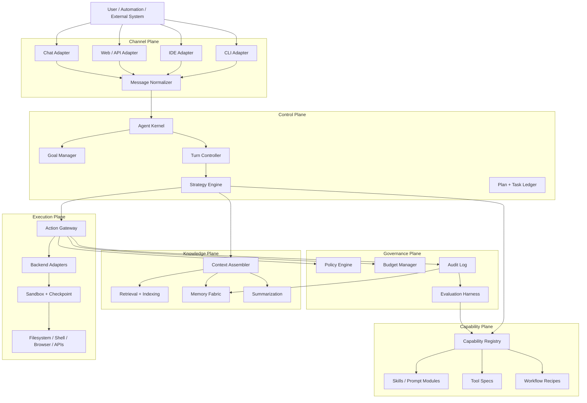
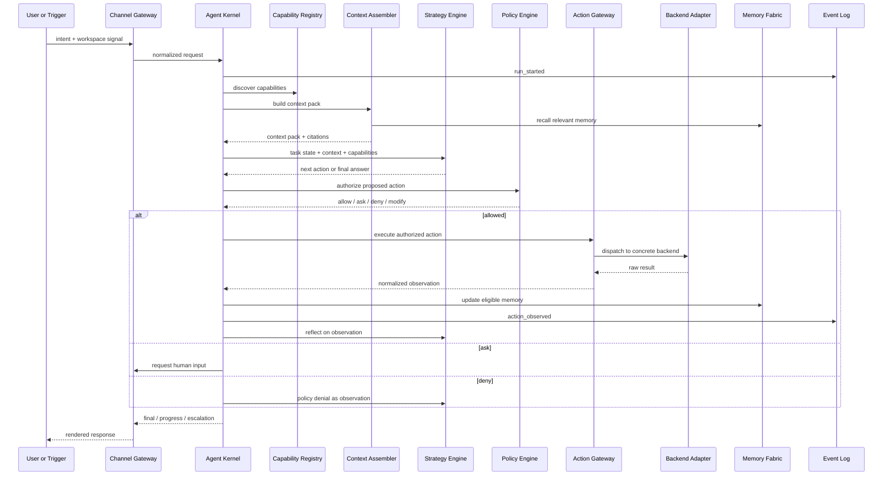

# Modular Agent Architecture Canvas

> Goal: design the most powerful yet flexible agent while preserving modularity,
> decoupling, safety, and long-term evolvability.
>
> Design rule: power must come from composition, not from a larger god object.

## 1. Core thesis

The ideal agent is not one monolithic intelligence. It is a small, stable control kernel
surrounded by replaceable capability modules.

The kernel owns only the loop:

```text
receive intent -> assemble context -> choose strategy -> propose action
-> authorize -> execute -> observe -> learn -> continue or finish
```

Everything else is a port:

| Concern | Owned by | Swappable by design |
|---|---|---|
| Models | Model router | Provider adapters, model policies, prompt formats |
| Tools | Action gateway | Tool plugins, backend adapters, permission rules |
| Context | Context fabric | Retrievers, rankers, summarizers, repo maps |
| Memory | Memory fabric | Working, episodic, semantic, procedural stores |
| Planning | Strategy engine | Reactive, plan-execute, ReWOO, reflection, debate |
| Orchestration | Task bus | Sub-agents, workflows, queues, handoff manifests |
| Safety | Governance layer | Policy bundles, sandboxes, budgets, approvals |
| User surfaces | Channel gateway | CLI, IDE, web, chat, API, automation triggers |

The agent becomes powerful because each plane can improve independently. It remains
flexible because no plane is allowed to reach through another plane's boundary.

## 2. Non-negotiable invariants

1. **Kernel minimalism.** The kernel coordinates the turn lifecycle. It does not know
   provider APIs, filesystem APIs, editor APIs, vector databases, or UI details.
2. **Dependency inversion.** Inner layers depend on contracts. Adapters depend inward.
   No core component imports a concrete tool, channel, model, or storage engine.
3. **Capability discovery over hard-coded menus.** The active tool, skill, model, and
   memory set is assembled from manifests at runtime.
4. **Atomic primitives first.** Tools are small, inspectable primitives. Domain tools are
   shortcuts for hot paths, not gates that hide primitives.
5. **Policies are data.** Permissions, budgets, sandbox rules, routing constraints, and
   approval requirements are declarative policy bundles, not scattered conditionals.
6. **All side effects pass through the action gateway.** File writes, shell commands,
   network calls, browser actions, commits, messages, and deployments are authorized,
   audited, and correlated with a task and policy decision.
7. **State is separated by volatility.** Working memory, event history, semantic memory,
   procedural memory, artifacts, and indexes live in different stores with explicit
   promotion rules.
8. **Everything important emits events.** The system can replay, audit, evaluate, and
   debug a run because decisions and observations are captured as structured events.
9. **Sub-agents receive contracts, not ambient authority.** Delegated workers get a task,
   bounded context, allowed capabilities, budget, policy envelope, and output schema.
10. **Human control is a first-class exit.** The agent can ask, pause, escalate, roll back,
    or degrade instead of pretending every loop must converge autonomously.

## 3. Architecture at a glance



## 4. Component responsibilities

| Component | Owns | Must not own |
|---|---|---|
| Channel gateway | Transport normalization, identity, workspace binding, response rendering hints | Planning, permissions, tool execution |
| Agent kernel | Turn loop, lifecycle events, cancellation, run state transitions | Concrete tools, concrete storage, provider SDKs |
| Goal manager | Goal state, done criteria, explicit completion signals, escalation state | Tool selection, model-specific prompting |
| Strategy engine | Planning pattern selection, next-action proposal, reflection policy | Direct side effects, persistence internals |
| Context assembler | Context budget, relevance ranking, pack construction, source attribution | Business decisions, file writes |
| Memory fabric | Store APIs, promotion/demotion rules, recall interfaces | Hidden writes outside event policy |
| Capability registry | Manifests, dependency checks, conflict resolution, schema versions | Runtime execution side effects |
| Action gateway | Authorization, dispatch, result shaping, rollback hooks, event emission | Planning or user-channel rendering |
| Backend adapters | Concrete execution environment: local, container, remote, browser, cloud | Authorization decisions |
| Policy engine | Allow, deny, ask, redact, budget, sandbox, network, file scope decisions | Tool implementation |
| Evaluation harness | Regression tasks, run scoring, capability telemetry, drift detection | Runtime authority in production loops |

## 5. Core contracts

The exact language does not matter. The important property is that every module depends on
contracts like these, not on concrete implementations.

```ts
type ModuleId = string;
type JsonObject = Record<string, unknown>;

interface AgentEvent {
  id: string;
  runId: string;
  taskId: string;
  type: string;
  at: string;
  payload: JsonObject;
}

interface AgentModule {
  id: ModuleId;
  version: string;
  provides: CapabilityRef[];
  requires: CapabilityRef[];
  init(context: ModuleInitContext): Promise<void>;
  handle(event: AgentEvent): Promise<AgentEvent[]>;
}

interface CapabilityRef {
  kind: "tool" | "skill" | "model" | "memory" | "retriever" | "workflow" | "policy";
  name: string;
  versionRange: string;
}

interface ToolSpec {
  name: string;
  description: string;
  inputSchema: JsonObject;
  outputSchema: JsonObject;
  requiredPermission: PermissionRef;
  effects: EffectDeclaration[];
  idempotency: "idempotent" | "repeatable-with-care" | "non-repeatable";
  rollback?: RollbackSpec;
}

interface ToolExecutor {
  canExecute(spec: ToolSpec, request: ToolRequest): Promise<PolicyDecision>;
  execute(request: ToolRequest, signal: AbortSignal): Promise<ToolResult>;
}

interface ContextProvider {
  id: string;
  estimate(request: ContextRequest): Promise<ContextEstimate>;
  retrieve(request: ContextRequest): Promise<ContextBlock[]>;
}

interface MemoryStore {
  id: string;
  kind: "working" | "episodic" | "semantic" | "procedural" | "artifact";
  read(query: MemoryQuery): Promise<MemoryRecord[]>;
  write(record: MemoryRecord, decision: PolicyDecision): Promise<void>;
}

interface ModelRouter {
  select(request: ModelRouteRequest): Promise<ModelRoute>;
  complete(route: ModelRoute, messages: ModelMessage[], tools: ToolSpec[]): Promise<ModelResult>;
}

interface PolicyEngine {
  decide(request: PolicyRequest): Promise<PolicyDecision>;
}
```

## 6. Turn lifecycle



## 7. The kernel

The kernel is a deterministic state machine. It should be small enough to reason about in
one file or one package.

It owns:

- Run creation, pause, resume, cancel, finish.
- Turn boundaries and iteration limits.
- Event emission and correlation IDs.
- Stop conditions: done, blocked, denied, budget exhausted, user handoff, error threshold.
- Delegation boundaries for sub-agents.

It does not own:

- Which model provider to call.
- How files are read or edited.
- How a browser is driven.
- How context is ranked.
- Where memory is stored.
- Which policy is correct for a workspace.

This is the main decoupling move. If the kernel stays pure, every other piece can evolve.

## 8. Capability graph

Capabilities are declared in manifests and assembled into a graph at runtime.

```yaml
id: code.modify.search_replace
kind: tool
version: 1.4.0
provides:
  - tool: edit.search_replace
requires:
  - policy: workspace.write
  - backend: filesystem
inputs:
  schema: ./schemas/search_replace.input.json
outputs:
  schema: ./schemas/edit_result.output.json
effects:
  - kind: file_write
    scope: workspace
permissions:
  minimum: workspace_write
rollbacks:
  strategy: checkpoint_restore
telemetry:
  emits:
    - tool.started
    - tool.finished
    - tool.failed
```

Graph rules:

- A module may depend on a capability kind and version range, never a concrete class.
- Conflicts are explicit: two tools can provide the same conceptual capability, but the
  registry must choose one active binding or expose both with distinct names.
- Missing optional capabilities degrade gracefully.
- Missing required capabilities fail at startup or task admission, not mid-run.
- Capability selection is logged so later evaluations can explain why a tool was visible.

## 9. Tool architecture

Use three tool layers.

| Layer | Purpose | Examples | Rule |
|---|---|---|---|
| Primitive tools | Maximum composability | read file, edit file, shell, grep, browser click | Always available when policy allows |
| Domain tools | Safer, faster common actions | run test suite, create migration, open PR | Shortcuts, not gates |
| Hot-path services | Deterministic optimized execution | code search index, dependency graph, autoformatter | Must expose fallback path |

Every tool declares:

- Input and output schemas.
- Required permission.
- Side effects.
- Idempotency.
- Timeout and retry behavior.
- Rollback or compensation plan when possible.
- Observability events.

The action gateway enforces this rule:

```text
No declaration, no execution.
No policy decision, no side effect.
No event, no trust.
```

## 10. Strategy engine

Planning strategies are plugins. The agent can change reasoning style without changing the
kernel.

| Strategy | Best for | Decoupling requirement |
|---|---|---|
| Reactive loop | Small tasks, chat, quick edits | Strategy only proposes next action |
| Plan then execute | Multi-step implementation | Plan is a ledger artifact, not hidden text |
| ReWOO-style cached actions | Expensive repeated tool calls | Cached actions are explicit events |
| Reflection loop | Debugging and repair | Reflection produces a new target or stop reason |
| Tree/debate strategies | High-uncertainty design choices | Branches run under budgeted subcontexts |
| Human-in-loop strategy | Ambiguous or risky tasks | Questions are explicit actions with schemas |

The strategy engine receives:

- Goal state.
- Context pack.
- Capability graph.
- Policy envelope.
- Budget envelope.
- Prior observations.

It returns one of:

- `propose_action`
- `delegate_task`
- `ask_human`
- `revise_plan`
- `finish`
- `escalate`

It cannot execute actions directly.

## 11. Context fabric

The context fabric is a pipeline, not a single prompt builder.


Provider types:

- Workspace files and open buffers.
- Repo map and symbol graph.
- Search results: lexical, structural, semantic.
- Recent run events.
- Persistent project memory.
- User preferences and policy.
- External documents, issues, PRs, and tickets.

The assembler owns relevance and budget. It should not own truth. Every block carries
source metadata, age, confidence, and why it was included.

## 12. Memory fabric

Use separate memory classes with explicit promotion gates.

| Memory | Lifetime | Writes allowed when | Example |
|---|---|---|---|
| Working | Current turn/session | Always, but cheap to discard | Current plan, seen files |
| Episodic | Append-only run history | Every important event | Tool calls, errors, decisions |
| Semantic | Cross-task knowledge | Summarized and validated | Project architecture notes |
| Procedural | Reusable how-to | Completion succeeded and pattern recurs | "How to release this service" |
| Artifact | Human-owned truth | User or policy-approved write | Specs, ADRs, docs, tests |

Promotion rule:

```text
Observation -> episodic log -> evaluated summary -> semantic/procedural memory
```

The agent should never silently turn a one-off guess into durable project truth.

## 13. Multi-agent orchestration

Sub-agents are useful only when they improve isolation, parallelism, or specialization.
They should not be an excuse to hide complexity.

A delegation contract contains:

```yaml
task_id: child-123
parent_id: root-001
objective: "Investigate payment retry failures"
done_criteria:
  - "Root cause identified with evidence"
  - "Risk and fix options summarized"
capabilities:
  allow:
    - tool.read
    - tool.search
    - tool.test.readonly
  deny:
    - tool.write
    - tool.deploy
context_pack: ./runs/root-001/context/child-123.json
budget:
  max_turns: 8
  max_tokens: 60000
  max_wall_time_seconds: 900
output_schema: ./schemas/investigation_report.json
handoff_path: ./runs/root-001/handoffs/child-123.md
```

Parent rules:

- Delegate bounded objectives, not vague responsibility.
- Pass the smallest sufficient context pack.
- Use policy inheritance: children can have less authority than the parent, never more by
  default.
- Require structured handoff artifacts.
- Treat child output as evidence, not truth.

## 14. Governance

Governance is the system that lets the agent be strong without being reckless.

| Mechanism | What it controls |
|---|---|
| Permission tiers | Read-only, workspace-write, network, secrets, deploy, destructive actions |
| Policy bundles | Per-user, per-workspace, per-task, per-channel rules |
| Sandboxes | Filesystem, network, process, browser, container, remote backends |
| Budgets | Tokens, dollars, turns, wall time, sub-agent count, recursion depth |
| Approval gates | Ask human before risky or ambiguous operations |
| Checkpoints | Snapshot before writes, restore on failure or rejection |
| Audit trail | Who/what/why for every decision and side effect |
| Redaction | Secrets and sensitive data filtered before model/tool boundaries |

Policy decisions should have one of five outcomes:

- `allow`
- `allow_with_modification`
- `ask`
- `deny_with_reason`
- `deny_and_escalate`

The model should see denials as observations. A denial is not a crash; it is feedback that
must shape the next plan.

## 15. Model routing

The model router isolates the rest of the system from provider churn.

Inputs:

- Task type and risk.
- Needed modalities.
- Required context size.
- Latency and cost target.
- Tool-use support.
- Structured-output support.
- Privacy and data residency rules.
- User or workspace preference.

Outputs:

- Provider and model.
- Prompt/message adapter.
- Tool schema adapter.
- Retry/fallback route.
- Cost and latency estimate.

Routing examples:

| Task | Preferred route |
|---|---|
| Cheap classification | Small fast model |
| Large codebase architecture | Large-context reasoning model |
| Code edit with strict schema | Tool-capable model with structured output |
| High-risk migration plan | Strong model plus critique strategy |
| Private local data | Local or approved private provider |

No strategy or tool should call a provider SDK directly.

## 16. User and channel interfaces

Channels are adapters over the same agent core.

| Channel | Adds | Must not change |
|---|---|---|
| CLI | Shell ergonomics, streaming text, local cwd | Kernel semantics |
| IDE | Buffer state, selections, diagnostics, inline diffs | Permission policy |
| Web app | Rich rendering, dashboards, account identity | Tool contracts |
| Chat | Message threading, attachments, notifications | Goal lifecycle |
| API | Programmatic triggers, webhooks, service auth | Audit requirements |

The parity principle applies: if a human can perform an outcome in a surface, the agent
should have a tool path to achieve the same outcome, subject to policy.

## 17. File and directory layout

A file-first system is easier for humans and agents to inspect.

```text
.agent/
  manifest.yaml
  policies/
    workspace.yaml
    destructive-actions.yaml
  capabilities/
    tools/
    skills/
    workflows/
  memory/
    semantic.md
    procedural/
  indices/
    repo-map/
    embeddings/
  runs/
    2026-07-01T10-00-00Z-root/
      events.jsonl
      plan.md
      context/
      checkpoints/
      handoffs/
      outputs/
  evals/
    regression-suite.yaml
    traces/
```

Files are the human-readable source of truth. Databases and vector stores are accelerators
that can be rebuilt from artifacts where possible.

## 18. Decoupling rules

Use these as code review checks.

| Rule | Why it matters |
|---|---|
| Core packages define contracts; adapters implement contracts | Prevents provider and tool lock-in |
| Strategy plugins produce commands, not side effects | Keeps reasoning testable |
| Tools know schemas and execution, not planning | Prevents bundled judgment |
| Policy engine receives facts, not hidden state | Keeps decisions auditable |
| Memory writes require event provenance | Prevents stale or invented knowledge |
| Context packs carry citations | Makes answers inspectable |
| Sub-agents communicate through handoff artifacts | Prevents shared mutable context bleed |
| Evaluation consumes event logs | Makes regressions reproducible |

Coupling smells:

- A model adapter imports a tool implementation.
- A tool calls another tool by name instead of declaring a dependency.
- A prompt mentions a tool that is not in the active registry.
- A policy is enforced in UI code but absent from backend execution.
- A memory store writes facts without a source event.
- A sub-agent has access to the parent's whole workspace by default.
- A domain tool is the only way to perform an underlying primitive action.

## 19. Power without rigidity

The design becomes powerful along six axes.

| Power axis | Source of power | Flexibility guard |
|---|---|---|
| Reasoning | Multiple planning strategies and model routes | Strategy plugins cannot execute side effects |
| Execution | Atomic tools plus backend adapters | Action gateway and policy gate every side effect |
| Knowledge | Context providers, repo maps, semantic recall | Context packs are cited and budgeted |
| Learning | Procedural memory and eval-driven skill creation | Promotion gates prevent unverified memory |
| Scale | Sub-agents, queues, workflows | Delegation contracts bound authority |
| Trust | Sandboxes, checkpoints, audit, approvals | Policies are declarative and replaceable |

The agent should feel adaptive at the edges and boring at the core.

## 20. Capability graduation path

New behavior should graduate through stages.

| Stage | Form | Graduation criterion |
|---|---|---|
| 0 | Manual prompt | One-off need |
| 1 | Reusable skill | Repeated need with stable reasoning pattern |
| 2 | Workflow recipe | Multi-step pattern with predictable checkpoints |
| 3 | Domain tool | Repeated mechanical operation with clear schema |
| 4 | Optimized service | Hot path needs speed, scale, or determinism |
| 5 | Core contract | Many modules depend on it and alternatives exist |

This keeps the core from absorbing every useful idea too early.

## 21. Evaluation and observability

The agent needs a regression suite the same way software needs tests.

Minimum event fields:

- Run ID, task ID, parent ID.
- User/channel/workspace.
- Active model route.
- Active capability graph hash.
- Context pack hash.
- Policy decisions.
- Tool calls and outputs.
- Memory writes.
- Cost, latency, token use.
- Stop reason.
- Human approvals or overrides.

Minimum eval set:

| Eval | Proves |
|---|---|
| Model swap | No provider is wired into core logic |
| Tool denial | Agent adapts to policy feedback |
| Read-only task | No write tool is invoked |
| Workspace write task | Checkpoint happens before mutation |
| Context overflow | Summarization and retrieval preserve essentials |
| Sub-agent task | Child cannot exceed inherited permissions |
| Memory promotion | Durable memory requires evidence |
| Plugin failure | Bad module degrades or disables cleanly |
| Replay run | Event log reconstructs decisions |
| Surface parity | CLI and IDE reach same core outcome |

## 22. Deployment topologies

The same architecture can run in several shapes.

| Topology | Best for | Notes |
|---|---|---|
| Single-process CLI | Local developer agent | Fast to build, easiest debugging |
| Editor-native entity | Low-latency IDE integration | Shares editor state through an adapter |
| Sidecar daemon | Multiple clients and long-lived memory | Strong fit for CLI + IDE + web reuse |
| Cloud worker | Heavy tasks, isolated execution | Needs stricter sandbox and data policy |
| Distributed workers | Parallel research/build/test | Requires task bus and reservation protocol |

The kernel contract should survive all five. Deployment is an adapter decision, not an
architecture rewrite.

## 23. Build sequence

Build from the inside out.

1. **Kernel and event log.** Implement run lifecycle, stop reasons, and replayable events.
2. **Capability registry.** Load tool, skill, model, context, and policy manifests.
3. **Action gateway.** Enforce policy, dispatch tools, normalize observations.
4. **Context fabric.** Add file, search, repo-map, and memory providers behind one pack API.
5. **Model router.** Add provider adapters and route policies.
6. **Strategy plugins.** Start with reactive and plan-execute; add advanced strategies later.
7. **Memory promotion.** Add durable semantic/procedural memory only after eval gates exist.
8. **Sub-agent contracts.** Add bounded delegation with explicit handoff artifacts.
9. **Evaluation harness.** Replay logs and run regression tasks on every capability change.
10. **Additional channels.** Add IDE, web, chat, and API adapters after the core is stable.

## 24. Architectural decisions

| Decision | Why | Trade-off |
|---|---|---|
| Small kernel plus capability graph | Maximizes replacement and testing | More upfront contract design |
| Event-sourced run history | Enables audit, replay, eval, memory provenance | Requires disciplined event schemas |
| Policy-as-data | Lets safety evolve per workspace and task | Policy language must stay understandable |
| Atomic tools first | Maximizes emergent capability | More model planning burden at first |
| Domain tools as shortcuts | Improves safety and speed on hot paths | Risk of duplicating primitive behavior |
| File-first artifacts | Human and agent inspectability | Needs indexing for scale |
| Strategy plugins | Reasoning can evolve independently | Requires clear action proposal schema |
| Sub-agent contracts | Isolation and parallelism without ambient authority | Handoff design must be precise |

## 25. Definition of done for this architecture

The design is successful when these statements are true:

- A model provider can be replaced without touching tools, memory, policy, or channels.
- A filesystem backend can be replaced by a sandboxed container without touching planning.
- A new skill can be added by manifest and markdown instructions, without code changes.
- A new domain tool can be added without changing the kernel.
- A denied action becomes a normal observation and the agent finds another safe path.
- A sub-agent can finish, fail, or time out without corrupting the parent run.
- Every durable memory entry links to source events or artifacts.
- Every important user-visible answer can cite the context that shaped it.
- Every side effect has a policy decision, event record, and rollback story where possible.
- The same task can be driven from CLI, IDE, or API through the same core lifecycle.

## 26. One-sentence blueprint

Build a tiny auditable kernel, surround it with manifest-discovered capabilities, route all
side effects through policy-governed action gateways, keep knowledge in cited context and
evidence-backed memory, and let power emerge from composable strategies, tools, models,
and sub-agents rather than from a monolith.
