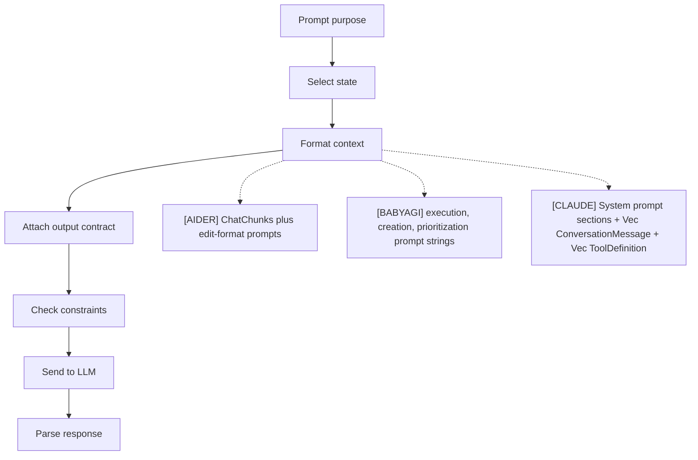
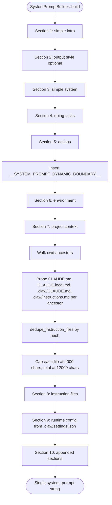
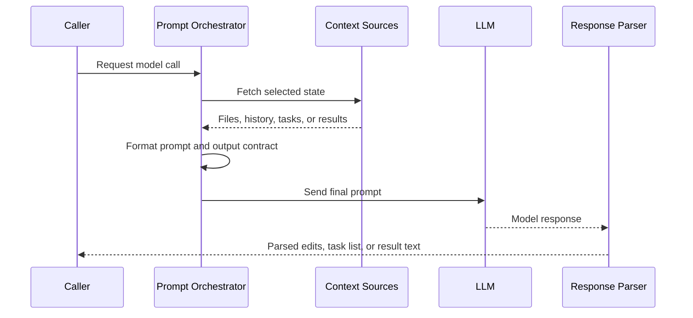
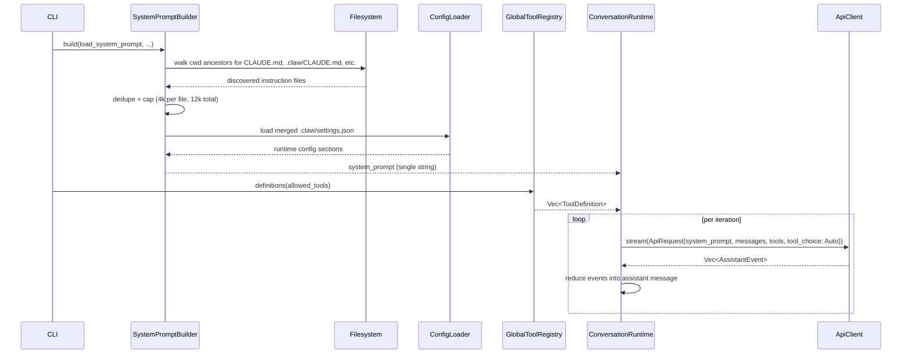

# Prompt Orchestration
> Module: 01_core_loop | Status: Phase 7 | Last Agent: Phase 7 Specialist Synthesis

## 1. Overview
Prompt orchestration defines how state is selected, ordered, formatted, and constrained before a model call.

[AIDER] orchestrates prompts through `ChatChunks`: system text, examples, read-only files, repo map, summarized history, editable files, current messages, and reminders are ordered before token checks and model dispatch.

[BABYAGI] orchestrates prompts through three compact prompt functions: `execution_agent()`, `task_creation_agent()`, and `prioritization_agent()`, all routed through `openai_call()`.

[CLAUDE] orchestrates prompts through `SystemPromptBuilder::build`, which assembles a single system-prompt string **once per turn** outside the loop, plus a sliding `messages: Vec<ConversationMessage>` cloned every iteration. The system prompt is composed of fixed sections in a fixed order, with a literal string anchor `__SYSTEM_PROMPT_DYNAMIC_BOUNDARY__` separating the static preamble from the dynamic context (claw-code: `rust/crates/runtime/src/prompt.rs:40, 144-166`). Tool definitions are sent on `MessageRequest.tools` with `tool_choice: Auto` rather than spliced into the system prompt (`main.rs:7518-7526`).

## 2. Blueprint Specification
| Element | Specification |
| --- | --- |
| Prompt roles | System/examples/files/history/current turn/reminders [AIDER]; single prompt strings for execution, creation, and prioritization [BABYAGI]; one composite `system_prompt: String` plus `messages: Vec<ConversationMessage>` plus separate `tools: Vec<ToolDefinition>` field [CLAUDE]. |
| Context selection | Editable files, read-only files, repo-map snippets, conversation summaries [AIDER]; objective, current task, incomplete task names, and recalled completed task names [BABYAGI]; environment context (cwd, OS, date), project context (repo info), discovered instruction files (`CLAUDE.md` etc.), runtime config — selected by `load_system_prompt(cwd, current_date, os, os_version)` (`prompt.rs:432`) [CLAUDE]. |
| Output contract | Edit-format-specific response syntax such as diff, whole, udiff, patch, or architect [AIDER]; numbered natural-language lists for task creation and prioritization [BABYAGI]; freeform assistant text interleaved with structured `ContentBlock::ToolUse { id, name, input }` blocks parsed via Anthropic streaming events [CLAUDE]. |
| Budgeting | Whole prompt token estimation and repo-map sizing [AIDER]; prompt trimming for `gpt-*` calls in `openai_call()` [BABYAGI]; per-file char cap `MAX_INSTRUCTION_FILE_CHARS = 4_000` and total cap `MAX_TOTAL_INSTRUCTION_CHARS = 12_000` on the instruction block (`prompt.rs:43-44`); auto-compaction on `cumulative input_tokens >= 100_000` (default) replaces older messages with a system summary [CLAUDE]. |
| Safety framing | Only added files are editable; repo-map files are read-only unless added [AIDER]; no durable permission model in the archive loop [BABYAGI]; dynamic-boundary marker separates static safety preamble from injectable context, hook-driven `additionalContext` can be appended (`hooks.rs:588-623`) [CLAUDE]. |

[CLAUDE] system-prompt section ordering (verbatim from `prompt.rs:144-166`):
1. **Simple intro** — fixed identity preamble.
2. **Output style** — optional, only if a style is set.
3. **Simple system** — base behavioral rules.
4. **Doing tasks** — task-execution guidance.
5. **Actions** — action-taking guidance.
6. `__SYSTEM_PROMPT_DYNAMIC_BOUNDARY__` literal marker (`prompt.rs:40`) — pure string anchor, not JSON.
7. **Environment context** — cwd, OS, OS version, date.
8. **Project context** — repo info, including `Claude instruction files discovered: <N>.` cross-link (`prompt.rs:288-300`).
9. **Instruction files** — block headed `# Claude instructions`, with each file rendered as `## <filename> (scope: <ancestor-dir>)` followed by content (`prompt.rs:331, 347-348, 380-391`). See `04_memory/persistent_memory.md`.
10. **Runtime config** — `# Runtime config` section reflecting merged settings (`prompt.rs:448-466`).
11. **Appended sections** — caller-supplied additions.

## 3. Logic Flow
1. Determine the prompt purpose.
2. Select relevant state.
3. Format state into the expected prompt structure.
4. Add output instructions.
5. Check model/budget constraints.
6. Send the final prompt to the LLM.
7. Parse the response according to the prompt contract.

[AIDER] changes both examples and parser when the edit format changes, making prompt orchestration part of model-routing behavior.

[BABYAGI] keeps prompt orchestration minimal and relies on the LLM following numbered-list instructions for queue updates.

[CLAUDE] separates static and dynamic concerns:
1. **Once per turn** — `SystemPromptBuilder::build` produces an immutable `system_prompt: String`. This includes the recursive walk of cwd ancestors for `CLAUDE.md`, `CLAUDE.local.md`, `.claw/CLAUDE.md`, `.claw/instructions.md` (`prompt.rs:213-219`); the deduper hashes content so symlinked-root duplicates collapse (`prompt.rs:353-367`).
2. **Once per turn** — `GlobalToolRegistry::definitions(allowed_tools)` produces a `Vec<ToolDefinition>` filtered by `--allowedTools` (`tools/src/lib.rs:247-278`).
3. **Per iteration** — clone `session.messages`, build `ApiRequest { system_prompt, messages }`, attach the tool definitions on `MessageRequest.tools` with `tool_choice: Auto` (`main.rs:7518-7526`), call `ApiClient::stream`.
4. **Per iteration** — reduce `Vec<AssistantEvent>` into one assistant message, then split tool-use blocks for downstream dispatch.
5. **Hook-driven extension** — `hookSpecificOutput.additionalContext` from a `PreToolUse` hook is appended to the conversation as a `systemMessage` line, expanding context dynamically without rebuilding the system prompt (`hooks.rs:588-623`).
6. **Compaction** — when triggered, replaces older messages with one `MessageRole::System` message containing `COMPACT_CONTINUATION_PREAMBLE + format_compact_summary(summary) + …` and re-appends the last 4 messages verbatim (`compact.rs:71-183`); subsequent compactions merge the prior summary via `merge_compact_summaries` (`compact.rs:106-110, 162`).

## 4. Flowchart

[CLAUDE] system-prompt assembly:

## 5. Sequence Diagram

[CLAUDE] per-turn assembly and per-iteration dispatch:

## 6. Variations & Trade-offs
| Variation | Benefit | Trade-off |
| --- | --- | --- |
| Structured prompt chunks [AIDER] | Predictable ordering and explicit file-scope semantics. | More machinery and more edge cases around token budgets. |
| Edit-format examples [AIDER] | Aligns model output with a parser. | Stale examples can cause format confusion if history is not summarized or reset. |
| Minimal prompt functions [BABYAGI] | Easy to audit and modify. | Numbered-list parsing is fragile and lacks schema validation. |
| Vector recall by objective [BABYAGI] | Adds lightweight memory to execution. | The archive execution context receives task names rather than full result bodies. |
| Static-once / dynamic-each-iteration [CLAUDE] | System prompt is built once per turn — saves per-iteration cost; messages clone is cheap. | Every iteration sends the *full* message list — context window pressure scales with turn length, mitigated only by post-turn compaction. |
| Dynamic-boundary marker [CLAUDE] | Lets downstream tooling and prompt caches treat preamble (cacheable) vs. dynamic (non-cacheable) as distinct regions. | The marker is a literal string only; no JSON delimiter — fragile if a downstream tool tries to split on it. |
| Tool definitions on `tools` field [CLAUDE] | Provider-native: model sees structured `ToolDefinition` schemas, not human-readable doc strings. | Adding a tool requires a `ToolSpec` registration; ad-hoc shell hooks must be wrapped to be visible. |
| Hook-driven `additionalContext` [CLAUDE] | Per-tool-call context injection without rebuilding the system prompt. | The hook author owns the JSON contract — bad output is silently logged and ignored (`hooks.rs:445-501`). |
| **Distributed source-controlled rules** [CONTINUE] | Rules are committed to the repo as markdown files with YAML frontmatter (`.continuerules`, `.continue/checks/`, `.continue/agents/`, colocated `rules.md`). The CLI (`cn`) hydrates rules with project context from context providers, calls the LLM, and posts results as CI status checks. This **decentralizes prompt configuration into the codebase** — teams version agent behavior alongside their code, without tool restarts. Rules compose slash commands (`/fix`, `/test`, `/review`). | Rules are stateless — no conversation memory across invocations. Quality depends on the LLM following markdown instructions. CI integration adds latency to the PR workflow. |

## 7. Agent Attribution Table
| Agent | Source-backed contribution |
| --- | --- |
| [AIDER] | Ordered `ChatChunks`, repo-map/read-only/editable-file separation, edit-format prompts, token checks, and prompt caching behavior. |
| [BABYAGI] | Three prompt-building functions for execution, task creation, and prioritization, with shared `openai_call()` dispatch and numbered-list output contracts. |
| [CLAUDE] | `SystemPromptBuilder::build` with 11-section composition; `__SYSTEM_PROMPT_DYNAMIC_BOUNDARY__` literal marker; cwd-ancestor `CLAUDE.md` discovery with content-hash deduping; per-file (4k) and total (12k) char caps on the instruction block; tool definitions sent on `MessageRequest.tools` with `tool_choice: Auto`; per-iteration message cloning; post-turn `compact_session` summary injection. |
| [CONTINUE] | **Distributed, source-controlled rule-based prompt assembly**: rules are markdown files with YAML frontmatter (`name`, `description`, instructions) committed to `.continuerules` (workspace root), `.continue/checks/` (CI checks), `.continue/agents/` (long-running agents), or colocated `rules.md` (directory-scoped overrides). `core/llm/rules/rules-utils.ts` defines rule metadata types and source display names. Rules compose with context providers (`core/context/`) to assemble prompts: the rule specifies *what to check*, the context provider supplies *what to check it against*, and the LLM call is made via the provider-agnostic abstraction (`core/llm/providers/ProviderInterface.ts`). Slash commands (`/plan`, `/fix`, `/test`) are thin wrappers over rules, making prompt orchestration user-extensible without touching IDE extension code. In CI mode, the CLI (`extensions/cli/`) reads check rules from `.continue/checks/`, hydrates them with project context, calls the LLM, and posts green/red GitHub status checks with suggested diffs — **treating code review rules as version-controlled artifacts** analogous to linters or test suites. |

## 8. Repository Implementations

### Roo-Code
- **System Prompt Assembly**: Handled dynamically per-mode in `src/core/prompts/system.ts`. The prompt is led by the mode's specific `roleDefinition`, followed by formatting, tool guidelines, capabilities (including conditionally included MCP hubs), available modes, and dynamically resolved skills via `getSkillsSection`.
- **Mode-Specific Rules**: Dynamically reads and injects rules from workspace files. It prioritizes `.clinerules-${mode}` (e.g., `.clinerules-architect`) to provide mode-scoped instructions, while appending generic rules from `.clinerules`.
- **Custom Instructions**: Appends global custom instructions defined by the user alongside the mode's `baseInstructions`.
