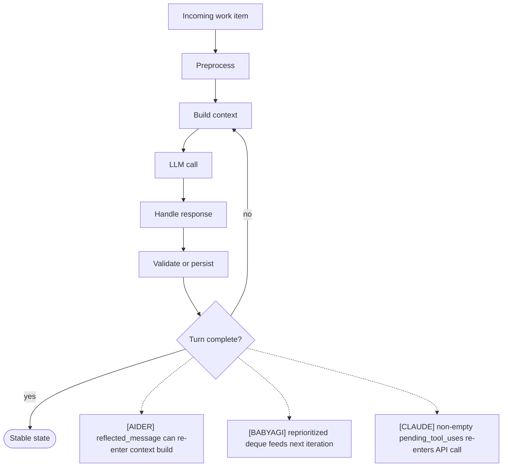
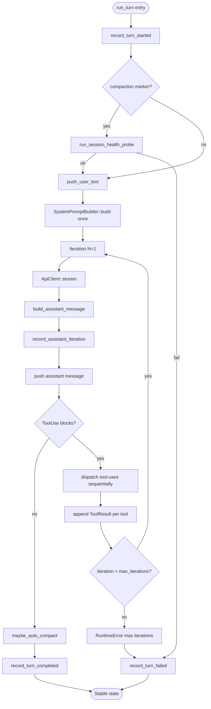
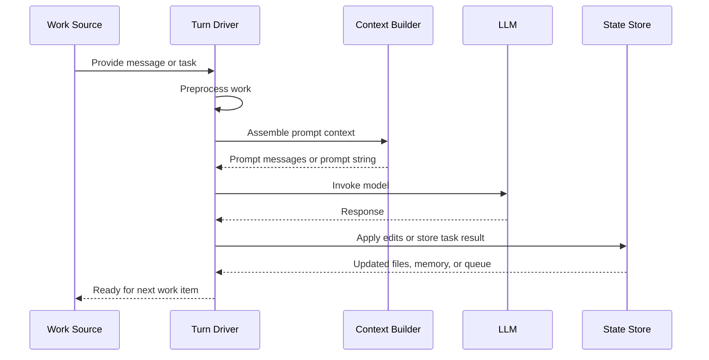
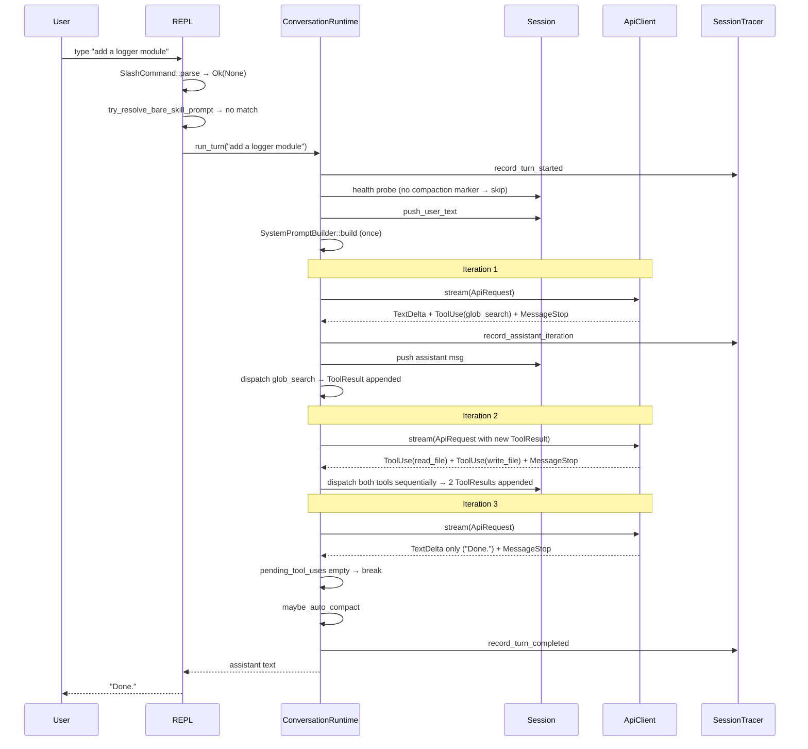

# Turn Lifecycle
> Module: 01_core_loop | Status: Phase 7 | Last Agent: Phase 7 Specialist Synthesis 

## 1. Overview
A turn lifecycle describes what happens from one incoming work item to a stable post-turn state.

[AIDER] defines a turn around a user message or single-message run: commands and file mentions are preprocessed, prompt chunks are assembled, the model is called, edits are parsed/applied, and validation or reflection may extend the turn.

[BABYAGI] defines a practical turn as one task-loop iteration: the next queued task is executed, its result is stored, new tasks are generated, and the remaining queue is reprioritized.

[CLAUDE] defines a turn as exactly one invocation of `ConversationRuntime::run_turn(user_input, prompter)` (claw-code: `rust/crates/runtime/src/conversation.rs:314`). Inside that single function call, the agent may invoke the model **N times** — once per inner iteration — interleaving each model call with zero-or-more sequentially-dispatched tool calls. The turn ends when the assistant produces a response with **zero** `ContentBlock::ToolUse` blocks. A multi-tool-call turn is therefore a single user message that produces an arbitrarily long internal trajectory, all of which is recorded in `Session::messages` before control returns to the caller.

## 2. Blueprint Specification
| Phase | Turn responsibility |
| --- | --- |
| Input | User message or command [AIDER]; queued task popped from deque [BABYAGI]; `user_input: String` argument to `run_turn` [CLAUDE]. |
| Preprocessing | Slash/bang commands, URLs, file mentions [AIDER]; current task names read from storage [BABYAGI]; **slash commands are intercepted before `run_turn`** in the REPL (`main.rs:3579-3617`); `run_turn` itself runs the post-compaction health probe before the loop (`conversation.rs:295-326`) [CLAUDE]. |
| Context | Chat chunks with files, repo map, and history [AIDER]; objective plus recalled completed task names [BABYAGI]; `system_prompt` built once + `session.messages` cloned per inner iteration [CLAUDE]. |
| Model response | Assistant content or function-call content [AIDER]; execution result text or numbered task list text [BABYAGI]; `Vec<AssistantEvent>` reduced into a `ConversationMessage` whose `blocks: Vec<ContentBlock>` interleave `Text`, `ToolUse`, and (after dispatch) `ToolResult` blocks [CLAUDE]. |
| Effects | File edits, commits, shell-output decisions, lint/test gates [AIDER]; vector memory write and queue replacement [BABYAGI]; per tool-use: pre-hook → permission → tool execution → post-hook → tool-result message; all persisted to `Session` [CLAUDE]. |
| Completion | No reflected message or retry cap reached [AIDER]; queue empty or next task remains [BABYAGI]; assistant response with no `ToolUse` blocks (or `max_iterations` cap exceeded); `maybe_auto_compact()` may then rewrite the session [CLAUDE]. |
| Telemetry | Optional debug logs [AIDER]; print statements [BABYAGI]; `record_turn_started`, `record_assistant_iteration`, `record_tool_started`, `record_tool_finished`, `record_turn_completed`/`record_turn_failed` push attributes into an optional `SessionTracer` (`conversation.rs:585-686`) [CLAUDE]. |

## 3. Logic Flow
1. Begin with one unit of work.
2. Normalize and enrich that unit.
3. Compose model context.
4. Send the prompt and collect the response.
5. Apply the response to local state.
6. Validate or persist the outcome.
7. Produce the next lifecycle decision.

[AIDER] can repeat inside the same user turn when `reflected_message` is set, with `max_reflections` limiting the number of passes.

[BABYAGI] advances by loop iterations rather than conversational retries; the reprioritized queue determines the next task.

[CLAUDE] multi-tool-call turn anatomy:
1. **Pre-flight** (REPL only): slash command interception (`main.rs:3579-3617`); bare-skill bypass via `try_resolve_bare_skill_prompt` rewriting the prompt to `${skill} {args}` (`main.rs:3604-3613`).
2. **`run_turn` entry**: `record_turn_started` telemetry (`conversation.rs:585+`).
3. **Health probe**: if the session has a prior `Session::compaction` marker, run a non-destructive `glob_search` probe; abort with `"Session health probe failed after compaction: ..."` on failure (`conversation.rs:295-326`).
4. **User message append**: `Session::push_user_text(user_input)` adds a `ContentBlock::Text` user message (`session.rs:245`).
5. **System prompt build**: `SystemPromptBuilder::build` runs **once** before the loop.
6. **Iteration loop** (bounded by `max_iterations`, default `usize::MAX`):
   a. Clone `session.messages` into an `ApiRequest`.
   b. Call `ApiClient::stream(request)` → `Vec<AssistantEvent>`.
   c. Reduce via `build_assistant_message`: `TextDelta` accumulates into `ContentBlock::Text`; each `ToolUse` flushes accumulated text and pushes `ContentBlock::ToolUse`; `Usage` records `TokenUsage`; `MessageStop` ends the message (`conversation.rs:706-753`).
   d. Push the assistant message to the session.
   e. Filter for `ContentBlock::ToolUse` blocks. If empty → break.
   f. For each tool-use (sequentially): pre-hook, permission, execute, post-hook, append `ContentBlock::ToolResult` with `tool_use_id` correlation.
   g. Continue to next iteration.
7. **Post-loop**: `maybe_auto_compact()` runs once. If `cumulative input_tokens >= CLAUDE_CODE_AUTO_COMPACT_INPUT_TOKENS` (default `100_000`), compact and emit `AutoCompactionEvent { removed_message_count }` (`conversation.rs:502, 690-704`).
8. **Telemetry close**: `record_turn_completed` or `record_turn_failed` (`conversation.rs:585-686`).

Inside a single `run_turn`, the **assistant-iteration count** can be 1 (no tool calls — pure text response), 2 (one round-trip of tool calls), or any N. Each `ContentBlock::ToolUse` produces one paired `ContentBlock::ToolResult` keyed by `tool_use_id`. The provider-side `convert_messages` maps `MessageRole::Tool` to `"user"` while preserving the tool-result content block (`main.rs:8793-8831`), which is how Anthropic-style tool round-trips re-enter the model context naturally on the next iteration.

## 4. Flowchart

[CLAUDE] multi-tool-call anatomy:

## 5. Sequence Diagram

[CLAUDE] one user message, multiple model calls:

## 6. Variations & Trade-offs
| Variation | Benefit | Trade-off |
| --- | --- | --- |
| Conversational turn [AIDER] | Preserves interaction history and scoped files. | Needs summarization and token-budget controls. |
| Autonomous task iteration [BABYAGI] | Simple loop boundaries and low implementation cost. | No explicit retry, status, or failure lifecycle. |
| Validation inside lifecycle [AIDER] | Lint/test results can become repair context. | Repair is gated by user confirmation and can lengthen the turn. |
| Queue mutation after execution [BABYAGI] | Each result can reshape future work. | Bad task-generation output can destabilize the queue. |
| Multi-tool-call turn [CLAUDE] | One user message can trigger arbitrary internal trajectories without conversational round-tripping; tool results re-enter the model naturally as `MessageRole::Tool` (mapped to provider `"user"`). | Token cost grows quadratically with iteration count because every iteration sends the full `messages.clone()`; the harness has no streaming surface — events are returned synchronously, so latency is the sum of model and tool wall-clocks. |
| Sequential per-iteration tool dispatch [CLAUDE] | Easy to reason about: tool N+1 sees tool N's result; no cross-tool race conditions. | No in-iteration tool parallelism even when the model emits independent `ToolUse` blocks; long-running tools serialize the rest of the iteration. |
| Health probe gate [CLAUDE] | Catches sessions in inconsistent post-compaction states before they corrupt the next turn. | Adds one extra (cheap) tool call at the start of every post-compaction turn. |

## 7. Agent Attribution Table
| Agent | Source-backed contribution |
| --- | --- |
| [AIDER] | User-input preprocessing, `run_one()` turn handling, chat chunk assembly, response accumulation, edit application, reflection, and validation gates. |
| [BABYAGI] | One-task iteration with queue pop, execution prompt, result storage, follow-up task creation, prioritization, and queue replacement. |
| [CLAUDE] | `ConversationRuntime::run_turn` as a single canonical turn entry; pre-turn health probe; once-per-turn `SystemPromptBuilder::build`; multi-iteration tool-use loop with `tool_use_id` ↔ `tool_result` correlation; sequential per-iteration tool dispatch; `record_turn_started/completed/failed` telemetry hooks; post-loop `maybe_auto_compact` driven by `cumulative input_tokens >= 100_000` (default). |

## 8. Repository Implementations

### Roo-Code
- **Turn Lifecycle Base**: Inherits the core loop behavior from Cline (via `Task.ts` using `recursivelyMakeClineRequests`), processing user input, calling the LLM, waiting for tool usage blocks, gating tool usage via `ask()`, and recursively calling the API until task completion.
- **Mode Switching Hooks**: Unique to Roo-Code is the `switch_mode` tool which allows the agent to switch modes mid-turn. This executes a state flush and optionally passes a reason string, requiring the loop to settle (500ms delay) and re-initialize context under the new persona before resuming the lifecycle.
- **Task Delegation**: The turn lifecycle can spawn child workflows via the `new_task` tool, pushing the parent turn to wait for sub-task completion.
