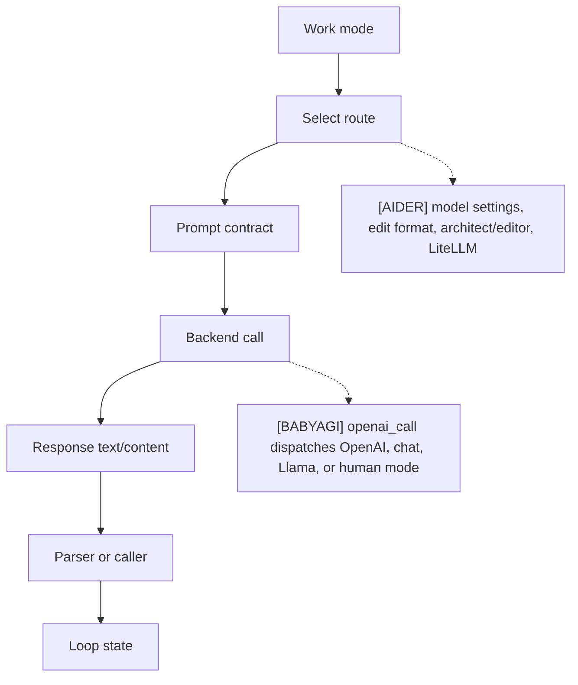
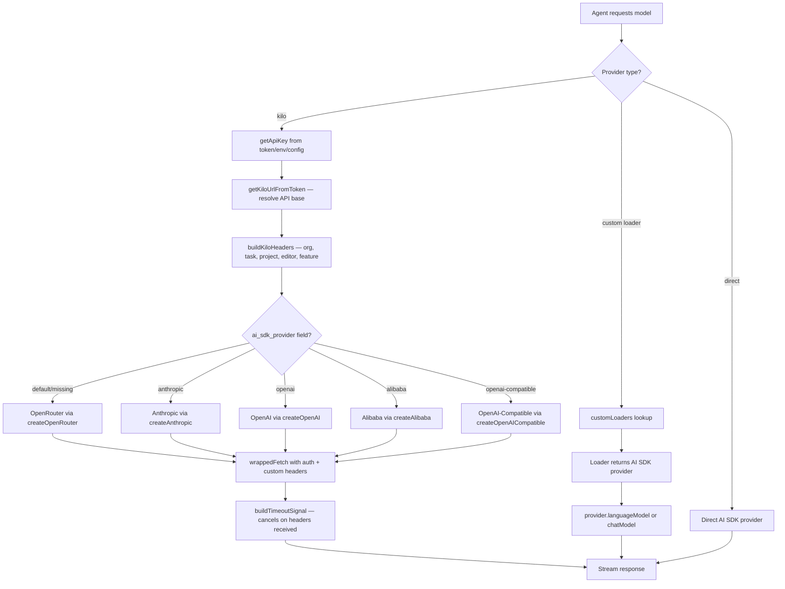
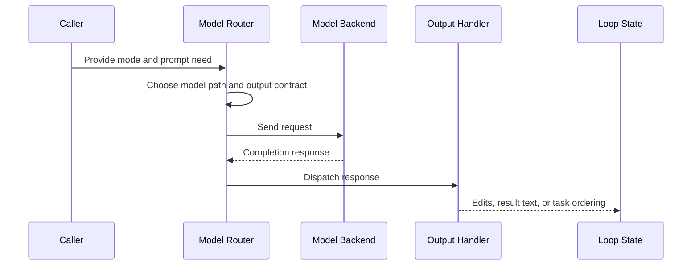

# Model Routing
> Module: 02_cognition | Status: Phase 7 | Last Agent: Phase 7 Specialist Synthesis

## 1. Overview
Model routing chooses which model path, prompt contract, and response parser should handle a given step.

[AIDER] has explicit routing through model settings, edit formats, chat modes, architect/editor model selection, weak/main models for summarization, and `Model.send_completion()` via LiteLLM.

[BABYAGI] has minimal routing: all three archive prompt agents call `openai_call()`, which dispatches between local Llama mode, human mode, non-chat OpenAI completions, and `gpt-*` chat completions.

[KILO] introduces a **proxy-first multi-provider architecture** via the Kilo Gateway (`@kilocode/kilo-gateway`). All model requests route through a unified OpenRouter-backed proxy that adds custom auth headers, organization scoping, and model metadata (recommended index, free tier, AI SDK provider hints). The gateway wraps five AI SDK providers — OpenRouter (default), Anthropic, OpenAI, Alibaba, and OpenAI-compatible — behind a single `createKilo()` factory. Provider-specific patches inject required headers (e.g., Anthropic's `claude-code-20250219` beta, Cerebras' 3rd-party integration header). A custom timeout handler (`buildTimeoutSignal`) replaces `AbortSignal.timeout()` with a cancellable timer that clears once response headers arrive.

[OPENCODE] provides the custom-loader foundation that Kilo extends. Each provider is loaded via `customLoaders` — async factory functions that return AI SDK-compatible provider instances. Providers auto-detect credentials from environment variables, auth stores, or config files. The `models.dev` registry supplies model metadata (context limits, capabilities, costs).

[PI] introduces a **lazy-loaded multi-LLM API** as a third routing paradigm — distinct from Aider's role-split (architect/editor) and Kilo's gateway proxy. The `@earendil-works/pi-ai` package (`packages/ai/src/`) abstracts every LLM provider behind a single `streamSimple(model, context, options)` entry point that takes a typed `Model<Api>`, a `Context` (system prompt, messages, tools), and `SimpleStreamOptions`, returning a unified `AssistantMessageEventStream`. Providers are registered via a strict one-to-one **API → provider** registry (`packages/ai/src/providers/register-builtins.ts:342-403`) — the model's `.api` field determines the provider; there is no routing table. Crucially, every provider is **lazy-loaded** through `createLazyStream(loadAnthropicProviderModule)` / `createLazySimpleStream(...)`: SDK modules (Anthropic, OpenAI, Google, Mistral, Bedrock, etc.) are imported only on first use, so users who never touch Bedrock never load the AWS SDK. 14 APIs are supported (`anthropic-messages`, `openai-responses`, `openai-completions`, `openai-codex-responses`, `azure-openai-responses`, `mistral-conversations`, `google-generative-ai`, `google-vertex`, `bedrock-converse-stream`, plus OpenRouter, Vercel AI Gateway, Cloudflare, xAI, Groq, Cerebras, Zenmux through OpenAI-compatible endpoints). Reasoning is unified via a provider-agnostic `ThinkingLevel` enum (`minimal | low | medium | high | xhigh`) with optional per-level token budgets that providers map to their native formats (Anthropic's `budget_tokens`, OpenAI's `reasoning_effort`).

## 2. Blueprint Specification
| Element | Specification |
| --- | --- |
| Route selector | CLI/model settings, chat mode, edit format, editor model fields [AIDER]; model name and mode flags inside `openai_call()` [BABYAGI]. |
| Prompt coupling | Route selects coder prompts and parser behavior [AIDER]; route reuses plain prompt strings for each agent function [BABYAGI]. |
| Execution backend | LiteLLM completion request with model name, stream flag, temperature, tool/function call options, and extra params [AIDER]; OpenAI Completion, ChatCompletion, local Llama, or human input branch [BABYAGI]. |
| Specialized route | Architect model can delegate to editor model with editor edit format [AIDER]; no separate planner/executor model split in the archive baseline [BABYAGI]. |
| Response handling | Content or function-call accumulation before edit parsing [AIDER]; text response returned to task loop or list parser [BABYAGI]. |

## 3. Logic Flow
1. Identify the work mode.
2. Select model and prompt contract.
3. Build the backend request.
4. Send the request.
5. Route the response to the matching parser or caller.
6. Feed parsed output back into loop state.

[AIDER] treats edit format as a routing contract because changing it swaps both prompt examples and parser implementation.

[BABYAGI] routes by model family rather than task type; execution, task creation, and prioritization share the same call helper.

[KILO] routes by provider identity via the Kilo Gateway:
1. Determine auth state (token, env var, or anonymous).
2. Select the target URL from the token payload (custom vs default API base).
3. Build request headers (org ID, task ID, project ID, editor name, feature flag).
4. Route model to the appropriate sub-provider via `ai_sdk_provider` metadata field (`alibaba`, `anthropic`, `openai`, `openai-compatible`).
5. Apply provider-specific patches (beta headers, endpoint overrides).
6. Send via wrapped fetch with custom headers injected.

[OPENCODE] routes by custom loader name:
1. Provider name is looked up in `customLoaders` map.
2. Loader function returns an AI SDK provider instance.
3. Model ID is passed to `provider.languageModel(modelID)` or `provider.chatModel(modelID)`.
4. Result is an AI SDK `LanguageModel` ready for streaming.

[PI] routes by `Model.api` field via a registry of lazy-loaded providers:
1. `streamSimple(model, context, options)` reads `model.api`.
2. `resolveApiProvider(api)` looks up the provider in `apiRegistry: Map<Api, ApiProvider>` (`packages/ai/src/stream.ts:17-59`).
3. If the provider's module hasn't loaded yet, `createLazyStream` invokes `loadProviderModule()` which dynamically `import()`s the SDK file (`./anthropic.js`, `./openai-responses.js`, etc.) and caches the promise.
4. The provider's `streamSimple()` is invoked with the model + context + options.
5. The provider transforms pi's canonical `Message[]` (user/assistant/toolResult) to the provider-native format, maps tool definitions (TypeBox → Anthropic `Tool`/OpenAI `ChatCompletionTool`/Google `function_declarations`), streams events from the SDK, and normalizes them into the unified `AssistantMessageEvent` shape (`start | text_start | text_delta | text_end | toolcall_start | toolcall_delta | toolcall_end | thinking_start | thinking_delta | thinking_end | done | error`).

## 4. Flowchart


### [KILO] Kilo Gateway Routing



### [PI] Lazy-loaded multi-LLM dispatch

```mermaid
flowchart TD
    A[Agent calls streamSimple(model, context, options)] --> B[resolveApiProvider model.api]
    B --> C{Provider in registry?}
    C -- no --> Err[throw No API provider registered]
    C -- yes --> D{Provider module<br/>already loaded?}
    D -- no --> E[loadProviderModule:<br/>dynamic import the SDK file<br/>cache module promise]
    D -- yes --> F[Use cached module]
    E --> F
    F --> G[provider.streamSimple]
    G --> H[transformMessages → provider-native format]
    H --> I[Map tools TypeBox → provider tool schema]
    I --> J[Stream events from SDK]
    J --> K[Normalize to AssistantMessageEvent:<br/>start/text_delta/toolcall_*/thinking_*/done/error]
    K --> L[AssistantMessageEventStream yields to caller]
```

### Routing pattern contrast

The three Phase 5/6 routing patterns differ along three orthogonal axes:

| Axis | [AIDER] role-split | [KILO] gateway proxy | [PI] lazy-loaded API registry |
| --- | --- | --- | --- |
| Selection key | Role (architect / editor / weak / main) chosen by the agent at call time | Provider identity routed through `createKilo()` proxy | `Model.api` enum dispatches to a registered `ApiProvider` |
| Network topology | Direct LiteLLM call per role; multiple SDKs always loaded | Single OpenRouter-backed proxy URL with patched headers and `wrappedFetch` | Direct SDK call for SDK-based providers; direct HTTP for OpenAI-compat endpoints; **no proxy layer** |
| SDK loading | Eager (every supported SDK loaded at import time) | Eager (5 AI SDK providers wrapped at startup) | **Lazy** — provider SDK files imported only on first use |
| Provider extensibility | Add to `MODEL_SETTINGS` table | Add a `customLoader` + register with `KILO_BUNDLED_PROVIDERS` | Call `registerApiProvider({ api, stream, streamSimple })` — extensions can add providers without modifying core |
| Reasoning surface | Per-model temperature / top-p / extra params | Provider-specific patches (`patchCustomLoaderResult`) inject beta headers | Unified `ThinkingLevel` enum with provider-mapped budgets (`Anthropic budget_tokens`, OpenAI `reasoning_effort`) |

## 5. Sequence Diagram


## 6. Variations & Trade-offs
| Variation | Benefit | Trade-off |
| --- | --- | --- |
| Edit-format routing [AIDER] | Keeps prompts aligned with parsers. | More route combinations to test. |
| Architect/editor routing [AIDER] | Lets planning and editing use different model/configuration choices. | Handoff adds latency and state-copying complexity. |
| Central helper routing [BABYAGI] | Keeps model invocation easy to inspect. | No task-specific model policy beyond prompt differences. |
| Human or local mode [BABYAGI] | Provides simple alternate execution branches. | The archive loop still lacks robust tool, permission, or validation routing. |
| Per-mode model routing [ROO] | Different LLMs per mode — Opus for planning, Sonnet for coding, cheap for Q&A. | Mode switches require API config reload; 500ms settling sleep. |
| **Proxy-first via Kilo Gateway** [KILO] | Single API surface wraps 5 AI SDK providers; custom auth, org scoping, and model metadata (free tier, recommended index, small model priority) enable unified billing and routing. Anonymous access with free models lowers the barrier to entry. | Proxy adds a network hop; locked to OpenRouter as the default backend; token-based URL resolution adds complexity. |
| **Provider-specific patches** [KILO] | Anthropic beta headers, Cerebras 3rd-party headers, Azure endpoint overrides, and OpenRouter default headers are applied transparently by `patchCustomLoaderResult`. | Provider-patch registry must be maintained as providers evolve; patches are applied at load time, not per-request. |
| **Custom timeout handling** [KILO] | `buildTimeoutSignal()` replaces `AbortSignal.timeout()` with a timer that clears once response headers arrive — prevents aborting healthy long-running streaming responses. | Custom abort controller management; must clear timeout on both success and failure paths. |
| **Custom loader extensibility** [OPENCODE] | Any provider can be added via an async factory function — no source changes needed for new providers. | Loader must return an AI SDK-compatible interface; loader errors surface at model-resolution time, not at config-parse time. |
| **Lazy-loaded provider SDKs** [PI] | Memory and cold-start saved for unused providers — users who never touch Bedrock never load the AWS SDK. Provider modules dynamically `import()`-ed on first use, with the module promise cached. | Dynamic imports require ESM-compatible runtimes; first call to a new provider pays the import cost; tooling cannot statically infer which providers are actually used. |
| **Strict API → provider one-to-one registry** [PI] | No routing table; the model's `.api` field deterministically picks the provider. Extensions add providers via `registerApiProvider({ api, stream, streamSimple })` without modifying core. | No automatic fallback or load balancing across providers; multi-provider strategies must live above the registry layer. |
| **Unified `ThinkingLevel` enum** [PI] | Provider-agnostic reasoning configuration: `minimal \| low \| medium \| high \| xhigh` with optional per-level token budgets that providers map to their native formats (`Anthropic budget_tokens`, OpenAI `reasoning_effort`). | Some providers (Codex, Completions) emit `text_delta` with the full text rather than streaming; tool-call argument streaming is provider-dependent. |
| **Provider-agnostic IDE layer** [CONTINUE] | `core/llm/providers/ProviderInterface.ts` is a thin abstraction over any API (OpenAI, Anthropic, Ollama, custom endpoints). Switching models is a config change in `continue.json`, not a refactor. Comparable to Hermes' transport but applied to the IDE use case (VS Code, JetBrains). | Table stakes by now — the novelty is in the rule orchestration (see `prompt_orchestration.md`), not the provider layer itself. |
| **Transport abstraction with tool normalization** [HERMES] | `agent/transports/base.py` defines `ProviderTransport(ABC)` with `convert_messages`, `convert_tools`, `build_kwargs`, and `normalize_response`. Each provider (Anthropic, OpenAI, Bedrock, Gemini, Moonshot, Xiaomi MiMo, etc.) implements this. Unlike Continue's provider model, Hermes' transport also handles **tool normalization** (not just message conversion) and is tightly integrated with the agent loop's error handling and retry logic. `hermes model openrouter:meta-llama/llama-3.3-70b` switches models at runtime. | Transport must be maintained per-provider as APIs evolve; tool normalization is a second axis of compatibility beyond messages. |
| **LanguageModelRegistry with ACP** [ZED] | `crates/language_model/` provides a unified `LanguageModelRegistry` for querying available models, managing credentials, and routing calls. Supports Anthropic, OpenAI, Ollama, and others via Agent Control Protocol (ACP) servers. Users can set a default model in `settings.json`, switch per-conversation (`/model openrouter:...`), or fall back to local Ollama. All within the editor — no external process. | Coupled to Zed's editor runtime; cannot be used outside the editor. ACP is an emerging protocol with limited ecosystem. |

## 7. Agent Attribution Table
| Agent | Source-backed contribution |
| --- | --- |
| [AIDER] | Model settings, registered edit formats, LiteLLM request construction, prompt/parser coupling, architect/editor model routing, and weak/main summarization paths. |
| [BABYAGI] | Shared `openai_call()` dispatch across local Llama, human mode, OpenAI Completion, and `gpt-*` ChatCompletion for execution, creation, and prioritization prompts. |
| [ROO] | Per-mode model routing via `ProviderSettingsManager.getModeConfigId(mode)` returning saved API config per mode (GPT-5 for code, Opus for architect, cheap for ask). |
| [KILO] | Kilo Gateway (`@kilocode/kilo-gateway`) proxy provider wrapping OpenRouter, Anthropic, OpenAI, Alibaba, and OpenAI-compatible backends behind `createKilo()` factory; `getApiKey()` credential resolution from options → env → auth store → anonymous fallback; `getKiloUrlFromToken()` token-derived API base URL; `buildKiloHeaders()` with organization ID, task ID, project ID, machine ID, editor name, and feature flag headers; `wrappedFetch` injecting auth + custom headers; `KILO_BUNDLED_PROVIDERS` mapping for provider registration; model schema extensions (`recommendedIndex`, `prompt`, `isFree`, `ai_sdk_provider`); `patchCustomLoaderResult()` injecting Anthropic beta header, OpenRouter/Vercel/Zenmux default headers, Cerebras 3rd-party header, Azure endpoint resolution; `buildTimeoutSignal()` cancellable timeout that clears on response headers; small model priority via `kilo-auto/small`; `kiloCustomLoader` async factory with credential auto-detection. |
| [OPENCODE] | Custom loader system (`customLoaders` map) with async factory functions returning AI SDK providers; `models.dev` registry for model metadata (context limits, capabilities, costs); provider auto-detection from environment variables. |
| [AUTOGPT] | `MultiProvider` thin dispatcher (`forge/llm/providers/multi.py`) selecting OpenAI / Anthropic / Groq / LiteLLM by model name; two-slot `smart_llm` / `fast_llm` configuration with `BaseAgentConfiguration.big_brain` toggle (default `True` → `smart`); strategies declare `LanguageModelClassification.SMART_MODEL \| FAST_MODEL` per phase; `Agent.complete_and_parse` injects provider-specific reasoning controls (`thinking_budget_tokens` for Claude 3.7+, `reasoning_effort: low\|medium\|high` for OpenAI o-series and GPT-5); per-task provider headers (`AP-TaskID`, `AP-StepID`, `AutoGPT-UserID`) injected via `_get_task_llm_provider`; `WatchdogComponent` is the only autonomous routing decision point — flips `big_brain=True` on detected loops, then reverts after one successful smart-LLM cycle. |
| [PI] | `streamSimple(model, context, options)` unified entry point in `@earendil-works/pi-ai` (`packages/ai/src/stream.ts:17-59`); strict API → provider registry via `registerApiProvider({ api, stream, streamSimple })` (`packages/ai/src/providers/register-builtins.ts:342-403`); lazy provider loading via `createLazyStream(loadProviderModule)` and `createLazySimpleStream(...)` (lines 89-201) — SDK modules imported only on first use, module promise cached; 14 supported APIs (`anthropic-messages`, `openai-responses`, `openai-completions`, `openai-codex-responses`, `azure-openai-responses`, `mistral-conversations`, `google-generative-ai`, `google-vertex`, `bedrock-converse-stream`, plus OpenRouter / Vercel AI Gateway / Cloudflare / xAI / Groq / Cerebras via OpenAI-compat); per-provider `transformMessages` mapping pi's canonical `Message[]` (user/assistant/toolResult) to provider-native format; tool normalization from TypeBox to Anthropic `Tool`/OpenAI `ChatCompletionTool`/Google `function_declarations`; unified event stream (`AssistantMessageEvent`: `start`, `text_start`, `text_delta`, `text_end`, `toolcall_start`, `toolcall_delta`, `toolcall_end`, `thinking_start`, `thinking_delta`, `thinking_end`, `done`, `error`); provider-agnostic reasoning via `ThinkingLevel` enum (`minimal \| low \| medium \| high \| xhigh`) with `ThinkingBudgets {minimal?, low?, medium?, high?}` token budgets mapped to native fields per provider. |
| [CONTINUE] | **Provider-agnostic LLM layer** via `core/llm/providers/ProviderInterface.ts` — thin abstraction over OpenAI, Anthropic, Ollama, and custom endpoints. Model switching is a `continue.json` config change. Multi-IDE strategy (VS Code, JetBrains) and CLI+IDE parity use the same provider abstraction. |
| [HERMES] | **Provider transport abstraction** via `agent/transports/base.py` defining `ProviderTransport(ABC)` with `convert_messages(messages) → Any`, `convert_tools(tools) → Any`, `build_kwargs(model, messages, tools) → Dict`, `normalize_response(response) → NormalizedResponse`. Implements transports for Anthropic, OpenAI, Bedrock, Gemini, Moonshot, Xiaomi MiMo, etc. Tool normalization (not just message conversion) is tightly integrated with the agent loop's error handling and retry logic. Runtime model switching via `hermes model openrouter:meta-llama/llama-3.3-70b`. OpenRouter aggregation support. |
| [ZED] | **LanguageModelRegistry** (`crates/language_model/`) providing a unified interface for querying available models, managing credentials, and routing calls across Anthropic, OpenAI, Ollama, and Agent Control Protocol (ACP)-compatible servers. Per-conversation model switching (`/model openrouter:...`), local Ollama fallback, and `agent_settings/src/agent_profile.rs` per-agent profile configuration — all within the editor. |

## 8. Repository Implementations

### Roo-Code
- **Mode-Specific Routing**: Roo-Code implements LLM routing inherently through its mode system via `ProviderSettingsManager.ts`. When the agent switches modes (e.g., from `architect` to `code`), it loads the API configuration uniquely saved for that mode. This allows users to configure a high-reasoning model (like Opus) for `architect` and a fast coding model (like Sonnet) for `code`.
- **API Provider Architecture**: It inherits the Cline API provider abstraction, supporting Anthropic, OpenAI, OpenRouter, AWS Bedrock, GCP Vertex, Google Gemini, and others, mapping the provider-specific SDK interfaces back to a unified stream handler.
