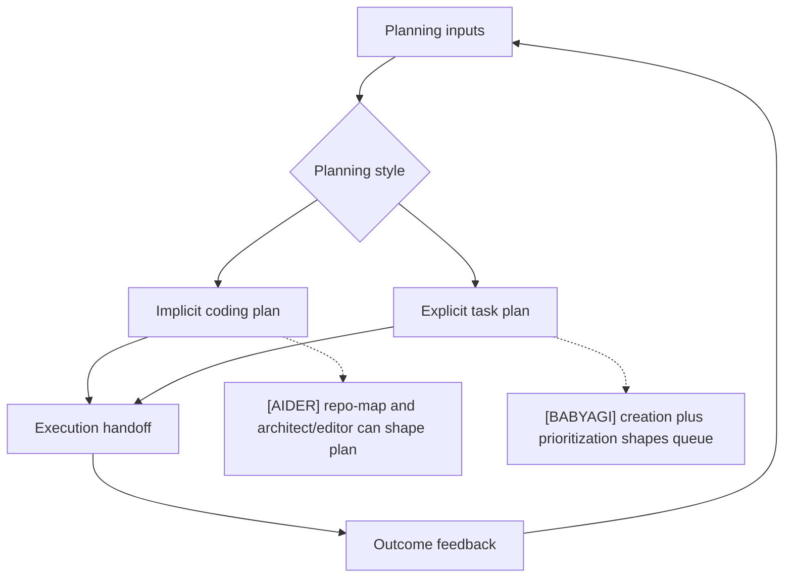
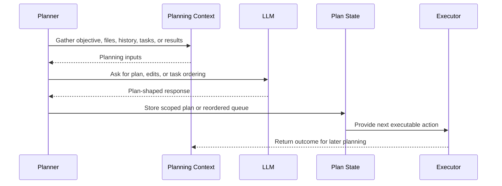

# Planning Strategies
> Module: 02_cognition | Status: Phase 7 | Last Agent: Phase 7 Specialist Synthesis

## 1. Overview
Planning strategy is the policy for deciding what should happen before execution and what should be executed next.

[AIDER] plans through context selection, repo-map ranking, edit-format choice, and optional architect mode; it usually keeps planning embedded in the coding conversation.

[BABYAGI] plans through a create-then-prioritize cycle: completed task results generate candidate tasks, then the prioritization prompt ranks all incomplete tasks against the objective.

[HERMES] plans through skill-driven composition: the agent identifies recurring patterns and codifies them into reusable skill procedures, reducing reliance on zero-shot reasoning.

## 2. Blueprint Specification
| Element | Specification |
| --- | --- |
| Planning scope | Files and edit strategy for a coding turn [AIDER]; ordered list of incomplete objective tasks [BABYAGI]. |
| Planning input | User request, chat history, repo map, file set [AIDER]; objective, completed result, current task, pending tasks [BABYAGI]. |
| Planning mechanism | Model prompt plus edit-format or architect/editor mode [AIDER]; `task_creation_agent()` followed by `prioritization_agent()` [BABYAGI]. |
| Plan persistence | Conversation state and optional commits [AIDER]; in-memory deque plus completed-result vector memory [BABYAGI]. |
| Execution handoff | Parsed edits or editor coder run [AIDER]; highest-priority deque item in the next loop iteration [BABYAGI]. |

## 3. Logic Flow
1. Collect planning inputs.
2. Decide whether planning is implicit or explicit.
3. Produce a plan-shaped model response.
4. Convert the response into executable state.
5. Execute or hand off the next action.
6. Feed outcomes back into future planning.

[AIDER] repo-map planning ranks file nodes and identifier references so the model sees compact snippets from likely relevant files.

[BABYAGI] prioritization is destructive at the queue level because the parsed ranked list replaces the existing deque.

## 4. Flowchart

## 5. Sequence Diagram

## 6. Variations & Trade-offs
| Variation | Benefit | Trade-off |
| --- | --- | --- |
| Embedded planning [AIDER] | Keeps planning close to code context and edit application. | Plan state can be implicit in conversation history. |
| Architect/editor planning [AIDER] | Separates high-level instructions from low-level edit protocol. | Adds an acceptance step and a second coder invocation. |
| Create-prioritize loop [BABYAGI] | Makes next-work selection explicit and objective-driven. | Queue replacement trusts the parsed LLM ordering. |
| Vector-memory feedback [BABYAGI] | Completed work can influence future execution. | Recall is limited to top completed task names in the archive baseline. |
| Skill-driven planning [HERMES] | Procedural-memory-driven: agent increasingly relies on learned, refined skills rather than zero-shot reasoning. | Requires curator maintenance and standard compliance for cross-agent portability. |

## 7. Agent Attribution Table
| Agent | Source-backed contribution |
| --- | --- |
| [AIDER] | Planning via repo-map ranking, file scope, edit-format selection, conversation context, and optional architect/editor delegation. |
| [BABYAGI] | Planning via execution-result-driven task creation, objective-based prioritization, queue replacement, and vector recall of completed work. |
| [HERMES] | Planning via skill-driven composition; automates procedural memory creation via `agent/curator.py` and YAML-based skill storage for reusable, standard-compliant task execution. |

## 8. Repository Implementations

### Roo-Code
- **Architect Mode**: Roo-Code separates high-level planning from low-level coding through its built-in `architect` mode. The `architect` is restricted from writing code directly (it has markdown-only edit capabilities or read-only tools) and is responsible for researching, formulating a plan, and passing that plan to the `code` mode via a mode switch.
- **Boomerang Delegation**: The agent can spawn sub-tasks using the `new_task` tool, passing a `message` and an initial `todos` list. The parent agent waits for the child's completion, allowing recursive, structured planning and execution.
