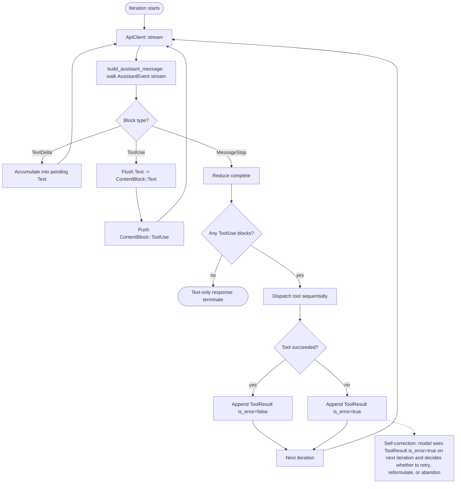
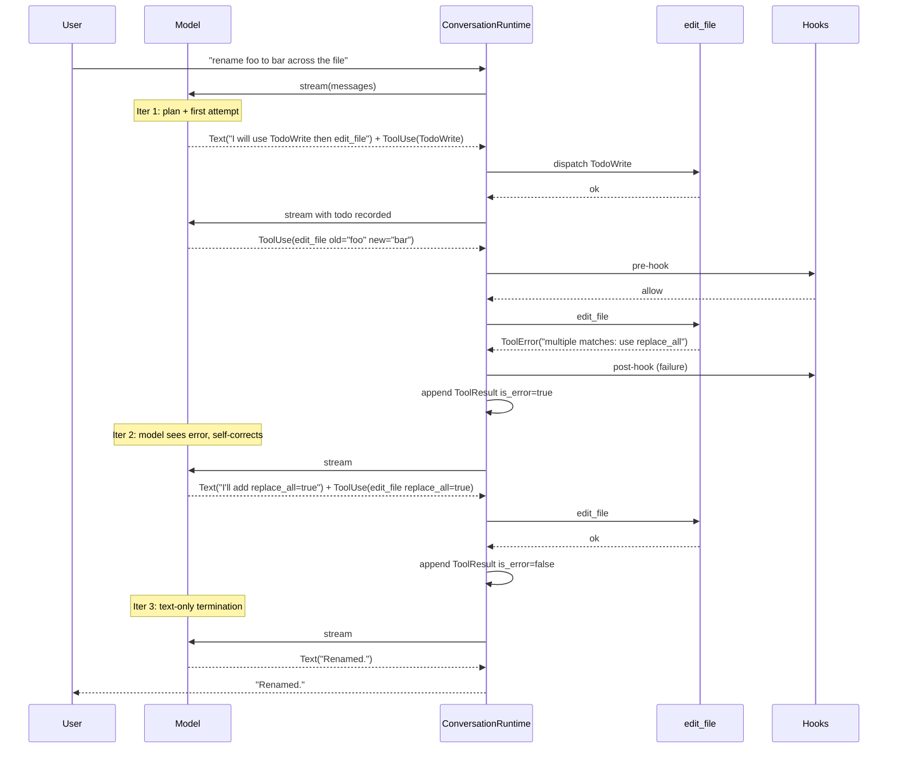

# Reasoning Patterns
> Module: 02_cognition | Status: Phase 7 | Last Agent: Phase 7 Specialist Synthesis 

## 1. Overview
Reasoning patterns describe how an agent generates intermediate steps, self-evaluates, and self-corrects between observation and final action. The "loop" is the structural carrier; the "reasoning pattern" is what the model is asked to produce *inside* each loop iteration.

[CLAUDE] reasoning is structural rather than special-cased: the harness exposes a tool-use protocol and lets the model decide *whether* to think out loud, *whether* to invoke a tool, and *whether* to retry. Self-correction is emergent — every tool error becomes a `ContentBlock::ToolResult { is_error: true }` that re-enters the model context on the next iteration, where the model can choose to reformulate, retry, or abandon. There is no explicit "extended thinking" toggle in the claw-code harness at HEAD `a389f8d` — `Thinking` content blocks are not registered in `mvp_tool_specs()` and there is no `<thinking>` framing injected by the system prompt builder. The reasoning surface is therefore: (a) **freeform text deltas** that interleave with tool use, (b) the **`TodoWrite` tool** as an explicit planning surface, (c) the **`Skill` tool** for invoking encapsulated reasoning routines, and (d) the **`AskUserQuestion` tool** as an escape valve when ambiguity is high.

[AIDER] and [BABYAGI] reasoning patterns are documented in `02_cognition/task_decomposition.md`, `02_cognition/planning_strategies.md`, and `02_cognition/model_routing.md`. This document covers Claude Code's structural pattern and (Phase 6) AutoGPT's explicit self-critique mechanisms — including the **Reflexion** strategy and the **ReWOO** cached-action replay pattern.

[AUTOGPT] reasoning is **explicit and pluggable**: every prompt strategy's `Thoughts` model includes a `self_criticism: str` field that the LLM is forced to fill on every cycle (the schema is dumped into the prompt as a TypeScript interface and `SystemComponent.get_best_practices` directives instruct *"Continuously review and analyze your actions … Constructively self-criticize your big-picture behavior constantly"*). Beyond that built-in surface, three strategies stage *dedicated* critique phases: **Reflexion** (`reflexion.py`) runs an `Evaluator` (heuristic regex by default, with `EvaluatorType.LLM` declared but currently falling back to heuristic) over each tool result and writes a `Reflection {action_name, action_arguments, result_summary, what_went_wrong, what_to_do_differently, success, evaluation_score, verbal_reflection}` into a `ReflexionMemory(reflections, max_reflections=20, FIFO trimmed)` that surfaces in the next prompt as a `## Lessons from Past Attempts` section; **Tree of Thoughts** (`tree_of_thoughts.py`) attaches a `categorical_evaluation: "sure" | "maybe" | "impossible"` per node with `evaluation_votes: dict[str, int]` aggregated via multi-sample voting; **Multi-Agent Debate** (`multi_agent_debate.py`) runs a structured `CRITIQUE` phase (`STRENGTHS / WEAKNESSES / SUGGESTIONS / SCORE` per critic, `num_debaters=3, num_rounds=2` by default) followed by a `CONSENSUS` phase that either votes (`use_voting=True`) or synthesizes. ReWOO contributes a different reasoning pattern — **cached-action replay**: the entire action plan is generated upfront in `PLANNING` phase, then the `EXECUTING` phase replays each cached `AssistantFunctionCall` by raising `UseCachedActionException` out of `build_prompt` (caught by string-name comparison in `Agent.propose_action` to avoid an import cycle), running `AfterParse.after_parse` to register the action in history, and returning *without* an LLM call (`classic/original_autogpt/autogpt/agents/prompt_strategies/rewoo.py`).

## 2. Blueprint Specification

| Reasoning surface | Mechanism | Source |
| --- | --- | --- |
| **Interleaved text + tool use** [CLAUDE] | `AssistantEvent::TextDelta` accumulates into a `ContentBlock::Text` block; an `AssistantEvent::ToolUse` flushes the pending text and pushes a `ContentBlock::ToolUse`. The reduced assistant message therefore alternates Text and ToolUse blocks in the order the model produced them. | `rust/crates/runtime/src/conversation.rs:706-753` |
| **Plan-as-data via `TodoWrite`** [CLAUDE] | The `TodoWrite` tool accepts `todos[].content`, `todos[].activeForm`, `todos[].status`. The model uses it as a metacognitive scratch-pad: each todo is a future commitment the model can reference in subsequent iterations. Permission tier `WorkspaceWrite`. | `tools/src/lib.rs:387-600` (spec); listed in Part 1 §2 catalog |
| **Skill invocation** [CLAUDE] | `Skill { skill, args? }` lets the model invoke a packaged reasoning routine (markdown procedure file) without leaving the agentic loop. Skill discovery walks `<ancestor>/.claw/commands/`, `<ancestor>/.codex/commands/`, `<ancestor>/.claude/commands/`, plus user-scope `$CLAW_CONFIG_HOME/commands` and `$HOME/.claw/commands`. Permission tier `ReadOnly`. | `commands/src/lib.rs:2851-2950`; spec in Part 1 §2 |
| **Question-as-tool** [CLAUDE] | `AskUserQuestion { question, options? }` is registered as a tool spec (`ReadOnly`). The model can choose to escalate ambiguity to the user instead of guessing — ambiguity becomes a *tool-use* event rather than a hidden reasoning step. | Part 1 §2 catalog |
| **Self-correction via `ToolResult { is_error: true }`** [CLAUDE] | A tool failure does not abort the turn. The runtime appends a tool-result message with `is_error: true`; the model sees the error in the next iteration and decides what to do. Hook failures route through `run_post_tool_use_failure_hook` and `merge_hook_feedback` adds a labelled `Hook feedback (error)` section to the tool result (`conversation.rs:457-483, 771-787`). | `conversation.rs:494-499`; `session.rs:653-665` |
| **`EnterPlanMode` / `ExitPlanMode`** [CLAUDE] | Two zero-input tools that the model can call to switch the harness into a planning posture (typically gating destructive tools). Both `WorkspaceWrite`. The harness records the mode transition; downstream tool invocations may behave differently. | `tools/src/lib.rs:603-854` (spec); Part 1 §2 |
| **`StructuredOutput`** [CLAUDE] | A tool with arbitrary JSON properties used as a structured-result emission surface — the model "thinks in JSON" by calling this tool with a known shape. `ReadOnly`. | Part 1 §2 catalog |

**Notable absences in claw-code at HEAD `a389f8d`** (versus what task.md asks about):
- No explicit `Thinking` content block, no `<thinking>` tag injection, no `extended_thinking` parameter on `MessageRequest` — searches over `rust/crates/` show no such surface.
- No model-side temperature / top-p tuning per turn — temperature is set at the API client level.
- No "self-critique" prompt template like AutoGPT's "evaluate your last step" (Phase 6 will add this).

## 3. Logic Flow

The reasoning pattern emerges from the loop structure:

1. **Model produces interleaved output** — text and tool-use blocks in arbitrary order.
2. **Harness reduces the stream** — flushes accumulated text into a `Text` block when a `ToolUse` event arrives, preserving the order.
3. **Tool dispatch happens sequentially** — each tool call is independent at the harness level; the model orchestrates.
4. **Errors are observations, not exceptions** — `is_error: true` tool results are visible to the next iteration; the model can choose to retry, reformulate, or surrender.
5. **Termination is a choice** — the model ends the turn by emitting an assistant response with no `ToolUse` blocks (text-only).

For metacognition specifically:
- **Before acting**, the model may emit text describing its plan, then call `TodoWrite` to commit the plan to a structured surface.
- **During acting**, each tool result is appended verbatim — no summarization between tool call and re-entry.
- **After failures**, the model sees the error in the next iteration. There is no harness-level retry counter — the model decides whether to retry, and how many times.
- **For high-ambiguity decisions**, the model can call `AskUserQuestion` to escalate. This is structurally identical to any other tool call — the harness blocks on the prompter's response (see `permissions.rs:69-88`).

## 4. Flowchart

## 5. Sequence Diagram

## 6. Variations & Trade-offs

| Pattern | Benefit | Trade-off |
| --- | --- | --- |
| **Interleaved text + tool use** [CLAUDE] | Natural — the model can narrate, plan, act, and report in one stream. | No clean separation between "thinking" and "communicating"; stream consumers see the full trajectory. |
| **Plan-as-data via `TodoWrite`** [CLAUDE] | Plans become inspectable, persistable, resumable across compaction. | Requires the model to opt in; not enforced by the harness. |
| **Self-correction via error re-entry** [CLAUDE] | No retry policy to tune — the model owns retry semantics. | Pathologically optimistic models can loop on the same failure; only the iteration cap (default `usize::MAX`) bounds it. |
| **`AskUserQuestion` as escape valve** [CLAUDE] | Ambiguity becomes a structured event; the user can answer in-band. | Requires a `prompter` to be wired; without it, the tool either errors or the question becomes a no-op. |
| **No explicit `<thinking>` tag** [CLAUDE] | Lower coupling to provider-specific reasoning surfaces; portable across model versions. | Cannot suppress chain-of-thought from the user-visible stream — all reasoning text appears as final text. |
| **Built-in `self_criticism` field on every cycle** [AUTOGPT] | Self-critique is a contract enforced by Pydantic schema: the model *must* emit `self_criticism` (and `observations`, `reasoning`, `plan`) on every cycle, regardless of strategy. The CLI prints it as a `CRITICISM:` block in `print_assistant_thoughts`. | The field is filled but is not programmatically *used* by `one_shot`, `plan_execute`, or `rewoo` — it's shown to the user and re-enters next prompt only via history. Effectiveness depends on the model treating self-critique seriously. |
| **Reflexion strategy: explicit verbal reinforcement** [AUTOGPT] | Pluggable `Evaluator` (`EvaluatorType.HEURISTIC` regex match on `error\|failed\|exception\|…` vs `success\|completed\|done\|…`, `EvaluatorType.LLM` declared) writes structured `Reflection {action_name, what_went_wrong, what_to_do_differently, success, evaluation_score, verbal_reflection}` records; `ReflexionMemory(max_reflections=20, FIFO)` surfaces a `## Lessons from Past Attempts` section in the next prompt. Switchable structured/verbal reflection format. `max_retry_attempts=3` prevents reflection loops. `ReflexionPromptStrategy.reset()` deliberately does NOT clear memory ("Keep memory across tasks - that's the point of Reflexion!"). | **Gap**: `ReflexionPromptStrategy.memory` is held only on the strategy object and is *not* serialized into `state.json`, so a process restart erases the reflections. The `EvaluatorType.LLM` branch falls back to heuristic — the LLM evaluator is declared but not implemented. The heuristic evaluator can produce false positives when both error- and success-keywords appear (first occurrence wins). |
| **ReWOO cached-action replay** [AUTOGPT] | `EXECUTING` phase replays cached `AssistantFunctionCall`s by raising `UseCachedActionException` out of `build_prompt`; `Agent.propose_action` catches by string-name (avoids an import cycle), runs `AfterParse.after_parse` to register the action in history, increments `cycle_count`, and returns without an LLM call. ActionHistory compression is also disabled in this phase since prompt-building is skipped. ReWOO claims 5x token efficiency vs ReAct. | Plan staleness — the entire plan is generated up-front, so an unanticipated tool failure forces full replanning (`SYNTHESIZING` phase synthesizes the answer from whatever was collected). Catching by string name is fragile across refactors. Strategy state is not in `state.json`. |
| **ToT/LATS multi-perspective evaluation** [AUTOGPT] | `Thought.categorical_evaluation: "sure" \| "maybe" \| "impossible"` (per the ToT paper) and `evaluation_votes: dict[str, int]` aggregate self-evaluation across multiple samples. LATS adds UCT-scored MCTS over `LATSNode {value, visits, children, parent, depth, reward, reflection}`. | Sub-agent infrastructure required; expensive in tokens. Sub-agents bounded by `sub_agent_timeout_seconds=300`, `sub_agent_max_cycles=25`. |
| **Multi-Agent Debate `CRITIQUE` phase** [AUTOGPT] | Structured per-critic format `STRENGTHS / WEAKNESSES / SUGGESTIONS / SCORE` followed by either voting or synthesis in the `CONSENSUS` phase. `num_debaters=3`, `num_rounds=2` by default. | Linear cost in `num_debaters × num_rounds`; brittle when sub-agents converge prematurely or disagree systematically. |
| **Implicit vs explicit critique split** [AUTOGPT] | The same agent runtime supports two paradigms: *implicit/continuous* (`one_shot`, `plan_execute`, `ReWOO` — `self_criticism` is asked every turn but not programmatically used) and *explicit/staged* (`Reflexion`, `ToT`, `LATS`, `Debate` — dedicated phase mutates strategy state machine based on evaluations). | The blueprint should preserve the distinction; conflating them obscures the design choice. |

## 7. Agent Attribution Table

| Agent | Source-backed contribution |
| --- | --- |
| [CLAUDE] | Interleaved-block reduction (`build_assistant_message`); `TodoWrite` as a structured plan surface; `Skill` for packaged reasoning; `AskUserQuestion` as a structured ambiguity-escalation surface; `EnterPlanMode`/`ExitPlanMode` for posture switching; `StructuredOutput` for JSON-typed thinking; emergent self-correction via `is_error: true` tool results re-entering the model context on the next iteration. |
| [AUTOGPT] | Built-in `self_criticism: str` field on every cycle's `Thoughts` Pydantic model (one_shot, plan_execute, rewoo, reflexion, ToT, LATS, debate); `SystemComponent.get_best_practices` self-criticism directives; **Reflexion strategy** with `Reflection {action_name, action_arguments, result_summary, what_went_wrong, what_to_do_differently, success, evaluation_score, verbal_reflection}` records and `ReflexionMemory(reflections, max_reflections=20)` FIFO buffer surfaced as `## Lessons from Past Attempts` in next prompt; pluggable `Evaluator` with `EvaluatorType.HEURISTIC` regex match (`error\|failed\|exception\|traceback\|invalid\|…` vs `success\|completed\|done\|…`) and declared `EvaluatorType.LLM` (currently falls back to heuristic); `max_retry_attempts=3` cap on reflection loops; structured vs verbal reflection format selection via `_get_reflection_format`; `ReflexionPromptStrategy.reset()` deliberately preserves memory across tasks (but the strategy is *not* serialized into `state.json` so a process restart loses reflections); **ReWOO cached-action replay** via `UseCachedActionException` raised out of `build_prompt` and caught by string-name comparison in `Agent.propose_action` to skip the LLM call entirely; **ToT** `categorical_evaluation: "sure"\|"maybe"\|"impossible"` field with multi-sample voting via `evaluation_votes: dict[str, int]`; **Multi-Agent Debate** structured `CRITIQUE` (`STRENGTHS / WEAKNESSES / SUGGESTIONS / SCORE`) → `CONSENSUS` (`use_voting=True\|False`) phases with `num_debaters=3, num_rounds=2`. |

> Phase 1 agents [AIDER] and [BABYAGI] do not contribute to this module — Aider's edit-format reasoning is in `code_modification.md`, BabyAGI's task-creation prompts are in `task_decomposition.md`. Phase 6 [PI] does not contribute structurally — Pi's reasoning surface is delegated to the application via `transformContext`/system prompt; Pi exposes a provider-agnostic `ThinkingLevel` enum (`minimal | low | medium | high | xhigh`) with optional per-level token budgets, but no harness-level critique loop.

## 8. Repository Implementations

### Roo-Code
- **Interleaved Tool Usage**: Like Claude Code, Roo-Code interleaves freeform text and tool usage. Reasoning happens transparently in the assistant's text blocks preceding tool calls.
- **Mode-Driven Posture**: The `ask` and `architect` modes alter the system prompt's `roleDefinition` to put the model in an explicit reasoning/research posture, preventing premature execution.
- **Implicit Self-Correction**: The loop automatically feeds tool errors (`is_error: true` equivalents) back into the prompt context. The model uses the error text to adjust parameters and retry without external harness intervention.
