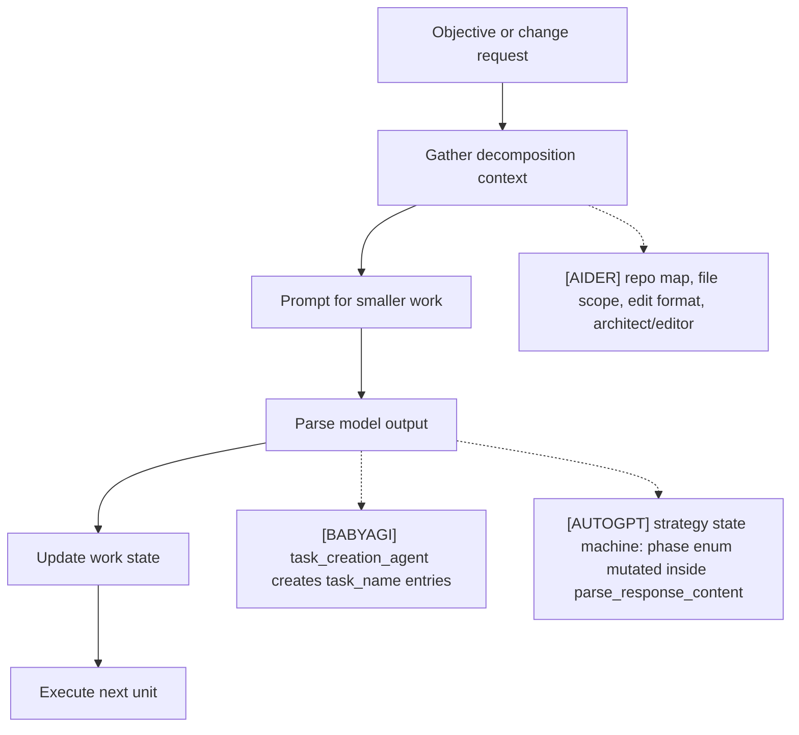
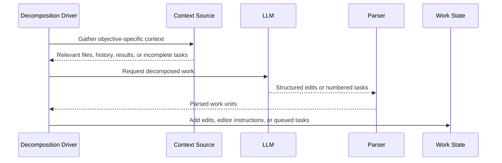

# Task Decomposition
> Module: 02_cognition | Status: Phase 7 | Last Agent: Phase 7 Specialist Synthesis 

## 1. Overview
Task decomposition converts a broad objective or user request into smaller work units that can be executed, validated, or reordered.

[AIDER] decomposes coding work mostly through file scope, edit formats, repo-map hints, and optional architect/editor delegation rather than through a persistent task queue.

[BABYAGI] decomposes work explicitly: `task_creation_agent()` uses the last execution result, the original objective, the completed task description, and incomplete task names to propose new tasks.

[AUTOGPT] decomposes work through a **swappable prompt-strategy state machine**. A single agent runtime supports seven dramatically different planning paradigms (`one_shot`, `plan_execute`, `rewoo`, `reflexion`, `tree_of_thoughts`, `lats`, `multi_agent_debate`) by holding a `BaseMultiStepPromptStrategy` instance whose `current_phase` enum is mutated *inside* `parse_response_content` (`classic/original_autogpt/autogpt/agents/prompt_strategies/`). Decomposition is therefore a property of the chosen strategy, not the loop. Three of these strategies (`tree_of_thoughts`, `lats`, `multi_agent_debate`) decompose by spawning sub-agents through `BaseMultiStepPromptStrategy.spawn_and_run` (see `06_orchestration/multi_agent_patterns.md`).

## 2. Blueprint Specification
| Element | Specification |
| --- | --- |
| Decomposition trigger | User asks for a coding change or architect plan [AIDER]; execution result completes for the current task [BABYAGI]; the task is admitted into the run and the configured strategy advances `current_phase` to a planning phase ([AUTOGPT] `plan_execute` → `PLANNING`, `rewoo` → `PLANNING`, `lats` → `EXPANSION`, etc.). |
| Work unit | File edit block, whole-file update, patch, or editor instruction [AIDER]; `{"task_id": ..., "task_name": ...}` dictionary [BABYAGI]; `PlannedStep(thought, tool_name, tool_arguments={}, status="pending")` ([AUTOGPT] `plan_execute`); `ReWOOStep` with `#E1, #E2, …` placeholder variables and a `depends_on` graph ([AUTOGPT] `rewoo`); `Thought {content, score, depth, children, parent, action, evaluation_votes}` for ToT, `LATSNode {value, visits, children, parent, depth, reward, reflection}` with UCT-scored selection for LATS, `DebateState {proposals, critiques, revision_count, winning_proposal}` for multi-agent debate ([AUTOGPT]). |
| Context for split | File mentions, repo-map identifiers, chat history, editable files [AIDER]; objective, last result, last task, incomplete task names [BABYAGI]; the merged outputs of `DirectiveProvider`, `CommandProvider`, `MessageProvider`, plus `ActionHistoryComponent`'s "Progress on your Task so far" summary ([AUTOGPT]); for `plan_execute` PS+ the optional `VARIABLE_EXTRACTION` phase pre-extracts `ExtractedVariable` and `CalculationStep` records into a `## Problem Context (PS+)` system-prompt section ([AUTOGPT]). |
| Output parser | Edit-format parser or architect-to-editor handoff [AIDER]; numbered-list parser with regex cleanup [BABYAGI]; strategy-specific parsers ([AUTOGPT]): `_extract_plan_from_response` regex (primary `^(\d+)\.\s+(.+?)(?:\s*[-–—]\s*(?:Command\|Tool\|Action):\s*(\w+))?(?=\n\d+\.\|\n*$)`, fallback simpler list regex), `Plan: <reasoning>\n#En = tool_name(args)` parser for ReWOO with dependency-graph extraction, structured Pydantic `ReflectionOutput` for `reflexion`, branching `Thought`/`LATSNode` deserialization for ToT/LATS. |
| State update | Files changed and possibly committed [AIDER]; new task dictionaries appended to the deque [BABYAGI]; `self.current_plan` mutated on the strategy object; `current_phase` enum advanced; `parse_response_content` may concurrently parse, validate, and advance state in one call ([AUTOGPT]). Note: this state is *not* serialized into `state.json`, so a process restart loses ReWOO/PS+/ToT/LATS plan progress. |

## 3. Logic Flow
1. Identify the current objective or requested change.
2. Gather context that constrains valid work units.
3. Ask the model for decomposed work in a format the runtime can consume.
4. Parse and sanitize the model output.
5. Update the executable work state.

[AIDER] architect mode separates planning from editing: the architect produces implementation instructions and a fresh editor coder applies them with a narrower edit prompt.

[BABYAGI] assigns authoritative task ids after parsing new task names, so model-provided numbering is only a response format.

[AUTOGPT] strategies decompose then drive themselves:
1. **`one_shot`** (baseline): no decomposition phase — the model emits `AssistantThoughts {observations, reasoning, self_criticism, plan: list[str]}` *and* a `tool_call` in the same response. The `plan` field is advisory; only the immediate `use_tool` is acted on. (`fast_llm`, single phase.)
2. **`plan_execute`** (Plan-and-Act / Plan-and-Solve / Routine): `PLANNING` phase asks `smart_llm` for a numbered plan ("`<step> - Command: <command_name>`"), regex-parses it into `ExecutionPlan(goal, steps, current_step_index, completed_steps, failed_attempts)`, then `EXECUTING` phase prompts `fast_llm` with `{step_num}`, `{progress}` (from `get_progress_summary`), and `{current_step}`. On `failed_attempts >= max_retries` (default 3) and `replan_count < max_replan_attempts` (default 3), `current_phase = REPLANNING` re-includes goal + completed-step summaries + failed step + error.
3. **`rewoo`** (Reasoning Without Observation): `PLANNING` prompts `smart_llm` for the entire plan up-front in `Plan: …\n#E1 = tool_name(arg=value)\n…\n#E2 = tool_name(arg=#E1)` form; the parser builds `ReWOOPlan.steps` plus a dependency graph. `EXECUTING` phase has `build_prompt` raise `UseCachedActionException(action_proposal=<replayed step>)` to skip the LLM call; `Agent.execute` then calls `record_execution_result(variable_name, result_str, error)` for `#En` variable substitution into later steps. `SYNTHESIZING` phase asks `smart_llm` to call `finish` with the final answer given the full plan + collected results. ActionHistory compression is **disabled** during ReWOO `EXECUTING` since prompt-building is skipped.
4. **`reflexion`** decomposes time, not space — see `reasoning_patterns.md`.
5. **`tree_of_thoughts`**, **`lats`**, **`multi_agent_debate`** decompose by sub-agent expansion: each candidate child step calls `await self.spawn_and_run(task=<sub-question>, max_cycles=…)` with a write-restricted `FileStorage` and a decremented `ResourceBudget.max_depth`. Results update the search structure (`Thought.score`, `LATSNode.value/visits`, `AgentProposal.confidence`); a single best `AssistantFunctionCall` is selected as the cycle's proposal.

All multi-step strategies inherit from `BaseMultiStepPromptStrategy` (`prompt_strategies/base.py:275`).

## 4. Flowchart


[AUTOGPT] ReWOO flow (plan-once / execute-without-LLM):
```mermaid
flowchart TD
    Start([Task]) --> Plan[PLANNING phase<br/>smart_llm builds full plan<br/>#E1, #E2, #E3...]
    Plan --> Parse[Parse #En = tool_name(args)<br/>regex extract dependency graph]
    Parse --> Step[EXECUTING phase<br/>get next executable step]
    Step --> Cached{cached action<br/>in plan?}
    Cached -- yes --> Replay[build_prompt raises<br/>UseCachedActionException<br/>NO LLM CALL]
    Replay --> Exec[Agent.execute<br/>record_execution_result for #En]
    Cached -- no --> LLM[fast_llm chooses next tool]
    LLM --> Exec
    Exec --> Substitute[substitute_variables in next step]
    Substitute --> More{more steps?}
    More -- yes --> Step
    More -- no --> Synth[SYNTHESIZING phase<br/>smart_llm reads plan + all results<br/>call finish with answer]
```

## 5. Sequence Diagram


[AUTOGPT] plan_execute sequence:
```mermaid
sequenceDiagram
    participant Loop as run_interaction_loop
    participant Agent
    participant Strategy as PlanExecutePromptStrategy
    participant Smart as smart_llm
    participant Fast as fast_llm
    participant Tool

    Loop->>Agent: propose_action() [phase=PLANNING]
    Agent->>Strategy: build_prompt(messages, task, directives, commands)
    Strategy->>Smart: planner instruction + numbered-list format
    Smart-->>Strategy: numbered plan
    Strategy->>Strategy: _extract_plan_from_response → ExecutionPlan
    Strategy-->>Agent: ChatPrompt (also commits use_tool for step 1)
    Agent->>Tool: execute step 1
    Tool-->>Agent: ActionResult

    loop until plan exhausted or replan
        Loop->>Agent: propose_action() [phase=EXECUTING]
        Agent->>Strategy: build_prompt
        Strategy->>Fast: executor_instruction({step_num},{progress},{current_step})
        Fast-->>Strategy: tool call for current step
        Strategy-->>Agent: ChatPrompt
        Agent->>Tool: execute
        Tool-->>Agent: ActionResult
        alt step failed and failed_attempts >= max_retries
            Strategy->>Strategy: phase = REPLANNING
        end
    end
```

## 6. Variations & Trade-offs
| Variation | Benefit | Trade-off |
| --- | --- | --- |
| File-scope decomposition [AIDER] | Keeps coding work grounded in editable files. | Does not create a durable task graph. |
| Architect/editor split [AIDER] | Allows a planning model to delegate implementation. | Requires user acceptance unless auto-accept is enabled. |
| Result-driven task creation [BABYAGI] | Lets completed work generate the next plan. | New tasks depend on brittle natural-language list parsing. |
| In-memory queue [BABYAGI] | Minimal and easy to reason about. | No task history, retries, leases, or durable pending state. |
| Swappable prompt-strategy state machine [AUTOGPT] | One runtime hosts seven dramatically different planning paradigms; strategy chosen at startup via `PROMPT_STRATEGY` env var; phase enum is mutated inside `parse_response_content`, so the strategy object is its own scheduler. | Strategy state lives only on the strategy object — not in `state.json` — so process restarts lose ReWOO plan progress, ToT trees, and Reflexion memory. Adding a strategy requires Python code; not user-defined. |
| Plan-once / execute-without-LLM (`rewoo`) [AUTOGPT] | The `EXECUTING` phase replays cached `AssistantFunctionCall`s by raising `UseCachedActionException` out of `build_prompt`; ReWOO claims 5x token efficiency vs ReAct. ActionHistory compression is disabled during this phase since prompt-building is skipped. | Plan staleness — the entire plan is generated up-front, so an unanticipated tool failure forces full replanning rather than incremental adjustment. The exception is caught by string-name comparison (to avoid an import cycle), which is fragile across refactors. |
| Plan-with-replanning (`plan_execute`) [AUTOGPT] | Separates planning (`smart_llm`) from execution (`fast_llm`); on `failed_attempts >= max_retries` it transitions to `REPLANNING` with the failure context, capped by `max_replan_attempts` (default 3). PS+ extension adds variable extraction and verified calculations to the prompt context. | Numbered-list parser is regex-based; malformed model output silently falls back to a simpler regex and may degrade plan quality. |
| Sub-agent search (`tree_of_thoughts`, `lats`, `multi_agent_debate`) [AUTOGPT] | Branching/MCTS/debate over reasoning paths via real `Agent` sub-instances; `ResourceBudget` decrements `max_depth` and zeroes `explicit_allow_rules` per level. LATS uses UCT score `(value/visits) + c*sqrt(ln(parent.visits)/visits)` for selection. | Sub-agents bounded by `sub_agent_timeout_seconds=300`, `sub_agent_max_cycles=25`, `max_sub_agents=25`; expensive in tokens; sub-agent file storage uses `clone_with_subroot(.sub_agents/{child_agent_id})` which restricts both reads and writes (note in source flags this as a simplification). |

## 7. Agent Attribution Table
| Agent | Source-backed contribution |
| --- | --- |
| [AIDER] | Decomposition through scoped files, repo-map hints, edit-format contracts, and architect/editor delegation. |
| [BABYAGI] | Explicit task decomposition through `task_creation_agent()`, parsed `task_name` entries, authoritative id assignment, and deque append. |
| [AUTOGPT] | Swappable prompt-strategy state machine (`prompt_strategies/{one_shot,plan_execute,rewoo,reflexion,tree_of_thoughts,lats,multi_agent_debate}.py`) selected via `PROMPT_STRATEGY` env var; `BaseMultiStepPromptStrategy` (`prompt_strategies/base.py:275`) shared base with `current_phase` enum and `spawn_and_run` sub-agent helper; `plan_execute` `ExecutionPlan(goal, steps, current_step_index, completed_steps, failed_attempts)` with regex plan extraction and `REPLANNING` phase capped by `max_replan_attempts`; `rewoo` `ReWOOPlan` with `#E1, #E2, …` placeholder variables, `depends_on` graph, `UseCachedActionException` zero-LLM replay path, `record_execution_result` for variable substitution, `SYNTHESIZING` phase calling `finish`; PS+ optional `VARIABLE_EXTRACTION` phase pre-extracting `ExtractedVariable` and `CalculationStep` into the system prompt; sub-agent decomposition via `Thought` tree (ToT), `LATSNode` MCTS tree with UCT selection (LATS), `DebateState` (multi-agent debate). |

> Phase 5 [KILO] [OPENCODE] decomposition lives in `06_orchestration/task_lifecycle.md` (plan→code handoff). Phase 6 [PI] does not contribute to this module — Pi delegates decomposition to the embedding application via `transformContext`/system prompt and has no built-in planning strategies.

## 8. Repository Implementations

### Roo-Code
- **Task Delegation (Boomerang)**: Work is decomposed by spawning child tasks through the `new_task` tool. The agent can specify the target `mode` (e.g., "code"), the prompt `message`, and optionally a `todos` list. This spins up a completely separate task loop whose result is fed back into the parent loop upon completion.
- **Dynamic Todo Lists**: The agent maintains a checklist using the `update_todo_list` tool. This tool is always available regardless of mode restrictions, allowing the agent to continuously break down and track work items during execution. A `preventCompletionWithOpenTodos` setting explicitly enforces that the agent cannot terminate the loop while checklist items remain incomplete.
