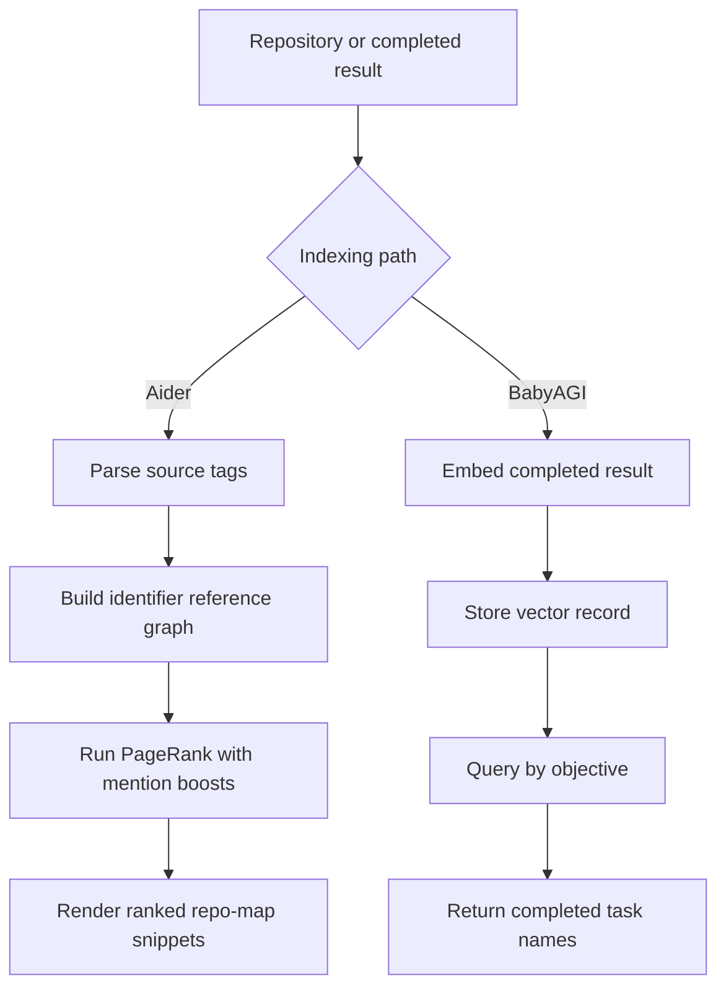
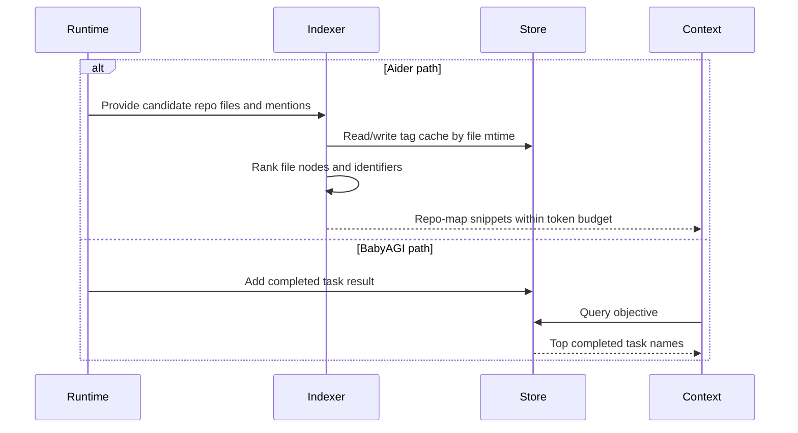

# Repo Map and Indexing
> Module: 03_context_engine | Status: Phase 7 | Last Agent: Phase 7 Specialist Synthesis 

## 1. Overview

Repo mapping and indexing decide what external knowledge can be compactly brought into context. [AIDER] Aider builds a static code graph from parsed definitions and references, ranks files and identifiers, and renders compact source snippets for files not already in chat. [BABYAGI] BabyAGI has no repo-map layer in the Phase 1 loop; its indexing is the vector storage of completed task results for later semantic recall.

## 2. Blueprint Specification

- Aider index unit: source tags with relative filename, absolute filename, line, identifier name, and kind (`def` or `ref`). [AIDER]
- Aider graph unit: file nodes with reference-to-definition edges labelled by identifier and weighted for mentions, fanout, private names, and reference counts. [AIDER]
- Aider map output: ranked snippets grouped by file, excluding files already included as full editable context. [AIDER]
- BabyAGI index unit: completed task result records stored with task name and result text in vector storage. [BABYAGI]
- BabyAGI retrieval output: top completed task names queried by objective, not source-code structure. [BABYAGI]

## 3. Logic Flow

1. Aider scans candidate repository files outside the active chat set and extracts tree-sitter definition/reference tags, with a fallback reference pass for some languages. [AIDER]
2. Aider caches tags by filename and modification time to avoid reparsing unchanged files. [AIDER]
3. Aider builds maps from identifiers to defining files and referencing files, then creates a `MultiDiGraph` whose nodes are relative file paths. [AIDER]
4. Aider runs PageRank with personalization from chat files, explicitly mentioned files, and mentioned identifiers. [AIDER]
5. Aider converts ranked file/identifier signal into snippet lines and binary-searches how many tags fit the map token budget. [AIDER]
6. BabyAGI writes each completed task result into vector memory and later queries that store by objective to produce lightweight context. [BABYAGI]

## 4. Flowchart

## 5. Sequence Diagram

## 6. Variations & Trade-offs

- Static code graphs can expose relevant code without embeddings infrastructure, but they depend on language parsers and identifier relationships. [AIDER]
- Token-bounded snippet rendering makes large repositories usable, but it may omit implementation details that require adding files directly. [AIDER]
- Vector memory is simple and cross-domain, but BabyAGI's Phase 1 recall does not distinguish code symbols, files, or edit authority. [BABYAGI]
- Caching by modification time improves map latency, while BabyAGI's result indexing is append/update oriented around completed work. [AIDER][BABYAGI]

## 7. Agent Attribution Table
| Agent | Source-backed contribution |
|---|---|
| Aider | [AIDER] Tree-sitter tag extraction, cached repo-map indexing, identifier-labelled file graph, PageRank ranking, and token-bounded snippet rendering. |
| BabyAGI | [BABYAGI] Vector indexing of completed task results and objective-based recall of prior task names. |

## 8. Repository Implementations

### Roo-Code
- **Embedded Codebase Index**: Roo-Code ships with a built-in vector search engine powered by an embedded Qdrant instance.
- **Extensible Embedders**: The indexing pipeline supports up to 8 different embedder backends, parsing local repository code to build a semantic map of the workspace natively without relying on external SaaS retrieval solutions.
