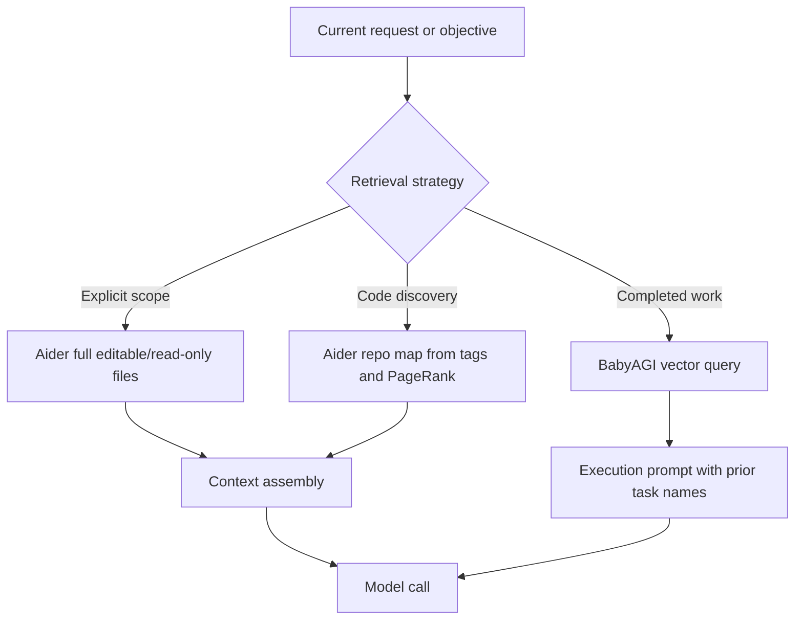

# Retrieval Strategies
> Module: 03_context_engine | Status: Phase 7 | Last Agent: Phase 7 Specialist Synthesis

## 1. Overview

Retrieval strategies determine what information is selected before model invocation. [AIDER] Aider retrieves repository context through explicit file scope, filename/identifier mentions, repo-map ranking, read-only files, and summarized history. [BABYAGI] BabyAGI retrieves completed-task memory with a vector query over prior results using the objective as the query.

## 2. Blueprint Specification

- Aider retrieval roots: user-added files, read-only files, file mentions in chat, identifier hints, and repo files outside the active chat set. [AIDER]
- Aider retrieval output: full editable file messages, full read-only messages, or compact repo-map snippets. [AIDER]
- Aider can reflect when mentioned files should be added, creating another pass with updated file scope after user confirmation. [AIDER]
- BabyAGI retrieval root: completed result vectors written after each executed task. [BABYAGI]
- BabyAGI retrieval output: up to five completed task names inserted into the execution prompt as prior context. [BABYAGI]

## 3. Logic Flow

1. Identify retrieval intent from the current turn or loop state: Aider looks for file names, identifiers, and command-managed file scope; BabyAGI uses the standing objective. [AIDER][BABYAGI]
2. Choose retrieval lane: Aider uses full files for explicit scope and repo maps for broad code discovery; BabyAGI uses semantic vector recall. [AIDER][BABYAGI]
3. Rank or filter candidates: Aider ranks by graph signal plus mention boosts; BabyAGI ranks by vector similarity in the result store. [AIDER][BABYAGI]
4. Insert retrieved context with authority labels: Aider distinguishes editable and read-only context; BabyAGI inserts recalled task names as background for execution. [AIDER][BABYAGI]
5. Continue the loop: Aider may ask to add files and retry; BabyAGI writes the new result and makes it retrievable for later tasks. [AIDER][BABYAGI]

## 4. Flowchart



## 5. Sequence Diagram

```mermaid
sequenceDiagram
    participant Loop
    participant Retriever
    participant Store
    participant Prompt
    alt Aider path
        Loop->>Retriever: Provide files, mentions, identifiers
        Retriever->>Store: Read repo tags or file contents
        Store-->>Retriever: Ranked snippets or full files
        Retriever-->>Prompt: Editable/read-only context blocks
    else BabyAGI path
        Loop->>Retriever: Provide objective
        Retriever->>Store: Query result vectors
        Store-->>Retriever: Similar completed task names
        Retriever-->>Prompt: Prior task-name context
    end
```

## 6. Variations & Trade-offs

- Explicit file scope gives strong edit precision but requires user or model-driven discovery of the right files. [AIDER]
- Graph retrieval can find structurally important code without embeddings, but it is tied to identifier quality and parser coverage. [AIDER]
- Vector retrieval is domain-flexible and very small in BabyAGI, but it does not preserve source structure or full historical result detail. [BABYAGI]
- Reflection-based file addition improves context iteratively, while BabyAGI relies on the next loop iteration after memory insertion. [AIDER][BABYAGI]
- Context-provider-based retrieval decouples the retrieval source from the agent rule, enabling composable retrieval strategies per rule or slash command. Each provider is loaded on-demand and can be added without code changes. [CONTINUE]

## 7. Agent Attribution Table
| Agent | Source-backed contribution |
|---|---|
| Aider | [AIDER] File-scope retrieval, mention scanning, read-only context, repo-map graph ranking, and reflected file-addition passes. |
| BabyAGI | [BABYAGI] Objective-based semantic retrieval from completed task results and insertion of recalled task names into execution prompts. |
| Continue | [CONTINUE] **Context providers as pluggable retrieval**: `core/context/` defines a `ContextProvider` interface (`getContextItems(query: string): Promise<ContextItem[]>`). Built-in providers include codebase search, terminal output, git history, web search, docs, and filesystem. Providers are loaded on-demand by rules and can be mixed in a rule without code changes — just configure in `continue.json`. More granular than MCP's tool/resource abstraction and simpler than per-agent custom loaders. Agnostic to execution context (IDE vs. CLI). |

## 8. Repository Implementations

### Roo-Code
- **Semantic File Search**: The agent defaults to `codebase_search` (powered by the embedded Qdrant index) for discovering semantic meaning in code before falling back to regex or AST-based searches.
- **Tiered Retrieval Tools**: Retrieval is grouped into the "read" tool group, giving the agent a hierarchy of exploration (`read_file`, `search_files`, `list_files`, `codebase_search`) that it can use depending on whether the query is structural, path-based, or semantic.
