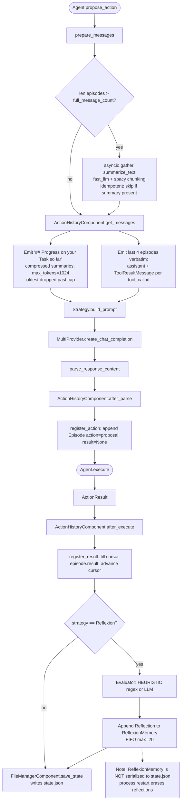

# Episodic Memory
> Module: 04_memory | Status: Phase 7 | Last Agent: Phase 7 Specialist Synthesis 

## 1. Overview
Episodic memory stores ordered, time-indexed records of *what the agent did* and *what came of it*. Unlike semantic memory (which is similarity-keyed), episodic memory is indexed by sequence position and used to reconstruct prompts, support replay, and feed reflection.

[AUTOGPT] is the only Phase 1–6 agent in the blueprint with a first-class episodic memory subsystem. The `EpisodicActionHistory` (`classic/forge/forge/components/action_history/{action_history,model}.py`) is the canonical short-/medium-term memory: a sequence of `Episode(action, result, summary)` records with lazy LLM-driven compression of older entries. There is **no vector store** in the modern AutoGPT Classic checkout — memory is purely sequential. (AutoGPT research §4.)

A second, narrower form of episodic memory is the **Reflexion buffer** (`classic/original_autogpt/autogpt/agents/prompt_strategies/reflexion.py` + `prompt_strategies/base.py:83-163`): a per-strategy `ReflexionMemory(reflections, max_reflections=20, FIFO trimmed)` of structured `Reflection` records that survives across tasks within a single process. Critically, this memory is *not* serialized into `state.json`, so a process restart erases it — a real limitation flagged in the research and worth carrying forward.

[CLAUDE] [CODEX] [CLINE] [ROO] [KILO] [OPENCODE] [PI] do not maintain episodic memory as a distinct subsystem — they rely on the conversation/session message list (which mixes user input, assistant text, and tool results in a single sequence) and on summarization-based compaction (Codex `compact.rs`, Claude `maybe_auto_compact`, Cline `summarize_task` / `conversationHistoryDeletedRange`, OpenCode/Kilo snapshot repo). These are documented in `01_core_loop/agentic_loop.md` and `06_orchestration/task_lifecycle.md`.

## 2. Blueprint Specification

### Episode shape [AUTOGPT]
```python
class Episode(BaseModel, Generic[AnyProposal]):
    action: AnyProposal              # the proposal (thoughts + use_tool)
    result: ActionResult | None      # outcome: success | error | interrupted_by_human
    summary: str | None = None       # LLM-generated 1-line compression (idempotent)

class EpisodicActionHistory(BaseModel, Generic[AnyProposal]):
    episodes: list[Episode]
    cursor: int = 0
    pending_user_feedback: list[str]
    _lock: asyncio.Lock              # for parallel compression
```

### Lifecycle hooks [AUTOGPT]
The component pipeline drives episode lifecycle:

| Hook | Trigger | Effect |
| --- | --- | --- |
| `register_action(proposal)` | `ActionHistoryComponent.after_parse` after `propose_action` | Appends `Episode(action=proposal, result=None)`; cursor stays put |
| `register_result(result)` | `ActionHistoryComponent.after_execute` after `execute` | Fills `Episode.result`; advances `cursor` to `len(episodes)` |
| `append_user_feedback(feedback)` | Permission allow-with-feedback or deny | Queues feedback for inclusion in next prompt as `[USER FEEDBACK]` user message |
| `rewind(n)` | `WatchdogComponent` repetition detection | Pops current partial episode plus `n` full episodes; forces a re-think |

### Reflection buffer shape [AUTOGPT]
```python
class Reflection:
    action_name: str
    action_arguments: dict
    result_summary: str
    what_went_wrong: str             # structured format
    what_to_do_differently: str
    success: bool
    timestamp: datetime
    verbal_reflection: str           # paper-style free-form
    reflection_format: "structured" | "verbal"
    evaluation_score: float | None   # from Evaluator

class ReflexionMemory:
    reflections: list[Reflection]    # max 20, FIFO trimmed
    def get_relevant_reflections(action_name=None, limit=5)
    def get_failed_reflections(limit=5)
```

### Compression strategy [AUTOGPT]
`EpisodicActionHistory.handle_compression` runs at the top of every `propose_action` (called via `ActionHistoryComponent.prepare_messages`):

1. If `n = len(episodes) <= full_message_count` (default 4) → return.
2. `older = episodes[: n - full_message_count]`.
3. `to_summarize = [ep for ep in older if ep.summary is None]` (idempotent — never re-summarized once cached).
4. Per-episode summarization runs in parallel via `asyncio.gather`, calling `summarize_text(ep.format(), instruction="The text represents an action, the reason for its execution, and its result. Condense the action taken and its result into one line. Preserve any specific factual information gathered by the action.", llm_provider=fast_llm, spacy_model="en_core_web_sm")`.
5. `spacy` chunks long episodes before summarization to fit the fast LLM's context.

Once summarized, an episode keeps its `summary` forever.

### Two-tier prompt assembly [AUTOGPT]
`ActionHistoryComponent.get_messages` emits two distinct sections:

- **Last `full_message_count=4` episodes**: original `assistant` message (with `tool_calls`) + a `ToolResultMessage` per tool call. This preserves provider API contract — both Anthropic and OpenAI require every `tool_use`/`function_call` to be followed by a matching `tool_result`. `_make_result_messages` handles parallel tool calls by emitting one `ToolResultMessage` per `tool_call.id`.
- **Older episodes**: a single `## Progress on your Task so far` user message that lists `* Step <i>: <summary>` for each compressed episode, capped at `max_tokens=1024` — once the running token total exceeds the cap, the **oldest summaries are dropped**.

Net effect: the prompt grows linearly in tool-call detail for the last 4 actions and logarithmically (compressed) for everything older, with a hard token cap on the summary section.

### Long-term persistence [AUTOGPT]
There is no separate semantic store. Episodic state is dumped to `{workspace}/.autogpt/agents/AutoGPT-{agent_id}/state.json` via `FileManagerComponent.save_state()`:

```
state.json          # AgentSettings (Pydantic dump): full EpisodicActionHistory with summaries baked in
permissions.yaml    # agent-specific allow/deny rules
workspace/          # agent's sandboxed FS
```

The Agent Protocol HTTP server calls `agent.file_manager.save_state()` after every API request that creates or executes a step (`agent_protocol_server.py:148, 272, 357`), so each cycle survives a restart. Resuming = `AgentManager.load_agent_state(agent_id)` parses the JSON back into `AgentSettings` and `_configure_agent` rebuilds the `Agent` over it.

### Strategy-specific episodic memory [AUTOGPT]
In addition to `EpisodicActionHistory`, multi-step strategies hold their own per-task memory on the strategy object — *not* in `state.json`:

- `ReWOOPromptStrategy.current_plan: ReWOOPlan` with `execution_results: dict[var_name, str]`.
- `PlanExecutePromptStrategy.current_plan: ExecutionPlan` plus `ps_plus_context: PSPlusContext`.
- `ReflexionPromptStrategy.memory: ReflexionMemory` — capped at `max_reflections=20`, FIFO trimmed. **`ReflexionPromptStrategy.reset()` deliberately does NOT clear memory** ("Keep memory across tasks - that's the point of Reflexion!").

> **Gap (flagged honestly)**: `ReflexionPromptStrategy.memory` is intended to outlive the task, but the strategy is *not* serialized into `state.json` — a process restart erases the reflections. The episodic action history *is* persisted (and includes the structured reflections via `Reflection.to_prompt_text()` formatting *only when surfaced into the prompt*), but the standalone `ReflexionMemory` buffer does not survive.

## 3. Logic Flow

1. `Agent.propose_action` enters; `ActionHistoryComponent.prepare_messages` runs first.
2. If `len(episodes) > full_message_count`, older episodes are compressed (idempotent, cached).
3. `MessageProvider.get_messages` pipeline runs; `ActionHistoryComponent.get_messages` yields the `## Progress on your Task so far` summary message followed by the last 4 verbatim episodes (assistant + tool-result pairs).
4. The strategy's `build_prompt` consumes these messages.
5. After the LLM responds and the proposal is parsed, `ActionHistoryComponent.after_parse` calls `register_action(proposal)` — appends `Episode(action=proposal, result=None)`.
6. `Agent.execute` runs; `ActionHistoryComponent.after_execute` calls `register_result(result)` — fills the cursor episode's `result`, advances `cursor`.
7. If permission denied or feedback was attached, `append_user_feedback(feedback)` queues it for next prompt.
8. If reflexion is the active strategy and the result triggered the evaluator, `_process_reflection` constructs a `Reflection` object and stores it in `ReflexionMemory` (separate from the episode).
9. State is persisted to `state.json` (Agent Protocol mode: every cycle; CLI mode: on `Ctrl+C` or normal termination).

## 4. Flowchart


## 5. Sequence Diagram
```mermaid
sequenceDiagram
    participant Loop as run_interaction_loop
    participant Agent
    participant Hist as EpisodicActionHistory
    participant Strategy
    participant LLM as MultiProvider
    participant FM as FileManagerComponent

    Loop->>Agent: propose_action
    Agent->>Hist: prepare_messages
    Hist->>Hist: handle_compression (lazy)
    Note over Hist: summarize older episodes via fast_llm<br/>idempotent: only first time per episode
    Hist-->>Agent: list of ChatMessage<br/>summary section + last 4 verbatim
    Agent->>Strategy: build_prompt(messages)
    Strategy-->>Agent: ChatPrompt
    Agent->>LLM: create_chat_completion
    LLM-->>Agent: AssistantChatMessage
    Agent->>Strategy: parse_response_content
    Strategy-->>Agent: AnyActionProposal
    Agent->>Hist: register_action(proposal)<br/>append Episode action result=None
    Agent-->>Loop: proposal
    Loop->>Agent: execute(proposal)
    Agent->>Agent: tool dispatch
    Agent->>Hist: register_result(result)<br/>fill cursor episode, advance
    alt strategy == Reflexion
        Strategy->>Strategy: Evaluator + record_result
        Strategy->>Strategy: ReflexionMemory.add(reflection) FIFO max=20
    end
    Agent->>FM: save_state
    FM->>FM: write state.json with full episodic history<br/>NB: ReflexionMemory is not included
```

## 6. Variations & Trade-offs

| Pattern | Benefit | Trade-off |
| --- | --- | --- |
| **Lazy compression of older episodes** [AUTOGPT] | Summarization runs only when the next prompt actually needs the older episodes; in ReWOO `EXECUTING` mode it's skipped entirely. Idempotent: episode summary is computed once and cached on the `Episode.summary` field. | Compression uses `fast_llm`; quality of summary depends on the cheap model. Token cap (`max_tokens=1024`) on the summary section means the oldest summaries can fall off, causing long-task amnesia for early steps. |
| **Two-tier prompt: 4 verbatim + summarized progress** [AUTOGPT] | Preserves provider API contract for tool-result correlation on the recent 4 episodes (Anthropic/OpenAI both require `tool_use` ↔ `tool_result` pairing), while allowing logarithmic prompt growth for older history. | The boundary at `full_message_count=4` is a fixed default, not adaptive to task complexity. |
| **`asyncio.gather` parallel summarization** [AUTOGPT] | All older episodes summarized concurrently (with `_lock` for safety). | Spikes fast-LLM API usage on long tasks; concurrent rate-limit pressure. |
| **Episodic state in `state.json`** [AUTOGPT] | Full `EpisodicActionHistory` (with cached summaries) survives across process restarts. Agent Protocol HTTP mode persists after every cycle (`agent_protocol_server.py:148, 272, 357`). | Pydantic dump of large histories grows; `state.json` is rewritten in full on every persist. |
| **Strategy memory not persisted** [AUTOGPT] | Strategy state machines don't have to define a serialization protocol. | **Real limitation**: `ReflexionMemory`, `ReWOOPlan`, `ExecutionPlan` are erased on restart. Reflexion's "keep memory across tasks" intent only holds within the same process. |
| **Permission denial as feedback into history** [AUTOGPT] | Denial isn't lost — it becomes an `ActionInterruptedByHuman(feedback=...)` `ActionResult` written into the current `Episode`, plus an entry in `pending_user_feedback` that surfaces in the next prompt as a `[USER FEEDBACK]` user message. The LLM sees *why* and can pivot. | Permission denial does not terminate the loop — runaway is possible if the user keeps denying without escalating to abort. |
| **`rewind(n)` for forced re-think** [AUTOGPT] | `WatchdogComponent` can force the agent to re-plan by popping the current partial episode plus `n` full episodes and flipping `big_brain=True` for the next cycle. | Lost episodes are gone (no undo); state.json reflects the rewound state. |

## 7. Agent Attribution Table

| Agent | Source-backed contribution |
| --- | --- |
| [AUTOGPT] | `EpisodicActionHistory` (`classic/forge/forge/components/action_history/model.py` + `action_history.py`) with `Episode(action, result, summary)` records, `cursor`, `pending_user_feedback`, and `_lock`; lifecycle hooks (`register_action`, `register_result`, `append_user_feedback`, `rewind`) driven by `ActionHistoryComponent.after_parse` / `after_execute`; lazy compression via `handle_compression` running idempotent `asyncio.gather summarize_text` over older episodes (default `full_message_count=4`); two-tier prompt assembly (`## Progress on your Task so far` summary section capped at `max_tokens=1024` + last 4 verbatim assistant/tool-result pairs); `state.json` Pydantic dump persistence written by `FileManagerComponent.save_state()` after each Agent Protocol step; `Reflection {action_name, action_arguments, result_summary, what_went_wrong, what_to_do_differently, success, evaluation_score, verbal_reflection}` and `ReflexionMemory(max_reflections=20, FIFO)` strategy-local buffer (NB: NOT serialized to `state.json`); `ReflexionPromptStrategy.reset()` deliberately preserves memory across tasks (within process). |

> Other agents in the blueprint (CLAUDE, CODEX, CLINE, ROO, KILO, OPENCODE, PI) do not maintain episodic memory as a distinct subsystem — they collapse it into the session/conversation message list with summarization-based compaction, documented in `01_core_loop/agentic_loop.md` and `06_orchestration/task_lifecycle.md`.
