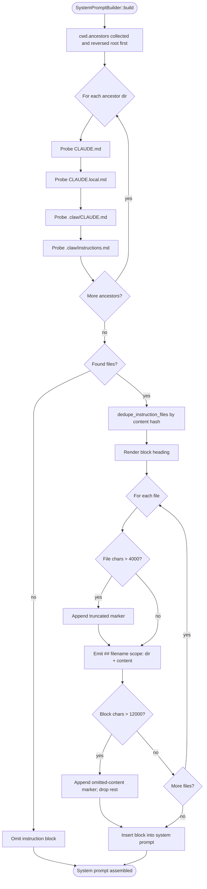
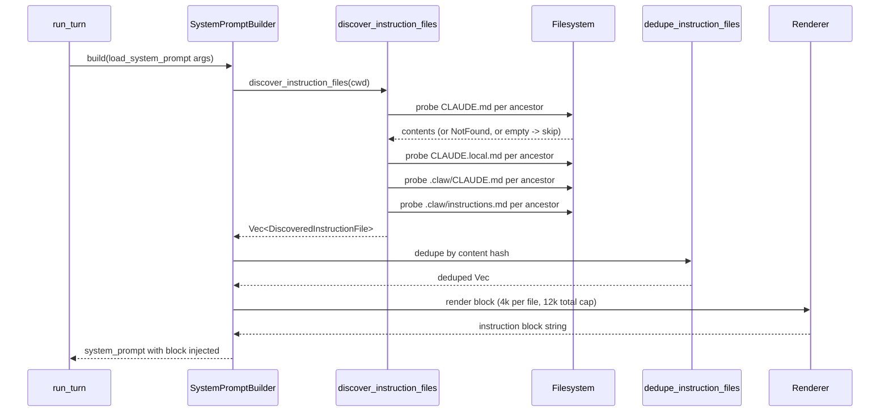

# Persistent Memory
> Module: 04_memory | Status: Phase 7 | Last Agent: Phase 7 Specialist Synthesis

## 1. Overview
Persistent memory is information that outlives a single turn or session, lives on the filesystem, and is loaded into the prompt at the start of every turn. It is distinct from working memory (per-session message history; see `working_memory.md`) and semantic memory (vector-recall surfaces; see `semantic_memory.md`).

[CLAUDE] persistent memory is **filesystem-backed instruction files**, discovered at turn start and rendered as a dedicated `# Claude instructions` section of the system prompt. The mechanism is `discover_instruction_files(cwd)` walking cwd ancestors and probing four filenames in fixed order (claw-code: `rust/crates/runtime/src/prompt.rs:203-224`):

1. `CLAUDE.md`
2. `CLAUDE.local.md`
3. `.claw/CLAUDE.md`
4. `.claw/instructions.md`

The result is rendered with one `## <filename> (scope: <ancestor-dir>)` subheading per file, in **root-most-first** order, with content-hash deduping. There is **no auto-write-back** path — the `/memory` slash command is read-only at HEAD `a389f8d` (`main.rs:6023-6082`).

[BABYAGI] does not implement filesystem-backed persistent memory; its closest analog is the vector-stored completed-task results, documented in `semantic_memory.md`. [AIDER] persists only chat history, conventions through user-supplied conventions files, and `.aider.tags.cache.v3` for the repo map; this is documented in `04_memory/working_memory.md` and `03_context_engine/repo_map_and_indexing.md`.

## 2. Blueprint Specification

### Discovery primitive [CLAUDE]
- **Function**: `discover_instruction_files(cwd) -> Vec<DiscoveredInstructionFile>` (`prompt.rs:203-224`).
- **Walk**: `cwd.ancestors()` collected into a `Vec`, reversed so root is first.
- **Per directory**, four filenames probed in this order:
  | Filename | Purpose | Source |
  | --- | --- | --- |
  | `CLAUDE.md` | Standard project memory file. | upstream-compatible |
  | `CLAUDE.local.md` | Per-checkout overrides; typically gitignored. | claw-code |
  | `.claw/CLAUDE.md` | Project memory under the harness's settings root. | claw-code branding |
  | `.claw/instructions.md` | Alternative memory filename. | claw-code |
- **Skip rules**: `NotFound` errors are ignored; empty / whitespace-only files are skipped (`prompt.rs:226-236`).
- **Dedupe**: `dedupe_instruction_files` hashes normalized content with `DefaultHasher`; identical content across symlinked roots is included once (`prompt.rs:353-367`).

### Scope and load order [CLAUDE]
- **Scope reach**: cwd ancestry only. **Not implemented** at HEAD `a389f8d`: a "user memory" file under `~/.claude/CLAUDE.md` or `~/.claw/CLAUDE.md`, a managed/enterprise file under `/etc/claude/` or `/Library/Application Support/ClaudeCode` or `%PROGRAMDATA%\ClaudeCode`. Grep over `prompt.rs` for `home`/`HOME`/`enterprise`/`managed` returns hits only inside test boilerplate (`prompt.rs:802-823`).
- **Load order**: root-most ancestor first; within each directory, the four filenames in the order above.
- **Settings vs. instructions**: settings files (`.claw/settings.json`, `.claw/settings.local.json`, `~/.claw/settings.json`, plus the legacy `.claw.json`) are **separate** from instruction files. They are merged by `ConfigLoader` and rendered as a distinct `# Runtime config` section *after* the instruction block (`prompt.rs:448-466`).

### Rendering [CLAUDE]
- **Block heading**: `# Claude instructions` (literal, hard-coded at `prompt.rs:331`).
- **Per-file rendering**: `## <filename> (scope: <ancestor-dir>)` followed by the (possibly truncated) content, separated by blank lines (`prompt.rs:347-348, 380-391`). The `scope:` value is the deepest ancestor directory the file lives under — letting the model know whether content came from cwd, parent, or a higher root.
- **Truncation markers**: per-file `[truncated]` when capped; whole-block `_Additional instruction content omitted after reaching the prompt budget._` when the total cap is hit (`prompt.rs:393-403`).

### Budget [CLAUDE]
| Constant | Value | Effect |
| --- | --- | --- |
| `MAX_INSTRUCTION_FILE_CHARS` | `4_000` | Per-file char cap; trailing `[truncated]` marker added. |
| `MAX_TOTAL_INSTRUCTION_CHARS` | `12_000` | Whole-block cap; subsequent files dropped. |

(`prompt.rs:43-44, 332-349, 393-403`)

### Cross-link to project context [CLAUDE]
The project-context section emits the line `Claude instruction files discovered: <N>.` so the model is told upfront how many instruction files were found before reaching the actual content block (`render_project_context`, `prompt.rs:288-300`).

### Read-only `/memory` command [CLAUDE]
- `SlashCommand::Memory` calls `render_memory_report()` / `render_memory_json()`.
- It reconstructs `ProjectContext::discover` from cwd and emits the file list with line counts and first-line previews (`main.rs:6023-6082`).
- It does **not** write a memory file. **Auto-memory write-back is not implemented in claw-code at HEAD `a389f8d`.**

### Single-shot scaffolding via `/init` [CLAUDE]
- `SlashCommand::Init` runs `crate::init::initialize_repo(cwd)` and emits an `InitReport` (`main.rs:3286-3297, 4465-4468, 6089-6101`).
- This creates starter files (e.g. an initial `CLAUDE.md` template); it is **not** a rolling auto-memory.

### `@include` directives [CLAUDE]
- **Not implemented**. The loader reads file content as-is. There is no parser for `@`-prefixed include paths inside `CLAUDE.md`.

## 3. Logic Flow

1. **Turn entry** (`run_turn`) calls `SystemPromptBuilder::build` once before the loop (`conversation.rs:333+`, `prompt.rs:144-166`).
2. `load_system_prompt(cwd, current_date, os, os_version)` invokes `discover_instruction_files(cwd)`.
3. The discoverer collects `cwd.ancestors().rev()` (root first), then for each ancestor probes the four filenames.
4. Each found file is loaded as `(scope_dir, filename, content)`, with empty/whitespace files skipped.
5. `dedupe_instruction_files` collapses symlink-induced duplicates by content hash.
6. The instruction block is rendered with `# Claude instructions` heading; each file becomes a `## <filename> (scope: <dir>)` subsection.
7. Per-file char cap `4_000` applied with `[truncated]` marker; total block cap `12_000` applied with the omitted-content marker.
8. The block is inserted **after** the dynamic-boundary marker, **before** the `# Runtime config` settings block (`prompt.rs:144-166`).
9. The composite system prompt is sent on every iteration's `ApiRequest.system_prompt`.

## 4. Flowchart

## 5. Sequence Diagram

## 6. Variations & Trade-offs

| Variation | Benefit | Trade-off |
| --- | --- | --- |
| **Filesystem instruction files** [CLAUDE] | Editable in any text editor, version-controllable, scoped by directory tree, no agent permission needed to author. | No write-back from agent — the agent cannot evolve its own memory in claw-code at HEAD `a389f8d`. |
| **Project-only scope** [CLAUDE] | Memory travels with the repo; no surprises from a forgotten `~/.claude/CLAUDE.md`. | A user with a personal preference set must duplicate it across repos. Diverges from upstream's documented "user-level memory file." |
| **4k / 12k char caps** [CLAUDE] | Hard upper bound on prompt growth; predictable token cost. | Long instruction docs are silently truncated; users must be aware of the cap. |
| **Content-hash deduping** [CLAUDE] | Symlinked monorepos don't blow up the prompt with copies. | Files that are *almost* identical (e.g. trailing whitespace difference) are kept as separate files. |
| **Read-only `/memory`** [CLAUDE] | Predictable: the model cannot mutate its own instructions silently. | Users wanting auto-evolved memory must add their own write tool or hook. |

## 7. Agent Attribution Table

| Agent | Source-backed contribution |
| --- | --- |
| [CLAUDE] | `load_system_prompt(cwd, ...)` in `prompt.rs` with recursive cwd-ancestor walk; `CLAUDE.md`, `CLAUDE.local.md`, `.claw/CLAUDE.md`, `.claw/instructions.md` probe order; content-hash deduplication via `dedupe_instruction_files`; `MAX_INSTRUCTION_FILE_CHARS = 4_000` per-file and `MAX_TOTAL_INSTRUCTION_CHARS = 12_000` total caps; `## <filename> (scope: <ancestor-dir>)` rendering with `Claude instruction files discovered: <N>.` cross-link in project context; auto-compaction summary persistence via `format_compact_summary`. |
| [HERMES] | **Closed-loop persistent memory**: `~/.hermes/MEMORY.md` stores general agent memory (user preferences, learned facts, project knowledge); `~/.hermes/USER.md` stores user-specific context; `~/.hermes/skills/` stores agent-created procedural memory as markdown files with YAML metadata (compatible with the [agentskills.io](https://agentskills.io) open standard). The `agent/curator.py` closed learning loop monitors successful task completions, auto-creates or refines skills based on patterns, and writes them for reuse. `agent/memory_*.py` and `agent/skill_*.py` manage the skill lifecycle (creation, editing, patching, deletion via `tools/skill_manager_tool.py`). This is **autonomous procedural memory creation** — the agent's learned workflows are first-class, reusable, cross-session assets that evolve over time. Not seen in prior agents: BabyAGI has episodic memory, Claude Code has CLAUDE.md, AutoGPT has vector stores, but none implement autonomous skill creation + self-improvement + open standard compatibility. |

> [BABYAGI] and [AIDER] do not contribute filesystem-backed persistent memory in their Phase 1 evidence; see `04_memory/working_memory.md` and `04_memory/semantic_memory.md` for those agents' state-persistence patterns.

## 8. Repository Implementations

### Roo-Code
- **Workspace Rules**: Persistent memory is primarily modeled through the `.clinerules` and `.roomodes` configuration files, which are loaded automatically from the workspace to guide the agent on established patterns.
- **Global Memory**: In addition to workspace files, it supports global custom instructions and a `.roo/` scoped rule directory that the user can persist across all projects.
