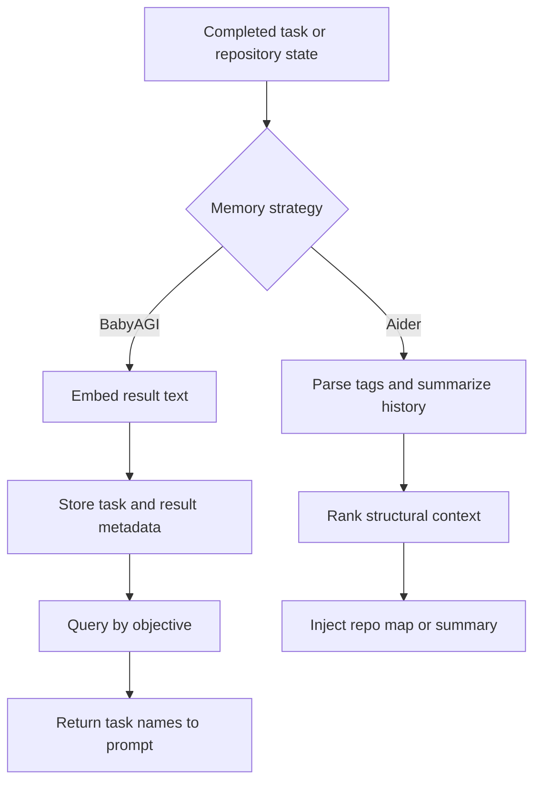

# Semantic Memory
> Module: 04_memory | Status: Phase 7 | Last Agent: Phase 7 Specialist Synthesis 

## 1. Overview

Semantic memory stores information for later similarity-based recall. [AIDER] Aider's Phase 1 context engine does not rely on embedding memory for repository context; it uses parsed code tags, graph ranking, chat history, and summaries instead. [BABYAGI] BabyAGI uses vector storage as its durable memory for completed task results.

[AUTOGPT] does **not** maintain a vector store in the modern Classic checkout (HEAD `c08b9774dc90f45f0958c6c0d9e9538d094a08af`). The 2023 BabyAGI / AutoGPT lineage used Pinecone or local FAISS to store past task results, but this checkout has fully retired that surface — there is no Chroma, no Pinecone, no FAISS, no embedding pipeline in `classic/forge/forge/components/`. All "memory" is the sequential `EpisodicActionHistory` (see `episodic_memory.md`) plus the long-term `state.json` Pydantic dump. The `SkillComponent` provides *skill discovery* over filesystem `SKILL.md` files, but discovery is YAML-frontmatter-driven, not similarity-based — see `extensibility.md`. (AutoGPT research §4.3.) This is a notable architectural retreat from the original "AutoGPT Pinecone memory" design and is honest to flag: the *idea* of vector memory persists in the project's lineage but the current Classic codebase has no implementation of it.

## 2. Blueprint Specification

- Aider semantic-like recall is structural rather than embedding-based: tags, identifier references, PageRank, and summarized chat history determine what returns to context. [AIDER]
- Aider repo-map cache stores parse tags for reuse, but it is an indexing cache rather than a long-term memory of completed work. [AIDER]
- BabyAGI stores completed result documents with metadata containing the task name and result text. [BABYAGI]
- BabyAGI's default archive storage uses Chroma with an OpenAI embedding function unless configured for local Llama mode; the classic variant used Pinecone. [BABYAGI]
- BabyAGI queries memory with the objective and returns top completed task names for execution context. [BABYAGI]

## 3. Logic Flow

1. After task execution, BabyAGI writes the result into vector storage with a stable `result_<task_id>` id and task/result metadata. [BABYAGI]
2. On later execution, BabyAGI queries vector storage with the objective and a small top-k limit. [BABYAGI]
3. BabyAGI inserts returned task names into the execution prompt when any are available. [BABYAGI]
4. Aider retrieves longer-term context through source indexing and history summarization rather than a completed-result vector store. [AIDER]
5. Aider injects structural recall as repo-map snippets or summarized history inside the ordered context assembly. [AIDER]

## 4. Flowchart



## 5. Sequence Diagram

```mermaid
sequenceDiagram
    participant Loop
    participant Memory
    participant Prompt
    alt BabyAGI path
        Loop->>Memory: Add completed task result
        Loop->>Memory: Query objective for top results
        Memory-->>Prompt: Prior completed task names
        Prompt-->>Loop: Execution context
    else Aider path
        Loop->>Memory: Request structural repo/history context
        Memory-->>Prompt: Repo-map snippets or chat summary
        Prompt-->>Loop: Ordered model context
    end
```

## 6. Variations & Trade-offs

- Vector memory gives BabyAGI persistence across loop iterations and objective-level recall, but Phase 1 only feeds task names back into execution. [BABYAGI]
- Updating an existing result id keeps BabyAGI memory simple, but it does not model rich task history or result versions. [BABYAGI]
- Aider's structural memory is more precise for code navigation, but it is not a general semantic store of past outcomes. [AIDER]
- Summaries and repo maps save tokens, while BabyAGI's vector recall saves tokens by returning compact labels. [AIDER][BABYAGI]

## 7. Agent Attribution Table
| Agent | Source-backed contribution |
|---|---|
| Aider | [AIDER] Structural recall through repo-map tags, graph ranking, tag caching, and summarized chat history instead of embedding-backed completed-result memory. |
| BabyAGI | [BABYAGI] Chroma/Pinecone-style vector memory for completed task results, objective-based top-k queries, and task-name recall for execution context. |
| AutoGPT | [AUTOGPT] **No vector store in current `classic/` checkout** — the 2023 Pinecone/FAISS pattern has been retired in favor of sequential `EpisodicActionHistory` (see `episodic_memory.md`) and the `SkillComponent` filesystem-driven `SKILL.md` discovery (YAML-frontmatter, not similarity-based; see `extensibility.md`). Worth recording as a **negative result** for the blueprint: AutoGPT explicitly chose not to keep its semantic memory subsystem as it modernized. |
| Roo Code (cross-link) | [ROO] `codebase_search` via Qdrant + 8 embedder backends, indexed at workspace level — see `03_context_engine/retrieval_strategies.md`. |
| Kilo Code (cross-link) | [KILO] `semantic_search` via LanceDB and `recall` tool — see `03_context_engine/retrieval_strategies.md`. |

## 8. Repository Implementations

### Roo-Code
- **Embedded Qdrant**: Roo-Code implements semantic memory through an embedded Qdrant vector database used specifically for the `codebase_search` tool.
- **Scope limitation**: The semantic memory in Roo-Code is restricted to code semantics. It is not used for generalized memory, past action recall, or factual reflection unlike BabyAGI's completed task vector store.
