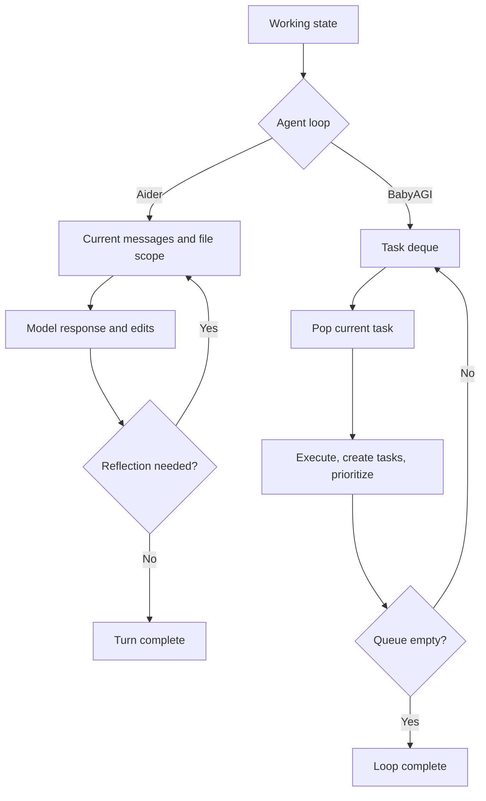

# Working Memory
> Module: 04_memory | Status: Phase 7 | Last Agent: Phase 7 Specialist Synthesis

## 1. Overview

Working memory is volatile state used to complete the current turn or loop iteration. [AIDER] Aider's working memory is the active chat state: current messages, completed/summarized history, editable files, read-only files, reflected messages, and per-turn edit/test outcomes. [BABYAGI] BabyAGI's working memory is the in-memory task deque plus the current task being executed.

## 2. Blueprint Specification

- Aider stores active conversation state in `cur_messages` and older completed state in `done_messages`, with summaries used when history grows. [AIDER]
- Aider tracks selected editable files and read-only files separately, and this file-scope state controls what the model may edit. [AIDER]
- Aider uses `reflected_message` as a retry channel for malformed edits, accepted file additions, and confirmed lint/test repair input. [AIDER]
- BabyAGI stores pending tasks in `SingleTaskListStorage`, a wrapper around a `deque`. [BABYAGI]
- BabyAGI task objects contain only `task_id` and `task_name`; queue replacement after prioritization rewrites the working order. [BABYAGI]

## 3. Logic Flow

1. Initialize active state: Aider starts a turn with current chat/file state; BabyAGI seeds the queue with the initial task. [AIDER][BABYAGI]
2. Select the next unit of work: Aider receives a user message; BabyAGI pops the leftmost task from the deque. [AIDER][BABYAGI]
3. Run the model with assembled context and capture output into active state. [AIDER][BABYAGI]
4. Update volatile state: Aider appends assistant output and may set a reflected message; BabyAGI appends new tasks and replaces the queue after prioritization. [AIDER][BABYAGI]
5. Continue or stop: Aider repeats while reflection is pending within its cap, while BabyAGI repeats until the queue is empty. [AIDER][BABYAGI]

## 4. Flowchart



## 5. Sequence Diagram

```mermaid
sequenceDiagram
    participant Loop
    participant WorkingMemory
    participant Model
    alt Aider path
        Loop->>WorkingMemory: Read cur_messages, file scope, reflected_message
        WorkingMemory->>Model: Provide assembled context
        Model-->>WorkingMemory: Assistant response, edits, or malformed output
        WorkingMemory-->>Loop: Continue if reflection is set
    else BabyAGI path
        Loop->>WorkingMemory: popleft next task
        WorkingMemory->>Model: Send execution prompt
        Model-->>WorkingMemory: Result and generated task lists
        WorkingMemory-->>Loop: Replaced prioritized deque
    end
```

## 6. Variations & Trade-offs

- Keeping editable file scope in working memory makes authority explicit, but the user or model must manage scope as the task evolves. [AIDER]
- Reflection is a compact retry mechanism, but Aider gates lint/test repair reflection behind user confirmation. [AIDER]
- BabyAGI's deque is easy to inspect and replace, but it has no durable pending-task history, status model, retry state, or leases. [BABYAGI]
- Minimal task objects reduce bookkeeping, but they force all nuance into natural-language task names. [BABYAGI]

## 7. Agent Attribution Table
| Agent | Source-backed contribution |
|---|---|
| Aider | [AIDER] Active and completed chat message state, editable/read-only file scope, reflected-message retries, and per-turn validation outcomes. |
| BabyAGI | [BABYAGI] In-memory task deque, minimal task records, append/replace/popleft queue operations, and loop continuation until the queue is empty. |
| Zed | [ZED] **Thread entity as working memory**: in Zed, the agent's working memory is the `Thread` entity — a GPUI `Entity` that manages the current conversation's messages. Because the agent is a native editor data structure, the Thread shares memory with the editor — no IPC overhead. The Thread is analogous to `cur_messages` in Aider but with direct access to editor state (buffer content, cursor position, file paths) as additional volatile context. Updates propagate automatically to all views via `cx.notify()`. This is a different deployment model for working memory — not a separate process's message buffer but a first-class editor entity. |

## 8. Repository Implementations

### Roo-Code
- **Task Conversation Thread**: Working memory primarily consists of the LLM conversation thread (user inputs, assistant messages, tool invocations, and results). As this thread grows, Roo-Code trims the working memory down by running `compact_session`, summarizing old segments while keeping recent ones intact.
- **Task Todo List**: A major addition to working memory is the explicit `todoList` state. Maintained via the `update_todo_list` tool, it remains active in the working memory throughout the task execution as a checklist of open objectives.
