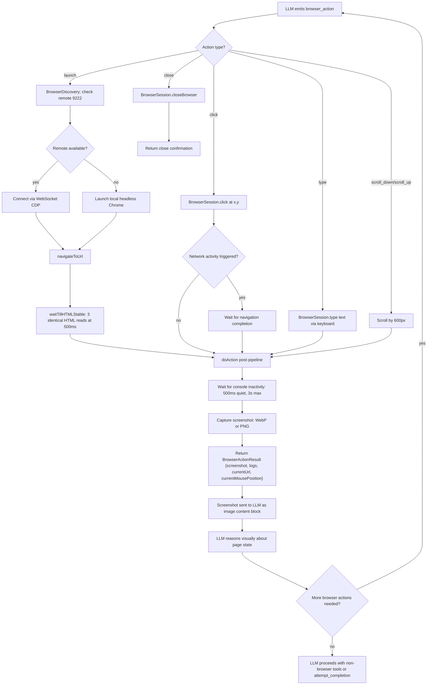
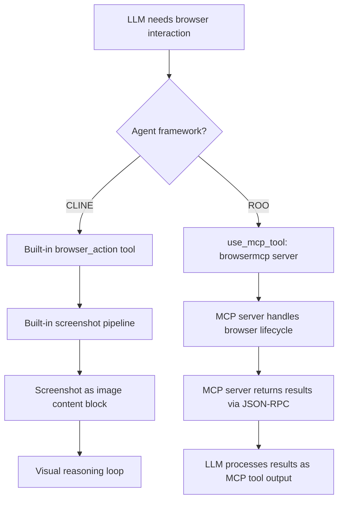
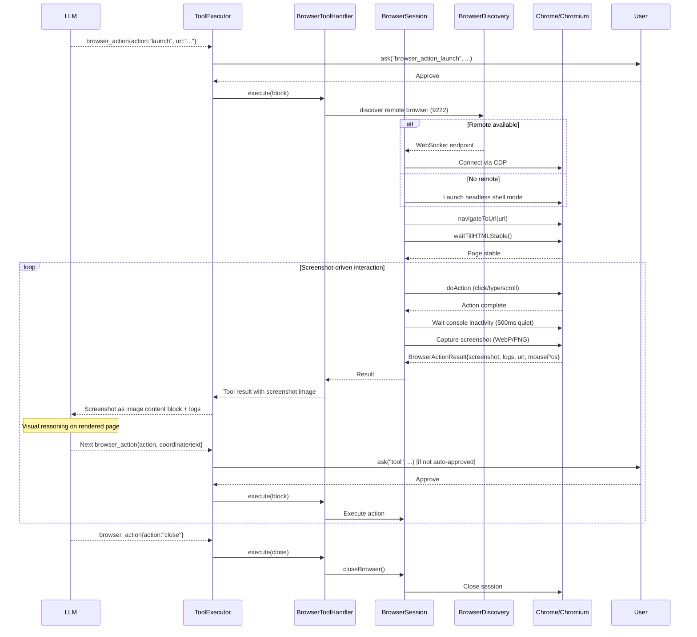

# Browser Interaction
> Module: 05_action_and_tools | Status: Phase 7 | Last Agent: Phase 7 Specialist Synthesis 

## 1. Overview
Browser interaction describes how an agent launches, controls, and reasons about a web browser within its tool-use loop. This document specifies the [CLINE] Puppeteer-based, screenshot-driven browser automation pattern as the Phase 4 reference. It is the **only** agent in the blueprint with first-party, built-in browser automation at the time of writing.

[CLINE] implements browser automation via **Puppeteer** in `src/services/browser/BrowserSession.ts`. The agent launches a Chrome/Chromium instance (headless or via remote debugging protocol), navigates to URLs, performs click/type/scroll actions, and after every action **except `close`** captures a **screenshot** that is sent back to the LLM as an image content block (`BrowserToolHandler.ts:177`, `BrowserSession.ts:340`). The `close` action returns a text confirmation without a screenshot. The LLM reasons visually about the page state — inspecting rendered layout, reading text from the screenshot, and deciding what to click or type next based on coordinates. This is Cline's "Computer Use" capability. (Cline research §4.)

[ROO] **removed browser automation entirely** from its Cline fork. `packages/types/src/tool.ts:16` declares `deprecatedToolGroups = ["browser"]`, and the schema preprocessor silently strips the `browser` group from any custom mode's configuration. There is no active `browser_action` tool or `BrowserSession.ts` in Roo Code's current `src/` tree, despite the `package.json` still listing `puppeteer-core` and `puppeteer-chromium-resolver` as dependencies. Roo's architectural bet is to **push browser interaction to MCP servers** (e.g., a `browsermcp` MCP server) rather than maintaining it as a first-party feature. This is the cleanest example in the blueprint of "MCP eats the agent's first-party tool surface." (Roo research §4.3, §6.10.)

> **Design tension**: [CLINE] treats browser as a core capability woven into the agent loop with rich approval UX. [ROO] treats browser as an external concern delegated to the protocol layer. Neither [CLAUDE], [CODEX], [AIDER], nor [BABYAGI] has built-in browser automation — [CLAUDE]'s `mcp__Claude_in_Chrome__*` tools are deferred MCP-side tools, not built-in browser sub-agents.

## 2. Blueprint Specification

### Browser Session Architecture [CLINE]

| Component | Implementation | Location |
| --- | --- | --- |
| Session manager | `BrowserSession` | `src/services/browser/BrowserSession.ts` |
| Browser discovery | `BrowserDiscovery` | `src/services/browser/BrowserDiscovery.ts` |
| Action handler | `BrowserToolHandler` | `src/core/task/tools/` (via `ToolExecutorCoordinator`) |
| Tool surface | `browser_action` | `src/shared/tools.ts` (`ClineDefaultTool` enum) |

### Browser Launch Modes [CLINE]

| Mode | Mechanism | When Used |
| --- | --- | --- |
| **Local headless** | Launches Chrome/Chromium in headless `"shell"` mode via Puppeteer | Default when no remote browser is configured |
| **Remote browser** | Connects to an existing Chrome instance via WebSocket (Chrome DevTools Protocol) | When `remoteBrowserHost` is configured |
| **Auto-discovery** | If no remote host is configured, tries Chrome's debug endpoint on `localhost` and `127.0.0.1` (port `9222`) | Fallback before launching a local instance |

Discovery flow (`BrowserDiscovery.ts`):
1. Probes `localhost:9222/json/version` and `127.0.0.1:9222/json/version` for Chrome's DevTools endpoint.
2. Extracts WebSocket endpoint from the `/json/version` response.
3. Caches the WebSocket endpoint with a **1-hour TTL** for reuse in `BrowserSession`.
4. Falls back to local browser launch on connection failure.

### Browser Actions [CLINE]

The `browser_action` tool accepts the following actions:

| Action | Parameters | Method | Description |
| --- | --- | --- | --- |
| `launch` | `url` | `launchBrowser()` + `navigateToUrl(url)` | Start browser session and navigate to URL |
| `click` | `coordinate` (x,y) | `click(coordinate)` | Click at specific pixel coordinates |
| `type` | `text` | `type(text)` | Type text via keyboard |
| `scroll_down` | — | `scrollDown()` | Scroll page down by 600px |
| `scroll_up` | — | `scrollUp()` | Scroll page up by 600px |
| `close` | — | `closeBrowser()` | Close browser session |

### Screenshot-Driven Interaction Model [CLINE]

After every action **except `close`**, `doAction()` executes a standard post-action pipeline:

1. **Attach listeners** — Console log and page error listeners are registered.
2. **Execute action** — The requested browser action runs.
3. **Wait for stability** — Waits for console log inactivity (500ms quiet period, 3s max timeout).
4. **Capture screenshot** — Takes a screenshot in WebP or PNG format (based on model image support).
5. **Return result** — `BrowserActionResult { screenshot, logs, currentUrl, currentMousePosition }`.

The screenshot is sent back to the LLM as an **image content block**, enabling **visual reasoning**. The LLM sees the rendered page and decides what to click/type next based on pixel coordinates. This is fundamentally different from DOM-based approaches — the agent reasons about the visual layout, not the HTML structure.

### Page Stability Mechanisms [CLINE]

| Mechanism | Implementation | Purpose |
| --- | --- | --- |
| `waitTillHTMLStable()` | Polls page HTML size every 500ms; waits for 3 consecutive identical readings | Ensures page has finished rendering before screenshot |
| Network activity detection | On click, monitors for triggered network requests | Waits for navigation completion if click triggers navigation |
| Console inactivity wait | 500ms quiet period, 3s timeout | Ensures JavaScript has finished executing |
| Automatic fallback | Remote → local browser on connection failure | Resilience against remote browser disconnection |

### Approval Flow [CLINE]

Browser actions go through Cline's standard per-action approval model:

1. `browser_action_launch` ask type → user must approve initial browser launch.
2. Subsequent browser actions follow the standard `tool` approval path.
3. Auto-approval modes (`yoloModeToggled`, `autoApprovalSettings.useBrowser`) can bypass the approval gate.
4. Non-browser tools automatically close the browser session before executing (cleanup in `ToolExecutor`).

### Browser Deprecation Rationale [ROO]

[ROO] deliberately removed browser automation as a design choice:

- `deprecatedToolGroups = ["browser"]` in `packages/types/src/tool.ts:16`.
- The `groupEntryArraySchema` silently strips `browser` entries during validation, so old configs that list `browser` don't fail — they just have it removed.
- Browser work is expected to go through MCP servers instead (e.g., `browsermcp`).
- This keeps the agent core leaner and pushes novel I/O to the protocol layer.
- The pattern is: **if a capability can be an MCP server, it should be**, rather than a first-party tool.

## 3. Logic Flow

### Full Browser Interaction Cycle [CLINE]

1. **LLM emits** `browser_action { action: "launch", url: "https://example.com" }`.
2. **ToolExecutor** routes to `BrowserToolHandler`.
3. **Approval check** — `ask("browser_action_launch", ...)` blocks until user approves.
4. **BrowserSession.launchBrowser()** — discovers or launches a Chrome instance.
5. **navigateToUrl(url)** — navigates and waits for page stability (`waitTillHTMLStable()`).
6. **doAction()** captures screenshot, console logs, current URL, mouse position.
7. **Result** returned to the loop — screenshot as image block, logs as text.
8. **LLM sees screenshot** and reasons: "I see a login form. I need to click the username field at coordinates (250, 340)."
9. **LLM emits** `browser_action { action: "click", coordinate: "250,340" }`.
10. **Approval check** — standard tool approval (or auto-approved if configured).
11. **BrowserSession.click(250, 340)** — clicks at coordinates.
12. **doAction()** captures new screenshot showing the clicked state.
13. **LLM sees updated screenshot** → types username → sees result → types password → etc.
14. **LLM emits** `browser_action { action: "close" }` when done.

### Cross-Tool Browser Lifecycle [CLINE]

The browser session is managed across tool boundaries:
- **Auto-close**: When a non-browser tool executes, `ToolExecutor` closes the browser session first.
- **Persistent session**: Browser stays open across consecutive `browser_action` calls within the same tool sequence.
- **Screenshot continuity**: Each action's screenshot feeds the visual reasoning chain.

## 4. Flowchart



### [ROO] Browser-via-MCP Pattern



## 5. Sequence Diagram

### [CLINE] Screenshot-Driven Browser Loop



### [ROO] MCP-Delegated Browser Pattern

```mermaid
sequenceDiagram
    participant LLM
    participant TE as ToolExecutor
    participant MH as McpHub
    participant BrowserMCP as browsermcp MCP Server
    participant Chrome as Chrome/Chromium

    LLM-->>TE: use_mcp_tool{server:"browsermcp", tool:"navigate", args:{url:"..."}}
    TE->>MH: callTool("browsermcp", "navigate", args)
    MH->>BrowserMCP: JSON-RPC tools/call
    BrowserMCP->>Chrome: Navigate to URL
    Chrome-->>BrowserMCP: Page loaded
    BrowserMCP-->>MH: Result (page content/screenshot)
    MH-->>TE: Output string
    TE-->>LLM: Tool result

    Note over LLM: Process result; may request further actions
    Note over LLM: No built-in visual reasoning pipeline
    Note over LLM: MCP server determines what data to return
```

## 6. Variations & Trade-offs

| Pattern | Benefit | Trade-off |
| --- | --- | --- |
| **Screenshot-driven visual reasoning** [CLINE] | LLM reasons about the actual rendered page — handles dynamic content, SPAs, canvas elements, and visual layouts that DOM-based approaches miss. | Requires models with strong image understanding; coordinate-based clicking is less precise than CSS-selector targeting; screenshots consume significant context window (image tokens). |
| **Headless + remote browser discovery** [CLINE] | Flexible deployment: local dev uses headless Chrome; remote setups connect to existing Chrome instances; auto-discovery on port 9222 handles common Docker/CI setups. | Auto-discovery is localhost-only (security constraint); remote WebSocket endpoint cached with 1-hour TTL may go stale. |
| **Per-action approval for browser** [CLINE] | User sees exactly what the agent wants to do in the browser before it happens; prevents accidental form submissions, purchases, or destructive actions. | High friction for long browser interaction sequences; YOLO mode bypasses all gates including browser. |
| **HTML stability polling** [CLINE] | Simple, robust mechanism (3 identical reads at 500ms intervals) that works across all types of page loads without needing framework-specific hooks. | Adds 1.5s minimum wait time; very dynamic pages (real-time feeds) may never stabilize. |
| **Browser-to-MCP delegation** [ROO] | Keeps agent core lean; browser capabilities evolve independently of the agent; multiple MCP servers can provide different browser strategies. | Loses the tight screenshot-reasoning loop; MCP server quality varies; no standardized image-return format in MCP; visual reasoning depends on what the MCP server chooses to return. |
| **`deprecatedToolGroups` silent-strip pattern** [ROO] | Old configs that list `browser` don't break — they gracefully degrade. | Silent removal can confuse users who expect browser tools; debugging requires checking the deprecated-groups list. |
| **Console log capture alongside screenshots** [CLINE] | LLM sees both visual state AND JavaScript errors/warnings — useful for debugging web applications. | Console logs can be noisy; privacy risk if sensitive data appears in console output. |

## 7. Agent Attribution Table

| Agent | Source-backed contribution |
| --- | --- |
| [CLINE] | Puppeteer-based browser automation via `BrowserSession.ts` with headless `"shell"` mode launch and remote CDP WebSocket connection; `BrowserDiscovery.ts` localhost-only auto-discovery on port 9222 with `/json/version` endpoint and 1-hour WebSocket cache TTL; six browser actions (`launch`, `click`, `type`, `scroll_down`, `scroll_up`, `close`) exposed as the `browser_action` tool with typed parameters (`url`, `coordinate`, `text`); screenshot-driven visual reasoning model where every action produces `BrowserActionResult { screenshot, logs, currentUrl, currentMousePosition }` with the screenshot sent as an image content block; `waitTillHTMLStable()` stability mechanism (3 consecutive identical HTML reads at 500ms intervals); console log inactivity wait (500ms quiet period, 3s timeout); network activity detection on click for navigation wait; automatic fallback from remote to local browser on connection failure; per-action `browser_action_launch` approval gate with `useBrowser` auto-approval setting; automatic browser close on non-browser tool execution. |
| [ROO] | **Browser deprecation as architectural policy**: `deprecatedToolGroups = ["browser"]` in `packages/types/src/tool.ts:16`; `groupEntryArraySchema` silent-strip preprocessor that removes browser from custom mode configs without validation failure; delegation of browser capabilities to MCP servers (e.g., `browsermcp`); the "MCP eats first-party tool surface" design pattern — if a capability can be an MCP server, push it to the protocol layer rather than maintaining it in the agent core. |

> Phase 6 [AUTOGPT] may add web-browsing plugin patterns. No other agent in the current blueprint has built-in browser automation comparable to [CLINE]'s Puppeteer integration.
