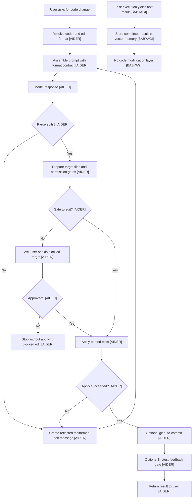
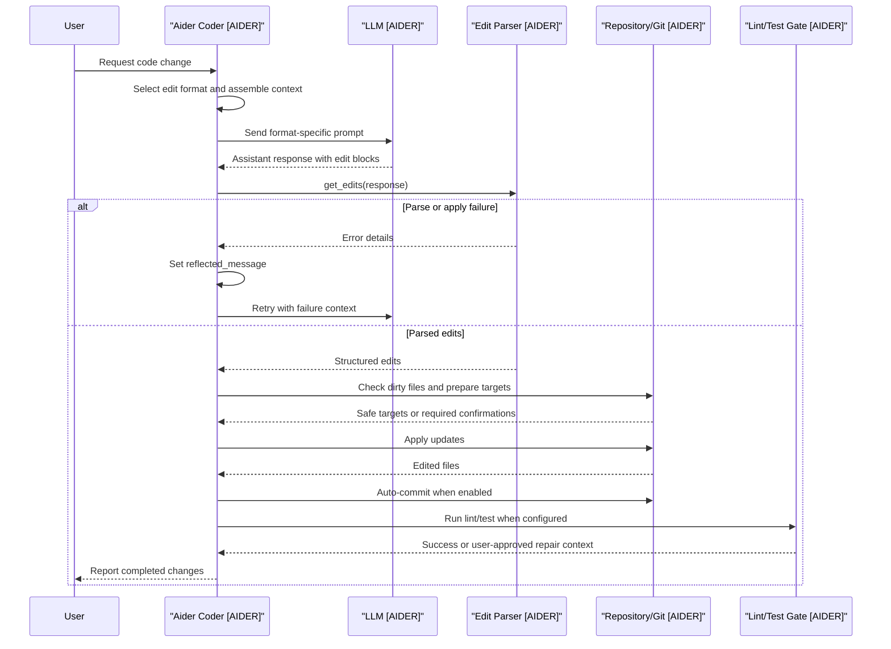

# Code Modification
> Module: 05_action_and_tools | Status: Phase 7 | Last Agent: Phase 7 Specialist Synthesis 

## 1. Overview

Code modification is the action-layer protocol that turns model text into controlled repository changes. [AIDER] In Phase 1, Aider is the concrete implementation: it chooses an edit format, prompts the model with format-specific examples, parses the response into file edits, dry-runs or validates the edits, applies them, and optionally commits the result through git. [AIDER]

The key architectural point is that code edits are not treated as ordinary prose. [AIDER] Aider binds each chat mode to a parser and a prompt contract, so `diff`, `diff-fenced`, `whole`, `udiff`, `patch`, `architect`, and editor-specific variants all carry different output expectations and failure modes. [AIDER] Malformed or unapplicable edits are converted into a reflected message that can drive another model pass. [AIDER]

BabyAGI establishes the negative baseline for this module. [BABYAGI] The archived task-loop implementation has no code editing protocol, no file operation schema, no patch parser, no repository write layer, and no post-edit verification path. [BABYAGI] It executes natural-language tasks and stores text results, which makes it useful as the floor beneath tool-capable coding agents. [BABYAGI]

## 2. Blueprint Specification

| Capability | Phase 1 Blueprint | Source Pattern |
| :--- | :--- | :--- |
| Edit-format routing | Select a coder/edit format from explicit user configuration, inherited coder state, or model settings before prompting. [AIDER] | `Coder.create()` and model edit-format defaults. [AIDER] |
| Prompt contract | Include format-specific edit examples and instructions so the model emits parseable changes instead of free-form prose. [AIDER] | `diff`, `diff-fenced`, `whole`, `udiff`, and `patch` prompt families. [AIDER] |
| Parse layer | Convert assistant output into structured edit intents through the active coder parser. [AIDER] | `get_edits()` in the selected coder. [AIDER] |
| Apply layer | Dry-run format-specific changes, gate risky edits, apply updates, and reflect malformed edit output. [AIDER] | `apply_updates()` and edit-format apply functions. [AIDER] |
| Repository safety | Check dirty files, confirm out-of-chat edits or new files, and use git commits as reversible checkpoints when enabled. [AIDER] | `prepare_to_edit()`, dirty commits, auto-commit, `/undo`. [AIDER] |
| Validation handoff | Run lint/test paths after edits and reflect failures only when user approval is given. [AIDER] | Auto-lint and auto-test confirmation gates. [AIDER] |
| Minimal baseline | Omit file mutation entirely; task execution yields text results only. [BABYAGI] | `babyagi_archive/babyagi.py` execution loop. [BABYAGI] |

Edit-format contracts:

- `diff` uses filename-prefixed SEARCH/REPLACE blocks, requiring exact or flexibly matched original text before replacement. [AIDER]
- `diff-fenced` keeps SEARCH/REPLACE semantics but places the filename inside the fenced block. [AIDER]
- `whole` replaces the entire file named before a code fence or inferred from the chat-file set. [AIDER]
- `udiff` uses unified-diff-like hunks with `---`, `+++`, `@@`, removed lines, and added lines. [AIDER]
- `patch` uses begin/end patch sentinels plus add, update, delete, or move actions. [AIDER]
- `architect` is a planning mode that delegates implementation to an editor coder rather than directly applying edits from the architect response. [AIDER]

## 3. Logic Flow

1. Resolve the active edit format from user settings, the selected model, or an existing coder. [AIDER]
2. Assemble context with editable files, read-only files, repo-map summaries, chat history, and coder-specific edit instructions. [AIDER]
3. Send the prompt to the selected model and accumulate streamed or non-streamed assistant output. [AIDER]
4. Parse assistant output through the active coder's `get_edits()` implementation. [AIDER]
5. If parsing fails, create a reflected message describing the malformed edit and re-enter the loop within the reflection cap. [AIDER]
6. For parsed edits, prepare target files: confirm new files, confirm edits to existing files outside chat, skip or gate ignored files, and checkpoint dirty in-chat files. [AIDER]
7. Dry-run and apply format-specific updates. [AIDER]
8. If any edit cannot be uniquely or safely applied, reflect the failure as model-visible feedback. [AIDER]
9. On successful apply, commit edited files when git auto-commit is active. [AIDER]
10. Run configured lint/test paths after the commit and ask before feeding failures back to the model. [AIDER]
11. BabyAGI does not enter this flow because its execution agent produces result text and writes to vector memory, not source files. [BABYAGI]

## 4. Flowchart

## 5. Sequence Diagram

## 6. Variations & Trade-offs

| Variation | Strength | Cost or Risk |
| :--- | :--- | :--- |
| SEARCH/REPLACE blocks [AIDER] | Compact and targeted; preserves untouched file content. [AIDER] | Requires exact enough context and can fail when repeated blocks are ambiguous. [AIDER] |
| Whole-file replacement [AIDER] | Simple parser contract and good for small files. [AIDER] | Higher token cost and higher accidental overwrite risk for large files. [AIDER] |
| Unified diff [AIDER] | Familiar to developers and compact for localized edits. [AIDER] | Needs robust hunk matching and clear uniqueness handling. [AIDER] |
| Patch action format [AIDER] | Represents add, update, delete, and move operations explicitly. [AIDER] | Parser complexity is higher than plain whole-file output. [AIDER] |
| Architect/editor split [AIDER] | Separates planning from implementation while reusing the edit/apply/commit machinery. [AIDER] | Adds another model pass and requires a handoff prompt that is precise enough for the editor. [AIDER] |
| No edit layer [BABYAGI] | Minimal autonomous loop with very low implementation complexity. [BABYAGI] | Cannot mutate code, verify repository changes, or recover from patch-level failures. [BABYAGI] |

## 7. Agent Attribution Table
| Agent | Contribution | Phase 1 Use |
| :--- | :--- | :--- |
| [AIDER] | Edit-format routing, prompt/parser coupling, guarded file application, git checkpointing, and validation feedback. | Primary source for the code modification blueprint. |
| [BABYAGI] | Demonstrates the minimal loop without tools, files, edit formats, or verification. | Contrast case defining what is absent below the action-capable layer. |

## 8. Repository Implementations

### Roo-Code
- **Pluggable Edit Strategies**: Roo-Code exposes multiple code modification tools (`write_to_file` for complete rewrites, `search_replace` for targeted block edits, `apply_diff` for unified diffs, and `apply_patch` for semantic patching).
- **Edit format evaluation**: Unlike Aider which binds a single coder format to a session, Roo-Code provides all these tools and allows the LLM to select the most appropriate modification strategy dynamically based on the edit size and complexity.
