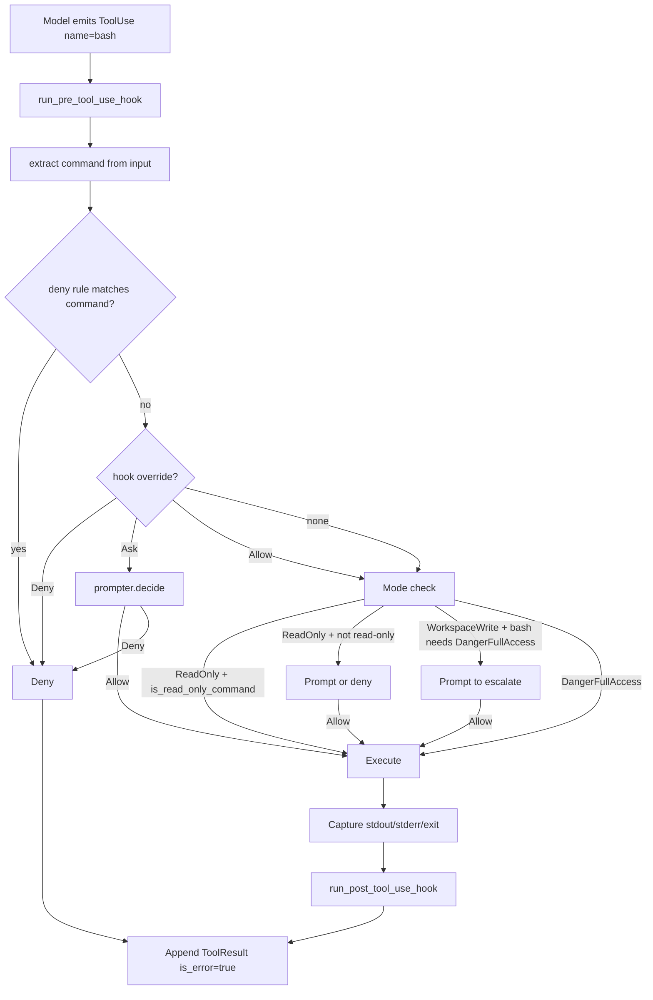
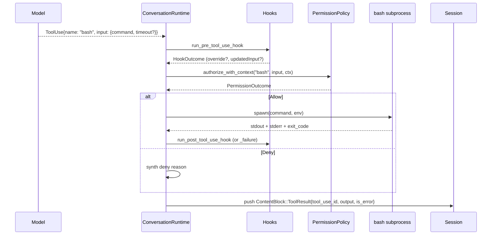
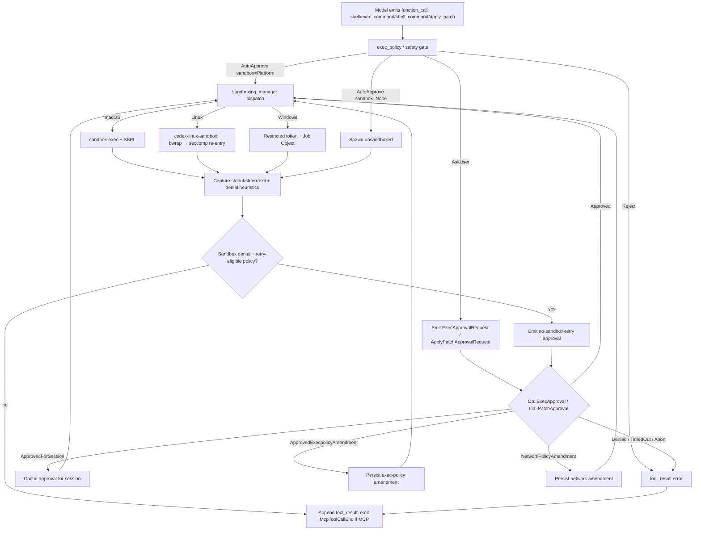
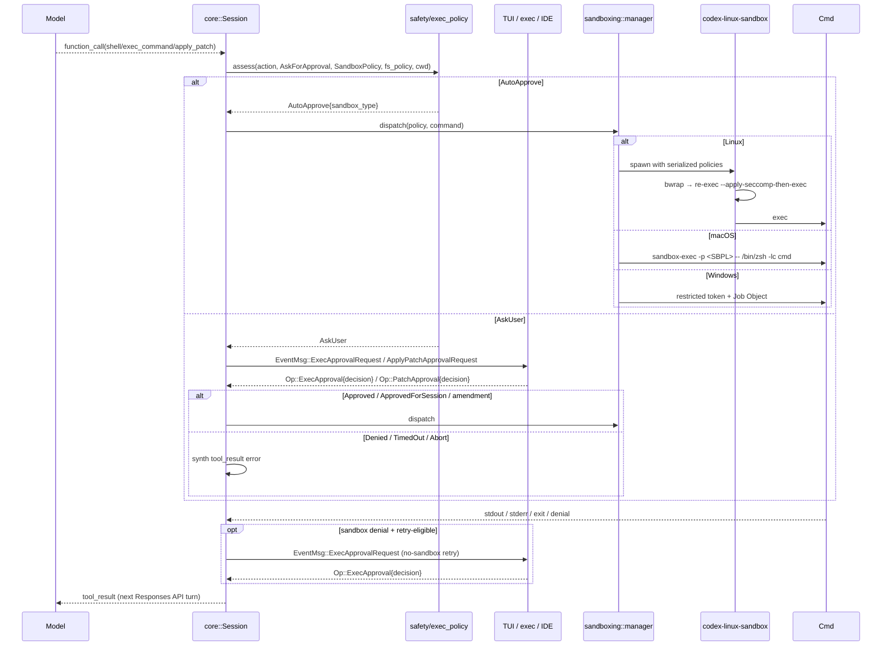

# Command Execution
> Module: 05_action_and_tools | Status: Phase 7 | Last Agent: Phase 7 Specialist Synthesis 

## 1. Overview
Command execution is the action surface that lets an agent run shell or interpreter commands against the user's environment. This document specifies the [CLAUDE] command-execution surface as the Phase 2 reference and the [CODEX] sandboxed-execution surface as the Phase 3 reference; Phase 5 will add OpenCode's TUI-driven command execution.

[CLAUDE] exposes three command-execution tools at HEAD `a389f8d`, all gated by the `DangerFullAccess` permission tier:

| Tool | Required input | Optional input | Purpose |
| --- | --- | --- | --- |
| `bash` | `command` | `timeout`, `description`, `run_in_background`, `dangerouslyDisableSandbox`, `namespaceRestrictions`, `isolateNetwork`, `filesystemMode`, `allowedMounts` | General-purpose shell command execution. |
| `PowerShell` | `command` | `timeout`, `description`, `run_in_background` | Windows-side command execution. |
| `REPL` | `code`, `language` | `timeout_ms` | Stateful interpreter execution (multi-language). |

(claw-code: `tools/src/lib.rs:387-600` and `603-854`; permission tiers per Part 1 §2 catalog.)

## 2. Blueprint Specification

### `bash` tool [CLAUDE]
- **Permission tier**: `DangerFullAccess`. Even with `--dangerously-skip-permissions`, a `Bash(rm -rf:*)` deny rule or a hook-driven `PermissionOverride::Deny` still blocks dangerous commands (`permissions.rs:182-189`).
- **Input schema** (per Part 1 §2 table):
  - `command: string` — required.
  - `timeout: number` — optional, milliseconds.
  - `description: string` — optional, free-text describing what the command does (used for telemetry and approval UX).
  - `run_in_background: bool` — optional. When true, the command starts and returns immediately; output is collected via a separate read mechanism.
  - `dangerouslyDisableSandbox: bool` — optional, opt-out from any sandbox layer.
  - `namespaceRestrictions`, `isolateNetwork`, `filesystemMode`, `allowedMounts` — optional sandbox-shaping fields recognized in the schema; the actual sandbox enforcement layer in claw-code is the `PermissionEnforcer::check_bash` heuristic, not a kernel-level sandbox (see below).
- **Read-only short-circuit**: under `ReadOnly` mode, `PermissionEnforcer::check_bash` uses an `is_read_only_command` heuristic to allow commands like `cat | grep | git log | …` without escalation (`permission_enforcer.rs:145-201`). This lets the model still navigate the repo in plan mode.
- **Workspace-boundary enforcement**: `check_bash` does not block writes outside the workspace by inspecting the command string — that responsibility falls to the operator via deny-rules and hooks. The complementary `check_file_write(path, workspace_root)` is invoked for filesystem-write tools, not for arbitrary `bash` commands.

### `PowerShell` tool [CLAUDE]
- **Permission tier**: `DangerFullAccess`.
- Mirror of `bash` for Windows hosts; smaller schema (no namespace/sandbox fields exposed at HEAD `a389f8d`).
- Routes through the same hook + permission machinery.

### `REPL` tool [CLAUDE]
- **Permission tier**: `DangerFullAccess`.
- **Input**: `code: string`, `language: string`, optional `timeout_ms: number`.
- This is the multi-language interpreter execution surface in claw-code's catalog. Statefulness across calls within a session is implementation-internal; Phase 5's [OPENCODE] research will document TUI-driven execution at greater depth.

### Permission flow for command tools [CLAUDE]
All three command tools share the same gate sequence (see `agentic_loop.md` §3 step 7):

1. `run_pre_tool_use_hook` — can rewrite `input` via `updatedInput` or override the permission decision.
2. `extract_permission_subject(input)` — for `bash`, this extracts the `command` field as the rule-matchable subject (`permissions.rs:447-469`).
3. `PermissionRule` matching: rule strings like `bash(git:*)` or `Bash(rm -rf)` are parsed by `PermissionRule::parse` (`permissions.rs:349-402`). Matchers: `*`/empty → `Any`, `prefix:*` → `Prefix(prefix)`, otherwise `Exact(value)`. A bare `ToolName` (no parens) becomes `Any`.
4. `authorize_with_context` produces `Allow | Deny | Prompt`. Under `DangerFullAccess` mode (claw-code's default — see `permission_model.md` for the divergence note), an absent matching rule falls through to `Allow`.
5. `tool_executor.execute("bash", input)` runs the command.
6. `run_post_tool_use_hook` (success) or `run_post_tool_use_failure_hook` (error).

### Bash result framing [CLAUDE]
The result string returned to the model contains the captured output. There is no global truncator in `conversation.rs`; per-tool truncation is at each tool's discretion. (Compare: `WebFetch` truncates at 8_192 bytes appending `[response truncated — N bytes total]` per `tools/src/lib.rs:1783-1796`; `bash` typically does not truncate its captured output, so very chatty commands can pressure the context window.)

### Background execution [CLAUDE]
The `bash` tool's `run_in_background: true` flag returns control to the loop without blocking on completion. There is no built-in tool to read background output in the published catalog — the operator is expected to capture output to a file inside the command itself (e.g. `&> /tmp/log.out`).

## 3. Logic Flow

1. **Model emits** `ContentBlock::ToolUse { name: "bash", input: { command, ... } }`.
2. **Pre-hook** runs; may rewrite the command via `updatedInput`.
3. **Subject extraction** picks the `command` string for rule-matching.
4. **Deny rules** check first; on match → `PermissionOutcome::Deny`.
5. **Hook overrides** (`Allow`/`Deny`/`Ask`) apply if present.
6. **Mode check**: under `ReadOnly`, the `is_read_only_command` heuristic decides; under `WorkspaceWrite`, prompt-on-escalate; under `DangerFullAccess`, allow-by-default.
7. **Execute**: the runtime forks the command, captures stdout/stderr (and exit code), respecting `timeout` if set.
8. **Post-hook** runs; result is composed with optional `Hook feedback` sections.
9. **Append** `ContentBlock::ToolResult { tool_use_id, tool_name: "bash", output, is_error }` to the session.

## 4. Flowchart


## 5. Sequence Diagram


## 6. Variations & Trade-offs

| Variation | Benefit | Trade-off |
| --- | --- | --- |
| **Single shell tool with rich schema** [CLAUDE] | One command surface for the model to learn; `description` field aids approval UX. | One permission tier (`DangerFullAccess`) for the whole tool — granularity comes from rules and hooks, not the spec. |
| **Read-only command heuristic** [CLAUDE] | `cat`, `grep`, `git log`, etc. work in plan mode without prompting. | Heuristic-based: a novel "read-only" command like `mycmd --dry-run` won't be auto-allowed; the model has to escalate. |
| **`run_in_background`** [CLAUDE] | Long-running commands don't block the loop. | No built-in "read-back" tool in the public catalog; operator must capture output to a known path. |
| **Sandbox-shaping fields in the schema (`namespaceRestrictions`, etc.)** [CLAUDE] | Forward-compatible with future sandbox layers. | At HEAD `a389f8d` the harness enforcement is permission rules + hooks, not a kernel-level sandbox — see `sandboxing.md` for what each agent actually enforces. Phase 3 [CODEX] will populate this gap. |
| **No built-in output truncator** [CLAUDE] | Faithful command output for debugging. | A noisy command (`find /` etc.) can blow the context window; the operator must wrap with `head` or `2>&1 | tee`. |
| **`PowerShell` parity tool** [CLAUDE] | Windows-host parity for the same loop semantics. | Two tools to gate; rules must be authored for both. |
| **`REPL` for multi-language** [CLAUDE] | One spec covers Python, JS, Shell, etc. via a `language` selector. | Statefulness across calls is opaque from the spec; Phase 5 [OPENCODE] will document the TUI execution model. |
| **Sandboxed-by-default execution** [CODEX] | Containment is real (Seatbelt / bwrap+seccomp / Windows token+job); `Never` does not mean "unsandboxed"; symlink/`.git`/`io_uring`/`ptrace` escapes are explicitly blocked. | Per-OS dispatcher must keep three backends in capability parity; Seatbelt cannot enforce packet-level network filtering; helper-binary versioning has to track core-protocol changes. |
| **Wire-protocol approval round-trip** [CODEX] | The same `core` crate drives TUI, headless `exec`, MCP-server, IDE/app-server unchanged; approval-state survives IPC; amendments (`ApprovedForSession`, `ApprovedExecpolicyAmendment`, `NetworkPolicyAmendment`) persist in-session. | Higher latency than in-process callback; UI front-ends must handle parked-turn state; replay/recovery on UI restart is a real concern. |
| **`apply_patch` freeform grammar tool** [CODEX] | Multi-file, multi-action edits in one call; envelope tokens make the payload unambiguous; narrow fuzzy match avoids over-eager matches. | Requires GPT-5-style freeform-tool support (JSON `{ input: string }` fallback for older models); no NFC normalization; fuzzy match cannot rescue heavy whitespace/encoding skew the way Aider's heuristics try to. |
| **No default `read_file`/`write_file` pair** [CODEX] | All filesystem reads and structured writes flow through the same approval+sandbox pipeline (shell, MCP resources, `apply_patch`); no "easy" channel that bypasses containment. | Higher per-read overhead than a typed read-file tool; agents have to compose `cat`/`sed`/`apply_patch` rather than a single typed call. |
| **`exec_command` + `write_stdin` unified-exec session** [CODEX] | Long-running interactive processes (REPLs, build watchers) can be driven turn-by-turn within one sandboxed session; `tty: true` enables proper pty semantics via `utils/pty`. | Session lifecycle is now stateful state the orchestrator must track; `max_output_tokens` and `yield_time_ms` need careful tuning to avoid stalls. |

## [CODEX] Sandboxed Command & Patch Execution

Codex's command execution is the same orchestration surface that runs `apply_patch`: every shell-family tool call and every patch action flows through `core/src/safety.rs` / `core/src/exec_policy.rs`, then through the per-OS sandbox dispatcher (`codex-rs/sandboxing/src/manager.rs`) before any process is spawned. The headline difference from [CLAUDE]'s `bash` is that the containment is real and platform-native — see [sandboxing.md](../07_permissions_and_governance/sandboxing.md) for the kernel-level mechanics — and approval is a wire-protocol round-trip rather than an in-process prompter call.

### Tool catalog [CODEX]

The model-facing tool surface is assembled by `codex-rs/tools/src/tool_registry_plan.rs` and serialized through `codex_tools::create_tools_json_for_responses_api`. The shell family is config-driven; the registry chooses among:

| Tool | Required | Optional | Notes |
| --- | --- | --- | --- |
| `shell` | `command: string[]` | `workdir`, `timeout_ms`, approval/escalation fields | Function tool. Command as **array** of argv. |
| `local_shell` | (custom) | — | `ToolSpec::LocalShell` custom tool, distinct JSON schema from `shell`. |
| `exec_command` | `cmd: string` | `workdir`, `shell`, `tty`, `yield_time_ms`, `max_output_tokens`, `login`, approval fields | Unified exec; `cmd` is a **string**, not array. Pairs with `write_stdin`. |
| `write_stdin` | (session id + bytes) | — | Attaches input to a running unified exec session. |
| `shell_command` | `command: string` | `workdir`, `timeout_ms`, `login`, approval fields | Function tool; `command` as a **string**. |
| `apply_patch` | (freeform body) | — | Default: freeform grammar custom tool whose payload is the patch text (`tools/src/tool_apply_patch.lark`). Fallback for older models: function tool `{ input: string }`, `strict: false`. |

There is no default `read_file`/`write_file` pair. Reading is normally through shell, MCP resources (`list_mcp_resources`, `read_mcp_resource`), `list_dir`, or `view_image`. Structural mutation is `apply_patch`; freeform mutation is shell, going through the same approval+sandbox pipeline.

### Approval × sandbox composition for shell tools [CODEX]

`exec_policy.rs` produces an `ExecApprovalRequirement` from the (`AskForApproval`, `SandboxPolicy`, command, exec-policy rules, prior session approvals) tuple. Branches:

- Dangerous commands or missing sandbox protections → prompt under `OnFailure`/`OnRequest`/`UnlessTrusted`/`Granular`; under `Never` they are forbidden unless `SandboxPolicy` is `DangerFullAccess` or `ExternalSandbox`.
- `Never` and `OnFailure` skip the initial approval for ordinary commands and rely on the sandbox.
- `OnRequest` allows ordinary non-escalated commands in a restricted sandbox; prompts for sandbox overrides, network/permission amendments, dangerous commands, and `prompt`-classified policy rules.
- `Granular` mirrors the relevant branch but converts disabled categories into automatic rejection.
- After a sandbox denial, the orchestrator may emit a no-sandbox-retry approval prompt only for policies/tools that allow it (`OnFailure`, `UnlessTrusted`, `Granular` with `sandbox_approval=true`). `Never` and ordinary `OnRequest` do **not** silently retry without sandbox.

### `apply_patch` envelope [CODEX]

Defined and parsed by `codex-rs/apply-patch/src/lib.rs`. Custom textual format, not unified diff:

```
*** Begin Patch
*** Add File: path/to/new.py
+from __future__ import annotations
+
+def hello():
+    return "hi"
*** Update File: existing/file.py
*** Move to: existing/renamed.py            (optional, paired with Update)
@@
 unchanged context line
-old line
+new line
@@ def some_function():
 unchanged within hunk
-removed
+added
*** Delete File: dead/file.py
*** End Patch
```

Tokens:

- **Sentinels**: `*** Begin Patch` opens, `*** End Patch` closes. The freeform grammar requires the payload to *be* the patch (`start: begin_patch hunk+ end_patch`).
- **Action verbs**: `*** Add File: <path>`, `*** Update File: <path>`, `*** Delete File: <path>`, `*** Move to: <path>` (only valid immediately after an `Update File:` action).
- **Hunk markers**: `@@` introduces a chunk inside `Update File:`. An optional anchor (e.g. `@@ def some_function():`) disambiguates repeated regions.
- **Line prefixes**: `+` add, `-` remove, ` ` (space) context.
- **EOF marker**: `*** End of File` after the last hunk indicates the patch consumes the literal end of file.

The applier is fuzzy in narrow source-matching passes only:
1. exact match;
2. trim trailing whitespace;
3. trim both sides;
4. fold common Unicode punctuation/space variants to ASCII.

There is no broad similarity search like Aider's `flexible_search_and_replace`. Trailing-newline repair is handled separately. The matcher does **not** perform NFC normalization. `safety.rs::is_write_patch_constrained_to_writable_paths()` normalises every action target through `..` resolution, lowercases on case-insensitive filesystems, and tests each against `writable_roots` before approving.

The patch decision tree (`safety.rs::assess_patch_safety(...)`):

```
1. patch.is_empty()                                   → Reject("empty patch")
2. policy == UnlessTrusted                            → AskUser
3. constrained_to_writable_paths(patch) || policy == OnFailure:
     a. SandboxPolicy in {DangerFullAccess, ExternalSandbox} → AutoApprove(sandbox_type=None)
     b. platform sandbox available                          → AutoApprove(sandbox_type=<that>)
     c. unavailable AND policy rejects sandbox-approval     → Reject("no sandbox available")
     d. otherwise                                            → AskUser
4. policy is Granular with sandbox_approval=false     → Reject(reason)
5. otherwise                                          → AskUser
```

### Approval as a wire-protocol round-trip [CODEX]

When `AskUser` is the verdict, the runtime emits `EventMsg::ExecApprovalRequest(...)` (shell) or `EventMsg::ApplyPatchApprovalRequest(...)` (patch) and **parks the turn**. Reply arrives as `Op::ExecApproval { id, turn_id, decision }` or `Op::PatchApproval { id, decision }`. `ReviewDecision` includes `Approved | ApprovedForSession | ApprovedExecpolicyAmendment | NetworkPolicyAmendment | Denied | TimedOut | Abort`, so a single reply can both authorize the immediate prompt and persist a command/network policy amendment for the session.

Because the approval flow lives on the wire protocol, *the same `core` crate drives a TUI, a headless `codex exec`, an MCP-server-as-Codex, and IDE/app-server front-ends without code changes* — a structurally different shape from [CLAUDE]'s in-process `prompter` callback.

### Sandbox dispatch detail [CODEX]

See [sandboxing.md](../07_permissions_and_governance/sandboxing.md) for the full per-OS mechanics. Summary for command execution:

| Platform | Spawn shape |
| --- | --- |
| macOS | `/usr/bin/sandbox-exec -p <SBPL profile> -DWRITABLE_ROOT_*=... -DEXCLUDE_*=... -- /bin/zsh -lc <cmd>` |
| Linux | Spawn `codex-linux-sandbox` helper with serialized `--sandbox-policy` / `--file-system-sandbox-policy` / `--network-sandbox-policy` JSON; helper runs `bwrap` with `--unshare-user/--unshare-pid`, `--unshare-net` if network is restricted, `--bind`/`--ro-bind`/`--tmpfs` per writable root and protected subpath, then re-execs itself with `--apply-seccomp-then-exec` to install seccomp (always denies `ptrace`, `io_uring_*`) and `PR_SET_NO_NEW_PRIVS` before `exec`'ing the command. |
| Windows | Restricted token + Job Object via `windows-sandbox-rs/`. |

Capture: stdout, stderr, exit code, plus sandbox-denial heuristics (e.g. ENOENT-on-bind-mount, EPERM-on-seccomp-denied syscall) so the orchestrator can branch into the no-sandbox-retry approval path when policy permits.

### Output handling [CODEX]

`output-truncation` (`utils/output-truncation/`) and `max_output_tokens` on `exec_command` cap individual tool outputs. Long-running unified-exec sessions can be polled via `write_stdin` plus subsequent `exec_command` reads. The `pty` utility crate provides terminal emulation when `tty: true` is set on `exec_command`.

### `[CODEX]` shell flowchart



### `[CODEX]` shell sequence diagram



## 7. Agent Attribution Table

| Agent | Source-backed contribution |
| --- | --- |
| [CLAUDE] | `bash` tool with `command, timeout, description, run_in_background, dangerouslyDisableSandbox, namespaceRestrictions, isolateNetwork, filesystemMode, allowedMounts` schema; `PowerShell` parity for Windows; `REPL { code, language, timeout_ms }` multi-language interpreter; `DangerFullAccess` permission tier for all command tools; `is_read_only_command` heuristic for read-only-mode short-circuit; rule subject extraction picks the `command` field; `run_in_background` for non-blocking commands; per-tool result framing without global truncation. |
| [CODEX] | Config-driven shell family (`shell` array-argv, `local_shell` custom, `exec_command`+`write_stdin` unified, `shell_command` string-form); `apply_patch` as a freeform-grammar custom tool with multi-action envelope (`Add File`/`Update File`/`Delete File`/`Move to`, optional `@@ <anchor>`); narrow fuzzy matcher (exact → trim-trailing → trim-both → Unicode-fold); `safety.rs::assess_patch_safety` decision tree returning `AutoApprove { sandbox_type, user_explicitly_approved } | AskUser | Reject`; `exec_policy.rs` `ExecApprovalRequirement` with dangerous-command, escalation, and exec-policy-rule classification; sandbox dispatch via `sandboxing::manager` to Seatbelt / `codex-linux-sandbox` helper / Windows restricted-token paths; approval as wire-protocol round-trip (`EventMsg::ExecApprovalRequest`/`ApplyPatchApprovalRequest` ↔ `Op::ExecApproval`/`Op::PatchApproval`); `ReviewDecision` carrying `Approved | ApprovedForSession | ApprovedExecpolicyAmendment | NetworkPolicyAmendment | Denied | TimedOut | Abort`; sandbox-denial heuristics + no-sandbox-retry approval path for retry-eligible policies; `output-truncation` + `max_output_tokens` per-tool output caps; `pty` for `tty: true` exec sessions. |

> Phase 1 [AIDER]'s `/run` and shell-output decisions, and [BABYAGI]'s text-only execution, are not first-class command-execution tools. Phase 5 [OPENCODE] will add TUI-driven command execution and [PI]'s tool-calling runtime contrasts with [CODEX]'s OS sandbox.

## 8. Repository Implementations

### Roo-Code
- **Background Execution Management**: Roo-Code implements `execute_command` alongside `read_command_output` to handle long-running or interactive shells. Rather than blocking the loop, commands can run in the background while the LLM continues executing or reads the ongoing stdout/stderr streams.
- **PTY Emulation**: Execution environments often utilize PTYs (pseudoterminals) to run formatters, test suites, and linters with native color output and interactive behaviors correctly routed to the user's IDE terminal panel.
