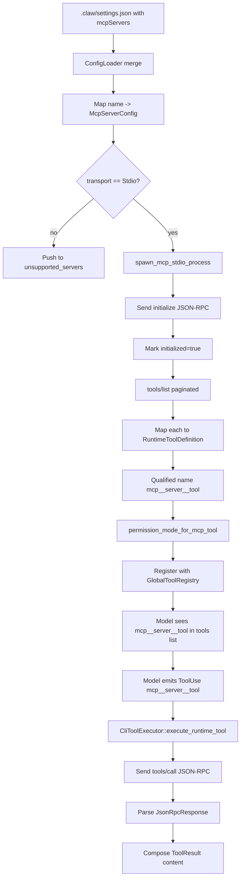

# Extensibility
> Module: 05_action_and_tools | Status: Phase 7 | Last Agent: Phase 7 Specialist Synthesis

## 1. Overview
Extensibility describes how an agent's tool catalog can grow at runtime — without modifying the harness binary. The blueprint now recognises **five paradigms**:

1. **Protocol-based** ([CLAUDE], [CLINE], [ROO]) — Model Context Protocol (MCP) JSON-RPC servers exposed over stdio, SSE, streamable HTTP, etc. Tools are external processes that speak a wire protocol.
2. **Code-based plugins** ([AUTOGPT], [PI]) — In-process components / hooks. Tools are Python or TypeScript classes/methods in the same process as the agent. AutoGPT uses the *component system* (`AgentComponent` subclasses + `@command` decorator + `SkillComponent` for runtime-discoverable `SKILL.md`); Pi uses *extension hooks* on the `Agent` class.
3. **Loader-based providers** ([OPENCODE]) — Async factory functions registered in a `customLoaders` map; provider/tool surface is constructed at startup but the loader contract is open.
4. **Rule-based / CI-integrated** ([CONTINUE]) — Markdown rules with YAML frontmatter (`.continuerules`, `.continue/checks/`, `.continue/agents/`) that compose with context providers and execute as IDE commands or CI status checks. This is a **prompt-as-code** extensibility model — version-controlled alongside source code.
5. **Autonomous skill creation** ([HERMES]) — The agent monitors successful task completions and auto-creates reusable skill files (`~/.hermes/skills/`). Skills are markdown with YAML metadata, compatible with the [agentskills.io](https://agentskills.io) open standard. This is **self-extending** extensibility — the agent grows its own tool catalog without operator intervention.

**Phase 7 additions**: [OPENCLAW] adds a **two-style plugin system** (isolated + in-process) behind its 22+ channel adapter abstraction. [ZED] adds **ACP (Agent Control Protocol) servers** as an MCP-like protocol integrated into the editor's entity model.

[CLAUDE] uses MCP as its primary extension surface, with only **stdio** transport wired up at HEAD (SSE/HTTP/WS parse but don’t connect). See below for the full [CLAUDE] specification.

[CLINE] implements an MCP client via `McpHub` (`src/services/mcp/McpHub.ts`) that manages the full server lifecycle: discovery, connection, tool/resource/template listing, and per-call dispatch. Cline reads MCP configurations from the global `cline_mcp_settings.json` (`disk.ts:55`) and supports **stdio**, **SSE**, and **streamable HTTP** transports (`schemas.ts:67`). Cline exposes two MCP tools: `use_mcp_tool { server_name, tool_name, arguments }` for tool calls and `access_mcp_resource { server_uri, uri }` for resource reads. Per-tool auto-approval via `cline_mcp_settings.json` allows selective unattended use. (Cline research §3.3.)

[ROO] inherits Cline's `McpHub` but adds **mode-conditional MCP gating** (MCP tools only available if the active mode includes `mcp` in its `groups` list), per-server `alwaysAllow` lists, `disabledTools` lists, and server-namespaced tool deduplication — when multiple servers expose the same tool name, Roo distinguishes them by server rather than silently hiding duplicates (`mcp_server.spec.ts:114`). Roo uses `.roo/mcp.json` for project-level config and global `mcp_settings.json` for user-level config (`globalFileNames.ts:4`); the old `cline_mcp_settings.json` is read only as **migration input** during settings migration (`migrateSettings.ts:26`), not as a runtime fallback. The `orchestrator` mode (`groups: []`) cannot use MCP tools at all. (Roo research §2.1.)

[CLAUDE] uses the **Model Context Protocol** (MCP) as its primary extension surface. An MCP server is an external process that speaks JSON-RPC 2.0 over stdio (or, in spec, SSE/HTTP/WebSocket — but only stdio is wired up at HEAD `a389f8d`). The harness discovers MCP server configurations from settings files, spawns the configured stdio servers on first use, requests their tool list, registers each tool as a `RuntimeToolDefinition` with a qualified name `mcp__<server>__<tool>`, and then those qualified names appear alongside built-in tools on `MessageRequest.tools` (claw-code: `rust/crates/runtime/src/mcp_stdio.rs`, `mcp.rs`, `mcp_tool_bridge.rs`).

## 2. Blueprint Specification

### Settings shape [CLAUDE]
- **Top-level key**: `mcpServers` in any merged settings file (`config.rs:709-733`).
- **Per-entry**: object map of `name -> server-spec`.
- Each entry is wrapped as `ScopedMcpServerConfig { scope: ConfigSource::{User, Project, Local}, config: McpServerConfig }`. Last-defined scope wins per the standard settings-merge order (`config.rs:103-106`).

### Server-config variants [CLAUDE]
`McpServerConfig` (`config.rs:120-128`):

| Variant | Discriminator (`type`) | Fields |
| --- | --- | --- |
| `Stdio` | `"stdio"` | `command, args[], env{}, toolCallTimeoutMs?` |
| `Sse` | `"sse"` | `url, headers, headersHelper?, oauth?{...}` |
| `Http` | `"http"` (default if `url` present) | same as `Sse` |
| `Ws` | `"ws"` | `url, headers, headersHelper?` |
| `Sdk` | `"sdk"` | `name` |
| `ManagedProxy` | `"claudeai-proxy"` | `url, id` |

Type inference: when `type` is absent, `infer_mcp_server_type` returns `"http"` if `url` is present else `"stdio"` (`config.rs:992-998`).

### Transport actually implemented [CLAUDE]
**Only `stdio` connects in practice.** `McpServerManager::from_servers` filters `server_config.transport() == McpTransport::Stdio` and pushes everything else to `unsupported_servers` with reason `"transport <T> is not supported by McpServerManager"` (`mcp_stdio.rs:494-512`). `Sse`, `Http`, `Ws`, `Sdk`, `ManagedProxy` parse from JSON but do not connect at HEAD `a389f8d`.

### Stdio server lifecycle [CLAUDE]
Single entry point: `ensure_server_ready(server_name)` runs before any RPC (`mcp_stdio.rs:1057-1069`):

1. **Reset on death**: if the prior process exited, `reset_server` clears it.
2. **Spawn**: if `process` is `None`, call `spawn_mcp_stdio_process(&bootstrap)` (`mcp_stdio.rs:1371-1389`).
3. **Initialize**: if `initialized == false`, send `initialize` JSON-RPC with `default_initialize_params() = { protocol_version: "2025-03-26", capabilities: {}, client_info: { name: "runtime", version: <crate-version> } }` (`mcp_stdio.rs:22-29, 1397-1406`). Timeout `MCP_INITIALIZE_TIMEOUT_MS` — 200 ms in test profile, 10_000 ms in release.
4. **Mark ready**: set `initialized = true`. **No `notifications/initialized` notification is sent** — handshake ends after the response (divergence from the spec).

### Tool discovery [CLAUDE]
`discover_tools_for_server_once(server_name)` issues `tools/list` requests with cursor-based pagination. Timeout `MCP_LIST_TOOLS_TIMEOUT_MS` — 300 ms test, 30_000 ms release (`mcp_stdio.rs:806-872`).

Each returned tool becomes a `ManagedMcpTool { server_name, qualified_name, raw_name, tool }`. `discover_tools` aggregates over all configured servers and rebuilds `tool_index: BTreeMap<qualified_name, ToolRoute>` (`mcp_stdio.rs:532-553`). `discover_tools_best_effort` collects per-server failures into an `McpToolDiscoveryReport` so partial connectivity does not abort the run (`mcp_stdio.rs:555-617`).

### Qualified-name format [CLAUDE]
`mcp_tool_name(server_name, tool_name)` = `format!("mcp__{server}__{tool}")` after both halves are run through `normalize_name_for_mcp` (replace any non-`[a-zA-Z0-9_-]` with `_`; collapse runs of `_` and trim them iff the name starts with `claude.ai `) (claw-code: `rust/crates/runtime/src/mcp.rs:7-37`). This is the literal name that appears in the model-facing tool list (e.g. `mcp__Claude_Preview__preview_screenshot`).

### Bridge to runtime tool registry [CLAUDE]
In `main.rs`, `build_runtime_mcp_state(runtime_config)` builds an `McpServerManager`, runs `discover_tools_best_effort`, then maps each `ManagedMcpTool` to a `RuntimeToolDefinition` via `mcp_runtime_tool_definition` (`main.rs:3969-4004`):

- Description falls back to `Invoke MCP tool \`{qualified_name}\`.`
- Input schema falls back to `{type: "object", additionalProperties: true}` if not provided by the server.
- Permission tier per `permission_mode_for_mcp_tool(tool)` (`main.rs:4056-4076`):
  - `readOnlyHint && !destructive && !openWorld` → `ReadOnly`.
  - `destructive || openWorld` → `DangerFullAccess`.
  - Otherwise → `WorkspaceWrite`.
- Annotations come from the MCP `tool.annotations` map (`main.rs:4070-4076`).

### Wrapper tools alongside MCP tools [CLAUDE]
When at least one MCP server is configured, `mcp_wrapper_tool_definitions()` adds three runtime-side defs — `MCPTool`, `ListMcpResourcesTool`, `ReadMcpResourceTool` — with their own input schemas (`main.rs:4006-4054`). These are *separate* from the built-in `mvp_tool_specs` entries `MCP`, `ListMcpResources`, `ReadMcpResource`, `McpAuth` (Part 1 §2 catalog).

> **Divergence note** (from research): the model thus sees both naming conventions (built-in spec `MCP` and runtime wrapper `MCPTool`) for the same generic-MCP entrypoint at HEAD `a389f8d`.

### JSON-RPC framing [CLAUDE]
- LSP-style: `Content-Length: <n>\r\n\r\n<payload>`.
- `encode_frame` wraps payload bytes with the header.
- `read_response` parses headers then a JSON body of `JsonRpcResponse { jsonrpc: "2.0", id, result?, error? }` (`mcp_stdio.rs:1390-1395`).
- Per-method wrappers: `initialize`, `list_tools`, `call_tool`, `list_resources`, `read_resource` (`mcp_stdio.rs:1306-1344`).

### Lifecycle phase tracking [CLAUDE]
Every method maps to `McpLifecyclePhase::{InitializeHandshake, ToolDiscovery, ResourceDiscovery, Invocation, ServerRegistration, ErrorSurfacing}` for telemetry (`mcp_stdio.rs:432-440`).

### Production execution split [CLAUDE]
Qualified MCP runtime tools (`mcp__server__tool`) and the runtime wrappers above are executed through `RuntimeMcpState::call_tool` / `CliToolExecutor::execute_runtime_tool`, which use the `McpServerManager` built from the merged config (`main.rs:3780-3906, 8693-8731`).

The built-in `MCP`, `ListMcpResources`, and `ReadMcpResource` specs execute through `tools::global_mcp_registry()`, but **production code does not call `global_mcp_registry().set_manager(...)` or `register_server(...)`**; those calls appear only in `mcp_tool_bridge.rs` tests. For real configured MCP servers, the runtime-qualified tools and wrappers are the accurate path.

### `MCP::call_tool` execution flow (built-in spec) [CLAUDE]
The unified `MCP { server, tool, arguments }` entry validates the server is `Connected` and the tool exists in the registry's cached tool list, then `spawn_tool_call(manager, qualified_name, arguments)`:

1. Boots a fresh `tokio::runtime::Builder::new_current_thread()` on a dedicated `mcp-tool-call-<qualified>` OS thread.
2. `discover_tools` (per-call rediscovery).
3. `manager.call_tool(qualified, arguments)`.
4. `manager.shutdown()`.
5. Block-and-join.

(`runtime/src/mcp_tool_bridge.rs:177-238`.) **Each call therefore re-spawns the stdio process** (because `shutdown` kills the child). This is a notable divergence from the long-lived `McpServerManager` path.

### Shutdown [CLAUDE]
`McpServerManager::shutdown` and `McpStdioProcess::shutdown` both `child.kill().await` then `child.wait()` (`mcp_stdio.rs:1346-1368`). **No graceful `shutdown` JSON-RPC method is sent.**

### `/mcp` slash command [CLAUDE]
- Dispatched to `handle_mcp_slash_command(args, cwd)` (`commands/src/lib.rs:4030-4067`).
- Inspects merged `RuntimeConfig.mcp().servers()` map.
- Emits text or JSON describing each server: name, scope, transport, summary, oauth-config presence.
- **Read-only** — does not connect or call tools.

## 3. Logic Flow

### Server bootstrap (lazy, on first need)
1. Settings merged via `ConfigLoader` — `mcpServers` map populates `RuntimeConfig.mcp().servers()`.
2. `McpServerManager::from_servers` filters by transport — only `Stdio` proceeds; others go to `unsupported_servers`.
3. CLI startup calls `build_runtime_mcp_state` which runs `discover_tools_best_effort` synchronously: every configured stdio server is spawned, initialized, and `tools/list` is paginated. Failures are collected, not raised.
4. Each tool becomes a `RuntimeToolDefinition` with qualified name `mcp__<server>__<tool>`.
5. The runtime tool list is appended to the registry's `definitions(...)` output before sending to the model.

### Per-call dispatch
1. Model emits `ContentBlock::ToolUse { name: "mcp__myserver__doit", input }`.
2. `CliToolExecutor::execute` tries `execute_runtime_tool` first.
3. `RuntimeMcpState::call_tool(qualified_name, arguments)` re-uses the long-lived stdio process.
4. JSON-RPC `tools/call` request is framed with `Content-Length` header.
5. Response is read, framed, parsed.
6. Result string is composed and returned to the loop, where it becomes a `ContentBlock::ToolResult`.

## 4. Flowchart


## 5. Sequence Diagram
```mermaid
sequenceDiagram
    participant CLI
    participant Mgr as McpServerManager
    participant Proc as MCP server stdio
    participant Reg as GlobalToolRegistry
    participant Runtime as ConversationRuntime
    participant Model
    participant Exec as CliToolExecutor

    CLI->>Mgr: from_servers(settings)
    Mgr->>Mgr: filter Stdio only; others unsupported
    Mgr->>Proc: spawn(command, args, env)
    Mgr->>Proc: JSON-RPC initialize {protocol_version: "2025-03-26"}
    Proc-->>Mgr: initialize response (no notifications/initialized sent)
    Mgr->>Proc: tools/list (paginated)
    Proc-->>Mgr: tools array
    Mgr->>Reg: register RuntimeToolDefinition with mcp__server__tool name

    Runtime->>Model: stream(MessageRequest with tools incl mcp__server__tool)
    Model-->>Runtime: ToolUse{name: mcp__server__tool, input}
    Runtime->>Exec: execute_runtime_tool
    Exec->>Mgr: call_tool(qualified_name, arguments)
    Mgr->>Proc: JSON-RPC tools/call
    Proc-->>Mgr: result
    Mgr-->>Exec: output string
    Exec-->>Runtime: Ok(output)
    Runtime->>Runtime: append ContentBlock::ToolResult
```

## 6. Variations & Trade-offs

| Variation | Benefit | Trade-off |
| --- | --- | --- |
| **Stdio-only transport** [CLAUDE] | Simple, robust, parent process owns lifecycle. | Remote MCP servers (SSE / HTTP / WebSocket) parse from settings but don’t connect; cross-host MCP requires a stdio shim. |
| **Qualified-name format `mcp__server__tool`** [CLAUDE] | Server origin is visible in every model-side tool name; permission rules can target servers. | Long names eat context window per tool; rule-authoring requires escaping rules for the double underscore. |
| **Per-call MCP stdio in `MCP::call_tool` (built-in spec)** [CLAUDE] | Isolated, no cross-call state leaks via the manager. | Spawns and tears down the server process every call — high latency for chatty servers. The runtime-qualified path uses a long-lived manager and avoids this. |
| **`discover_tools_best_effort` over per-server failures** [CLAUDE] | A broken server doesn’t abort the whole run. | Operator must check the discovery report; silent partial failures are easy to miss. |
| **Three permission tiers from MCP `annotations`** [CLAUDE] | Model-facing permission tier reflects the server’s self-declared safety. | Server can self-declare `readOnlyHint: true` dishonestly; deny-rules at the operator level remain the trust anchor. |
| **No `notifications/initialized` after handshake** [CLAUDE] | One fewer round-trip on cold-start. | Strict spec-conformant servers may reject subsequent calls. |
| **No graceful shutdown JSON-RPC** [CLAUDE] | Predictable: `kill` always works. | Servers with persistent state may not flush; operator must handle in-server. |

## [CLINE] MCP Client Architecture

### McpHub Lifecycle [CLINE]

`McpHub` (`src/services/mcp/McpHub.ts`) is the central MCP manager:

1. **Settings loading**: Reads the global `cline_mcp_settings.json` (`disk.ts:55`). File watched via `chokidar` watcher.
2. **Connection lifecycle per server**: `connectToServer(name, config)` calls `createMcpTransport(config)` → transport instance → `Client.connect(transport)` → `listTools()` / `listResources()` / `listResourceTemplates()` / `listPrompts()`.
3. **Reconnection**: 5s delay between connection attempts; retries on failure.
4. **Shutdown**: `deleteConnection(name)` closes transport and client; `dispose()` closes all.

### Transport Variants [CLINE]

| Transport | Config key | Implementation |
| --- | --- | --- |
| **Stdio** | `command` present | `StdioClientTransport(command, args, env)` with extended PATH resolution and PYTHONPATH/VIRTUAL_ENV support |
| **SSE** | `url` + `transportType: "sse"` | `SSEClientTransport(url, headers)` |
| **Streamable HTTP** | `url` + `transportType: "streamablehttp"` | `StreamableHTTPClientTransport(url, headers)` |

### MCP Tools Exposed [CLINE]

| Tool | Parameters | Action |
| --- | --- | --- |
| `use_mcp_tool` | `{ server_name, tool_name, arguments }` | Calls `mcpHub.callTool(server, tool, args)` via JSON-RPC `tools/call` |
| `access_mcp_resource` | `{ server_uri, uri }` | Calls `mcpHub.readResource(server, uri)` via JSON-RPC `resources/read` |

### Per-Tool Auto-Approval [CLINE]

In `mcp_settings.json`, each server can declare:
```json
{
  "mcpServers": {
    "my-server": {
      "command": "npx",
      "args": ["@my-server/mcp"],
      "autoApprove": ["safe_tool_1", "safe_tool_2"]
    }
  }
}
```
Tools in the `autoApprove` array bypass the `ask("use_mcp_server", ...)` approval gate.

### Approval Flow [CLINE]

1. LLM emits `use_mcp_tool { server_name, tool_name, arguments }`.
2. `UseMcpToolHandler` checks if the tool is in the server’s `autoApprove` list.
3. If not auto-approved: `ask("use_mcp_server", tool_proposal)` — user approves/rejects.
4. On approval: `McpHub.callTool(server, tool, args)` → JSON-RPC.
5. Result returned to the loop as a tool result.

## [ROO] MCP Client Variants

### Mode-Conditional MCP Gating [ROO]

The system prompt only includes MCP capabilities if:
```typescript
const hasMcpGroup = modeConfig.groups.some(g => getGroupName(g) === "mcp")
const hasMcpServers = mcpHub && mcpHub.getServers().length > 0
const shouldIncludeMcp = hasMcpGroup && hasMcpServers
```
- `code` mode (groups: `read, edit, command, mcp`) → sees MCP tools
- `orchestrator` mode (groups: `[]`) → does NOT see MCP tools
- `ask` mode (groups: `read, mcp`) → sees MCP tools

### Per-Server `alwaysAllow` and `disabledTools` [ROO]

```json
{
  "mcpServers": {
    "my-server": {
      "alwaysAllow": ["safe_read_tool"],
      "disabledTools": ["dangerous_admin_tool"]
    }
  }
}
```
- `alwaysAllow`: bypass approval for listed tools.
- `disabledTools`: completely hide listed tools from the model — they won’t appear in the tool list.

### Tool Deduplication [ROO]

When multiple MCP servers expose a tool with the same name, Roo **namespaces** them by server name rather than silently hiding duplicates (`mcp_server.spec.ts:114`). The model sees tools from all servers, distinguished by their `server_name` parameter. This is structurally different from a first-wins deduplication strategy.

### Settings Compatibility [ROO]

Roo reads MCP configs from:
1. `<workspace>/.roo/mcp.json` (project-level, preferred)
2. Global `mcp_settings.json` (user-level, `globalFileNames.ts:4`)

The old `cline_mcp_settings.json` is consumed only during **one-time settings migration** (`migrateSettings.ts:26`) — it is not a runtime fallback or workspace config source.

## MCP Client Comparison

| Dimension | [CLAUDE] | [CLINE] | [ROO] |
| --- | --- | --- | --- |
| Manager | `McpServerManager` (Rust) | `McpHub` (TypeScript) | `McpHub` (TypeScript, forked) |
| Transport | Stdio only (SSE/HTTP/WS parse but don't connect) | Stdio + SSE + streamable HTTP | Stdio + SSE + streamable HTTP (inherited) |
| Qualified names | `mcp__server__tool` | `use_mcp_tool { server_name, tool_name }` | `use_mcp_tool { server_name, tool_name }` |
| Tool listing | `tools/list` paginated; cached in `BTreeMap` | `listTools()` on connect; refreshed on reconnect | Same as Cline + `disabledTools` filter |
| Auto-approval | Annotation-driven tier (`readOnlyHint`, `destructive`, `openWorld`) | Per-tool `autoApprove` list in `mcp_settings.json` | Per-server `alwaysAllow` + `disabledTools` |
| Mode gating | N/A (always available) | N/A (always available if server connected) | Mode-conditional: only if mode has `mcp` group |
| Deduplication | N/A (unique qualified names) | N/A | Server-namespaced (same tool names from different servers are distinguished by `server_name`) |
| Settings file | `.claw/settings.json` (`mcpServers` key) | Global `cline_mcp_settings.json` | `.roo/mcp.json` (project) + global `mcp_settings.json` (user); `cline_mcp_settings.json` is migration input only |
| Shutdown | `kill` (no graceful JSON-RPC) | `transport.close()` | `transport.close()` (inherited) |

## 6. Variations & Trade-offs

| Variation | Benefit | Trade-off |
| --- | --- | --- |
| **Stdio-only transport** [CLAUDE] | Simple, robust, parent process owns lifecycle. | Remote MCP servers (SSE / HTTP / WebSocket) parse from settings but don’t connect; cross-host MCP requires a stdio shim. |
| **Qualified-name format `mcp__server__tool`** [CLAUDE] | Server origin is visible in every model-side tool name; permission rules can target servers. | Long names eat context window per tool; rule-authoring requires escaping rules for the double underscore. |
| **Per-call MCP stdio in `MCP::call_tool` (built-in spec)** [CLAUDE] | Isolated, no cross-call state leaks via the manager. | Spawns and tears down the server process every call — high latency for chatty servers. The runtime-qualified path uses a long-lived manager and avoids this. |
| **`discover_tools_best_effort` over per-server failures** [CLAUDE] | A broken server doesn’t abort the whole run. | Operator must check the discovery report; silent partial failures are easy to miss. |
| **Three permission tiers from MCP `annotations`** [CLAUDE] | Model-facing permission tier reflects the server’s self-declared safety. | Server can self-declare `readOnlyHint: true` dishonestly; deny-rules at the operator level remain the trust anchor. |
| **No `notifications/initialized` after handshake** [CLAUDE] | One fewer round-trip on cold-start. | Strict spec-conformant servers may reject subsequent calls. |
| **No graceful shutdown JSON-RPC** [CLAUDE] | Predictable: `kill` always works. | Servers with persistent state may not flush; operator must handle in-server. |
| **Multi-transport support (stdio + SSE + streamable HTTP)** [CLINE] | Can connect to remote MCP servers hosted as HTTP services — enables cloud-hosted and team-shared MCP servers. | More transport code to maintain; SSE and streamable HTTP transports add connection state complexity. |
| **Per-tool `autoApprove` in settings** [CLINE] | Fine-grained: specific safe tools bypass approval while dangerous tools from the same server still require user confirmation. | Config grows with the number of trusted tools; new tools from server updates are not auto-approved until explicitly listed. |
| **`server_name + tool_name` naming** [CLINE] [ROO] | More readable than `mcp__server__tool`; server and tool are explicit parameters, not encoded in the name. | Model must provide two separate parameters for every call; server name spelling errors silently fail. |
| **Mode-conditional MCP gating** [ROO] | Orchestrator can’t accidentally invoke MCP tools; only modes with `mcp` group see MCP capabilities in the system prompt. | Mode authors must remember to include `mcp` in groups; forgetting it silently hides all MCP tools for that mode. |
| **`disabledTools` per server** [ROO] | Completely hides dangerous tools from the model — not just denied but invisible, preventing the model from even attempting them. | Configuration overhead; tool names must be exact-matched. |
| **Server-namespaced tool deduplication** [ROO] | Same tool names from different servers coexist — model always specifies `server_name`, avoiding silent drops. | Model must always qualify tool calls by server; more verbose than a unique-name scheme. |
| **One-time `cline_mcp_settings.json` migration** [ROO] | Smooth migration from Cline to Roo — existing settings are imported on first run. | One-time operation; after migration, only `.roo/mcp.json` and global `mcp_settings.json` are active. |
| **`@command` decorator + protocol-typed components** [AUTOGPT] | Tools live as decorated methods on classes that opt into protocols (`CommandProvider`, `MessageProvider`, etc.) via type signatures alone. `_parameters_match` validates that decorator parameters exactly match the function signature at *class-definition time*, so mismatches raise immediately. Auto-discovery via `AgentMeta.__call__` metaclass — adding a component just means making it an `AgentComponent` attribute on the `Agent` subclass. | Adding a tool requires a Python source change. The decorator's parameter declaration is duplicated against the function signature (validated, but still typed twice). |
| **`SKILL.md` 3-level progressive disclosure** [AUTOGPT] | METADATA always loaded (~100 tokens/skill), body loaded on `load_skill()`, sibling files loaded on `read_skill_file()`, with `unload_skill()` to free context. Skills are *runtime-discoverable* (drop `SKILL.md` into `.autogpt/skills/`) and *user-contributable* without writing Python — qualitatively different from the component system. Aligned with Anthropic's open Agent Skills standard. | Validation is strict (`name: ^[a-z0-9-]+$`, max 64 chars; description ≤ 1024 chars); `max_loaded_skills=5` cap (range 1-20). Skills can declare `allowed-tools` but enforcement depends on the agent's permission system. |
| **Three-tier pipeline retry on plugin failure** [AUTOGPT] | `ComponentEndpointError` retries the component (3x); `EndpointPipelineError` restarts the pipeline (3x) with original args via `_selective_copy`; `ComponentSystemError` propagates to `WatchdogComponent`. Composable plugin error semantics. | Three retry budgets to reason about; pathological storms possible. |
| **Defunct legacy plugin system retained** [AUTOGPT] | Empty `classic/original_autogpt/plugins/` directory and lingering `autogpt.bat` references document the abandoned `auto_gpt_plugin_template.AutoGPTPluginTemplate` lifecycle hooks for archaeological context. | Confusing for new contributors — the directory is empty but the references suggest it should exist. |
| **Extension hooks on `Agent`** [PI] | `transformContext`, `convertToLlm`, `beforeToolCall`, `afterToolCall`, `shouldStopAfterTurn`, plus steering/follow-up queues let apps customize loop behavior without subclassing. Custom message types via TypeScript declaration merging on `CustomAgentMessages`. Direct provider registration via `registerApiProvider({ api, stream, streamSimple })` in `pi-ai`. | TypeScript declaration merging is the only way to add custom message types — runtime registration not supported. Hooks are awaited in order (Agent class, line 496); slow subscribers block subsequent listeners (by design — guarantees ordering). |
| **Pluggable `*Operations` objects on tools** [PI] | Each built-in tool accepts a `*Operations` interface (`BashOperations.exec(...)`, `ReadOperations.read(...)`, etc.) so tools can target SSH, container, or remote backends without tool source changes. | Operations interface defines a contract that remote implementations must mirror exactly (truncation, exit codes, signals). |

## 7. Agent Attribution Table

| Agent | Source-backed contribution |
| --- | --- |
| [CLAUDE] | `mcpServers` settings shape with `Stdio` / `Sse` / `Http` / `Ws` / `Sdk` / `ManagedProxy` variants; stdio-only actual transport at HEAD `a389f8d`; `ensure_server_ready` lazy bootstrap; `tools/list` cursor-paginated discovery with `discover_tools_best_effort` partial-failure tolerance; `mcp__<server>__<tool>` qualified-name format with `normalize_name_for_mcp` rules; `mcp_runtime_tool_definition` mapping incl. `permission_mode_for_mcp_tool` annotation-driven tier; `MCPTool`/`ListMcpResourcesTool`/`ReadMcpResourceTool` runtime wrappers alongside built-in `MCP`/`ListMcpResources`/`ReadMcpResource` specs; LSP-style `Content-Length` JSON-RPC framing; per-call re-spawn in `MCP::call_tool` vs long-lived manager in `execute_runtime_tool`; read-only `/mcp` inspector slash command. |
| [CLINE] | `McpHub` (`src/services/mcp/McpHub.ts`) as the central MCP manager with full lifecycle (discover → connect → list → call → disconnect); three transports (stdio via `StdioClientTransport` with PATH/PYTHONPATH resolution, SSE via `SSEClientTransport`, streamable HTTP via `StreamableHTTPClientTransport`); `use_mcp_tool { server_name, tool_name, arguments }` and `access_mcp_resource { server_uri, uri }` as the two MCP-facing tools; global `cline_mcp_settings.json` (`disk.ts:55`) with per-server config and per-tool `autoApprove` list; chokidar file watcher for settings hot-reload; 5s reconnection delay on transport failure; `ask("use_mcp_server", ...)` approval gate with auto-approve bypass for listed tools; `listTools()` / `listResources()` / `listResourceTemplates()` / `listPrompts()` discovery on connect. |
| [ROO] | Mode-conditional MCP gating (`shouldIncludeMcp = hasMcpGroup && hasMcpServers`); per-server `alwaysAllow` list and `disabledTools` list; server-namespaced tool deduplication — same-name tools from different servers coexist via `server_name` qualifier (`mcp_server.spec.ts:114`); `.roo/mcp.json` (project) + global `mcp_settings.json` (user) as active config sources; `cline_mcp_settings.json` consumed only during one-time migration (`migrateSettings.ts:26`); `orchestrator` mode (`groups: []`) blocked from MCP access. |
| [AUTOGPT] | **Component system** (`forge/agent/components.py`, `protocols.py`) with `AgentComponent` ABC, `ConfigurableComponent[BM]` mix-in, and six protocols (`DirectiveProvider`, `CommandProvider`, `MessageProvider`, `AfterParse[AnyProposal]`, `AfterExecute`, `ExecutionFailure`); `@command(names, description, parameters)` decorator (`forge/command/decorator.py`) producing `Command` objects with descriptor binding and class-time `_parameters_match` signature validation; `function_specs_from_commands(...)` adapter to `CompletionModelFunction` JSON specs; `AgentMeta.__call__` metaclass auto-discovery + `_topological_sort` via `run_after()`; **`SKILL.md` skills system** (`forge/components/skills/`) with 3-level progressive disclosure (METADATA always loaded; FULL_CONTENT on `load_skill`; ADDITIONAL on `read_skill_file`), strict name/description validation, `max_loaded_skills=5` cap, and `unload_skill` to free context; aligned with Anthropic's open Agent Skills standard; **legacy `auto_gpt_plugin_template.AutoGPTPluginTemplate` defunct** (`classic/original_autogpt/plugins/` empty, `install_plugin_deps` no longer wired); `PlatformBlocksComponent` bridge to the new `autogpt_platform/` block-based product (gated on `PLATFORM_API_KEY`); three-tier pipeline retry (`ComponentEndpointError` 3x retry per component, `EndpointPipelineError` 3x pipeline restart with `_selective_copy` of original args, `ComponentSystemError` propagation used by `WatchdogComponent`). |
| [PI] | Extension hooks on `Agent` and `agentLoop`: `transformContext`, `convertToLlm` (filters out custom `AgentMessage` types extended via TypeScript declaration merging on `CustomAgentMessages`), `beforeToolCall { block, reason }`, `afterToolCall` (per-field merge of `content`, `details`, `isError`, `terminate`), `shouldStopAfterTurn`, plus `Agent.steer(prompt)` and `Agent.followUp(prompt)` injection queues (`packages/agent/src/agent.ts`); pluggable `*Operations` objects (`BashOperations`, `ReadOperations`, etc.) for SSH/container/remote tool execution; provider extensibility via `registerApiProvider({ api, stream, streamSimple })` in `@earendil-works/pi-ai` with lazy SDK loading; experimental `pi-coding-agent` extensions surface for adding CLI tools/behaviors. |

## [AUTOGPT] Code-Based Plugin Paradigm

AutoGPT Classic has had three "plugin" eras; only two are present in this checkout. The legacy Python-class plugin system (`auto_gpt_plugin_template.AutoGPTPluginTemplate`) is **defunct** — `classic/original_autogpt/plugins/` exists but is empty, `setup.py` has no plugin-deps install, and `app/main.py` no longer respects `install_plugin_deps`. The active surfaces are:

### Component System (primary)

`forge/agent/components.py` + `forge/agent/protocols.py`. Tools are decorated methods on `AgentComponent` subclasses:

```python
class AgentComponent(ABC):
    _run_after: list[type[AgentComponent]] = []
    _enabled: bool | Callable[[], bool] = True
    _disabled_reason: str = ""

    def run_after(self, *components) -> Self      # fluent ordering API

class ConfigurableComponent(ABC, Generic[BM]):    # mix-in for env-driven config
    config_class: ClassVar[type[BM]]              # required Pydantic model

@command(
    names=["greet", "hello"],
    description="Greet a user",
    parameters={
        "name": JSONSchema(type=JSONSchema.Type.STRING, required=True),
    },
)
def greet(self, name: str) -> str:
    return f"Hello, {name}!"
```

Components implement one or more **protocols** from `forge/agent/protocols.py`:

| Protocol | Method | Used for |
|---|---|---|
| `DirectiveProvider` | `get_constraints / get_resources / get_best_practices` | Inject text into system prompt sections |
| `CommandProvider` | `get_commands() -> Iterator[Command]` | Register tools the LLM can call |
| `MessageProvider` | `get_messages() -> Iterator[ChatMessage]` | Inject user/system messages (history, clock, file context) |
| `AfterParse[AnyProposal]` | `after_parse(proposal)` | React to a fresh proposal |
| `AfterExecute` | `after_execute(result)` | React to an executed result |
| `ExecutionFailure` | `execution_failure(error)` | Recover from pipeline failures |

Discovery is automatic: `AgentMeta.__call__` (the metaclass on `BaseAgent`) intercepts instance creation, finishes `BaseAgent.__init__`, then calls `instance._collect_components()` which enumerates every `AgentComponent` attribute on `self` and runs `_topological_sort` to order them by `_run_after`.

### `SKILL.md` Skills (runtime-discoverable, user-contributable)

A second extensibility layer aligned with Anthropic's open Agent Skills standard. Source: `forge/components/skills/`. `SkillComponent` implements `DirectiveProvider`, `MessageProvider`, `CommandProvider`. Configuration:

```python
class SkillConfiguration(BaseModel):
    skill_directories: list[Path] = [
        Path(".autogpt/skills"),
        Path.home() / ".autogpt/skills",
    ]
    max_loaded_skills: int = 5      # cap, range 1-20
```

**Three-level progressive disclosure**:

| Level | Trigger | Surface | Token cost |
|---|---|---|---|
| **L1 METADATA** | Always at startup | Every `SKILL.md`'s YAML frontmatter (`name`, `description`, `license`, `allowed-tools`, `author`, `version`, `tags`) is parsed and surfaced as `## Available Skills` | ~100 tokens/skill |
| **L2 FULL_CONTENT** | LLM calls `load_skill(skill_name)` | `SKILL.md` body (validated against `name: ^[a-z0-9-]+$`, max 64 chars; description ≤ 1024 chars) is read and surfaced as `## Skill: <name>\n<content>` plus list of additional files | Variable |
| **L3 ADDITIONAL** | LLM calls `read_skill_file(skill_name, filename)` | Sibling files (anything in skill directory other than `SKILL.md`) loaded on demand | Variable |

Surfaced commands: `list_skills`, `load_skill`, and once any skill is loaded, `unload_skill` and `read_skill_file`. `unload_skill` resets `load_level` to METADATA so the freed body comes out of the prompt.

This is **qualitatively different** from the component system: skills are *runtime-discoverable* and *user-contributable* without writing Python — just drop a `SKILL.md` into `.autogpt/skills/` and it appears.

### `PlatformBlocksComponent` — bridge to the new platform

When `PLATFORM_API_KEY` is set, `Agent.__init__` instantiates `PlatformBlocksComponent` which exposes blocks from `autogpt_platform/backend/backend/blocks/` (e.g. `claude_code.py`, `codex.py`, `code_executor.py`) as ordinary `Command` objects callable from the classic agent. This is the explicit bridge between the unsupported "loop" architecture and the supported "graph" architecture.

### Pipeline retry semantics

```python
async def run_pipeline(protocol_method, *args, retry_limit=3) -> list:
    while pipeline_attempts < retry_limit:
        for component in self.components:
            if not isinstance(component, protocol_class): continue
            if not component.enabled: continue
            while component_attempts < retry_limit:
                try:
                    result = method(*args); break
                except ComponentEndpointError:
                    component_attempts += 1
        # EndpointPipelineError → restart pipeline with original args restored
```

Three exception levels: `ComponentEndpointError` retries the component (3x); `EndpointPipelineError` restarts the whole pipeline (3x); `ComponentSystemError` propagates and is used by `WatchdogComponent` to force a fresh prompt build.

## [PI] Extension Hooks

Pi takes a different approach: rather than a component metaclass, Pi exposes a small set of *extension hooks* on the `Agent` class and `agentLoop()`. Apps embed Pi by passing hooks into agent configuration; tools are also injected directly (`Agent.state.tools = [...]`) rather than discovered.

### Hook surface

| Hook | Where | Effect |
| --- | --- | --- |
| `transformContext(messages) → messages` | `streamAssistantResponse` line 261 | Optional async transformation of the message context before LLM call (pruning, summarization). Must be fast — runs every turn and blocks if async. |
| `convertToLlm(messages) → llmMessages` | line 266 | Mandatory filter that drops custom message types and yields only `user`, `assistant`, `toolResult`. Custom `AgentMessage` types (declared via TypeScript declaration merging in `CustomAgentMessages`) are filtered out before LLM calls. |
| `beforeToolCall(toolCall, args, assistantMessage, context) → { block?: boolean, reason?: string }` | `agent-loop.ts:548-564` | Runs after argument validation. Returns `{ block: true, reason }` to prevent execution and emit an error result — used as the permission/governance hook in Pi. |
| `afterToolCall(...)` | `agent-loop.ts:629-654` | Can override `content`, `details`, `isError`, `terminate` per-field after execution. |
| `shouldStopAfterTurn(messages) → boolean` | `agent-loop.ts:218` | Per-turn termination predicate (separate from `terminate: true` per-tool). |
| Steering / follow-up queues | `Agent.steer(prompt)`, `Agent.followUp(prompt)` | Inject messages into the running loop; followups run after the agent would naturally stop. |

### Coding Agent Extensions (experimental)

The `pi-coding-agent` package supports a separate extensions surface for adding custom tools and behaviors to the CLI. Status flagged as **experimental** (research §6). Pluggable `*Operations` objects (`ReadOperations`, `BashOperations`, `WriteOperations`, etc.) let tools target SSH, container, or remote backends without changing tool code — see `tool_architecture.md`.

### Provider extensibility (`pi-ai`)

A third extension surface lives in `@earendil-works/pi-ai`: `registerApiProvider({ api, stream, streamSimple })` adds new LLM providers without modifying core (`packages/ai/src/providers/register-builtins.ts:342-403`). Each provider is lazy-loaded — the SDK module is only imported when a model with that `api` is first used.

## Three-Paradigm Comparison

| Dimension | Protocol (MCP) [CLAUDE] [CLINE] [ROO] | Code-based plugin [AUTOGPT] [PI] | Loader-based [OPENCODE] | Rule-based / CI-integrated [CONTINUE] | Autonomous skill creation [HERMES] |
| --- | --- | --- | --- | --- | --- |
| Where does the tool run? | External process / remote server | In-process | Constructed at startup, in-process | LLM call orchestrated by CLI or IDE | In-process (skill loaded at prompt assembly) |
| What does the tool author write? | JSON-RPC server (any language) | Python class subclass + `@command` decorator [AUTOGPT]; TypeScript `AgentTool<T>` object [PI] | Async factory function returning AI SDK provider | Markdown file with YAML frontmatter | Nothing — the agent creates skills autonomously |
| Discovery | Stdio handshake + `tools/list` JSON-RPC | Metaclass auto-discovery [AUTOGPT]; explicit attachment to `Agent.state.tools` [PI] | Loader registered in `customLoaders` map | File-glob `.continuerules`, `.continue/checks/`, colocated `rules.md` | File-glob `~/.hermes/skills/*.md` |
| Runtime extensibility (no source change) | Yes — drop a server config into `mcpServers` | YES for skills (`SKILL.md` files in `.autogpt/skills/` are dynamically loaded); NO for components (Python source change) | Yes — loader can read config | YES — commit a markdown rule to the repo | YES — agent auto-creates skill files |
| User-contributable without code | YES (drop a stdio server config) | YES via `SKILL.md` markdown files [AUTOGPT]; partial via extension hooks [PI] | YES via loader config | YES — write markdown rules | YES — but primarily agent-authored |
| Permission mapping | Per-server / per-tool ACL or annotation tier | 5-level cascade [AUTOGPT]; `beforeToolCall` hook [PI] | Inherits from agent's permission system | N/A — rules are stateless LLM prompts | Inherits from agent's backend permissions |
| Coupling | Loose (wire protocol) | Tight (in-process imports / hooks) | Medium (in-process but registered) | Loose (markdown files, no runtime coupling) | Tight (agent runtime writes skill files) |
| Latency | Network/IPC round-trip per call | Function call | Function call (after one-time loader init) | LLM call latency | Function call (skill loaded into prompt) |
| Failure isolation | Server crash isolated; runtime continues | Component error → pipeline retry [AUTOGPT]; thrown errors → `isError: true` tool result [PI] | Loader error surfaces at model-resolution time | Rule failure = LLM output quality issue | Skill failure = LLM misapplication |
