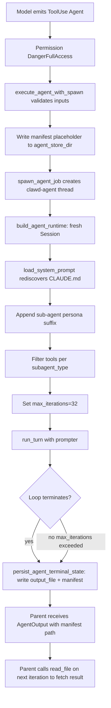
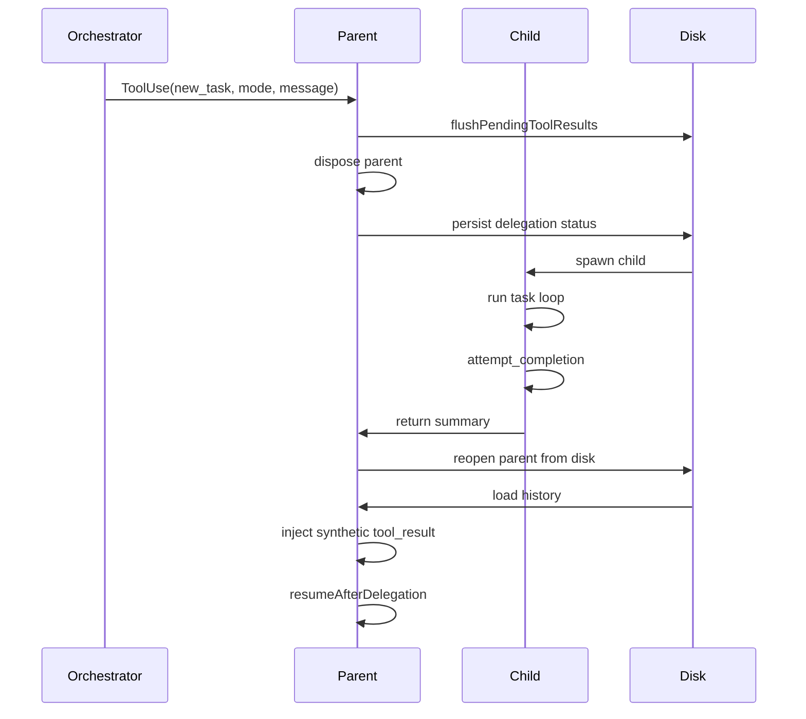

# Multi-Agent Patterns
> Module: 06_orchestration | Status: Phase 7 | Last Agent: Phase 7 Specialist Synthesis

## 1. Overview
Multi-agent patterns are mechanisms by which a parent agent delegates work to a subordinate agent — typically with a reduced tool set and an isolated context — and aggregates the result. This document specifies the [CLAUDE] sub-agent pattern (Phase 2) and the [ROO] Boomerang / Task Orchestration pattern (Phase 4) as the two primary delegation models. [CLINE]'s `new_task` tool is documented as a contrast — same tool name, fundamentally different semantics.

> **Three delegation paradigms compared:**
> - **[CLAUDE] `Agent` tool** — In-process, fire-and-forget. Spawns a child `ConversationRuntime` in a worker thread. Parent gets a file-based manifest path; must poll for results. Child has a fresh `Session`, reduced tool set per `subagent_type`, and a 32-iteration cap.
> - **[ROO] `new_task` (Boomerang)** — Durable, persistent, mode-typed delegation. Parent is flushed to disk and disposed. Child gets the entire UI/API stack. On `attempt_completion`, the child's summary is injected as a synthetic `tool_result` into the parent's API conversation history. The parent resumes as if `new_task` returned synchronously. Unbounded child turns; spans arbitrary clock time.
> - **[CLINE] `new_task`** — Create a new task with preloaded continuation context. No parent linkage, no return path, no auto-resume. The user must manually return to the previous task. Same tool name as Roo, fundamentally different semantics.

[CLAUDE] exposes **three distinct primitives** that the upstream task spec collapses into a single "Task" tool. None of them is named `Task` at the tool surface in claw-code; the spec's "Task" is closest to the **`Agent`** tool. The three primitives:

| Primitive | What it does | Spawns a runtime? |
| --- | --- | --- |
| **`Agent`** | Spawns a child `ConversationRuntime` in a worker thread with a reduced tool set. **This is the real "Task" analog.** | Yes — child Rust thread with full agentic loop. |
| **`TaskCreate` / `TaskGet` / `TaskList` / `TaskOutput` / `TaskStop` / `TaskUpdate`** | Pure in-memory `TaskRegistry` bookkeeping (`Arc<Mutex<HashMap>>`). | No — no LLM call anywhere in `task_registry.rs`. |
| **`WorkerCreate` / `WorkerObserve` / `WorkerSendPrompt` / …** | State-machine harness over an *externally* spawned coding-agent process; observed via screen-text events. | No — claw-code does not spawn the worker process. |

> **Important divergence from upstream**: upstream Claude Code's `Task` tool spawns a sub-agent. claw-code's `TaskCreate` only writes to a registry; **`Agent` is the tool that actually spawns**. Browser sub-agent (`Browser`, etc.) is **not implemented in claw-code at HEAD `a389f8d`** — `mcp__Claude_in_Chrome__*` and `mcp__Claude_Preview__*` are deferred MCP-side tools advertised via `ToolSearch`, not built-in browser sub-agents.

(claw-code: `rust/crates/tools/src/lib.rs:571-587, 3477-3617, 1571-1605`; `rust/crates/runtime/src/task_registry.rs:34-232`; `rust/crates/runtime/src/worker_boot.rs:30-410`.)

## 2. Blueprint Specification

### `Agent` tool — sub-runtime spawning [CLAUDE]
- **Spec**: `Agent { description, prompt, subagent_type?, name?, model? }` with `required_permission: DangerFullAccess` (Part 1 §2 catalog).
- **Entry**: `execute_agent_with_spawn(input, spawn_fn)` validates `description`/`prompt`, generates `agent_id`, writes a markdown manifest plus a JSON manifest under `agent_store_dir()`, then delegates to `spawn_agent_job(job)` (`tools/src/lib.rs:3481-3559`).
- **Spawn**: `spawn_agent_job` creates a thread named `clawd-agent-{id}` running `run_agent_job(&job)` (`tools/src/lib.rs:3561-3586`).
- **Child runtime construction** — `build_agent_runtime(job)` builds `ConversationRuntime<ProviderRuntimeClient, SubagentToolExecutor>` with (`tools/src/lib.rs:3597-3617`):
  - A fresh `Session::new()`.
  - The resolved model — `DEFAULT_AGENT_MODEL = "claude-opus-4-6"` (`tools/src/lib.rs:3473`).
  - The parent's filtered allowed-tools set, further reduced per `subagent_type` (see below).
  - An `agent_permission_policy()` derived from `mvp_tool_specs()` requirements.
  - System prompt from `build_agent_system_prompt(subagent_type)`.
- **Iteration cap**: `DEFAULT_AGENT_MAX_ITERATIONS = 32` via `with_max_iterations` (`tools/src/lib.rs:3475, 3589`). This is *much* tighter than the parent's `usize::MAX` default — sub-agents are hard-bounded.

### Child system prompt [CLAUDE]
`build_agent_system_prompt(subagent_type)` calls `load_system_prompt(cwd, DEFAULT_AGENT_SYSTEM_DATE, OS, "unknown")`, then appends:

```
You are a background sub-agent of type `<subagent_type>`. Work only on the
delegated task, use only the tools available to you, do not ask the user
questions, and finish with a concise result.
```

(`tools/src/lib.rs:3619-3632`.)

So the child **re-discovers `CLAUDE.md` etc. from its cwd** — the same memory hierarchy is inherited via path, not value-copied.

### Per-`subagent_type` tool subsets [CLAUDE]
`allowed_tools_for_subagent` (`tools/src/lib.rs:3642-3721`):

| Subagent type | Allowed tools |
| --- | --- |
| `Explore` | `read_file, glob_search, grep_search, WebFetch, WebSearch, ToolSearch, Skill, StructuredOutput` |
| `Plan` | Read-only set + `TodoWrite, SendUserMessage` |
| `Verification` | `bash, read_file, glob_search, grep_search, WebFetch, WebSearch, ToolSearch, TodoWrite, StructuredOutput, SendUserMessage, PowerShell` |
| `claw-guide` | Read-only + `Skill, SendUserMessage` |
| `statusline-setup` | `bash, read_file, write_file, edit_file, glob_search, grep_search, ToolSearch` |
| **Default** (any unrecognized) | Broad set incl. `bash, write_file, edit_file, REPL, PowerShell, Sleep, Config, NotebookEdit` |

### Context isolation [CLAUDE]
The child has a **brand-new `Session`**, its **own `ConversationRuntime`**, its **own `PermissionPolicy`** (defaulting to `DangerFullAccess` modulo per-tool `required_permission`), and a `SubagentToolExecutor` constrained to the `allowed_tools` set (`tools/src/lib.rs:3608-3614`). Parent and child do **not** share `Session::messages` or `usage_tracker`.

### Communication is file-based [CLAUDE]
There is **no parent-poll tool**. The child writes results to:

- **`output_file`** = `<agent_store_dir>/<agent_id>.md` — the assistant's final text output.
- **`manifest_file`** = `<agent_store_dir>/<agent_id>.json` — JSON manifest including `status: "completed" | "failed"` plus the final assistant text.

(`tools/src/lib.rs:3493-3496, 3593-3594, 3740-3760`.) The manifest path is returned in the synchronous `AgentOutput` value the `Agent` tool produces (`tools/src/lib.rs:3526-3543`); the parent must read the file (e.g. via `read_file`) to fetch results.

### `TaskRegistry` bookkeeping primitives [CLAUDE]
`TaskRegistry` is `Arc<Mutex<HashMap<String, Task>>>` with **no spawn, no runtime, no LLM call** (`task_registry.rs:34-232`):

- `create(prompt, description?)` allocates `task_id = format!("task_{:08x}_{}", ts, counter)` and stores `prompt, description, task_packet?, status, messages, output, team_id` (`task_registry.rs:79-120`).
- `update(task_id, message)` appends a user message.
- `append_output(task_id, text)` accumulates a string.
- `stop(task_id)` flips status with a terminal-state guard.
- `RunTaskPacket { objective, scope, repo, branch_policy, acceptance_tests, commit_policy, reporting_contract, escalation_policy }` routes through `TaskRegistry::create_from_packet` after `validate_packet` (`task_registry.rs:83-94`, `task_packet.rs`). Still in-registry — does not spawn a runtime.

The model uses these as *bookkeeping* tools to record TODOs the user can inspect via `/tasks` (which is parsed-but-stubbed in claw-code at HEAD).

### Worker harness primitives [CLAUDE]
`WorkerCreate(cwd, trusted_roots?, auto_recover_prompt_misdelivery?)` allocates `worker_id` and pushes a `Spawning` event but **spawns no process** (`worker_boot.rs:223-263`). `worker_boot::WorkerStatus`: `Spawning, TrustRequired, ReadyForPrompt, Running, Finished, Failed` (`worker_boot.rs:30-37`).

`WorkerObserve(worker_id, screen_text)` does string-pattern matching for trust-prompt detection, prompt-misdelivery detection (e.g. prompt landed in shell), and ready-cues; status transitions are state-machine-only (`worker_boot.rs:271-410`). The actual process is run by an external supervisor (terminal/tmux) — claw-code is the orchestrator, not the spawner.

### Teams [CLAUDE]
`TeamCreate(name, tasks)` allocates a `team_id` and tags each task with `assign_team(task_id, team_id)`; `TeamDelete` removes it (`tools/src/lib.rs:1571-1605`, `team_cron_registry.rs`). Pure bookkeeping; no execution semantics.

## 3. Logic Flow

### `Agent` spawn lifecycle
1. Model emits `ContentBlock::ToolUse { name: "Agent", input: { description, prompt, subagent_type? } }`.
2. Parent harness's permission gate authorizes (`DangerFullAccess` required).
3. `execute_agent_with_spawn` validates inputs and writes `<agent_id>.md` + `<agent_id>.json` placeholder manifests.
4. `spawn_agent_job` creates a `clawd-agent-{id}` thread.
5. Inside the thread:
   a. `build_agent_runtime(job)` constructs the child `ConversationRuntime`.
   b. Child calls `load_system_prompt(cwd, ...)` — re-discovering `CLAUDE.md` from disk.
   c. Child appends the sub-agent persona suffix.
   d. Child filters tools per `subagent_type`.
   e. Child runs `run_turn(prompt, prompter)` with `max_iterations: 32`.
   f. Child writes output to `output_file` and updates `manifest_file` on completion via `persist_agent_terminal_state`.
6. Parent thread receives `AgentOutput` containing the manifest path.
7. Parent typically calls `read_file` on the manifest path to fetch the result on the next iteration.

### `TaskRegistry` lifecycle (no runtime)
1. Model emits `ToolUse { name: "TaskCreate", input: { prompt, description? } }`.
2. Harness mutex-locks the registry, allocates `task_id`, stores the entry.
3. Returns the `task_id` immediately.
4. Subsequent `TaskUpdate` / `TaskGet` / `TaskList` / `TaskStop` / `TaskOutput` / `TaskUpdate` calls mutate or read the same registry — no LLM is involved.

## 4. Flowchart


## 5. Sequence Diagram
```mermaid
sequenceDiagram
    participant ParentModel as Parent Model
    participant ParentRuntime as Parent ConversationRuntime
    participant Spawn as spawn_agent_job
    participant ChildThread as clawd-agent thread
    participant ChildRuntime as Child ConversationRuntime
    participant FS as Filesystem (agent_store_dir)
    participant ChildModel as Child Model

    ParentModel-->>ParentRuntime: ToolUse(Agent, {description, prompt, subagent_type})
    ParentRuntime->>ParentRuntime: permission gate (DangerFullAccess)
    ParentRuntime->>FS: write <agent_id>.md + .json placeholders
    ParentRuntime->>Spawn: spawn_agent_job(job)
    Spawn->>ChildThread: thread "clawd-agent-{id}"
    ChildThread->>ChildRuntime: build_agent_runtime(job)
    ChildRuntime->>FS: load_system_prompt rediscovers CLAUDE.md from cwd
    ChildRuntime->>ChildRuntime: filter tools per subagent_type; max_iterations=32

    loop child loop bounded by 32 iterations
        ChildRuntime->>ChildModel: stream(child messages)
        ChildModel-->>ChildRuntime: ToolUse / Text
        ChildRuntime->>ChildRuntime: dispatch tools (subset only)
    end

    ChildRuntime->>FS: persist_agent_terminal_state writes output + manifest
    Spawn-->>ParentRuntime: AgentOutput{manifest_path}
    ParentRuntime->>ParentRuntime: append ToolResult with manifest path

    Note over ParentRuntime,FS: No streaming back to parent.
    Note over ParentRuntime,FS: Parent must call read_file to fetch results.
    ParentRuntime->>FS: (next iteration) read_file(manifest_path)
```

## Boomerang Flow Diagram [ROO]


## Side-by-Side Comparison: Sub-Agent vs Boomerang vs Cline new_task

| Dimension | [CLAUDE] `Agent` | [ROO] `new_task` (Boomerang) | [CLINE] `new_task` |
| --- | --- | --- | --- |
| **Lifetime** | In-process; child thread joins before parent continues | Durable; parent exits memory; child spans unbounded time | One-shot; creates new task, no return |
| **Context isolation** | Fresh `Session`, reduced tool set, own `PermissionPolicy` | Entirely separate Task with its own mode’s system prompt, tools, and optionally different LLM | Preloaded context, no parent linkage |
| **Result return** | File-based: `<agent_id>.md` + `.json` manifest; parent polls | Synthetic `tool_result` injection into parent’s API history; parent auto-resumes | None — user manually returns |
| **Mode/persona** | `subagent_type` selects tool subset + persona suffix | `mode` parameter selects full mode (roleDefinition + groups + model config) | N/A |
| **Iteration cap** | 32 iterations (hard-coded) | Unbounded (same as any Task) | N/A |
| **Parallelism** | Sequential spawning; one child thread per `Agent` call | Sequential only; single-open-task invariant | `use_subagents` allows up to 5 parallel |
| **Nesting** | Not architecturally supported | Multi-level: `HistoryItem.childIds` array with `parentTaskId` chain | N/A |
| **Persistence** | Manifest survives crashes; runtime state does not | Full persistence: parent + child history on disk; survives editor restarts | Task persisted but no parent linkage |
| **Per-child model** | `DEFAULT_AGENT_MODEL = "claude-opus-4-6"` (hard-coded) | Per-mode API config: `ProviderSettingsManager.getModeConfigId(mode)` | Same model as parent |

## 6. Variations & Trade-offs

| Pattern | Benefit | Trade-off |
| --- | --- | --- |
| **`Agent` spawning a fresh `ConversationRuntime`** [CLAUDE] | Real context isolation: child can't pollute parent's `Session::messages` or `usage_tracker`; child has its own permission policy. | No live streaming back: parent must poll the manifest file. Child’s discovery re-walks the filesystem — duplicate work if many agents share the same cwd. |
| **Per-`subagent_type` tool subsets** [CLAUDE] | A `Plan` agent can't accidentally write files; an `Explore` agent can't run `bash`. Predictable safety floor. | Subset is hard-coded in Rust — adding a new type requires harness changes. |
| **`max_iterations = 32` cap on children** [CLAUDE] | Bounds runaway sub-agents. | Children that need long trajectories will hit the cap and emit a `RuntimeError` — caller must check the manifest. |
| **File-based handoff (manifest + output)** [CLAUDE] | Result survives parent crashes; manifest is human-inspectable; no IPC complexity. | Parent must spend extra tool calls (`read_file`) to surface child results into its context. |
| **`TaskRegistry` (no spawn)** [CLAUDE] | Cheap bookkeeping; user can inspect TODOs without paying for inference. | Easy to confuse with the `Agent` tool — naming is upstream-divergent in claw-code. |
| **`WorkerObserve` state machine** [CLAUDE] | Lets the agent supervise *external* coding agents (terminal/tmux) without being the spawner. | Detection is string-pattern based — fragile if the external agent's prompts change. |
| **`Browser` sub-agent absent** [CLAUDE] | Surface area is smaller; fewer permission tiers to manage. | Browser-driven workflows (Cline-style) require MCP shims (`mcp__Claude_in_Chrome__*`). |
| **Boomerang: synthetic `tool_result` injection** [ROO] | Parent LLM sees delegation as a function call — "I called `new_task`, it returned this summary." No awareness of the sub-conversation. Clean semantic boundary. | History rewriting on disk is complex; idempotency guards (`validateAndFixToolResultIds`) needed for correctness; corrupted history falls back to plain text. |
| **Single-open-task invariant** [ROO] | Avoids resource races (file watchers, MCP refcounts, stream ownership). Simpler than concurrent parent+child. | Parent literally exits memory — no real-time parent monitoring of child progress. |
| **Mode-typed delegation** [ROO] | `architect` plans → spawns `code` → spawns `debug`. Each subtask sees only the prompt suited to its role. Per-mode model routing gives cost/capability optimization per subtask. | Mode switch overhead (500ms sleep); per-mode API config adds configuration surface. |
| **`preventCompletionWithOpenTodos`** [ROO] | Blocks `attempt_completion` if any todo is open — ensures thoroughness before returning to parent. | Requires the LLM to explicitly maintain the todo list via `update_todo_list`. |
| **Hierarchical nesting** [ROO] | Multi-level delegation (orchestrator → architect → code → debug) with correct `parentTaskId` chain unwinding. | Deep nesting creates long dependency chains; each level adds a persist-dispose-resume cycle. |
| **Cline `new_task` (no return)** [CLINE] | Simple context handoff — creates a fresh conversation with preloaded context. | No parent tracking; no auto-resume; user must manually navigate back. Not a delegation pattern. |
| **Cline `use_subagents` (parallel in-process)** [CLINE] | Up to 5 parallel subagents in a single turn — fan-out for embarrassingly parallel tasks. | In-process only; no persistence; no mode typing; results must fit in a single turn. |

## 7. Agent Attribution Table

| Agent | Source-backed contribution |
| --- | --- |
| [CLAUDE] | `Agent` tool spawning a child `ConversationRuntime` in a `clawd-agent-{id}` thread; `DEFAULT_AGENT_MODEL = "claude-opus-4-6"`; `DEFAULT_AGENT_MAX_ITERATIONS = 32`; per-`subagent_type` tool subsets (`Explore`, `Plan`, `Verification`, `claw-guide`, `statusline-setup`, default); fresh `Session` + isolated `PermissionPolicy` per child; sub-agent persona suffix appended to a re-discovered system prompt; file-based result handoff via `<agent_id>.md` + `<agent_id>.json` manifest under `agent_store_dir()`; separate `TaskRegistry` bookkeeping primitives (`TaskCreate` etc.) with no LLM invocation; `WorkerCreate`/`WorkerObserve` state machine for externally-spawned coding agents; `TeamCreate`/`TeamDelete` task tagging. |
| [ROO] | **Boomerang delegation pattern**: `new_task { mode, message, todos? }` spawns a child `Cline` instance with a fresh conversation in a specified mode; `parentTaskId` tree tracks delegation ancestry; parent can list `todos` for the child; `preventCompletionWithOpenTodos` blocks `attempt_completion` until all todos are done (`NewTaskTool.ts`, `ClineProvider.ts`). **Mode-switch orchestration**: `switch_mode { mode_slug, reason }` changes the current task's persona/model/tool-surface in-place without creating a child task. `modesSection` in the system prompt lists all available modes with `whenToUse` hints so the orchestrator LLM knows when to delegate vs. switch. Critical ordering of steps 5→6→7; `new_task` isolation enforcement truncating blocks after delegation and pre-injecting error `tool_result`s for skipped tools; child runs as normal Task with `parentTaskId` set; `attempt_completion` in child triggers `delegateToParent()` → `askFinishSubTaskApproval()` → `reopenParentFromDelegation()`; synthetic `tool_result` injection: scan parent API history backwards for `new_task` `tool_use_id`, append `user` message with `tool_result` containing child summary, idempotent overwrite, `validateAndFixToolResultIds()` for multi-tool messages, plain-text fallback on corrupted history; parent re-loaded into memory via `createTaskWithHistoryItem` → `overwriteClineMessages` → `overwriteApiConversationHistory` → `resumeAfterDelegation()`; hierarchical nesting via `HistoryItem.childIds` array and `parentTaskId` chain; per-mode model routing via `ProviderSettingsManager.getModeConfigId(mode)` during `handleModeSwitch`; delegation metadata: `status` enum (`active`, `delegated`, `completed`), `delegatedToId`, `awaitingChildId`, `completedByChildId`; `TaskDelegated`, `TaskDelegationCompleted`, `TaskDelegationResumed` events; `switch_mode { mode_slug, reason }` as the in-place (same task) alternative to `new_task` delegation. |
| [HERMES] | **Multi-channel gateway orchestration**: Hermes receives messages from 7+ channels (Telegram, Discord, Slack, WhatsApp, Signal, Email, CLI) via a gateway abstraction (`tui_gateway/`, channel-specific adapters). Each incoming message is routed to the agent loop, which selects relevant skills, calls the LLM, dispatches tool calls to one of 7 terminal backends, and responds through the originating channel. This is a **fan-in/fan-out** orchestration pattern — multiple input channels converge on a single agent, and responses fan out to the originating channel. The gateway handles channel-specific message formatting (Telegram markdown vs. Discord embeds vs. email MIME), authentication, and rate limiting per channel. |
| [OPENCLAW] | **22+ channel adapter abstraction**: OpenClaw abstracts messaging channels behind a unified adapter interface. Each adapter (Telegram, Discord, Slack, WhatsApp, LINE, Messenger, Teams, etc.) implements `send(message)`, `receive()`, and `formatForChannel(content)`. The **Canvas renderer** provides a live interactive rendering surface — rendering structured agent output (code blocks, tables, progress indicators) into a platform-specific rich format. This is the widest multi-channel surface in the blueprint. |
| [CLINE] | `new_task { context }` creating a new task with preloaded continuation context (no parent linkage, no return path, no auto-resume — user manually returns); `use_subagents { prompt_1..prompt_5 }` running up to five in-process parallel subagents in a single turn when subagents are enabled; configured subagent tools surfaced as dedicated native tool names via `SharedToolHandler`. |

## 8. Repository Implementations

### AutoGPT
- **Strategy-Spawned Sub-Agents**: In strategies like `tree_of_thoughts`, `lats`, and `multi_agent_debate`, AutoGPT spawns isolated sub-agents using `BaseMultiStepPromptStrategy.spawn_and_run(agent_id)`.
- **Hierarchical Budgets**: AutoGPT uses a `ResourceBudget` tree to enforce limits on sub-agents. A child budget decrements `max_depth` and zero's out `explicit_allow_rules`. This forces sub-agents to explicitly request permissions, and strictly limits unbounded recursion.
- **Sub-root Sandboxing**: File operations for sub-agents are sandboxed in `.sub_agents/{child_agent_id}` via `clone_with_subroot`, heavily restricting what sub-agents can read or write in the parent workspace.
