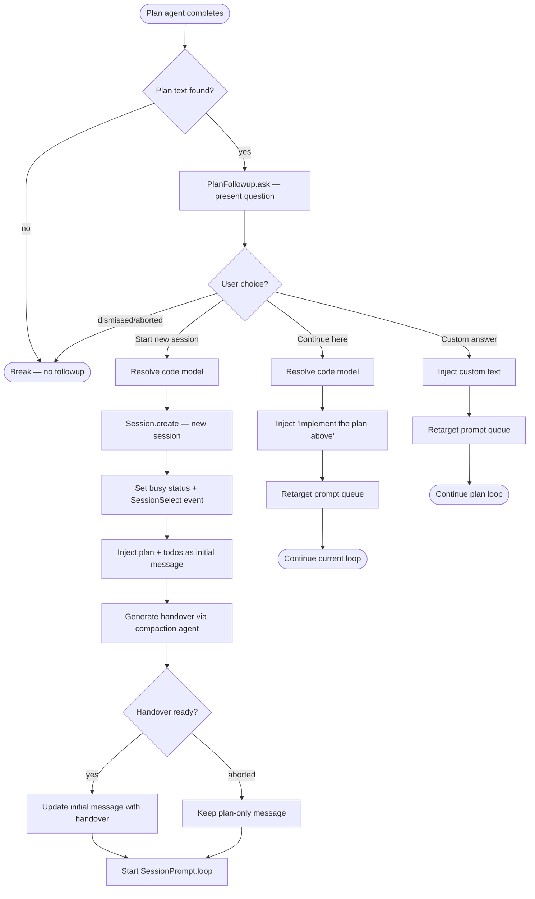
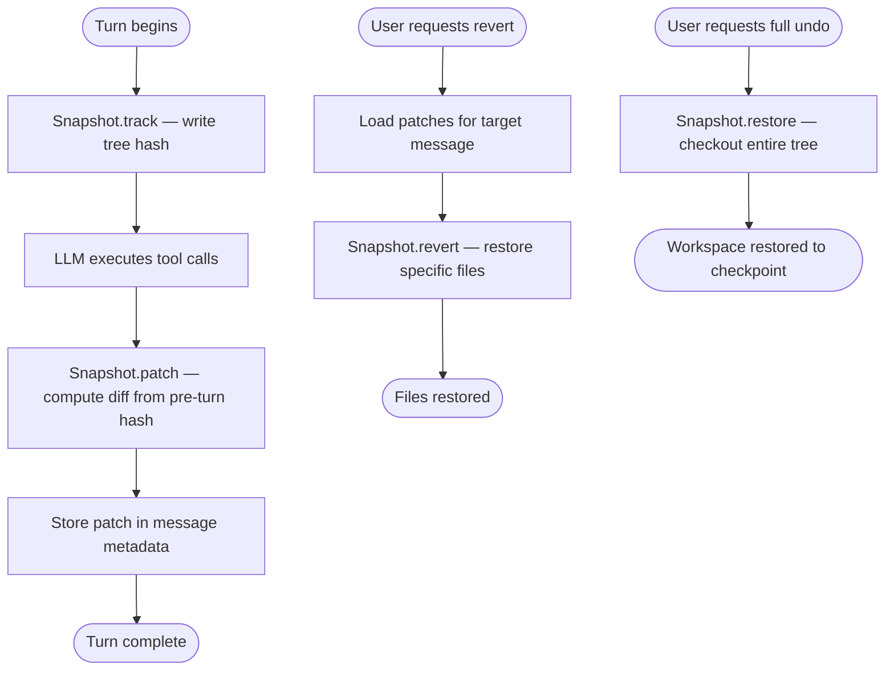
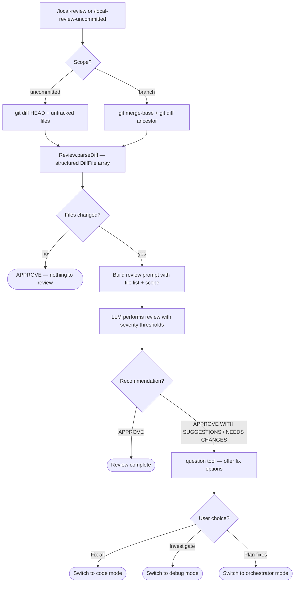
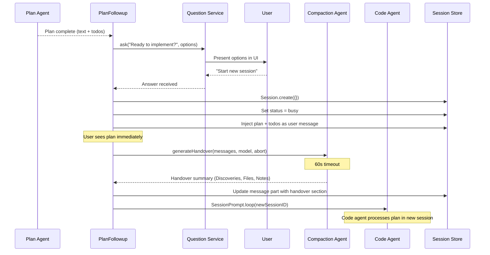
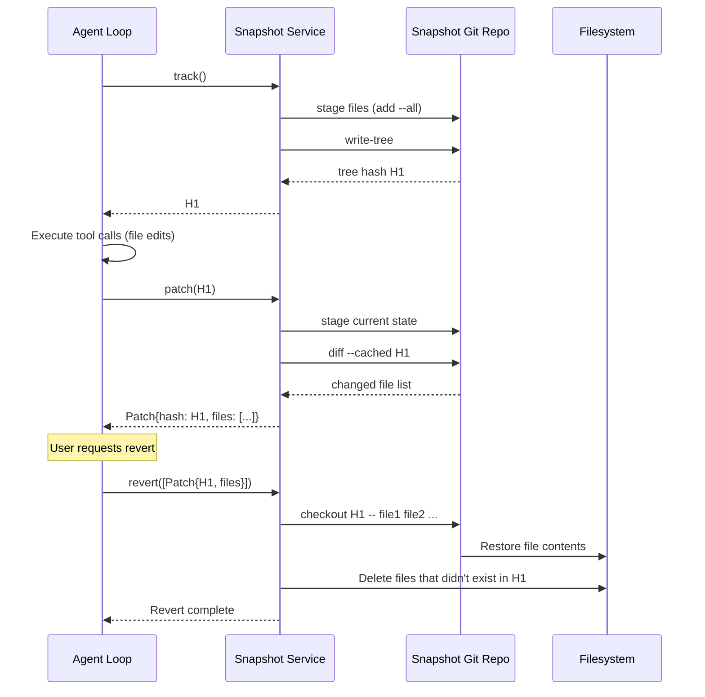

# Task Lifecycle
> Module: 06_orchestration | Status: Phase 7 | Last Agent: Phase 7 Specialist Synthesis 

## 1. Overview
A task lifecycle describes how an agent transitions work through discrete phases — from initiation through execution to completion, with optional checkpointing, review, and handoff between phases. This document specifies five distinct lifecycle patterns discovered across the blueprint's agents.

[KILO] introduces the most structured task lifecycle in the blueprint: a **plan→handover→implement** pipeline where a planning session produces a structured plan, generates an LLM-summarized handover document, and optionally spawns a new implementation session with cross-session todo persistence. This is backed by a **git-based snapshot system** that tracks filesystem state independently from the user's project git, enabling per-turn checkpointing and deterministic revert.

[OPENCODE] provides the session-based foundation that Kilo extends. Each session has a lifecycle of `idle → busy → idle`, with sessions persisted to SQLite and messages stored as structured `MessageV2` records. The `SessionPrompt.loop()` drives the agentic loop within a session, and session state survives process restarts.

[CODEX] uses a single-turn-per-session model where `Op::UserTurn` opens a turn, cycles through tool calls, and closes with `EventMsg::TurnComplete`. Memento-style auto-compaction with `ghost_snapshots` preserves undo history across compaction boundaries.

[CLAUDE] uses `ConversationRuntime::run_turn` as the task unit — one user input drives an iterative tool-use loop until the model produces text-only output. Post-turn auto-compaction may rewrite the session.

[CLINE] [ROO] use VS Code extension tasks (`Task` class) as the lifecycle unit. Cline's tasks support `startTask()` / `resumeTaskFromHistory()` with checkpoint-based undo. Roo's Boomerang delegation adds parent↔child task persistence with synthetic `tool_result` injection on completion.

## 2. Blueprint Specification

### Session Lifecycle [OPENCODE] [KILO]

| Phase | Status | Description |
| --- | --- | --- |
| Creation | — | `Session.create({})` generates a new session with ascending ID, binds to the current project directory. |
| Idle | `idle` | Session exists but no prompt loop is running. User can browse history. |
| Busy | `busy` | `SessionPrompt.loop()` is active — the agentic loop is processing. |
| Completion | `idle` | Loop ends. Session returns to idle. Messages persist in SQLite. |
| Disposal | — | `Instance.dispose()` releases project resources. Session data persists on disk. |

### Plan→Code Handoff [KILO]

| Step | Component | Action |
| --- | --- | --- |
| 1. Plan completion | `plan` agent | Plan agent produces structured plan text and optional todo list. Plan written to `.kilo/plans/*.md`. |
| 2. Followup prompt | `PlanFollowup.ask()` | Presents a structured `question` tool: "Ready to implement?" with options. |
| 3a. New session | `PlanFollowup.startNew()` | Creates new session → sets `busy` status → generates LLM handover summary → injects plan+todos+handover as initial message → starts `code` agent loop. |
| 3b. Continue here | `PlanFollowup.inject()` | Injects "Implement the plan above" message into the current session → retargets prompt queue → continues loop with `code` agent. |
| 3c. Custom answer | `PlanFollowup.inject()` | Injects user's free-text response → retargets prompt queue → continues `plan` agent. |

### Handover Generation [KILO]

The handover is a structured summary generated by the `compaction` agent (or the plan model) with a 60-second timeout:

```
## Discoveries
[Key findings from code exploration — architecture patterns, gotchas, edge cases]

## Relevant Files
[Structured list of files/directories read or discussed, with relevance notes]

## Implementation Notes
[Conventions, pitfalls, dependencies between steps, watchpoints]
```

The handover is **appended** to the initial plan message — the session first shows the plan text immediately (fast UX), then the handover section grows in-place once the slow LLM call resolves.

### Snapshot Checkpointing [OPENCODE] [KILO]

| Operation | Method | Description |
| --- | --- | --- |
| Track | `Snapshot.track()` | Stages all modified/untracked files (respecting `.gitignore`, 2MB limit), writes a git tree hash. Returns the hash as a checkpoint. |
| Patch | `Snapshot.patch(hash)` | Compares current state against a tracked hash. Returns changed file list. |
| Restore | `Snapshot.restore(hash)` | Checks out all files from a snapshot hash — full filesystem revert. |
| Revert | `Snapshot.revert(patches)` | Reverts specific files from multiple patches. Batched checkout with clash detection. |
| DiffFull | `Snapshot.diffFull(from, to)` | Produces structured `FileDiff[]` (file, patch, additions, deletions, status) between two hashes. |
| Cleanup | automatic (hourly) | `git gc --prune=7.days` on the snapshot repository. |

The snapshot repository is stored at `~/.local/share/kilo/snapshot/{projectID}/{worktreeHash}/` — completely separate from the user's project `.git`.

### AI Code Review [KILO]

| Step | Component | Action |
| --- | --- | --- |
| 1. Scope selection | `/local-review` or `/local-review-uncommitted` | Detects base branch or uncommitted scope. |
| 2. Diff parsing | `Review.parseDiff()` | Parses `git diff` output into structured `DiffFile[]` with hunks. |
| 3. Prompt assembly | `Review.buildReviewPrompt*()` | Builds structured review prompt with file list, scope, and git command suggestions. |
| 4. LLM review | Review agent | Produces Summary → Issues Found (CRITICAL/WARNING/SUGGESTION with confidence thresholds) → Detailed Findings → Recommendation (APPROVE/APPROVE WITH SUGGESTIONS/NEEDS CHANGES). |
| 5. Fix routing | `question` tool | Offers mode-specific fix options: `code` for direct fixes, `debug` for investigation, `orchestrator` for coordinated multi-category fixes. |

### Todo Persistence [KILO]

Todos are structured checklist items that persist across sessions:

```typescript
type Todo = {
  content: string
  status: "completed" | "in_progress" | "cancelled" | "pending"
}
```

Rendered as markdown checkboxes (`[x]`, `[~]`, `[-]`, `[ ]`) and injected into implementation sessions. Managed via `Todo.Service` with `get(sessionID)` and `update(input)`.

## 3. Logic Flow

### Plan→Code Transition [KILO]

1. Plan agent completes — last assistant message or plan file contains the plan text.
2. `PlanFollowup.ask()` checks for plan content and presents the followup question.
3. On "Start new session":
   a. Resolve the code model (state file → config → plan model fallback).
   b. Create a new session immediately (fires `session.created` event for VS Code extension).
   c. Set session status to `busy`.
   d. Emit `SessionSelect` event to switch to the new session tab.
   e. Inject plan text + todos as the initial user message (visible immediately).
   f. Generate handover summary via `compaction` agent (async, 60s timeout).
   g. If handover generated, update the initial message part in-place.
   h. Start `SessionPrompt.loop()` for the new session.
4. On "Continue here":
   a. Resolve the code model.
   b. Inject "Implement the plan above" as a synthetic user message.
   c. Retarget the prompt queue to the new message.
   d. Continue the current loop.

### Snapshot Lifecycle per Turn [OPENCODE] [KILO]

1. Before each LLM turn: `Snapshot.track()` captures the filesystem state as a tree hash.
2. The LLM executes tool calls (file edits, command execution).
3. After the turn: `Snapshot.patch(hash)` computes the diff from the pre-turn snapshot.
4. The patch (hash + changed files) is stored in the session's message metadata.
5. On revert request: `Snapshot.revert(patches)` restores files to the pre-turn state.
6. On full undo: `Snapshot.restore(snapshot)` checks out the entire tree.

## 4. Flowchart

### [KILO] Plan→Code Lifecycle



### [OPENCODE] [KILO] Snapshot Lifecycle



### [KILO] AI Code Review



## 5. Sequence Diagram

### [KILO] Plan→Code Handoff with Handover



### [OPENCODE] [KILO] Snapshot Checkpoint/Revert



## 6. Variations & Trade-offs

| Variation | Benefit | Trade-off |
| --- | --- | --- |
| **Plan→code session handoff with LLM handover** [KILO] | Clean context separation — implementation session starts fresh with curated knowledge. Handover captures high-entropy discoveries that the plan text doesn't fully explain. | Handover generation adds latency (up to 60s). Session split means implementation agent can't reference planning conversation directly. |
| **Separate snapshot git repository** [OPENCODE] [KILO] | Checkpoint/revert doesn't interfere with the user's git history. Per-turn granularity enables surgical undo. | Additional disk usage for the shadow git repo. Hourly GC needed to prevent unbounded growth. |
| **`git diff --unified=INT_MAX` for patch generation** [KILO] | Prevents event loop freezes on large-file diffs (replaces O(N*M) JS Myers). Fail-soft — empty patches on git error. | Requires shelling out to git (slightly slower for small files). 500-file batching needed for Windows command-line limits. |
| **AI code review with confidence thresholds** [KILO] | Structured severity + confidence prevents low-confidence noise. Post-review mode routing (code/debug/orchestrator) creates an actionable pipeline. | Review quality depends on LLM capability. Thresholds are prompt-based, not enforced programmatically. |
| **Cross-session todo persistence** [KILO] | Implementation session inherits the planning session's task checklist. Provides continuity across the plan→code transition. | Requires explicit `Todo.Service` management. Todos are plain text — no structured subtask decomposition. |
| **Single-turn lifecycle** [CODEX] | Simple — one request, one turn, one completion signal. | No multi-turn conversation within a session; each interaction is independent. |
| **Boomerang parent-child persistence** [ROO] | Parent survives arbitrarily long child execution. Child has full UI/API stack. | Complex lifecycle management (persist → dispose → resume). Synthetic tool_result must faithfully summarize child work. |

## 7. Agent Attribution Table

| Agent | Source-backed contribution |
| --- | --- |
| [KILO] | `PlanFollowup` namespace (`plan-followup.ts`) with `ask()` followup prompt presenting "Start new session" / "Continue here" / custom answer; `startNew()` creating a new session, setting busy status, emitting `SessionSelect`, injecting plan+todos, and generating an LLM handover summary via the `compaction` agent with 60s timeout; `generateHandover()` producing structured Discoveries/Relevant Files/Implementation Notes summary; `formatTodos()` rendering todo items as markdown checkboxes across sessions; `resolveCodeModel()` resolving implementation model from state file → config → plan model; `KiloSessionPromptQueue.retarget()` for prompt queue redirection; `DiffFull.batch()` replacing JS Myers with `git diff --unified=INT_MAX` for performance (512-file batching for Windows cmdline limits); `DiffFull.file()` for single-file working-tree diffs with staged fallback; `Review` namespace with `parseDiff()` structured diff parser, `buildReviewPromptUncommitted()` / `buildReviewPromptBranch()` prompt builders, `getBaseBranch()` auto-detection (main > master > dev > develop), `getUncommittedChanges()` / `getBranchChanges()` with untracked file inclusion; structured review format with CRITICAL (95%+) / WARNING (85%+) / SUGGESTION (75%+) confidence thresholds; post-review `question` tool with mode-specific fix routing (code/debug/orchestrator); `WorktreeDiff` namespace with `summary()` / `detail()` / `full()` for Agent Manager diff viewer, `stamp` cache-invalidation keys, and `generatedLike` flag for auto-collapsing generated files. |
| [OPENCODE] | `Snapshot` service (`snapshot/index.ts`) with `track()` → `write-tree`, `patch(hash)` → `diff --cached`, `restore(hash)` → `read-tree` + `checkout-index`, `revert(patches)` → batched `checkout` with clash detection, `diffFull(from, to)` → `cat-file --batch` bulk content loading with per-file `git show` fallback; separate snapshot git repository at `~/.local/share/kilo/snapshot/{projectID}/{worktreeHash}/`; 2MB file size limit; `.gitignore`-respecting exclusion; hourly `gc --prune=7.days` cleanup; `SummaryFileDiff` lightweight variant for DB payloads; session-based architecture with `SessionPrompt.loop()` driving the agentic loop; `SessionStatus` state machine (`idle` / `busy`). |
| [CODEX] | Single-turn-per-session lifecycle with `Op::UserTurn` → tool-call cycles → `EventMsg::TurnComplete`; Memento-style auto-compaction with `ghost_snapshots` for `Op::Undo` across compaction boundaries; `InitialContextInjection::BeforeLastUserMessage` for AGENTS.md placement in rebuilt history. |
| [CLAUDE] | `ConversationRuntime::run_turn` as the task unit; post-turn `maybe_auto_compact()` rewriting sessions when cumulative `input_tokens >= CLAUDE_CODE_AUTO_COMPACT_INPUT_TOKENS` (default 100,000). |
| [CLINE] [ROO] | `Task` class as lifecycle unit with `startTask()` / `resumeTaskFromHistory()` → `initiateTaskLoop()`; `ICheckpointManager` abstraction for git-based checkpoints; Boomerang delegation with parent persist-dispose-resume and synthetic `tool_result` injection on child completion [ROO]. |

