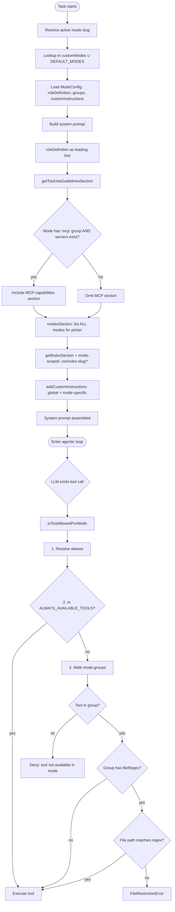
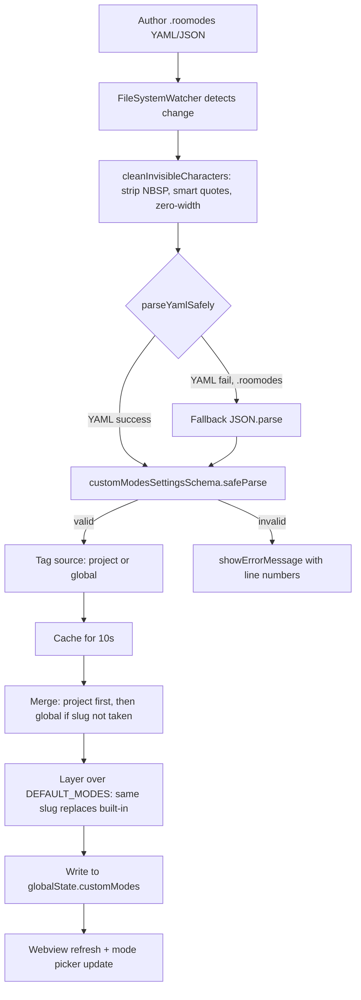
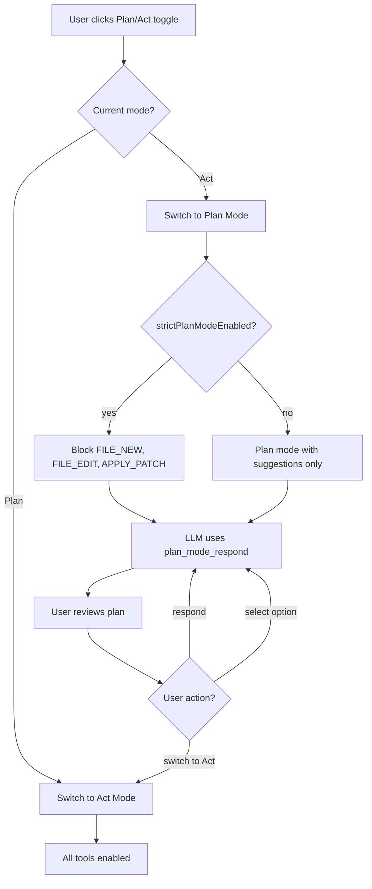
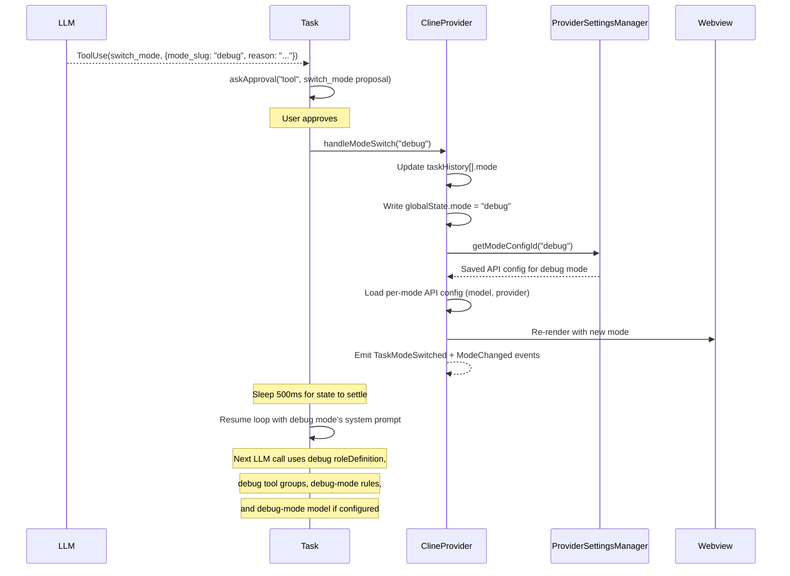
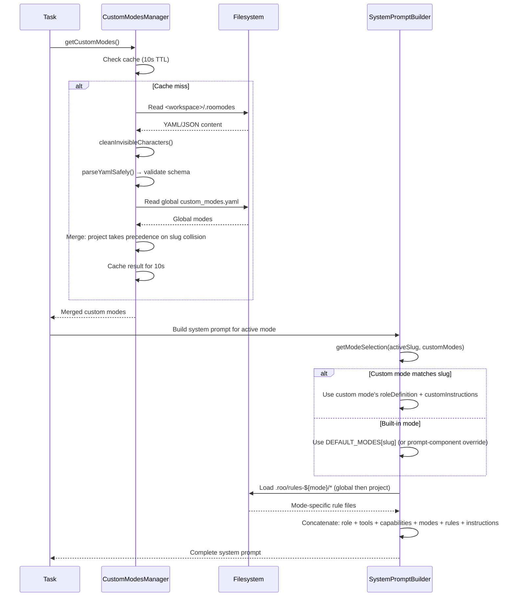

# Workflow Modes
> Module: 06_orchestration | Status: Phase 7 | Last Agent: Phase 7 Specialist Synthesis 

## 1. Overview
Workflow modes are named agent personas that swap the system prompt, allowed-tool surface, and behavioral constraints at runtime without changing the underlying agent loop. This document specifies [ROO]'s mode system as the Phase 4 reference — the first agent in the blueprint to elevate persona-switching to a first-class, user-extensible primitive. [CLINE]'s Plan/Act toggle is documented as the precursor pattern that Roo Code generalizes.

[ROO] defines a mode as a tuple of `(roleDefinition, customInstructions, toolGroups, fileRegex restrictions)` expressed as a `ModeConfig` schema. A mode simultaneously controls: (1) **persona** — the leading line of the system prompt; (2) **tool RBAC** — which tool groups the mode may use; (3) **file RBAC** — regex-based write-path restrictions on edit-group tools; and (4) **model routing** — per-mode API config binding so different LLMs can power different modes. No other agent in the blueprint unifies all four axes into a single user-editable YAML primitive. (Roo research §1.1, §6.1.)

[CLINE] has a binary **Plan Mode / Act Mode** toggle, not a first-class mode system. Plan Mode restricts file-modification tools (`write_to_file`, `replace_in_file`, `apply_patch`, `new_rule`) when `strictPlanModeEnabled` is on, and the model communicates via the `plan_mode_respond` tool. Act Mode enables all tools and uses `act_mode_respond` for progress updates. Switching between Plan and Act is a UI button action, not a tool call. (Cline research §3.4.)

[ROO] **replaced** the Plan/Act binary toggle with the mode framework. There is no `plan_mode_respond` or `act_mode_respond` tool in Roo Code — planning is now a *mode* (`architect`) with the same enforcement machinery as any other mode. (Roo research §4.3.)

[KILO] uses a **named-agent system** that parallels Roo's modes but is structurally different. Kilo defines six native agents (`code`, `plan`, `debug`, `ask`, `orchestrator`, `explore`) with per-agent permission rulesets composed via `Permission.fromConfig()` + `Permission.merge()`. Unlike Roo's `ModeConfig` YAML records that unify persona × tool-RBAC × file-RBAC × model-config, Kilo's agents are defined in TypeScript via `patchAgents()` with explicit permission merging of defaults + agent-specific rules + user config + deny overrides. The `build → code` renaming maintains backward compatibility. Custom agents can be defined via markdown files in config directories (no `.roomodes`-style YAML needed). Plan mode has a structured `PlanFollowup` handoff to code mode. (Kilo research §6.)

[OPENCODE] provides the base agent framework with `build`, `plan`, `general`, and `explore` agents. Each agent has a `mode` field (`"primary"` or `"subagent"`) and an optional model override. The agent list is extensible via markdown files in config directories. (OpenCode research §3.)

## 2. Blueprint Specification

### ModeConfig Schema [ROO]

```typescript
// packages/types/src/mode.ts:96
modeConfigSchema = z.object({
  slug:                z.string().regex(/^[a-zA-Z0-9-]+$/),
  name:                z.string().min(1),
  roleDefinition:      z.string().min(1),   // becomes the LEADING line of the system prompt
  whenToUse:           z.string().optional(), // exposed to the orchestrator picker
  description:         z.string().optional(),
  customInstructions:  z.string().optional(),
  groups:              groupEntryArraySchema, // tool groups + per-group fileRegex restrictions
  source:              z.enum(["global", "project"]).optional(),
})
```

### The Five Built-In Modes [ROO]

From `packages/types/src/mode.ts:168-227` (`DEFAULT_MODES`):

| Slug | Name | `groups` | Role (gist) | Key `customInstructions` |
| --- | --- | --- | --- | --- |
| `architect` | 🏗️ Architect | `read`, `["edit", { fileRegex: "\\.md$" }]`, `mcp` | "experienced technical leader… create a detailed plan… which the user will review and approve" | Build `update_todo_list`; ask clarifying questions; use Mermaid diagrams; **end with `switch_mode` to request implementation** |
| `code` | 💻 Code | `read`, `edit`, `command`, `mcp` | "highly skilled software engineer with extensive knowledge in many programming languages, frameworks, design patterns, and best practices" | *(minimal)* |
| `ask` | ❓ Ask | `read`, `mcp` | "knowledgeable technical assistant focused on answering questions" | "do not switch to implementing code unless explicitly requested"; include Mermaid when helpful |
| `debug` | 🪲 Debug | `read`, `edit`, `command`, `mcp` | "expert software debugger specializing in systematic problem diagnosis" | "Reflect on 5-7 different possible sources… distill to 1-2… add logs to validate… ask the user to confirm the diagnosis before fixing" |
| `orchestrator` | 🪃 Orchestrator | `[]` *(empty!)* | "strategic workflow orchestrator who coordinates complex tasks by delegating them to appropriate specialized modes" | Full Boomerang playbook (see [multi_agent_patterns.md](multi_agent_patterns.md)) |

**Critical design facts:**

1. **`architect` is read-mostly with markdown-only edits.** The `fileRegex: "\\.md$"` means architect can write `plan.md` / `todo.md` but *cannot* touch source code. This is enforced at the `validateToolUse` layer (`src/core/tools/validateToolUse.ts:206-213`) which throws `FileRestrictionError` when the path doesn't match. [ROO]

2. **`orchestrator` has `groups: []`.** It deliberately has **no** read, no edit, no command, no MCP tools. The only tools it can use are the `ALWAYS_AVAILABLE_TOOLS`: `ask_followup_question`, `attempt_completion`, `switch_mode`, `new_task`, `update_todo_list`, `run_slash_command`, `skill`. Its job is purely coordination via `new_task` (Boomerang delegation) and `switch_mode` (in-place mode change). (Roo research §1.2; CHANGELOG line 2344: "Remove tool groups from orchestrator mode definition.") [ROO]

### Tool Groups [ROO]

From `src/shared/tools.ts:296-314`:

```typescript
TOOL_GROUPS = {
  read:    { tools: ["read_file", "search_files", "list_files", "codebase_search"] },
  edit:    { tools: ["apply_diff", "write_to_file", "generate_image"],
             customTools: ["edit", "search_replace", "edit_file", "apply_patch"] },
  command: { tools: ["execute_command", "read_command_output"] },
  mcp:     { tools: ["use_mcp_tool", "access_mcp_resource"] },
  modes:   { tools: ["switch_mode", "new_task"], alwaysAvailable: true },
}

ALWAYS_AVAILABLE_TOOLS = [
  "ask_followup_question", "attempt_completion", "switch_mode",
  "new_task", "update_todo_list", "run_slash_command", "skill",
]
```

Key behaviors:

- **`customTools`** are opt-in: they appear only if the active model's `ModelInfo.includedTools` lists them (`filter-tools-for-mode.ts:152-220`). This is how GPT-5/Codex models use `apply_patch` while older models stick with `apply_diff`. [ROO]
- **`modes.alwaysAvailable: true`** guarantees `switch_mode` and `new_task` are exposed even when the mode's `groups` array is empty — this is the trick that makes `orchestrator` viable. [ROO]
- **`TOOL_ALIASES`** = `{ write_file: "write_to_file", search_and_replace: "edit" }` — model-emitted alias names resolve to canonical tool handlers while preserving the original name in API conversation history. [ROO]
- **Deprecated groups**: `deprecatedToolGroups = ["browser"]` — the schema preprocessor silently strips entries whose group name is in this list. [ROO]

### Tool-Allowance Decision Logic [ROO]

From `src/core/tools/validateToolUse.ts:120-239`, the `isToolAllowedForMode` decision:

```
1. Resolve aliases (write_file → write_to_file).
2. If toolRequirements explicitly disables the tool → false.
3. If tool is in ALWAYS_AVAILABLE_TOOLS → true.
4. If tool is a custom tool registered in the experiments system → true.
5. If tool name starts with "mcp_" (dynamic MCP tool) AND mode has the "mcp" group → true.
6. Otherwise, look up the mode by slug in (customModes ∪ DEFAULT_MODES).
7. Walk mode.groups:
   a. If the tool is in groupConfig.tools (or in customTools AND model includedTools) → check group options.
   b. If group has fileRegex AND this is an actual edit op → validate filePath against regex.
      Throw FileRestrictionError if no match.
   c. For apply_patch, extract every file path from the patch and validate each against the regex.
   d. Return true.
8. No matching group → false.
```

The mode's `groups` list IS the permission policy — there is no separate per-tool RBAC layer. [ROO]

### System Prompt Assembly per Mode [ROO]

`src/core/prompts/system.ts:41-110` constructs the system prompt as:

```
${roleDefinition}                       ← from active mode (LEADING LINE)
${markdownFormattingSection()}
${getSharedToolUseSection()}
${getToolUseGuidelinesSection()}
${getCapabilitiesSection(cwd, mcpHub)}  ← MCP servers omitted unless mode has "mcp" group AND servers exist
${modesSection}                         ← list of ALL modes (slug, name, whenToUse) — for switch_mode/new_task picker
${skillsSection}
${getRulesSection(cwd, settings)}
${getSystemInfoSection(cwd)}
${getObjectiveSection()}
${addCustomInstructions(...)}           ← global + mode-specific + .roo/rules-${mode}/* + AGENTS.md + .roorules
```

The **MCP gating** (`system.ts:67-70`) is mode-aware:
```typescript
const hasMcpGroup    = modeConfig.groups.some(g => getGroupName(g) === "mcp")
const hasMcpServers  = mcpHub && mcpHub.getServers().length > 0
const shouldIncludeMcp = hasMcpGroup && hasMcpServers
```

So `code` mode with MCP servers sees them; `orchestrator` (`groups: []`) does not. The MCP catalog is conditional on the mode, not just on connection state. [ROO]

### Mode-Specific Rule Files [ROO]

`src/core/prompts/sections/custom-instructions.ts:402-438` loads mode-specific instructions in priority order, per mode `${mode}`:

1. `~/.roo/rules-${mode}/*` (global) — directory of files
2. `<cwd>/.roo/rules-${mode}/*` (project-local) — directory of files
3. *(if `enableSubfolderRules`)* recursive subfolder discovery
4. Fallback: `<cwd>/.roorules-${mode}` (single legacy file)
5. Fallback²: `<cwd>/.clinerules-${mode}` (Cline-compat single file)

This is why the Roo Code repo ships `.roo/rules-code/`, `.roo/rules-debug/`, `.roo/rules-translate/`, etc. — **mode-scoped** prompt overrides for the team. [ROO]

### Per-Mode Model Configuration [ROO]

`ProviderSettingsManager.getModeConfigId(mode)` returns a saved API config per mode. `handleModeSwitch` automatically loads the saved config for the new mode (or falls through to the workspace lock). This enables patterns like: [ROO]

- GPT-5 for `code` mode (optimized for fast code generation)
- Claude Opus for `architect` mode (optimized for planning and reasoning)
- A cheaper model for `ask` mode (cost optimization)

This is a distinct strategy from [AIDER]'s architect/editor split (per-call) and [CLINE]'s per-task config (one-per-task). [ROO]

### Plan/Act Mode (Precursor) [CLINE]

Cline has two modes, toggled via a UI button (not a tool call):

| Mode | Behavior | Key Tools |
| --- | --- | --- |
| **Plan Mode** | Exploration/planning. When `strictPlanModeEnabled` is on, file modification tools are blocked. | `plan_mode_respond` — LLM presents plans; user responds, selects options, or switches to Act Mode. |
| **Act Mode** | All tools available. | `act_mode_respond` — non-blocking progress/preamble tool. |

This is a **binary toggle** inside one Task, not first-class personas. [CLINE]

## 3. Logic Flow

### Custom Mode Definition Lifecycle [ROO]

1. **Author** a `.roomodes` file in the workspace root (YAML or JSON):
   ```yaml
   customModes:
     - slug: docs-extractor
       name: 📚 Docs Extractor
       roleDefinition: |-
         You are a codebase analyst who extracts raw facts...
       groups:
         - read
         - - edit
           - fileRegex: \.roo/extraction/.*\.(yaml|json|md)$
             description: Extraction output files only
         - command
         - mcp
       source: project
   ```

2. **`CustomModesManager`** watches the file via `vscode.workspace.createFileSystemWatcher`.

3. **Read pipeline** (`loadModesFromFile`):
   a. `cleanInvisibleCharacters()` strips problematic Unicode (NBSP, zero-width, smart quotes, dashes).
   b. `parseYamlSafely()` runs YAML parse first; on failure for `.roomodes` only, falls back to `JSON.parse()`.
   c. `customModesSettingsSchema.safeParse()` validates structure.
   d. Successful modes tagged with `source: "project" | "global"`.
   e. Result cached for 10 seconds (`cacheTTL = 10_000`).

4. **Merge rule** (`CustomModesManager.ts:226-247`):
   - Project modes added first; their slugs reserve those names.
   - Global modes added only if slug isn't taken by a project mode.
   - Merged list layered over built-in modes — a custom mode with the same slug as a built-in **overrides** it entirely.

5. **Write pipeline** (`updateCustomMode`): all writes go through a serial `writeQueue` to prevent concurrent file rewrites. Routes to `.roomodes` for `source: project` and to global settings for `source: global`.

6. **Import/export** (`exportModeWithRules` / `importModeWithRules`): can bundle a mode with its `.roo/rules-${slug}/*` rule files into a single YAML — a marketplace-friendly artifact. [ROO]

### Mode Switching at Runtime [ROO]

Two distinct primitives:

1. **`switch_mode { mode_slug, reason }`** — switches the *current* task's mode:
   a. Requires user approval.
   b. `handleModeSwitch(mode_slug)` updates `taskHistory[].mode`, writes `globalState.mode`.
   c. Loads the API config saved for that mode (per-mode model selection).
   d. Re-renders the webview.
   e. Does NOT clear conversation history.
   f. Sleeps 500ms for state to settle before next tool runs.
   g. Emits `TaskModeSwitched` + `ModeChanged` events. [ROO]

2. **`new_task { mode, message, todos? }`** — spawns a *child* task in the named mode:
   - Always switches mode via `handleModeSwitch` before constructing the child Task.
   - This is the Boomerang primitive (see [multi_agent_patterns.md](multi_agent_patterns.md)). [ROO]

### Plan/Act Toggle [CLINE]

1. User clicks Plan/Act toggle button in the UI.
2. UI state flips between Plan and Act modes.
3. In Plan Mode with `strictPlanModeEnabled`: `ToolExecutor` blocks `FILE_NEW`, `FILE_EDIT`, `APPLY_PATCH` tool types.
4. LLM uses `plan_mode_respond` to present plans; user can respond or switch to Act Mode.
5. In Act Mode: all tools available; `act_mode_respond` used for non-blocking progress updates.
6. `act_mode_respond` has anti-narration guards against consecutive progress-only loops. [CLINE]

## 4. Flowchart

### [ROO] Mode System Architecture



### [ROO] Custom Mode Lifecycle



### [CLINE] Plan/Act Binary Toggle



## 5. Sequence Diagram

### [ROO] Mode Switch via `switch_mode` Tool



### [ROO] Mode Resolution for System Prompt



## 6. Variations & Trade-offs

| Pattern | Benefit | Trade-off |
| --- | --- | --- |
| **Mode = persona × tool-RBAC × file-RBAC × model-config** [ROO] | A single `ModeConfig` record simultaneously controls system prompt, tool access, write-path restrictions, and which LLM powers the mode. Maximum composability for workflows. | Four axes of configuration in one record is complex — misconfiguring any axis can produce surprising behavior. |
| **`fileRegex` write restrictions on edit groups** [ROO] | Architect mode can write `plan.md` but not source code — enforced at the validator, not just the prompt. Runtime safety over prompt-only instruction. | Regex authoring errors (e.g., missing escapes) silently allow or block files. `apply_patch` requires extracting and validating every file path from the patch, which is more expensive. |
| **Per-mode model selection** [ROO] | Different LLMs can power different modes — Opus for planning, Sonnet for coding, a cheap model for Q&A. Cost optimization meets task-fit. | Mode switches require API config reloading; mid-task model changes can produce inconsistent reasoning styles. 500ms sleep after switch mitigates race conditions. |
| **Custom modes via `.roomodes` YAML** [ROO] | Users define arbitrary agent personas without touching source code. Teams can commit mode definitions to the repo. Marketplace-friendly import/export. | Unicode hardening (`cleanInvisibleCharacters`) needed because users paste YAML from chat clients. JSON fallback for `.roomodes` adds parsing ambiguity. |
| **`ALWAYS_AVAILABLE_TOOLS` bypass** [ROO] | Guarantees `switch_mode`, `new_task`, `attempt_completion` work in every mode, including `orchestrator` with `groups: []`. | These tools cannot be restricted by any mode — a mode that should not delegate (e.g., a "focused" mode) cannot block `new_task`. |
| **Mode-scoped rule directories** [ROO] | `.roo/rules-debug/` applies only in debug mode. Stronger separation than flat `.clinerules/` — debugger-only rules like "always add a log first" don't pollute coding mode. | More files to manage; rule discovery walks multiple directories per mode. |
| **`switch_mode` as a first-class tool** [ROO] | The agent itself can reason about switching modes — "I should switch to debug mode for this." Enables agent-driven workflow routing. | Mode switches require approval; 500ms sleep adds latency. The agent can thrash between modes if not well-prompted. |
| **Binary Plan/Act toggle** [CLINE] | Simple, intuitive UX — two states, one button. Easy for users to understand. | No extensibility — can't add custom modes. Plan mode enforcement is limited to blocking specific tools; no file-regex restrictions. No per-mode model routing. |
| **`strictPlanModeEnabled` gate** [CLINE] | Prevents accidental file modification in planning mode — a safety floor. | Only blocks a fixed set of tool names; new edit tools would need explicit addition to the block list. |
| **`deprecatedToolGroups` silent-strip** [ROO] | Graceful migration path — old configs that reference `browser` don't break. | Silent removal can confuse users; requires checking the deprecated list to debug missing tools. |
| **`preventCompletionWithOpenTodos` + `update_todo_list`** [ROO] | Explicit task-progress checklist; completion blocked if any todo is open — ensures thoroughness. | Cline's focus-chain uses implicit per-tool `task_progress` parameters instead — same goal, different mechanism. Roo's approach requires the LLM to explicitly call `update_todo_list`. |

## 7. Agent Attribution Table

| Agent | Source-backed contribution |
| --- | --- |
| [ROO] | `ModeConfig` schema (`slug`, `name`, `roleDefinition`, `whenToUse`, `description`, `customInstructions`, `groups` with `groupEntrySchema` supporting `fileRegex` restrictions); five built-in modes (`architect` with markdown-only edits, `code` with full edit/command, `ask` as read-only assistant, `debug` with structured diagnosis workflow, `orchestrator` with `groups: []` and only always-available tools); `TOOL_GROUPS` registry (`read`, `edit` with `customTools`, `command`, `mcp`, `modes` with `alwaysAvailable: true`); `ALWAYS_AVAILABLE_TOOLS` list guaranteeing `switch_mode`/`new_task`/`attempt_completion` in all modes; `TOOL_ALIASES` registry preserving model-emitted names while routing to canonical handlers; `isToolAllowedForMode` validator with alias resolution, always-available bypass, group walking, and `FileRestrictionError` for regex-protected groups; mode-aware system prompt assembly with conditional MCP catalog based on mode groups; `modesSection` listing all available modes for the `switch_mode`/`new_task` picker; mode-specific rule directories `.roo/rules-${mode}/` with priority loading (global, project, subfolder, legacy fallbacks); `CustomModesManager` with `cleanInvisibleCharacters` input hardening, YAML+JSON dual-format parsing, write queue serialization, 10s cache TTL, file watcher, and schema validation with line-number error reporting; `.roomodes` project-level custom mode definitions with merge precedence (project over global, custom over built-in); `ProviderSettingsManager.getModeConfigId(mode)` per-mode API config binding; `handleModeSwitch(mode_slug)` with task history update, global state write, per-mode API config loading, webview re-render, `TaskModeSwitched`+`ModeChanged` events, and 500ms settling sleep; `switch_mode { mode_slug, reason }` as a first-class tool for in-place mode switching; `new_task { mode, message, todos? }` as the Boomerang delegation primitive (see `multi_agent_patterns.md`); `update_todo_list` as always-available task-progress tool with `preventCompletionWithOpenTodos` blocking setting; `deprecatedToolGroups = ["browser"]` with `groupEntryArraySchema` silent-strip preprocessor; mode import/export with bundled rule files. |
| [CLINE] | Binary Plan/Act mode toggle (not a first-class mode system); `strictPlanModeEnabled` gate blocking `FILE_NEW`, `FILE_EDIT`, `APPLY_PATCH` tool types in Plan Mode; `plan_mode_respond { response, needs_more_exploration, task_progress }` tool for plan presentation with user response/option-selection/mode-switch interaction; `act_mode_respond { response, task_progress }` non-blocking progress tool with anti-narration guard; Plan↔Act switching via UI button action (not a tool call); Focus Chain as an alternative to Roo's `update_todo_list` — implicit `task_progress` parameter on many tools rather than an explicit checklist tool. |

> Phase 5 [OPENCODE] adds built-in agent personas (`code`/`plan`/`debug`/`ask`/`orchestrator`/`explore`) [KILO] alongside Roo's mode system.

## [KILO] Named Agent System

### Agent Registry [KILO]

Kilo defines agents in `packages/opencode/src/kilocode/agent/index.ts` via the `patchAgents()` function, which modifies the base OpenCode agent map:

| Agent | Mode | Description | Key Permission Rules |
| --- | --- | --- | --- |
| `code` | primary | Highly skilled software engineer (renamed from OpenCode's `build`) | Full `bash` access + `semantic_search` + user overrides |
| `plan` | primary | Read-only + plan file writes | `readOnlyBash` + MCP rules + edits restricted to `.kilo/plans/*.md`, `.opencode/plans/*.md`, `{data}/plans/*.md` |
| `explore` | primary | Codebase exploration and search | Deny-default + `read`, `grep`, `glob`, `bash`, `webfetch`, `websearch`, `codesearch`, `codebase_search`, `semantic_search` |
| `debug` | primary | Diagnose and fix software issues | Full defaults + `question`, `suggest`, `plan_enter`, `semantic_search` |
| `orchestrator` | primary (deprecated) | Coordinate complex tasks in parallel | Read-only + `task`, `todoread`, `todowrite`, `question`. Bash **denied** (enforced *after* user config) |
| `ask` | primary | Answer questions without modifications | `readOnlyBash` + read/search tools + MCP (with approval). All file edits **denied**. User denies re-applied after MCP rules |

### Permission Composition Order [KILO]

```
defaults → agent-specific rules → user config → deny overrides
```

Key design decisions:
- `orchestrator.bash = "deny"` is applied **after** user config — users cannot re-enable shell for the orchestrator.
- `ask` mode re-applies `user.filter(r => r.action === "deny")` after the ask-specific MCP rules — explicit user denies always win over auto-generated MCP rules.
- `plan` mode uses `planGuard(mcpRules)` which restricts edits to plan file paths only.

### Agent Lifecycle Differences from Roo [KILO] vs [ROO]

| Dimension | Kilo Agents | Roo Modes |
| --- | --- | --- |
| Definition format | TypeScript `patchAgents()` function | YAML `.roomodes` records |
| Schema | Ad-hoc per-agent objects with `permission: Permission.Ruleset` | `ModeConfig` schema with `roleDefinition`, `groups`, `customInstructions` |
| Tool access control | Explicit `Permission.fromConfig()` + `Permission.merge()` | `TOOL_GROUPS` registry + `isToolAllowedForMode` validator |
| File restrictions | Path-based via `Permission.fromConfig({ edit: { "*.md": "allow" } })` | Regex-based via `fileRegex` in group options |
| Custom agents | Markdown files in config directories | `.roomodes` YAML/JSON + `CustomModesManager` |
| Mode switching | Session prompt queue retargeting + new session creation | `switch_mode` tool (in-place) + `new_task` (Boomerang) |
| Model routing | Plan→code model resolution (state file → config → fallback) | `ProviderSettingsManager.getModeConfigId(mode)` per-mode API config |

### Custom Agent Definition via Markdown [KILO] [OPENCODE]

Agents can be defined by placing `.md` files in config directories:
```
~/.config/kilo/agents/<name>.md
<project>/.kilo/agents/<name>.md
```

The markdown file's frontmatter defines agent metadata (model, temperature, etc.), and the body becomes the agent's system prompt. The `remove()` function handles deletion of custom agents by scanning config directories and legacy `.kilocodemodes` YAML files.

## 7. Agent Attribution Table

| Agent | Source-backed contribution |
| --- | --- |
| [ROO] | `ModeConfig` schema (`slug`, `name`, `roleDefinition`, `whenToUse`, `description`, `customInstructions`, `groups` with `groupEntrySchema` supporting `fileRegex` restrictions); five built-in modes (`architect` with markdown-only edits, `code` with full edit/command, `ask` as read-only assistant, `debug` with structured diagnosis workflow, `orchestrator` with `groups: []` and only always-available tools); `TOOL_GROUPS` registry (`read`, `edit` with `customTools`, `command`, `mcp`, `modes` with `alwaysAvailable: true`); `ALWAYS_AVAILABLE_TOOLS` list guaranteeing `switch_mode`/`new_task`/`attempt_completion` in all modes; `TOOL_ALIASES` registry preserving model-emitted names while routing to canonical handlers; `isToolAllowedForMode` validator with alias resolution, always-available bypass, group walking, and `FileRestrictionError` for regex-protected groups; mode-aware system prompt assembly with conditional MCP catalog based on mode groups; `modesSection` listing all available modes for the `switch_mode`/`new_task` picker; mode-specific rule directories `.roo/rules-${mode}/` with priority loading (global, project, subfolder, legacy fallbacks); `CustomModesManager` with `cleanInvisibleCharacters` input hardening, YAML+JSON dual-format parsing, write queue serialization, 10s cache TTL, file watcher, and schema validation with line-number error reporting; `.roomodes` project-level custom mode definitions with merge precedence (project over global, custom over built-in); `ProviderSettingsManager.getModeConfigId(mode)` per-mode API config binding; `handleModeSwitch(mode_slug)` with task history update, global state write, per-mode API config loading, webview re-render, `TaskModeSwitched`+`ModeChanged` events, and 500ms settling sleep; `switch_mode { mode_slug, reason }` as a first-class tool for in-place mode switching; `new_task { mode, message, todos? }` as the Boomerang delegation primitive (see `multi_agent_patterns.md`); `update_todo_list` as always-available task-progress tool with `preventCompletionWithOpenTodos` blocking setting; `deprecatedToolGroups = ["browser"]` with `groupEntryArraySchema` silent-strip preprocessor; mode import/export with bundled rule files. |
| [CLINE] | Binary Plan/Act mode toggle (not a first-class mode system); `strictPlanModeEnabled` gate blocking `FILE_NEW`, `FILE_EDIT`, `APPLY_PATCH` tool types in Plan Mode; `plan_mode_respond { response, needs_more_exploration, task_progress }` tool for plan presentation with user response/option-selection/mode-switch interaction; `act_mode_respond { response, task_progress }` non-blocking progress tool with anti-narration guard; Plan↔Act switching via UI button action (not a tool call); Focus Chain as an alternative to Roo's `update_todo_list` — implicit `task_progress` parameter on many tools rather than an explicit checklist tool. |
| [KILO] | `patchAgents()` function (`kilocode/agent/index.ts`) modifying the base agent map: `build → code` renaming with `resolveKey()` / `preprocessConfig()` backward compatibility; six native agents (`code`, `plan`, `debug`, `ask`, `orchestrator`, `explore`) with per-agent permission rulesets; `bash` full-access map (60+ command patterns with `*: ask` default); `readOnlyBash` deny-default map with selective git read-only ops and shell metacharacter blocking; `askGuard(mcpRules)` for read-only agents; `planGuard(mcpRules)` for plan-mode agents with `.kilo/plans/*.md` write restriction; `getMcpRules(cfg)` auto-generating per-server MCP wildcard rules from config; `prepare(cfg)` pre-computing mcpRules + defaults patch; `telemetryOptions(cfg)` for OpenTelemetry integration; `processConfigItem()` for displayName/deprecated extraction; custom agent definition via markdown files in config directories; `remove(name)` scanning config dirs + legacy `.kilocodemodes` YAML for custom agent deletion. |
| [OPENCODE] | Base agent framework with `build`, `plan`, `general`, and `explore` agents; agent `mode` field (`"primary"` / `"subagent"` / `"all"`); optional per-agent model override (`{ modelID, providerID }`); extensible agent registry via markdown files in config directories; `Agent.Service` with `get(name)` lookup. |

### Continue
- **CI-Integrated Rule Modes**: Continue decentralizes workflow modes into source-controlled `.continuerules` and `.continue/checks/`. Modes are essentially CI checks executed against pull requests, where the agent behaves as an automated code reviewer. This brings agentic workflow modes into the SDLC.
