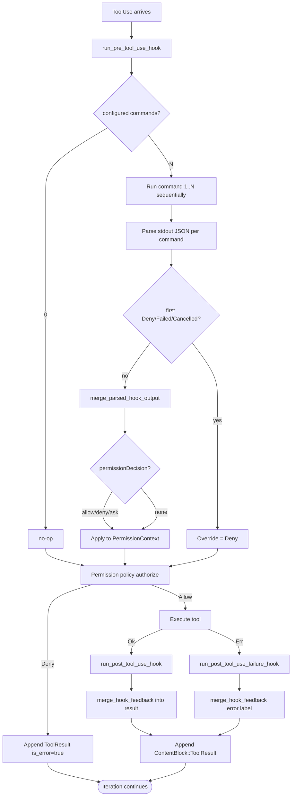
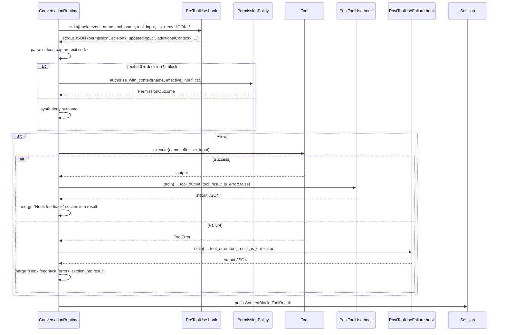

# Audit and Observability
> Module: 07_permissions_and_governance | Status: Phase 7 | Last Agent: Phase 7 Specialist Synthesis 

## 1. Overview
Audit and observability are the mechanisms by which an agent's actions are recorded, intercepted, and externally programmable — independent of the model's behavior. This document specifies the [CLAUDE] hooks system as the Phase 2 reference. It is the harness's primary observability *and* policy-extension surface: hooks both watch and decide.

[CLAUDE] hooks are shell commands configured in settings under the `hooks` key. They fire at specific lifecycle events with a JSON payload on stdin and an extensible JSON schema on stdout. The harness reads the response and merges it into the loop — overriding permission decisions, rewriting tool inputs, appending context, or denying outright (claw-code: `rust/crates/runtime/src/hooks.rs`, `conversation.rs:401-499, 771-787`).

> **task.md asks for upstream's `PreToolUse | PostToolUse | Notification | UserPromptSubmit | Stop | SubagentStop | SessionStart | PreCompact | SessionEnd`.** The claw-code source implements only **three** events. Reporting source reality.

## 2. Blueprint Specification

### Implemented events [CLAUDE]
`HookEvent::{PreToolUse, PostToolUse, PostToolUseFailure}` — `as_str` returns `"PreToolUse"`, `"PostToolUse"`, `"PostToolUseFailure"` matching the settings keys (claw-code: `rust/crates/runtime/src/hooks.rs:21-37`).

| Event | Fires when |
| --- | --- |
| `PreToolUse` | Before permission evaluation, after model emits `ContentBlock::ToolUse`. |
| `PostToolUse` | After successful tool execution. |
| `PostToolUseFailure` | After tool execution that returned a `ToolError` (`is_error: true`). |

> **Not implemented in claw-code at HEAD `a389f8d`**: `Notification`, `UserPromptSubmit`, `Stop`, `SubagentStop`, `SessionStart`, `PreCompact`, `SessionEnd`. Grep across `rust/` returns hits only inside test strings and a plugin-manifest validator that explicitly rejects upstream-style `SessionStart` hooks (`rust/crates/plugins/src/lib.rs:2637, 2653`).

### Settings shape [CLAUDE]
- **Top-level key**: `hooks`.
- **Value**: object whose keys must be `"PreToolUse" | "PostToolUse" | "PostToolUseFailure"`, each mapping to a `string[]` of shell commands (`config.rs:757-771`).
- **No matcher syntax** (divergence from upstream): per-tool patterns wrapping the command list as `{matcher: "Bash", hooks: [{type: "command", command: "..."}]}` are **not** supported. Commands are run unconditionally for the event, regardless of tool name (`config.rs:766-770`).

Example:
```json
{
  "hooks": {
    "PreToolUse": ["./scripts/audit-pre.sh"],
    "PostToolUse": ["./scripts/audit-post.sh", "./scripts/notify-slack.sh"],
    "PostToolUseFailure": ["./scripts/log-failure.sh"]
  }
}
```

### Hook input (stdin payload) [CLAUDE]
Built by `hook_payload(event, tool_name, tool_input, tool_output, is_error)` (`hooks.rs:632-657`):

For `PreToolUse` / `PostToolUse`:
```json
{
  "hook_event_name": "PreToolUse",
  "tool_name": "bash",
  "tool_input": { "command": "ls" },
  "tool_input_json": "{\"command\":\"ls\"}",
  "tool_output": "(post only)",
  "tool_result_is_error": false
}
```

For `PostToolUseFailure`:
```json
{
  "hook_event_name": "PostToolUseFailure",
  "tool_name": "bash",
  "tool_input": { "command": "ls /missing" },
  "tool_input_json": "...",
  "tool_error": "<error reason>",
  "tool_result_is_error": true
}
```

`tool_input` is parsed JSON (or `{"raw": "..."}` if not parseable). Payload is delivered on stdin to a shell subprocess (`hooks.rs:439`).

### Hook environment variables [CLAUDE]
Each hook subprocess additionally receives these env vars (`hooks.rs:431-437`):

| Var | Value |
| --- | --- |
| `HOOK_EVENT` | One of `PreToolUse` / `PostToolUse` / `PostToolUseFailure`. |
| `HOOK_TOOL_NAME` | The dispatched tool name. |
| `HOOK_TOOL_INPUT` | Stringified tool input (raw). |
| `HOOK_TOOL_IS_ERROR` | `"true"` / `"false"` for post-events. |
| `HOOK_TOOL_OUTPUT` | Tool's output text for `PostToolUse`. |

### Hook output schema [CLAUDE]
Parsed from stdout JSON (`hooks.rs:588-623`):

| Top-level key | Effect |
| --- | --- |
| `systemMessage: string` | Appended to `messages` as additional system context. |
| `reason: string` | Appended (alongside other reasons in deny outcomes). |
| `continue: false` | Treated as `Deny`. |
| `decision: "block"` | Treated as `Deny`. |
| `hookSpecificOutput.additionalContext: string` | Appended to messages as extra system context. |
| `hookSpecificOutput.permissionDecision: "allow" \| "deny" \| "ask"` | Maps to `PermissionOverride::{Allow, Deny, Ask}`. |
| `hookSpecificOutput.permissionDecisionReason: string` | Reason text shown to the user when prompting. |
| `hookSpecificOutput.updatedInput: object` | Replaces the tool input for downstream evaluation and execution. |

### Exit-code semantics [CLAUDE]
(`hooks.rs:445-501`)

| Exit | Outcome |
| --- | --- |
| `0` | `Allow` — unless `decision: "block"` or `continue: false` in stdout JSON, then `Deny`. |
| `2` | `Deny` with fallback reason `"<event> hook denied tool \`<tool>\`"`. |
| Other non-zero | `Failed` with formatted failure reason and stderr. |
| Signal-killed | `Failed`. |
| Cancelled via `HookAbortSignal` | `Cancelled`. |

### Loop interception [CLAUDE]
`run_turn` calls hooks at three points (`conversation.rs:401-499, 771-787`):

1. **`run_pre_tool_use_hook`** — fires *before* permission evaluation. The hook's `permission_override` and `permission_reason` flow into the `PermissionContext` (`conversation.rs:401-408`). A `Cancelled`/`Failed`/`Denied` hook short-circuits to `PermissionOutcome::Deny` with the hook's messages baked into the reason (`conversation.rs:410-430`). `updatedInput` replaces the tool input.

2. **`run_post_tool_use_hook`** — fires after successful tool execution. `merge_hook_feedback` appends a labelled `Hook feedback` section to the tool result (`conversation.rs:457-483`).

3. **`run_post_tool_use_failure_hook`** — fires when the tool returned an error. `merge_hook_feedback` appends a `Hook feedback (error)` section.

### Multiple commands per event [CLAUDE]
`run_commands` iterates configured commands sequentially; the first `Deny`/`Failed`/`Cancelled` short-circuits the rest (`hooks.rs:313-414`). Allow outcomes are merged via `merge_parsed_hook_output`.

### Progress reporting [CLAUDE]
An optional `HookProgressReporter` receives `Started`/`Completed`/`Cancelled` events for UI feedback (`hooks.rs:39-60`).

### Telemetry beyond hooks [CLAUDE]
The agentic loop has its own telemetry tracer independent of hooks. `record_turn_started`, `record_assistant_iteration`, `record_tool_started`, `record_tool_finished`, `record_turn_completed`/`record_turn_failed` push attributes into an optional `SessionTracer` (`conversation.rs:585-686`). This is the harness's structured-log surface; hooks are the *programmable* surface.

### Audit artifacts [CLAUDE]
| Surface | Persistence |
| --- | --- |
| `Session::messages` | Full turn record incl. all `ToolUse` and `ToolResult` blocks; persisted to disk per session (`session.rs:368, 469`). |
| `Session::compaction` | Tracks `count, removed_message_count, summary` across compactions (`session.rs:56-96, 249-257`). |
| `Agent` manifest files | `<agent_store_dir>/<agent_id>.json` records sub-agent terminal state (`tools/src/lib.rs:3493-3496, 3740-3760`). |
| `SessionTracer` attributes | Optional structured telemetry (`conversation.rs:585-686`). |
| Hook stdout/stderr | Captured per-call; failure reasons surfaced into the tool result. |

## 3. Logic Flow

For each tool invocation:

1. **`PreToolUse` fires** — stdin payload sent, env vars set, all configured `PreToolUse` commands run sequentially.
2. Hook output JSON parsed. The first deny/failure short-circuits.
3. **Permission policy uses the hook's outcome** as `PermissionOverride` input to `authorize_with_context`.
4. If the hook supplied `updatedInput`, `effective_input` becomes that JSON.
5. **Tool runs** (or doesn't, if permission denied).
6. **`PostToolUse` fires** on success — stdin payload includes `tool_output`. Hook output is merged into a `Hook feedback` section appended to the tool result.
7. **`PostToolUseFailure` fires** on error — stdin payload includes `tool_error`. Hook output is merged into a `Hook feedback (error)` section.
8. **Tool result is appended** to `Session::messages` and visible to the model on the next iteration.

## 4. Flowchart


## 5. Sequence Diagram


## 6. Variations & Trade-offs

| Pattern | Benefit | Trade-off |
| --- | --- | --- |
| **Three lifecycle events (claw-code)** [CLAUDE] | Minimal surface; covers the entire tool-call lifecycle. | No `SessionStart`, `Stop`, `UserPromptSubmit`, `PreCompact`, etc. — operators wanting prompt-level interception must work outside the harness. |
| **Shell-command hooks with JSON in/out** [CLAUDE] | Language-agnostic — any executable can be a hook. Composable with existing scripts. | Subprocess-per-call cost; serialization overhead; must validate JSON output carefully. |
| **No matcher syntax** [CLAUDE] | Configuration is flat and predictable. | Every `PreToolUse` hook fires for *every* tool call — operator must filter inside the script using `HOOK_TOOL_NAME`. |
| **`updatedInput` rewriting** [CLAUDE] | Programmable input sanitation (e.g. block paths, redact secrets) without modifying the harness. | Rewriting tool inputs after the model emitted them creates a model-vs-actual divergence; later auditors must trust the hook log. |
| **`additionalContext` injection** [CLAUDE] | Inject just-in-time context (e.g. recent CI status) without rebuilding the system prompt. | Each call costs hook latency + a `systemMessage` line in the conversation. |
| **Multiple commands per event with first-fail short-circuit** [CLAUDE] | Composable safety pipelines: a deny anywhere stops the chain. | Order matters; the first hook to deny wins, but operator must order intentionally. |
| **Telemetry tracer separate from hooks** [CLAUDE] | Hot-path telemetry (per-iteration, per-tool) doesn't pay subprocess cost. | Two observability surfaces to integrate with downstream dashboards. |

## 7. Agent Attribution Table

| Agent | Source-backed contribution |
| --- | --- |
| [CLAUDE] | `HookEvent::{PreToolUse, PostToolUse, PostToolUseFailure}` lifecycle events; flat `string[]` settings shape (no matcher syntax); JSON stdin payload with `hook_event_name`/`tool_name`/`tool_input`/`tool_input_json`/`tool_output`/`tool_error`/`tool_result_is_error` keys; `HOOK_*` environment variables for shell-friendly access; output schema with `systemMessage`/`reason`/`continue`/`decision`/`hookSpecificOutput.{additionalContext, permissionDecision, permissionDecisionReason, updatedInput}`; exit-code policy (0 / 2 / other / signal / cancelled); `merge_hook_feedback` appending labelled `Hook feedback` / `Hook feedback (error)` sections; `merge_parsed_hook_output` for multi-hook chaining; `HookProgressReporter` UI feedback; separate `SessionTracer` telemetry surface; durable `Session::messages` and `agent_id.json` manifest as audit artifacts. |

> Phase 4 [CLINE] adds per-action approval as a sibling observability pattern; Phase 6 [AUTOGPT] will add budget-limit guardrails in `safety_guardrails.md`.
