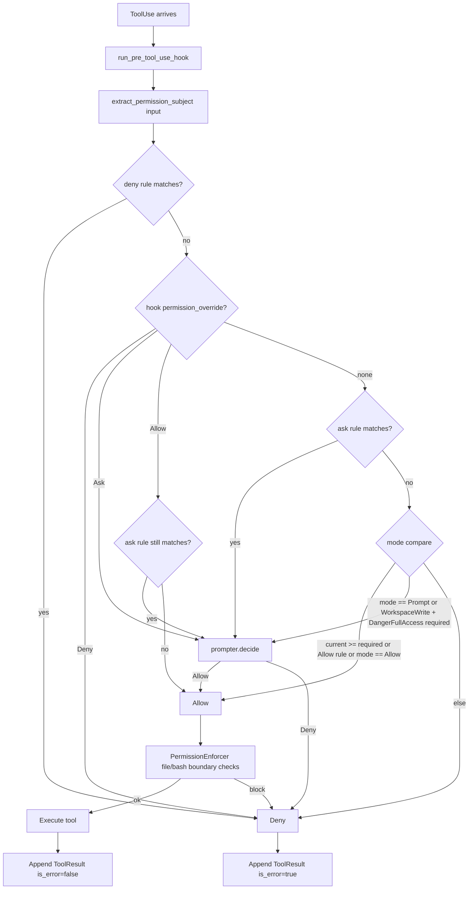
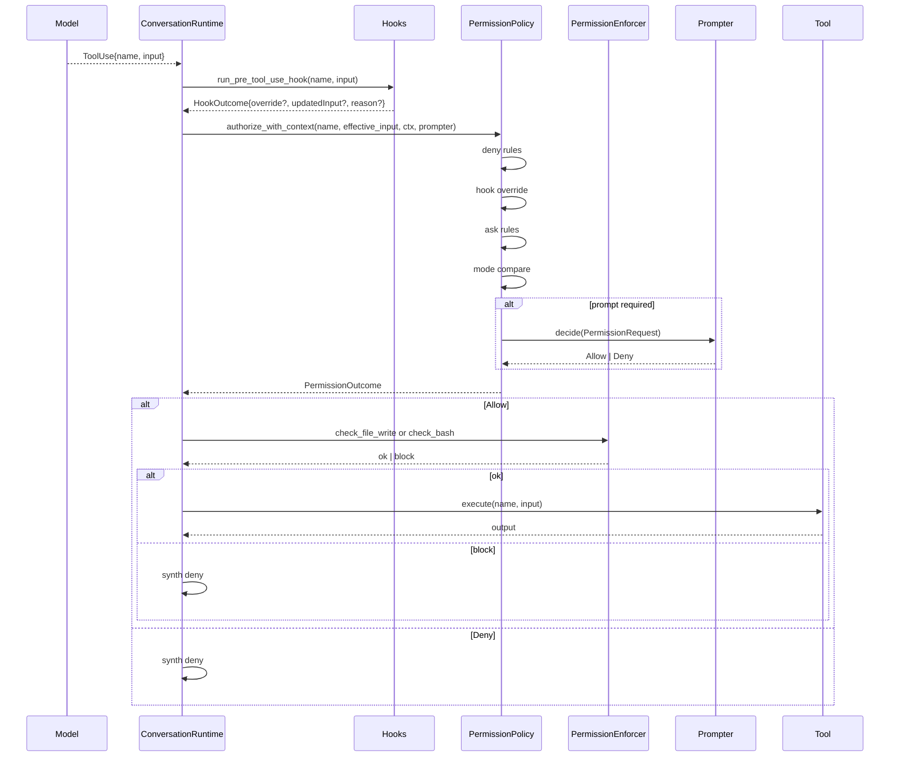
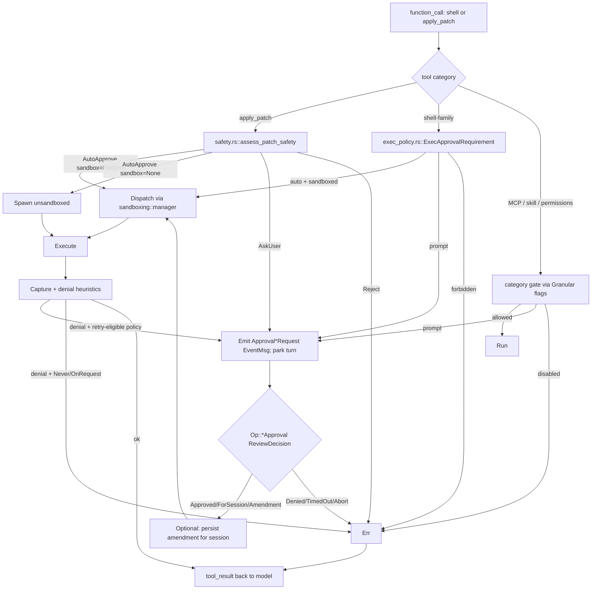
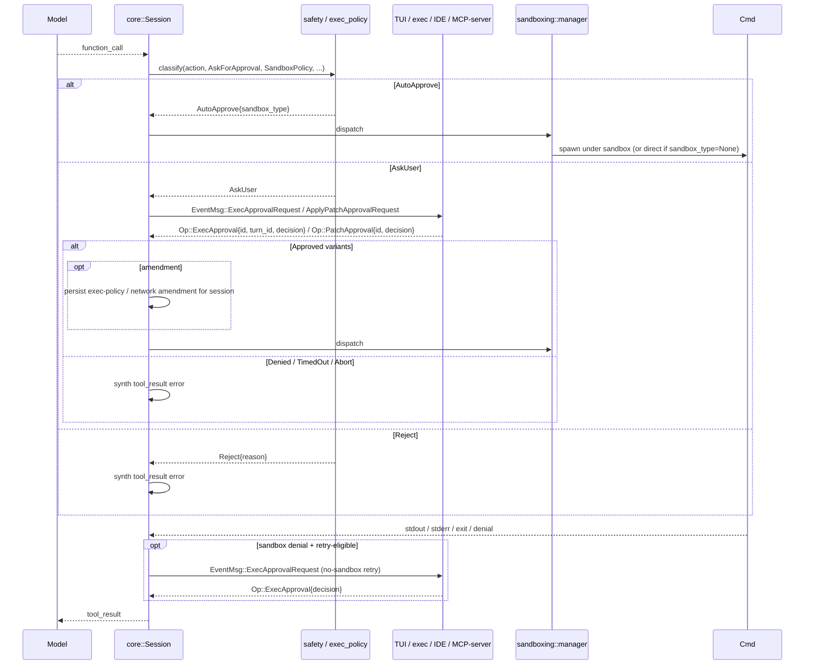

# Permission Model
> Module: 07_permissions_and_governance | Status: Phase 7 | Last Agent: Phase 7 Specialist Synthesis 

## 1. Overview
A permission model is the policy layer that decides whether a given tool invocation is allowed, denied, or escalated to the user. This document specifies the [CLAUDE] mode-based permission system (Phase 2), the [CODEX] two-dimensional `AskForApproval × SandboxPolicy` matrix (Phase 3), the [CLINE] per-action approval model (Phase 4), [ROO]'s mode-as-permission system (Phase 4), and [KILO]'s config-file protection layer (Phase 5) as five distinct paradigms.

> **Five paradigms compared:**
> - **[CLAUDE]** is **mode-first**: a single `PermissionMode` drives both "ask?" and "what can run?" — they collapse into one axis, with rules and hooks as overrides.
> - **[CODEX]** decomposes the two questions: `AskForApproval` decides whether a human is consulted; `SandboxPolicy` decides what is physically possible. The two compose independently.
> - **[CLINE]** is **per-action-first**: every tool use is presented to the user for approval by default. Granular auto-approval settings (`autoApprovalSettings`) and YOLO mode provide bypass mechanisms. A `CommandPermissionController` adds pattern-based command allow/deny rules.
> - **[ROO]** uses **mode-as-permission**: the active mode's `groups` list IS the permission policy — no separate RBAC layer. `fileRegex` restrictions add write-path enforcement. No hooks system (unlike Cline). MCP access is mode-conditional.
> - **[KILO]** adds **config-file protection**: a `ConfigProtection` layer intercepts `edit` and `external_directory` permissions targeting agent config files (`.kilo/`, `.kilocode/`, `.opencode/`, `kilo.json`, `AGENTS.md`), blocking all edits except plan files. The "Always Allow" UI option is disabled for config paths — every config edit requires individual approval. A `drainCovered` mechanism auto-resolves permissions across concurrent sub-agents to prevent redundant approval prompts.


[CLAUDE] uses a five-variant `PermissionMode` enum (three CLI-exposed) backed by deny/allow/ask rule lists, with hooks acting as a per-call override layer. The full ordered evaluation in `PermissionPolicy::authorize_with_context` runs (claw-code: `rust/crates/runtime/src/permissions.rs:175-292`):

> deny rule → hook deny → hook ask → hook allow → ask rule → mode/allow rule → default deny

A separate `PermissionEnforcer` layer adds workspace-boundary checks for filesystem-write tools and a read-only-command heuristic for `bash` (`permission_enforcer.rs:108-201`).

> **task.md asks for "3 modes (default, permissive, auto)"** — the source actually defines five `PermissionMode` variants with three CLI-exposed labels. This document reports source reality.

## 2. Blueprint Specification

### `PermissionMode` enum [CLAUDE]
`PermissionMode::{ReadOnly, WorkspaceWrite, DangerFullAccess, Prompt, Allow}` with `as_str` labels `"read-only" | "workspace-write" | "danger-full-access" | "prompt" | "allow"` (claw-code: `rust/crates/runtime/src/permissions.rs:9-28`).

| Variant | CLI label | Reachable from CLI flag? | Meaning |
| --- | --- | --- | --- |
| `ReadOnly` | `read-only` | Yes | Read tools allowed; write tools denied; `bash` allowed only if `is_read_only_command` heuristic passes. |
| `WorkspaceWrite` | `workspace-write` | Yes | Read + workspace-bounded writes allowed; bash and other `DangerFullAccess` tools require prompting. |
| `DangerFullAccess` | `danger-full-access` | Yes | All tool tiers allowed by default; deny rules and hooks still apply. |
| `Prompt` | `prompt` | No (runtime-internal) | Every tool requires prompting. |
| `Allow` | `allow` | No (runtime-internal) | All tools allowed unconditionally (modulo deny rules). |

`Prompt` and `Allow` are runtime-internal — only the first three are reachable from the CLI flag (`main.rs:1525-1542`).

### Settings-file mode parsing [CLAUDE]
`parse_optional_permission_mode` first checks top-level `permissionMode`, then `permissions.defaultMode` (`config.rs:831-863`). Accepted values map as:

| Settings value | → `PermissionMode` |
| --- | --- |
| `"default"` / `"plan"` / `"read-only"` | `ReadOnly` |
| `"acceptEdits"` / `"auto"` / `"workspace-write"` | `WorkspaceWrite` |
| `"dontAsk"` / `"danger-full-access"` | `DangerFullAccess` |

> **task.md's "default, permissive, auto" trio** corresponds to settings-file *aliases*, not CLI mode names. `default` → `ReadOnly`, `auto` → `WorkspaceWrite`. There is no settings alias spelled "permissive."

### Default mode (CLI) [CLAUDE]
`default_permission_mode()` resolves in this order (`main.rs:1552-1559`):

1. `RUSTY_CLAUDE_PERMISSION_MODE` env var.
2. Merged config's `permissionMode` field.
3. Merged config's `permissions.defaultMode` field.
4. Built-in default: **`PermissionMode::DangerFullAccess`**.

> **Divergence**: upstream Claude Code defaults to a prompting/plan mode; **claw-code defaults to full access**. This is documented in the research as a deliberate harness-specific choice.

### Settings precedence (last-wins deep merge) [CLAUDE]
`ConfigLoader::discover()` orders entries (`config.rs:242-269`):

1. User legacy `<HOME>/.claw.json`.
2. User `<config_home>/settings.json`.
3. Project `<cwd>/.claw.json`.
4. Project `<cwd>/.claw/settings.json`.
5. Local `<cwd>/.claw/settings.local.json`.

`load()` deep-merges in that order so later entries override earlier — **local > project > user** (`config.rs:271-296`; verified by `loads_and_merges_claude_code_config_files_by_precedence`, `config.rs:1296-1395`).

`<config_home>` is `$CLAW_CONFIG_HOME` else `$HOME/.claw` (`config.rs:561-563`).

### Project path branding [CLAUDE]
**claw-code uses `.claw/` not `.claude/`** for settings:

| Path | Purpose |
| --- | --- |
| `.claw/settings.json` | Project settings (committed). |
| `.claw/settings.local.json` | Local override (typically gitignored). |
| `~/.claw/settings.json` | User settings. |
| `.claw.json` (project + user roots) | Legacy alias for back-compat. |

(`config.rs:243-269`.)

> **Managed/enterprise paths**: **Not implemented in claw-code at HEAD `a389f8d`**. No `/etc/claude`, `/Library/Application Support/ClaudeCode`, or `%PROGRAMDATA%\ClaudeCode` paths are loaded. `ConfigLoader::discover` enumerates exactly the five paths above.

### Allow / deny / ask rules [CLAUDE]
- **Settings shape**: `permissions.{allow, deny, ask}: string[]` (`config.rs:780-798`).
- **Rule grammar** (`PermissionRule::parse`, `permissions.rs:349-402`):
  - `ToolName(matcher)` where:
    - `*` or empty → `Any`.
    - `prefix:*` → `Prefix(prefix)`.
    - Otherwise → `Exact(value)`.
  - Bare `ToolName` (no parens) → `Any`.
- **Rule subject extraction** (`extract_permission_subject`, `permissions.rs:447-469`): for each tool input, JSON-parses and probes keys in this order — `command`, `path`, `file_path`, `filePath`, `notebook_path`, `notebookPath`, `url`, `pattern`, `code`, `message` — falling back to the raw input string.
- **Example rules** (test fixtures, `permissions.rs:570-605`):
  - `"Read"` (ToolName-only).
  - `"bash(git:*)"` (prefix).
  - `"bash(rm -rf:*)"` (prefix deny).
  - `"Edit"` (ask).
- **Settings JSON shape used in tests** (`config.rs:1310, 1320`):
  ```json
  {
    "permissions": {
      "defaultMode": "plan",
      "allow": ["Read"],
      "deny": ["Bash(rm -rf)"],
      "ask": ["Edit"]
    }
  }
  ```

### Authorization order [CLAUDE]
`PermissionPolicy::authorize_with_context` (`permissions.rs:175-292`):

1. **Any matching deny rule** → `Deny`.
2. **Hook `PermissionOverride::Deny`** → `Deny`.
3. **Hook `Ask`** → prompt-or-deny (depends on prompter).
4. **Hook `Allow`** → `Allow` unless an ask rule matches (then prompt).
5. **Default**:
   - Matching ask rule → prompt.
   - Allow rule, OR `current_mode == Allow`, OR `current_mode >= required_mode` → `Allow`.
   - `current_mode == Prompt`, OR `WorkspaceWrite -> DangerFullAccess` escalation → prompt.
   - Else → `Deny`.

### Prompter contract [CLAUDE]
- `PermissionPrompter::decide(&PermissionRequest) -> PermissionPromptDecision::{Allow, Deny { reason }}` (`permissions.rs:69-88`).
- `PermissionRequest` carries `tool_name, input, current_mode, required_mode, reason`.
- **Without a prompter, prompt-required outcomes hard-deny** (`permissions.rs:310-323`).

### Workspace-boundary enforcement [CLAUDE]
`PermissionEnforcer::check_file_write(path, workspace_root)` (`permission_enforcer.rs:108-142`):

| Mode | Behavior |
| --- | --- |
| `WorkspaceWrite` | Denies writes outside workspace; allows inside. |
| `ReadOnly` | Denies all writes. |
| `Allow` / `DangerFullAccess` | Allows writes anywhere. |
| `Prompt` | Denies with reason `"file write requires confirmation in prompt mode"`. |

`check_bash` uses `is_read_only_command` to allow `cat | grep | git log | …` even under `ReadOnly` (`permission_enforcer.rs:145-201`).

### Autonomy / mode-resolution precedence (effective) [CLAUDE]
1. CLI flag (`--dangerously-skip-permissions` or `--permission-mode <value>`).
2. `RUSTY_CLAUDE_PERMISSION_MODE` env var.
3. Merged config (`permissionMode` then `permissions.defaultMode`).
4. Built-in default `DangerFullAccess`.

(`main.rs:611-693, 1552-1559`.)

### `--dangerously-skip-permissions` [CLAUDE]
Sets `permission_mode_override = Some(PermissionMode::DangerFullAccess)` (`main.rs:691-694`). It bypasses prompting and rule-driven escalation (because `DangerFullAccess >= required_mode` for every built-in tool), but it does **not** bypass:

- Deny rules in `permissions.deny`.
- Hook-driven `PermissionOverride::Deny`.
- Workspace-boundary checks in `PermissionEnforcer::check_file_write`.

These evaluate before / orthogonally to the active mode (`permissions.rs:182-189`, `permission_enforcer.rs:108-142`). **`--dangerously-skip-permissions` is therefore not a true YOLO bypass — it is "skip the prompter and the mode escalation gate."**

### `--permission-mode <value>` [CLAUDE]
Accepts exactly `read-only | workspace-write | danger-full-access`; any other value is rejected with `"unsupported permission mode '<value>'. Use read-only, workspace-write, or danger-full-access."` (`main.rs:1525-1542, 6119`). Aliases (`plan`, `acceptEdits`, `dontAsk`, `auto`) are accepted only in settings JSON, not on the CLI.

### `--allowedTools` interaction [CLAUDE]
Orthogonal to mode — restricts the tool catalog exposed to the model (`tools/src/lib.rs:192-244`, `main.rs:773-784`). A tool absent from the allowed set is simply not advertised, regardless of mode.

### Residual gates under `DangerFullAccess` [CLAUDE]
Even with the flag set, the loop still runs hooks (`run_pre_tool_use_hook` / `run_post_tool_use_hook`), and any deny rule or hook-deny still produces `PermissionOutcome::Deny` (`conversation.rs:401-445`, `permissions.rs:182-189`).

## 3. Logic Flow

For each tool invocation in the loop:

1. **Pre-hook fires** with `(tool_name, input)`; output may carry `permission_override`/`permission_reason` and `updatedInput`.
2. **`effective_input`** is `pre_hook_result.updated_input()` if rewritten, else original.
3. **`extract_permission_subject(input)`** picks the rule-matching subject (e.g. `command` for `bash`).
4. **`PermissionPolicy::authorize_with_context(name, effective_input, ctx, prompter)`** runs the ordered evaluation.
5. **Outcome** is `Allow`, `Deny { reason }`, or (via prompter) decided live.
6. **`PermissionEnforcer`** layer adds boundary checks for filesystem writes and read-only-mode bash heuristic.
7. **On `Allow`** → tool executes.
8. **On `Deny`** → synthesized `ContentBlock::ToolResult { is_error: true, output: <reason> }`.

## 4. Flowchart


## 5. Sequence Diagram


## 6. Variations & Trade-offs

| Pattern | Benefit | Trade-off |
| --- | --- | --- |
| **5-variant mode enum, 3 CLI-exposed** [CLAUDE] | Internal `Prompt` and `Allow` modes give hooks fine-grained control without polluting the user-facing CLI surface. | Naming divergence from upstream's "plan / accept-edits / yolo"; documentation-vs-CLI mismatch noted in research. |
| **Last-wins deep-merge precedence (local > project > user)** [CLAUDE] | Per-checkout overrides are easy; no "frozen by enterprise" footgun. | No managed/enterprise floor — operators can't enforce a policy below the user level. |
| **Rule grammar `ToolName(matcher)` with prefix/exact** [CLAUDE] | Compact; readable in JSON; granular for high-risk patterns like `bash(rm -rf:*)`. | Subject extraction is positional (probes a fixed key list) — exotic tool inputs may not have a clean matchable field. |
| **Hook overrides as a side channel** [CLAUDE] | Programmable, evolving policy without touching the harness binary. | Hooks must be authored carefully; a buggy hook can silently `Deny` all tools. |
| **`PermissionEnforcer` workspace-boundary** [CLAUDE] | Defense in depth: even `DangerFullAccess` won't let a write escape the workspace if the path check denies it. | Path resolution is the operator's responsibility — symlinks and `..` need careful canonicalization. |
| **Default mode = `DangerFullAccess`** [CLAUDE] | Turn-key dev velocity; the model can act without user friction. | Diverges from upstream's safer default; first-time users may not realize the implication. |
| **Two-dimensional `AskForApproval × SandboxPolicy`** [CODEX] | Decouples "ask?" from "what can run?" — `Never + WorkspaceWrite` is meaningfully different from `Never + DangerFullAccess`. Containment composes under approval. | Higher cognitive load — operators must reason about both axes; named presets exist but the real surface is the 5×4 product. |
| **Approval as wire-protocol round-trip** [CODEX] | Same `core` crate drives TUI, headless `exec`, MCP-server-as-Codex, and IDE/app-server unchanged; approval state survives IPC. | Higher latency than in-process callback; UI front-ends must handle parked-turn state and replay/recovery. |
| **`Granular(GranularApprovalConfig)` per-category booleans** [CODEX] | Operators turn specific prompt categories (sandbox approval, exec rules, skill approval, request_permissions, MCP elicitations) into auto-allow or auto-reject. | Five-knob configuration is easy to misconfigure; auto-rejection makes "why didn't this run?" debugging harder. |
| **`ApprovedForSession` / amendment review decisions** [CODEX] | Single approval can both authorize the immediate action AND persist a session-scoped exec-policy or network amendment — fewer repeat prompts. | Session-scoped amendments accumulate silently; UI must surface what's been amended for auditability. |
| **`Never` ≠ unsandboxed** [CODEX] | Eliminates the most common operator footgun ("I set it to never-prompt and now it can do anything"). | The combinatorics make documentation harder; users coming from Claude-style "skip permissions" mental models can be confused. |

## [CODEX] Autonomy Levels — `AskForApproval × SandboxPolicy`

### The `AskForApproval` enum [CODEX]

`codex-rs/protocol/src/protocol.rs`:

```rust
#[derive(Default, ...)]
#[serde(rename_all = "kebab-case")]
pub enum AskForApproval {
    #[serde(rename = "untrusted")]
    UnlessTrusted,
    OnFailure,                                         // marked deprecated in source
    #[default]
    OnRequest,
    #[strum(serialize = "granular")]
    Granular(GranularApprovalConfig),
    Never,
}
```

Semantic distinctions:

| Variant | Semantics |
| --- | --- |
| `UnlessTrusted` | Always prompt unless the operation is on a session-cached / explicitly-trusted whitelist. |
| `OnFailure` *(deprecated)* | Auto-approve into the sandbox; on sandbox failure, escalate to user for no-sandbox retry. |
| `OnRequest` *(default)* | Auto-approve ordinary non-escalated operations; prompt for sandbox overrides, network/permission amendments, dangerous commands, exec-policy `prompt` rules. |
| `Granular(GranularApprovalConfig)` | Per-category booleans: `sandbox_approval`, `rules`, `skill_approval`, `request_permissions`, `mcp_elicitations`. Disabled categories convert into automatic rejection. |
| `Never` | Never prompt. Sandbox failures are returned to the model as tool errors (no retry). Dangerous commands forbidden unless `SandboxPolicy ∈ {DangerFullAccess, ExternalSandbox}`. |

### The `SandboxPolicy` enum [CODEX]

```rust
pub enum SandboxPolicy {
    DangerFullAccess,
    ReadOnly { network_access: bool },
    ExternalSandbox { network_access: NetworkAccess },
    WorkspaceWrite {
        writable_roots: Vec<AbsolutePathBuf>,
        network_access: bool,
        exclude_tmpdir_env_var: bool,
        exclude_slash_tmp: bool,
    },
}
```

Mechanics fully documented in [sandboxing.md](sandboxing.md).

### Named presets [CODEX]

`codex-rs/utils/approval-presets/src/lib.rs` exposes three presets via `--approval-preset` / config:

| Preset | `AskForApproval` | `SandboxPolicy` |
| --- | --- | --- |
| `read-only` | `OnRequest` | `ReadOnly { network_access: false }` |
| `auto` | `OnRequest` | `WorkspaceWrite { writable_roots: [cwd], network_access: false, ... }` |
| `full-access` | `Never` | `DangerFullAccess` |

> **`--full-auto` is *not* equivalent to the `auto` preset.** `auto` = `OnRequest + WorkspaceWrite`. `codex exec --full-auto` only contributes `SandboxMode::WorkspaceWrite`; the headless `exec` runner separately defaults `approval_policy` to `Never`. The user-visible labels `suggest` / `auto-edit` / `full-auto` from older Codex copy are best treated as autonomy *labels* over the explicit `AskForApproval × SandboxPolicy` pair.

| User-facing label | Source-mapping | Effect |
| --- | --- | --- |
| `suggest` / `read-only` | `OnRequest + ReadOnly{network_access:false}` | Reads proceed; writes/network/most exec require approval or are rejected. |
| `auto-edit` / `auto` | `OnRequest + WorkspaceWrite{...}` | `apply_patch` to writable roots auto-applies under sandbox; ordinary non-dangerous commands run sandboxed; network / escalations / protected paths / dangerous commands prompt. |
| `full-auto` (`codex exec`) | `WorkspaceWrite` (from flag) + `Never` (runner default) | Patches and commands run without prompts but **still under workspace sandbox**; sandbox denials are returned to the model, not retried. |
| `full-access` / bypass | `Never + DangerFullAccess` (preset or `--dangerously-bypass-approvals-and-sandbox`) | No prompts; no Codex-managed OS sandbox. Explicit unsafe escape hatch. |

### Per-tool decision paths [CODEX]

There is no single universal gate. Each category has its own logic:

| Category | Gate code | Outcome enum |
| --- | --- | --- |
| `apply_patch` | `core/src/safety.rs::assess_patch_safety(...)` | `SafetyCheck::{ AutoApprove { sandbox_type, user_explicitly_approved }, AskUser, Reject { reason } }` |
| Shell-family (`shell`, `shell_command`, `exec_command`) | `core/src/exec_policy.rs` + `core/src/tools/sandboxing.rs` + `core/src/tools/orchestrator.rs` | `ExecApprovalRequirement` |
| MCP tool calls | per-server gating via `Granular.mcp_elicitations` and `request_permissions` | category-specific |
| Skills | `Granular.skill_approval` flag | category-specific |
| Permissions requests | `Granular.request_permissions` flag | category-specific |

The patch decision tree (`safety.rs`):

```
1. patch.is_empty()                                              → Reject("empty patch")
2. policy == UnlessTrusted                                       → AskUser
3. constrained_to_writable_paths(patch) || policy == OnFailure:
     a. SandboxPolicy in {DangerFullAccess, ExternalSandbox}     → AutoApprove(sandbox_type=None)
     b. platform sandbox available                                → AutoApprove(sandbox_type=<that>)
     c. unavailable AND policy rejects sandbox-approval           → Reject("no sandbox available")
     d. otherwise                                                  → AskUser
4. policy is Granular with sandbox_approval=false                → Reject(reason)
5. otherwise                                                      → AskUser
```

Shell path branches:

- Dangerous / missing-sandbox: prompts under `OnFailure | OnRequest | UnlessTrusted | Granular`; under `Never`, forbidden unless `DangerFullAccess` / `ExternalSandbox`.
- `Never` and `OnFailure`: skip initial approval; rely on sandbox.
- `OnRequest`: ordinary non-escalated commands run sandboxed; sandbox overrides / network / permission amendments / dangerous / `prompt`-rule commands prompt.
- `Granular`: disabled categories reject instead of prompt.
- After sandbox denial, no-sandbox retry approval is offered only for `OnFailure`, `UnlessTrusted`, or `Granular(sandbox_approval=true)`. `Never` and ordinary `OnRequest` do **not** silently retry.

### Per-tool gate matrix [CODEX]

| Mode / preset | Read-only obs (`shell cat`, `list_dir`, MCP resources, `view_image`) | `apply_patch` to writable root | `apply_patch` outside writable | Ordinary shell | Dangerous / network / escalated shell |
| --- | --- | --- | --- | --- | --- |
| `read-only` (`OnRequest + ReadOnly`) | Allowed | Asks/rejects (no writable root) | Asks/rejects | Usually prompts (FS sandbox is read-only) | Prompts; can be rejected by policy |
| `auto` (`OnRequest + WorkspaceWrite`) | Allowed | Auto-approved, sandboxed | Asks, or rejects | Sandboxed without prompt if non-dangerous | Prompts |
| `OnFailure + sandboxed` | Allowed | Auto-approved sandboxed | Sandbox attempt; denial may prompt no-sandbox retry | Sandboxed without prompt | Sandbox-failure may prompt retry |
| `Never + sandboxed` | Allowed | Auto-approved if path-constrained | Rejected pre-execution if not constrained | Sandboxed without prompt | Forbidden; sandbox denials returned to model |
| `Granular` | Per-category | Depends on `sandbox_approval` + path safety | Disabled categories reject | Depends on `sandbox_approval` / `rules` / cached approvals | Disabled categories reject |
| `full-access` / bypass (`Never + DangerFullAccess`) | Unrestricted | Auto-approved, unsandboxed | Auto-approved, unsandboxed | Unsandboxed, no prompt | Unsandboxed, no prompt |

### Approval as a wire-protocol round-trip [CODEX]

When `AskUser` is the verdict, the loop emits `EventMsg::ExecApprovalRequest(...)` or `EventMsg::ApplyPatchApprovalRequest(...)` and **parks the turn**. The reply arrives as `Op::ExecApproval { id, turn_id, decision }` or `Op::PatchApproval { id, decision }`. This is structurally different from Aider's in-process `io.confirm_ask` Python call and from claw-code's runtime `prompter` callback — Codex's approval flow survives across IPC, IDE plug-ins, and MCP-server invocations of Codex by other agents.

`ReviewDecision` variants:

| Variant | Effect |
| --- | --- |
| `Approved` | Approve this single action. |
| `ApprovedForSession` | Approve and cache for the rest of this session. |
| `ApprovedExecpolicyAmendment` | Approve and persist a session amendment to the exec-policy ruleset. |
| `NetworkPolicyAmendment` | Approve with a session amendment to the network policy. |
| `Denied` | Reject; tool returns synthesized error to model. |
| `TimedOut` | Implicit reject after timeout. |
| `Abort` | Abort the entire turn. |

### `[CODEX]` autonomy flowchart



### `[CODEX]` autonomy sequence diagram



## [CLINE] Per-Action Approval Model

### The ask/say Paradigm [CLINE]

Cline's approval model is built on two communication primitives:

- **`say(type, text, images, files, partial)`** — One-way message to the user (informational). Does NOT block execution.
- **`ask(type, text, partial)`** — Two-way message that **blocks until the user responds**. Uses `pWaitFor()` to poll `taskState.askResponse` every 100ms.

### Ask Types (Approval Boundaries) [CLINE]

| Ask Type | When Triggered | User Options |
| --- | --- | --- |
| `tool` | File, read/search/list, web, and other tool proposals | Approve / Reject / Edit |
| `command` | Shell command proposed | Approve / Reject |
| `command_output` | Running command receives additional output | Provide output / Continue |
| `browser_action_launch` | Browser launch requested | Approve / Reject |
| `use_mcp_server` | MCP server/tool use requires approval | Approve / Reject |
| `use_subagents` | Subagent delegation requested | Approve / Reject |
| `completion_result` | Task completion proposed | Accept / Provide Feedback |
| `api_req_failed` | API error occurred | Retry / Cancel |
| `mistake_limit_reached` | Too many errors | Provide Guidance / Cancel |
| `followup` | LLM asks a question | Respond |

### Auto-Approval Settings [CLINE]

| Mode | Behavior |
| --- | --- |
| **YOLO Mode** (`yoloModeToggled`) | Auto-approves ALL tools — reads, writes, commands, browser, MCP |
| **Granular Settings** (`autoApprovalSettings`) | Per-category: `readFiles`, `editFiles`, `executeSafeCommands`, `executeAllCommands`, `useBrowser`, `useMcp` |
| **Path-Aware** | Distinguishes workspace-local vs external files (`editFilesExternally` toggle) |
| **MCP Per-Tool** | Individual MCP tools can be marked `autoApprove` in `mcp_settings.json` |

### Command Permission Controller [CLINE]

`CommandPermissionController` (`src/core/permissions/CommandPermissionController.ts`) validates shell commands via `CLINE_COMMAND_PERMISSIONS` environment variable:

```json
{
  "allow": ["npm *", "git *", "echo *"],
  "deny": ["rm -rf *", "sudo *"],
  "allowRedirects": false
}
```

Evaluation rules:
1. Parse command into segments (split by `&&`, `||`, `|`, `;`).
2. Detect dangerous characters (backticks outside single quotes, newlines outside quotes).
3. Check for redirect operators (`>`, `>>`, `<`) — blocked unless `allowRedirects: true`.
4. Validate each segment against deny rules (first, takes precedence), then allow rules.
5. Recursively validate subshell contents `(...)` and `$(...)`.
6. No rules defined → allow everything (backward compatibility).

### Rejection Propagation [CLINE]

When a user rejects a tool via `ask()`, `taskState.didRejectTool = true` is set. All subsequent tool blocks **in the same turn** are skipped — the rejection cascades to prevent partially-approved tool sequences.

## [ROO] Mode-as-Permission

### Tool-Group RBAC [ROO]

The active mode's `groups` list IS the permission policy — there is no separate per-tool RBAC layer. `isToolAllowedForMode` (`src/core/tools/validateToolUse.ts:120-239`) is the gatekeeper:

1. Resolve tool aliases (`write_file` → `write_to_file`).
2. If `toolRequirements` explicitly disables → deny.
3. If in `ALWAYS_AVAILABLE_TOOLS` → allow.
4. Walk mode's `groups`:
   - If tool found in group AND group has `fileRegex` → validate path against regex; throw `FileRestrictionError` on mismatch.
   - If tool found → allow.
5. No matching group → deny.

### File-Regex Write Restrictions [ROO]

The `architect` mode's `["edit", { fileRegex: "\\.md$" }]` group entry means it can write `plan.md` but NOT source code. For `apply_patch`, every file path in the patch is extracted and validated against the regex. This is enforced at the validator, not just the prompt.

### Mode-Conditional MCP Access [ROO]

MCP tools are only available if the active mode includes `mcp` in its `groups` list. The `orchestrator` mode (`groups: []`) cannot use MCP tools. This is the MCP gating in the system prompt:
```typescript
const shouldIncludeMcp = hasMcpGroup && hasMcpServers
```

### No Hooks System [ROO]

Roo Code does NOT have a hooks subsystem. Cline's 9 lifecycle hooks (`TaskStart`, `PreToolUse`, `PostToolUse`, etc.) are absent. Roo's `RooCodeEventName.*` events are for in-process API/bridge consumers, not user-extensible scripts. Where Cline uses hooks for extensibility, Roo's answer is "use MCP servers."

### Differences from Cline [ROO]

| Dimension | [CLINE] | [ROO] |
| --- | --- | --- |
| Permission model | Per-action approval (ask/say) + `CommandPermissionController` + hooks | Mode-group RBAC + `fileRegex` + mode-conditional MCP |
| Auto-approval | Granular `autoApprovalSettings` + YOLO + per-MCP-tool | Per-server `alwaysAllow` list + `disabledTools` list |
| Hooks | 9 lifecycle events as external processes with JSON I/O | None — use MCP servers instead |
| File restrictions | `.clineignore` (gitignore-style) | `.rooignore` + per-mode `fileRegex` |
| Rule sources | `.clinerules/` (flat) + `.cursorrules` + `.windsurfrules` + `.agents/` compat | `.roo/rules-${mode}/` (mode-scoped) + `.roorules` + `.clinerules` compat + `AGENTS.md` |

## Four-Paradigm Comparison

| Axis | [CLAUDE] | [CODEX] | [CLINE] | [ROO] |
| --- | --- | --- | --- | --- |
| Policy shape | Single `PermissionMode` (5 variants) | Two-dimensional `AskForApproval × SandboxPolicy` | Per-action approval with granular auto-approve categories | Mode's `groups` list IS the permission policy |
| Default | `DangerFullAccess` (claw-code) | `OnRequest + WorkspaceWrite` (`auto` preset) | Per-action (every tool asks) | Mode-dependent (code = full edit/command; architect = read + md-only edit) |
| Approval mechanism | In-| Override channels | Hooks + deny/allow/ask rules | `Granular` per-category booleans + session amendments | YOLO mode + granular settings + hooks + `CommandPermissionController` | Per-mode tool groups + `fileRegex` (no hooks) | Config-file protection + per-agent bash rulesets + permission drain |
| Command filtering | `is_read_only_command` heuristic | exec-policy rules | Pattern-based `CLINE_COMMAND_PERMISSIONS` allow/deny | Same as Cline per-action approval | Per-agent bash allowlists (`bash` full, `readOnlyBash` deny-default with selective read-only git ops) |
| Bypass | `--dangerously-skip-permissions` (still respects deny rules) | `full-access` / `--dangerously-bypass-approvals-and-sandbox` | YOLO mode auto-approves everything | YOLO mode (inherited from Cline) | `POST /allow-everything` adds `{ "*": "*": "allow" }` (session or global scope) |
| MCP gating | Mode + connection state | Per-category `mcp_elicitations` | Global when servers exist + per-tool `autoApprove` | Mode-conditional (only if mode has `mcp` group) | Per-agent MCP wildcard rules (auto-generated from config `mcp` keys) |
| Extensibility | Hooks + rules | Exec-policy amendments | Hooks (9 lifecycle events) | MCP servers (no hooks) | No hooks; per-agent `Permission.merge()` of defaults + user + agent-specific rulesets |

## [KILO] Config-File Protection System

### ConfigProtection Layer [KILO]

**Source:** `packages/opencode/src/kilocode/permission/config-paths.ts`

The `ConfigProtection` namespace intercepts permission requests before they reach the base OpenCode permission system:

**Protected relative paths (project-level):**
- `.kilo/`, `.kilocode/`, `.opencode/` directories (at any nesting depth)
- Root config files: `kilo.json`, `kilo.jsonc`, `opencode.json`, `opencode.jsonc`, `AGENTS.md`
- **Excluded:** `plans/` subdirectory (plan files must be writable by the plan agent)

**Protected absolute paths (global-level):**
- `~/.config/kilo/` (XDG config)
- `~/.kilo/`, `~/.kilocode/` (legacy global directories)

**Behavior:**
1. `edit` permissions targeting any protected path are intercepted — the agent cannot modify config files without explicit per-request approval.
2. `external_directory` requests from bash-originated commands targeting protected directories are blocked.
3. File **reads** are **not** restricted — only edits.
4. The `DISABLE_ALWAYS_KEY` flag hides the "Always Allow" UI option for config-file permissions. Users must approve each config edit individually — no permanent bypass.

### Permission Drain [KILO]

**Source:** `packages/opencode/src/kilocode/permission/drain.ts`

The `drainCovered` function auto-resolves pending permissions across concurrent sub-agents:

```
When user approves rule R on sub-agent A:
  → All sibling sub-agents with pending permissions matching R auto-resolve.
  → Config-file permissions are EXEMPT — always require explicit user action.
```

This prevents the user from seeing the same approval prompt multiple times when parallel sub-agents (e.g., via the Agent Manager) request the same permission pattern.

### Per-Agent Bash Rulesets [KILO]

**Source:** `packages/opencode/src/kilocode/agent/index.ts`

Kilo defines two distinct bash permission maps:

**`bash` (full agent access):**
- `"*": "ask"` — anything not explicitly allowed requires approval.
- Explicitly allowed: `cat`, `ls`, `tree`, `grep`, `rg`, `jq`, `touch`, `mkdir`, `cp`, `mv`, `tsc`, `tar`, `unzip`.

**`readOnlyBash` (plan/ask/explore agents):**
- `"*": "deny"` — default deny everything.
- Whitelisted read-only commands: `cat`, `ls`, `tree`, `grep`, `rg`, etc.
- Selective git: `git log`, `git show`, `git diff`, `git status`, `git blame`, `git rev-parse` allowed; all other git commands denied.
- Shell metacharacters explicitly denied: `|`, `;`, `&&`, `&`, `$(`, `` ` ``, `>`, `>>`, `>|`, `<(`.
- `gh *: "ask"` — GitHub CLI requires approval.

Each agent combines its bash ruleset with tool-level permissions via `Permission.fromConfig()` and `Permission.merge()`:
```
defaults + agent-specific-rules + user-config + deny-overrides
```

### Allow Everything Endpoint [KILO]

**Source:** `packages/opencode/src/kilocode/permission/routes.ts`

`POST /allow-everything` provides a one-click "allow all" mode:
- Adds `{ permission: "*", pattern: "*", action: "allow" }` to session or global config.
- Scoped: can be limited to a single session or applied globally.
- Reversible: the disable path removes the wildcard rule.

## 7. Agent Attribution Table

| Agent | Source-backed contribution |
| --- | --- |
| [CLAUDE] | `PermissionMode` enum (`ReadOnly`/`WorkspaceWrite`/`DangerFullAccess`/`Prompt`/`Allow`); CLI-exposed three-mode surface; settings-file alias mapping (`default`→`ReadOnly`, `auto`→`WorkspaceWrite`, `dontAsk`→`DangerFullAccess`); 5-path settings discovery with last-wins deep merge; `.claw/`-branded settings root with `.claude/`-style legacy `.claw.json` aliases; `permissions.{allow,deny,ask}` rule lists with `ToolName(matcher)` grammar (`*` / `prefix:*` / `Exact`); `extract_permission_subject` positional key probing; ordered authorization (`deny` → hook → ask → mode/allow → default deny); `PermissionPrompter::decide` contract with hard-deny fallback; `PermissionEnforcer::check_file_write` workspace-boundary; `is_read_only_command` heuristic for `bash` under `ReadOnly`; `--dangerously-skip-permissions` semantics that still respect deny rules and hooks; default mode `DangerFullAccess` (claw-code-specific divergence). |
| [CODEX] | Two-dimensional autonomy matrix (`AskForApproval × SandboxPolicy`) decoupling "ask the human?" from "what can physically run"; five-variant `AskForApproval` (`UnlessTrusted`, `OnFailure` *(deprecated)*, `OnRequest` *(default)*, `Granular(GranularApprovalConfig)`, `Never`); four-variant `SandboxPolicy` (`DangerFullAccess`, `ReadOnly`, `ExternalSandbox`, `WorkspaceWrite`); three named presets (`read-only`, `auto`, `full-access`) plus the headless `--full-auto` flag (which is *not* the `auto` preset); per-category gating logic in `safety.rs` (patch), `exec_policy.rs` (shell), and `Granular` flags (skill / MCP elicitation / `request_permissions`); patch decision tree returning `AutoApprove { sandbox_type, user_explicitly_approved } | AskUser | Reject`; approval as a wire-protocol round-trip (`EventMsg::ExecApprovalRequest` / `EventMsg::ApplyPatchApprovalRequest` ↔ `Op::ExecApproval { id, turn_id, decision }` / `Op::PatchApproval { id, decision }`); `ReviewDecision` carrying `Approved | ApprovedForSession | ApprovedExecpolicyAmendment | NetworkPolicyAmendment | Denied | TimedOut | Abort` so a single reply can both authorize and persist a session amendment; sandbox-denial → no-sandbox-retry approval path for retry-eligible policies; the explicit semantic that `Never` means "no prompts" and **not** "unsandboxed" — containment continues to be decided by `SandboxPolicy`; `--dangerously-bypass-approvals-and-sandbox` as the only true full-bypass escape hatch (drops both axes simultaneously). |
| [CLINE] | Per-action approval via the `ask()` / `say()` paradigm — `ask()` blocks with `pWaitFor()` polling at 100ms intervals; 17+ ask types (`tool`, `command`, `command_output`, `browser_action_launch`, `use_mcp_server`, `use_subagents`, `completion_result`, `followup`, etc.); granular auto-approval via `AutoApprove` class with `yoloModeToggled` (auto-approve ALL tools), per-category `autoApprovalSettings` (`readFiles`, `editFiles`, `executeSafeCommands`, `executeAllCommands`, `useBrowser`, `useMcp`), path-aware `editFilesExternally` toggle, and per-MCP-tool `autoApprove` in `cline_mcp_settings.json`; `CommandPermissionController` (`src/core/permissions/CommandPermissionController.ts`) with pattern-based `allow`/`deny` rules via `CLINE_COMMAND_PERMISSIONS` env var, segment-by-segment validation, dangerous-character detection, redirect blocking, and recursive subshell validation; `didRejectTool` flag cascading rejection to all subsequent tool blocks in the same turn; 9 lifecycle hooks (`TaskStart`, `TaskResume`, `TaskCancel`, `TaskComplete`, `UserPromptSubmit`, `PreToolUse`, `PostToolUse`, `Notification`, `PreCompact`) executed as external processes with JSON I/O and `contextModification` injection; notification system (VS Code notifications, sound alerts, hook-driven events). |
| [ROO] | Mode-as-permission: active mode's `groups` list is the permission policy with no separate RBAC layer; `isToolAllowedForMode` validator with alias resolution, `ALWAYS_AVAILABLE_TOOLS` bypass, group walking, and `FileRestrictionError` for regex-protected groups; `architect` mode markdown-only edits via `fileRegex: \"\\.md$\"`; `apply_patch` per-file-path regex validation; mode-conditional MCP access (`shouldIncludeMcp = hasMcpGroup && hasMcpServers`); `orchestrator` mode with `groups: []` — only always-available tools; no hooks system (Roo's `RooCodeEventName.*` events are for in-process listeners only); `.rooignore` (renamed from `.clineignore`); per-server `alwaysAllow` list and `disabledTools` list for MCP tool gating; mode-scoped rule directories `.roo/rules-${mode}/*` as prompt-level permission guidance. |
| [KILO] | Config-file protection via `ConfigProtection` namespace (`config-paths.ts`) intercepting `edit` and `external_directory` permissions targeting `.kilo/`, `.kilocode/`, `.opencode/` directories and `kilo.json`, `opencode.json`, `AGENTS.md` root config files; plan file exemption (`.kilo/plans/`, `.opencode/plans/`); global path protection for `~/.config/kilo/`, `~/.kilo/`, `~/.kilocode/`; `DISABLE_ALWAYS_KEY` suppressing the "Always Allow" UI for config-file permissions; `drainCovered` function (`drain.ts`) auto-resolving pending permissions across concurrent sub-agents with config-file exemption; per-agent bash rulesets — `bash` (full access with `*: ask`, explicit allowlist for read/archive commands) and `readOnlyBash` (deny-default with selective git read-only ops and shell metacharacter blocking); agent-level permission composition via `Permission.fromConfig()` + `Permission.merge()` with ordered layering (defaults → agent-specific → user config → deny overrides); `askGuard()` for read-only agents and `planGuard()` for plan-mode agents with `.kilo/plans/*.md` write path; `getMcpRules()` auto-generating per-server MCP wildcard rules from config; `POST /allow-everything` endpoint adding session-or-global wildcard allow rule. |

> Phase 6 [AUTOGPT] will add budget-based permission constraints.
