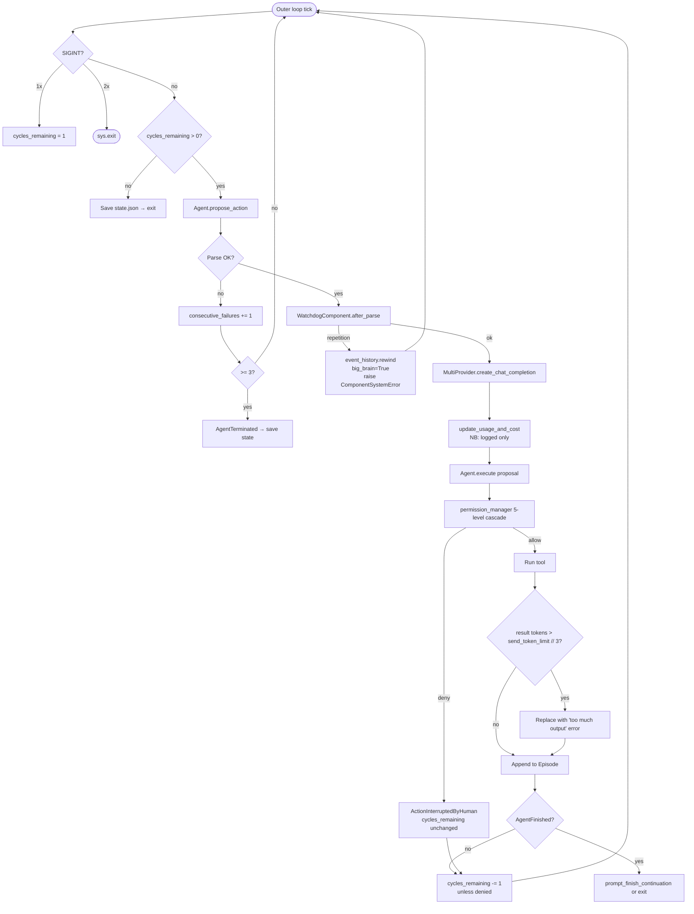

# Safety Guardrails
> Module: 07_permissions_and_governance | Status: Phase 7 | Last Agent: Phase 7 Specialist Synthesis 

## 1. Overview
Safety guardrails are runtime mechanisms that bound an agent's autonomy along axes that aren't covered by per-action permissions: cycle counts, monetary cost, token usage, sub-agent depth, repetition / liveness, and consecutive failures. They are the *quantitative* constraints that complement the *qualitative* permission model in `permission_model.md`.

[AUTOGPT] is the Phase 1–6 reference for budget-shaped guardrails. AutoGPT distinguishes **four budget axes** (cycle, token, money, sub-agent depth/count) with explicit configuration for each, plus three liveness mechanisms (`consecutive_failures`, `WatchdogComponent`, `SIGINT` handling) and six structural termination conditions (AutoGPT research §7). Crucially, AutoGPT's research **honestly flags** that the monetary axis is *logged-only and not enforced as a hard stop* — a real gap relative to systems like Codex that hard-cap cycles or tokens per task.

[PI] (research §7) is honest about its **minimal guardrails surface**: Pi has no built-in cycle budget, no built-in cost tracking, no built-in sandbox/isolation for bash execution, and no explicit permission system. Bash runs in the user's shell with full access. The `beforeToolCall` hook is the single extension point where embedding apps can layer their own guardrails. This is by design — Pi positions itself as a "modular, well-engineered minimal coding agent" and explicitly delegates safety to the embedding application or to per-project hooks.

[CODEX], [CLAUDE], [CLINE], [ROO], [KILO] use a different mix: Codex has a sandbox-first runtime with hard-capped iterations and Memento-style auto-compaction; Claude has an opt-in `with_max_iterations` cap (default `usize::MAX`); Cline tracks `consecutiveMistakeCount` plus YOLO override; Roo inherits Cline's mechanisms; Kilo adds config-file protection and per-agent bash rulesets. These belong primarily in `permission_model.md` and `sandboxing.md` and are cross-linked here only where they bound runtime quantities.

## 2. Blueprint Specification

### Four budget axes [AUTOGPT]
| Axis | Where | Default | Effect on overrun |
| --- | --- | --- | --- |
| **Cycle count** | `BaseAgentConfiguration.cycle_budget` (1) and `cycles_remaining` in `run_interaction_loop` (`app/main.py:607-787`) | CLI continuous mode: ∞; non-continuous: 1 then prompt; `continuous_limit: 0` | Outer loop `while cycles_remaining > 0` exits; CLI saves `state.json`. |
| **Token budget per prompt** | `BaseAgentConfiguration.send_token_limit` and `ActionHistoryConfiguration.max_tokens` (1024) | None for prompt (defaults to `llm.max_tokens * 3 // 4`); 1024 for history summaries | Old episodes summarized via `fast_llm`; oldest summaries dropped past cap. **Tool results larger than `send_token_limit // 3` are replaced with an error message** ("Command(s) returned too much output. Do not execute these commands again with the same arguments.") to prevent one giant tool result from blowing up the next prompt. |
| **Money / API cost** | `ModelProviderBudget` (`forge/llm/providers/schema.py`) tracks `total_budget`, `total_cost`, `remaining_budget`. Per-task budget tracked in `AgentProtocolServer._task_budgets: defaultdict[str, ModelProviderBudget]` | `total_budget = math.inf` | `update_usage_and_cost` decrements `remaining_budget`; **currently NOT enforced as a hard stop — only logged**. The `agent_protocol_server` reports `task_total_cost` in `additional_output` per step, and at server shutdown logs the sum of all `_task_budgets`. |
| **Sub-agent depth/count** | `ResourceBudget` in `ExecutionContext` (`forge/agent/execution_context.py`) | `max_depth=5`, `max_sub_agents=25`, `max_cycles_per_agent=50` | `can_spawn_sub_agent()` returns `False` once exceeded; `spawn_sub_agent` calls raise `RuntimeError`. `create_child_budget()` decrements `max_depth` per level and zeroes `explicit_allow_rules` so children must get explicit permissions. |

> **Honest gap**: there is **no token-based hard stop** in AutoGPT — `total_budget` is logged but not used to abort. This is a real gap relative to Codex, which uses Memento-style auto-compaction at the next-request token cap and can hard-cap iterations. Future blueprint readers should treat AutoGPT's budget-as-soft-guardrail pattern as advisory, not enforcement.

### Three liveness mechanisms [AUTOGPT]
| Mechanism | Where | Trigger | Effect |
| --- | --- | --- | --- |
| `consecutive_failures` | `app/main.py:692-702` | 3 `InvalidAgentResponseError`s in a row | Raises `AgentTerminated` → outer `run_auto_gpt` calls `handle_agent_termination` to save state. |
| `WatchdogComponent` | `forge/components/watchdog/watchdog.py` | Same `(use_tool.name, use_tool.arguments)` repeated, OR no tool emitted, AND agent currently on `fast_llm` | `event_history.rewind()`, flips `config.big_brain = True` (forces `smart_llm` next cycle), raises `ComponentSystemError` to retry the whole pipeline. After the next successful cycle, `revert_big_brain` flips it back. The watchdog is the only "automatic" model-routing in the codebase. |
| `SIGINT` | `app/main.py:642-663` | `Ctrl+C` once → set `cycles_remaining = 1` (graceful stop after current step). Twice → `sys.exit()`. | First press just ends continuous mode; second press is a hard kill. |

### Six structural termination conditions [AUTOGPT]
1. **Self-termination** — the LLM calls `finish(reason: str, suggested_next_task?: str)` (defined in `SystemComponent.finish`, raises `AgentFinished`). In CLI mode this triggers `prompt_finish_continuation` (exit on empty input, or restart with new task in same workspace, clearing `event_history.episodes`). In non-interactive mode (server / benchmark) it just exits.
2. **User interrupt** — first `Ctrl+C` sets `cycles_remaining = 1`, second exits via `sys.exit()`.
3. **Failure cap** — 3 consecutive `InvalidAgentResponseError`s raise `AgentTerminated`.
4. **Cycle limit** — `--continuous-limit N` flag.
5. **Permission deny** — does NOT terminate; the denial becomes an `ActionInterruptedByHuman` and the agent re-plans next cycle. So the user can effectively redirect the agent without stopping it.
6. **Sub-agent timeout** — `asyncio.wait_for(_run_agent_loop, timeout=sub_agent_timeout_seconds)` (default 300s) wraps every sub-agent run; on timeout the handle is `FAILED` but the parent is unaffected.

### [PI] minimal guardrails surface
| Surface | Where | Effect |
| --- | --- | --- |
| `beforeToolCall` hook | `agent-loop.ts:548-564` | The single extension point — apps return `{ block: true, reason }` to prevent tool execution. No built-in policy. |
| `afterToolCall` hook | `agent-loop.ts:629-654` | Can override `content`, `details`, `isError`, `terminate` per-field after execution. Used by apps to redact / sanitize results. |
| Output truncation metadata | Per-tool | `truncation: TruncationResult` returned in tool details so the agent loop / UI can convey limits to the LLM. Tools (read, bash, write, grep) include `truncation` in their `details` type. |
| `terminate: true` per-tool result | Tool execution | If every tool result in a batch sets `terminate: true`, agent stops without another LLM call. Runtime-only; transcript shows standard tool results. |
| `shouldStopAfterTurn` callback | `agent-loop.ts:218` | Per-turn termination predicate for embedding app to inject. |
| AbortSignal | Throughout | `agentLoop(prompts, context, config, signal?, streamFn?)` accepts a signal for cooperative cancellation. |

> **Honest gap (Pi)**: there is **no sandbox/isolation** for bash execution. Commands run in the user's shell with full access. There is **no explicit permission system** — tools are "all or nothing". `beforeToolCall` can block specific tool calls, but there's no model-level permission declaration. This is documented in research §7 and is a deliberate scope limit, not an oversight.

## 3. Logic Flow

### [AUTOGPT] per-cycle guardrail evaluation
1. Outer loop checks `while cycles_remaining > 0`.
2. SIGINT handler may set `cycles_remaining = 1` between cycles for graceful stop.
3. `propose_action` enters; `consecutive_failures` increments on `InvalidAgentResponseError` and may raise `AgentTerminated` at 3.
4. After parse, `WatchdogComponent.after_parse` checks repetition; on detection, rewinds history, flips `big_brain=True`, raises `ComponentSystemError` to restart the pipeline.
5. `LLM.create_chat_completion` updates `ModelProviderBudget` (`update_usage_and_cost`) — *logged only*.
6. `execute` runs; tool result is checked against `send_token_limit // 3` and replaced with an error if oversized.
7. After execute, `cycles_remaining -= 1` *unless* the result is `interrupted_by_human` (denial).
8. Sub-agent calls go through `ExecutionContext.can_spawn_sub_agent()` which checks `budget.max_depth`, `budget.max_sub_agents`, and cancellation state.
9. On `AgentFinished` (the `finish` tool was called), CLI prompts for continuation; non-interactive exits.
10. On `AgentTerminated`, save state and exit.

### [PI] per-cycle guardrail evaluation
1. Inner loop processes one turn; AbortSignal checked between LLM call and tool dispatch.
2. Tool calls go through preflight: `prepareArguments` shim → schema validation → `beforeToolCall(toolCall, args, assistantMessage, context)`.
3. If `beforeToolCall` returns `{ block: true, reason }`, an immediate error result is emitted; tool does not execute.
4. After execution, `afterToolCall` may rewrite the result.
5. If every tool result in a batch has `terminate: true`, agent stops.
6. `shouldStopAfterTurn` is consulted at end of turn.
7. Steering messages may pre-empt the next LLM call.

## 4. Flowchart


## 5. Sequence Diagram
```mermaid
sequenceDiagram
    participant Loop as run_interaction_loop
    participant Agent
    participant Watchdog as WatchdogComponent
    participant LLM as MultiProvider
    participant Budget as ModelProviderBudget
    participant Tool
    participant State as state.json

    loop while cycles_remaining > 0
        Loop->>Agent: propose_action
        alt parse failed 3x
            Loop->>State: save (AgentTerminated)
        else
            Agent->>Watchdog: after_parse(proposal)
            alt repetition detected
                Watchdog->>Agent: rewind, big_brain=True
                Watchdog-->>Loop: ComponentSystemError → retry
            else
                Agent->>LLM: create_chat_completion
                LLM->>Budget: update_usage_and_cost (logged only)
                LLM-->>Agent: AssistantChatMessage
                Agent-->>Loop: proposal
                Loop->>Agent: execute(proposal)
                Agent->>Tool: dispatch
                alt tool result tokens > send_token_limit // 3
                    Tool-->>Agent: replaced with error
                else
                    Tool-->>Agent: ActionResult
                end
                alt finish() called
                    Agent-->>Loop: AgentFinished → prompt_finish_continuation
                end
                Loop->>Loop: cycles_remaining -= 1 unless denied
            end
        end
    end
```

## 6. Variations & Trade-offs

| Pattern | Benefit | Trade-off |
| --- | --- | --- |
| **Four-axis budget model** [AUTOGPT] | Cycle, token, cost, and sub-agent depth are configured independently — appropriate axis can be tightened per deployment. | Configuration surface is wider; users must understand all four. |
| **Output-size guard on tool results** [AUTOGPT] | Single oversized result (e.g. a 100k-char `cat` of a binary file) doesn't blow up the next prompt; it's replaced with a deterministic error string. | Loses the actual data — agent must retry with smaller scope. |
| **Cost as soft guardrail** [AUTOGPT] | `ModelProviderBudget` tracks `total_cost` / `remaining_budget` per task; reported in Agent Protocol's `additional_output`. | **Honest gap**: not enforced as a hard stop — pure observability. Compare to Codex which can hard-cap. |
| **`WatchdogComponent` reactive escalation** [AUTOGPT] | Detects repetition (same `(use_tool, args)` twice) and escalates `fast_llm → smart_llm` automatically; reverts after one good cycle. The only autonomous routing decision in the codebase. | False positives possible on legitimate repeated operations (e.g. polling). |
| **`consecutive_failures` cap** [AUTOGPT] | 3 unparseable LLM responses in a row → terminate. Bounds runaway from broken model output. | Hard-coded threshold; a model that's stuck in a parsing loop wastes 3 cycles. |
| **Permission denial as feedback, not termination** [AUTOGPT] | Denial becomes `ActionInterruptedByHuman(feedback=...)` written into the episode + `pending_user_feedback` queue → next prompt sees `[USER FEEDBACK]`. The user redirects without stopping the agent. | Permission denial does not bound runaway — repeated denials don't terminate. |
| **Sub-agent depth tree with reset-on-each-level allow rules** [AUTOGPT] | `ResourceBudget.create_child_budget` decrements `max_depth` and **zeroes** `explicit_allow_rules` so children must get explicit permissions; deny rules are inherited. Hierarchical budget tree not seen in Roo's Boomerang or Kilo's worktree orchestration. | Explicit-allow propagation must be done by hand; tedious for deep recursion. |
| **Minimal guardrails by design** [PI] | `beforeToolCall` is the single hook — apps can layer arbitrary policy; the harness imposes no opinion. The `terminate: true` per-tool-result hint and `shouldStopAfterTurn` callback give apps fine control. | **Honest gap**: no built-in cost / cycle / sandbox surface. Bash runs in the user's shell. Apps must wire their own. Not appropriate as an out-of-the-box production agent — positioned as "modular, well-engineered minimal coding agent" in the research. |
| **Output truncation metadata as soft signal** [PI] | `truncation: TruncationResult` in tool details surfaces the limit to the LLM (and UI) without aborting; tools (read, bash, write, grep) consistently include it. | The model decides what to do — runtime doesn't enforce a re-fetch policy. |
| **`terminate: true` AND across tool batch** [PI] | Coordinated termination from a parallel tool batch — only stops if *every* result terminates. Useful for "verify all my changes compiled, all green → stop". | Mixed batches keep the loop running; can be surprising if one tool returns `terminate: true` and others don't. |

## 7. Agent Attribution Table

| Agent | Source-backed contribution |
| --- | --- |
| [AUTOGPT] | **Four-axis budget model** (cycle, token, cost, sub-agent depth/count) with explicit configuration: `BaseAgentConfiguration.cycle_budget`, `send_token_limit`, `ActionHistoryConfiguration.max_tokens=1024`, `ModelProviderBudget {total_budget, total_cost, remaining_budget}` (logged-only, NOT enforced — gap vs Codex), `ResourceBudget {max_depth=5, max_sub_agents=25, max_cycles_per_agent=50}` with `create_child_budget` decrementing `max_depth` per level and zeroing `explicit_allow_rules`; `update_usage_and_cost` per LLM call; per-task budget in `AgentProtocolServer._task_budgets: defaultdict[str, ModelProviderBudget]` reported as `task_total_cost` in step `additional_output`; **output-size guard** replacing tool results > `send_token_limit // 3` with a deterministic error string; **three liveness mechanisms** (`consecutive_failures` 3x cap raising `AgentTerminated` at `app/main.py:692-702`, `WatchdogComponent` repetition detection that rewinds history + flips `big_brain=True` + raises `ComponentSystemError`, SIGINT 1×=`cycles_remaining=1` graceful / 2×=`sys.exit()`); **six structural termination conditions** (`finish` tool raising `AgentFinished`, user interrupt, failure cap, `--continuous-limit N`, permission denial as `ActionInterruptedByHuman` (does NOT terminate), sub-agent timeout via `asyncio.wait_for(timeout=300)`); permission deny as feedback into `pending_user_feedback` instead of terminate. |
| [PI] | **Minimal guardrails surface** by design: `beforeToolCall(toolCall, args, assistantMessage, context) → { block?, reason? }` as the single permission/governance hook (`agent-loop.ts:548-564`); `afterToolCall(...)` per-field merge of `content / details / isError / terminate` (`agent-loop.ts:629-654`); `terminate: true` AND-across-batch per-tool early-stop hint (runtime-only; transcript still shows standard tool results); `shouldStopAfterTurn(messages) → boolean` per-turn termination predicate (`agent-loop.ts:218`); AbortSignal cooperative cancellation; output truncation metadata in tool details (`TruncationResult` for read/bash/write/grep). **Honest gaps**: no built-in cost/cycle budget, no sandbox/isolation for bash, no explicit permission system, tool-call argument streaming is provider-dependent — Pi positions itself as a modular minimal agent and explicitly delegates safety to the embedding application. |

### Continue
- **CI as a Structural Guardrail**: Instead of restricting what an agent can do on the developer's machine, Continue leverages CI checks as a guardrail. The agent operates as a reviewer against pull requests, ensuring code policies defined in `.continuerules` and `.continue/checks/` are met before the PR can be merged. This pushes safety into the SDLC instead of the agent loop.

> Cross-links: [CODEX] sandbox-first runtime → `sandboxing.md`; [CLAUDE] `with_max_iterations` cap → `agentic_loop.md`; [CLINE] `consecutiveMistakeCount` + YOLO → `permission_model.md`; [KILO] config-file protection + per-agent bash rulesets → `permission_model.md`.
