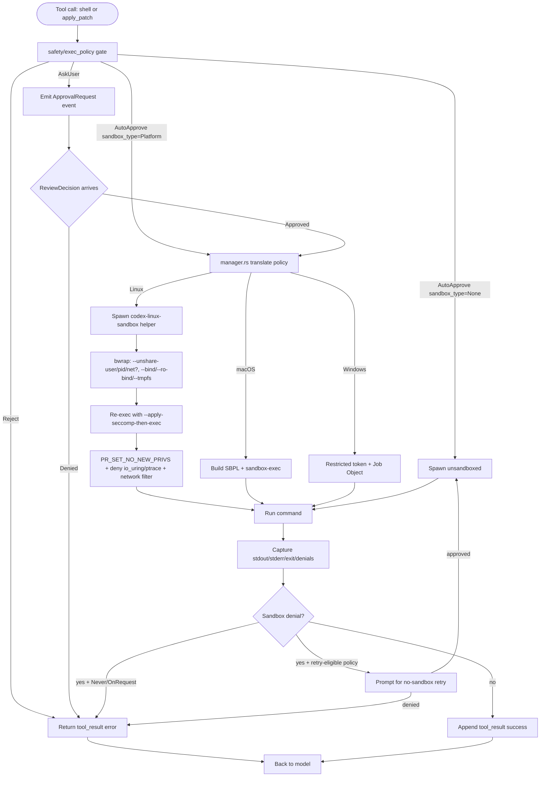
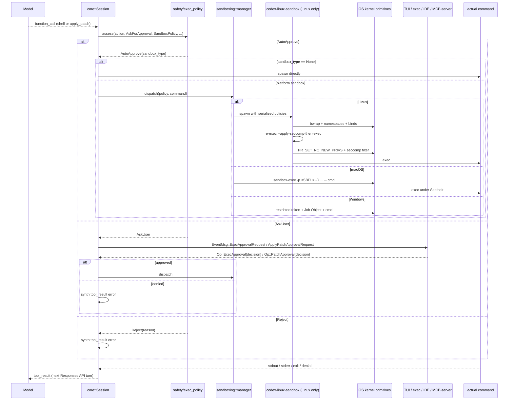

# Sandboxing
> Module: 07_permissions_and_governance | Status: Phase 7 | Last Agent: Phase 7 Specialist Synthesis 

## 1. Overview

Sandboxing is the runtime containment layer that decides **what is physically possible** for an agent action, independent of whether a human is consulted. It composes *underneath* the permission/approval layer documented in [permission_model.md](permission_model.md): permissions decide whether to ask; the sandbox decides what can run if the answer is yes.

[CODEX] is the reference implementation for sandbox-first execution. Every shell command and every `apply_patch` action is, by default, executed inside an OS-native sandbox. The sandbox backend is selected per platform (macOS Seatbelt, Linux bubblewrap+seccomp, Windows restricted-token/job-object), but the policy that drives them is a single shared `SandboxPolicy` enum on the wire protocol. The only way to leave the sandbox is to explicitly select `DangerFullAccess` or an external-sandbox mode whose enforcement is delegated outside Codex.

This is structurally different from the Phase 2 [CLAUDE] reference: claw-code's `bash` tool exposes sandbox-shaping fields (`namespaceRestrictions`, `isolateNetwork`, `filesystemMode`, `allowedMounts`) in its schema, but the actual enforcement at HEAD `a389f8d` is permission rules + hooks, not a kernel-level sandbox. [CLAUDE]

[AIDER] has no OS sandbox at all — it relies on git scoping, the in-chat file set, and per-action confirmation. [AIDER]

## 2. Blueprint Specification

### The shared `SandboxPolicy` enum [CODEX]

Defined in `codex-rs/protocol/src/protocol.rs`:

```rust
#[serde(tag = "type", rename_all = "kebab-case")]
pub enum SandboxPolicy {
    DangerFullAccess,
    ReadOnly { network_access: bool },
    ExternalSandbox { network_access: NetworkAccess },
    WorkspaceWrite {
        writable_roots: Vec<AbsolutePathBuf>,
        network_access: bool,
        exclude_tmpdir_env_var: bool,
        exclude_slash_tmp: bool,
    },
}
```

Four variants, three structural axes:

| Axis | Encoded as | Default |
| --- | --- | --- |
| Filesystem containment | The variant itself (`ReadOnly` / `WorkspaceWrite` / `ExternalSandbox` / `DangerFullAccess`) | `WorkspaceWrite` for the `auto` preset; `ReadOnly` for `read-only`. |
| Writable surface | `WorkspaceWrite::writable_roots: Vec<AbsolutePathBuf>` | `[cwd]`, optionally unioned with `[$TMPDIR, /tmp]` unless `exclude_*` flags are set. |
| Network | Per-variant `network_access: bool` (or typed `NetworkAccess` for `ExternalSandbox`) | **`false` in every sandboxed variant** — opt-in only. |

`WorkspaceWrite` additionally treats top-level `.git`, `.agents`, and `.codex` as **read-only protected subpaths** even though they sit under the writable root. `.codex` is protected pre-creation so first-time creation flows through the protected-path approval path. The agent cannot rewrite git history, mutate hooks, or stash secrets in `.codex` without going through an explicitly approved command.

### Per-OS backends [CODEX]

The dispatcher (`codex-rs/sandboxing/src/manager.rs`) translates the platform-neutral `SandboxPolicy` into native primitives:

| Platform | Backend | Code | Mechanism |
| --- | --- | --- | --- |
| macOS | Seatbelt (`/usr/bin/sandbox-exec`) | `codex-rs/sandboxing/src/seatbelt.rs`, `seatbelt_base_policy.sbpl`, `seatbelt_network_policy.sbpl`, `restricted_read_only_platform_defaults.sbpl` | Kernel MAC framework; SBPL Lisp policy DSL; closed-by-default `(deny default)` profile + named-parameter `(subpath (param "WRITABLE_ROOT_<n>"))` rules. |
| Linux | bubblewrap + seccomp (+ legacy Landlock) | `codex-rs/linux-sandbox/src/{bwrap,landlock,launcher,linux_run_main,proxy_routing,vendored_bwrap}.rs` | User-namespace filesystem isolation via `bwrap` (`--unshare-user/--unshare-pid/--unshare-net`, `--bind`/`--ro-bind`/`--tmpfs`); `PR_SET_NO_NEW_PRIVS` and seccomp filters applied via `--apply-seccomp-then-exec` re-entry; Landlock retained as legacy/reference. |
| Windows | Restricted token + Job Object | `codex-rs/windows-sandbox-rs/`, `codex-rs/sandboxing/...` | Newer than the Linux/macOS path; uses Windows access-token restriction and job-object limits. |

### macOS Seatbelt detail [CODEX]

`create_seatbelt_command_args()` in `seatbelt.rs` builds an SBPL profile by concatenating, with `\n` separators:

1. `include_str!("seatbelt_base_policy.sbpl")` — embedded base profile (`(version 1)`, `(deny default)`, narrow allows for `process-exec`, `process-fork`, same-sandbox signals, `/dev/null`/`/dev/ptmx`/`/dev/tty*` device IO, hardware/kernel `sysctl-read`, POSIX semaphores and shared memory for Python `multiprocessing` / PyTorch `__KMP_REGISTERED_LIB_*`, `user-preference-read` for CoreFoundation/`cfprefsd`).
2. File-read rules derived from the policy (broad read-everything-except-secrets typically).
3. File-write rules: one `(allow file-write* (subpath (param "WRITABLE_ROOT_<n>")))` per writable root, optionally wrapped with `(require-not (subpath (param "EXCLUDE_<n>")))` for protected subpaths.
4. Deny-read patterns (secrets folders).
5. Network: `seatbelt_network_policy.sbpl` for full network, or a dynamically built loopback-only stanza for managed-proxy mode, or nothing (closed-by-default).
6. `restricted_read_only_platform_defaults.sbpl` appended only when `include_platform_defaults == true`.

The shell-out shape:

```
/usr/bin/sandbox-exec \
    -p "<concatenated SBPL>" \
    -DWRITABLE_ROOT_0=/abs/path/to/cwd \
    -DEXCLUDE_0=/abs/path/to/cwd/.git \
    -- /bin/zsh -lc "<user-or-model command>"
```

Limits: Seatbelt cannot block raw network at packet level if `network*` is allowed (only at API level), and it does not isolate the process namespace. Codex relies on Seatbelt strictly for filesystem and high-level network control, plus the unforgeability of macOS's process sandbox from inside.

### Linux bubblewrap + seccomp detail [CODEX]

Codex does **not** restrict the long-lived parent CLI. Instead it spawns a standalone helper binary, `codex-linux-sandbox`, from the `linux-sandbox/` crate:

```
codex-linux-sandbox \
    --sandbox-policy-cwd <cwd> \
    --command-cwd <cwd-if-needed> \
    --sandbox-policy <json> \
    --file-system-sandbox-policy <json> \
    --network-sandbox-policy <json> \
    -- <command-to-run>
```

**Stage 1 — bubblewrap (`bwrap.rs`).** Either the system `bwrap` binary or a vendored fallback. Current flags include:

- `--new-session`, `--die-with-parent`.
- `--unshare-user`, `--unshare-pid` always.
- `--unshare-net` when network mode requires an isolated namespace (restricted networking and managed-proxy mode).
- Filesystem view: either `--ro-bind / /` for the default full-read policy, or `--tmpfs /` plus scoped `--ro-bind` mounts for restricted-read policies.
- `--bind <writable_root> <writable_root>` for each writable root.
- `--ro-bind <protected_subpath> <protected_subpath>` to re-apply read-only protection beneath writable roots (covers `.git`, `.agents`, `.codex`).
- `--dev /dev` and optional `--proc /proc`.

The current source does **not** add `--unshare-ipc`, `--unshare-uts`, or `--unshare-cgroup` in the main builder.

**Stage 2 — seccomp re-entry.** After bubblewrap establishes the filesystem and namespace view, the helper re-execs itself with `--apply-seccomp-then-exec`. In this inner stage it may:

- set `PR_SET_NO_NEW_PRIVS`;
- install a default-allow seccomp filter that **always** denies `ptrace`, `io_uring_setup`, `io_uring_enter`, `io_uring_register`;
- add network-syscall denies depending on `NetworkSandboxPolicy`.

Network modes:

| Mode | Behavior |
| --- | --- |
| `Restricted` | Deny outbound/inbound network syscalls; allow Unix-socket IPC for local tools. |
| `ProxyRouted` | Allow IP sockets inside the isolated namespace so traffic reaches the managed bridge; deny Unix socket paths that could bypass the proxy. |
| (no filter) | Full network allowed and no managed-proxy route enforced. |

**Landlock fallback.** `linux-sandbox/src/landlock.rs` retains the ABI-v5 Landlock filesystem function (read-`/`, read-write `/dev/null`, read-write writable roots, then `restrict_self()`), but it is currently unused — filesystem sandboxing is performed via bubblewrap.

### Network gating: three orthogonal places [CODEX]

1. **`SandboxPolicy::*::network_access`** — high-level toggle on the wire protocol. Default `false`.
2. **Seatbelt** closed-by-default profile on macOS, with dynamic full-network or managed-proxy stanzas only when enabled.
3. **Linux bwrap** `--unshare-net` plus seccomp `Restricted` / `ProxyRouted` modes.

The `network-proxy/` and `responses-api-proxy/` crates implement "agent has network through a proxy you control": the proxy whitelists egress hosts (often just `api.openai.com`), and the seccomp `ProxyRouted` mode plus loopback-only Seatbelt rules keep the agent boxed in.

### Filesystem: `WorkspaceWrite` semantics [CODEX]

`WorkspaceWrite` is the default workspace-capable sandbox. Concretely:

- `writable_roots` defaults to `[cwd]`, unioned with `[$TMPDIR, /tmp]` unless `exclude_tmpdir_env_var` / `exclude_slash_tmp` are set.
- Top-level `.git`, `.agents`, `.codex` are demoted to read-only protected subpaths when present; `.codex` is protected pre-creation at the workspace root.
- `is_write_patch_constrained_to_writable_paths()` (in `core/src/safety.rs`) normalises every `Add/Update/Delete/Move` patch target through `..` resolution, lowercases on case-insensitive filesystems, and tests each against the writable-roots set.

Escape paths the design specifically guards against:

| Vector | Defense |
| --- | --- |
| Symlink traversal (cwd symlink → `/etc/shadow`) | bwrap `--ro-bind` resolves symlinks against the post-bind mount table; Seatbelt `(literal …)` / `(subpath …)` rules apply to resolved paths. |
| Confused-deputy via `git` | `.git` is read-only, so the agent cannot rewrite history, change hooks, or write the index without going through `git` itself — a separate approval-gated exec call. |
| `io_uring` ring-buffer escape | Explicitly denied by seccomp (`io_uring_setup`/`io_uring_enter`/`io_uring_register`). |
| `ptrace` injection into another process | Denied by seccomp. |

### How the sandbox composes with approval [CODEX]

The approval policy (`AskForApproval`, see [permission_model.md](permission_model.md)) is **layered on top of** the sandbox, not the other way around:

- The patch-safety gate (`core/src/safety.rs`) returns one of `AutoApprove { sandbox_type, user_explicitly_approved } | AskUser | Reject { reason }`.
- A patch constrained to writable paths under `WorkspaceWrite` returns `AutoApprove(sandbox_type=<platform>)` — runs sandboxed without asking.
- A patch under `DangerFullAccess` or `ExternalSandbox` returns `AutoApprove(sandbox_type=None)` — runs without Codex's sandbox.
- `Never` without `DangerFullAccess` still means **"no prompts inside the sandbox"**, not "unsandboxed shell." The selected `SandboxPolicy` continues to determine containment.
- Sandbox denial returns a structured error to the tool runtime; depending on `AskForApproval`, the orchestrator may prompt for a no-sandbox retry (`OnFailure`, `UnlessTrusted`, `Granular` with `sandbox_approval=true`) or simply return the error to the model (`Never`, ordinary `OnRequest`).

### Standalone helper-binary pattern [CODEX]

`codex-linux-sandbox` is a separate executable that the parent CLI execs into. This isolates kernel-level restrictions (seccomp, `PR_SET_NO_NEW_PRIVS`) to the child process tree without tainting the long-lived agent process — the agent retains its full host capabilities, only the per-command spawn is restricted. The blueprint should treat this as a transferable pattern.

## 3. Logic Flow

For each shell command or `apply_patch` invocation:

1. **Patch-safety / exec-policy gate** evaluates `(action, AskForApproval, SandboxPolicy, file-system-policy, cwd, windows-sandbox-level)` and returns `AutoApprove { sandbox_type } | AskUser | Reject`.
2. **If `AskUser`**, the runtime emits `EventMsg::ExecApprovalRequest` or `EventMsg::ApplyPatchApprovalRequest` and parks the turn until the matching `Op::ExecApproval { decision }` / `Op::PatchApproval { decision }` arrives on the submission queue.
3. **If `AutoApprove(sandbox_type=None)`** (i.e. `DangerFullAccess` / `ExternalSandbox`), the runtime spawns the command directly without Codex sandbox.
4. **If `AutoApprove(sandbox_type=Seatbelt|Bwrap|Windows)`**, `sandboxing/src/manager.rs` translates the policy:
   - **macOS**: build SBPL string by concatenating base + read/write/deny/network/platform-default sections; shell out to `sandbox-exec -p <profile> -D <param>=<value>... -- <command>`.
   - **Linux**: spawn `codex-linux-sandbox` helper with serialized policies; helper runs `bwrap` with computed flags, then re-execs itself with `--apply-seccomp-then-exec` to install seccomp + `PR_SET_NO_NEW_PRIVS` before exec'ing the actual command.
   - **Windows**: spawn under restricted token + job object.
5. **Capture** stdout/stderr/exit code plus sandbox-denial heuristics (e.g. ENOENT-on-bind-mount, EPERM-on-seccomp-denied-syscall).
6. **On sandbox denial**: depending on `AskForApproval`, either prompt for no-sandbox retry, or return structured error as `tool_result` to the model.
7. **Append** result to conversation history; loop continues.

## 4. Flowchart



## 5. Sequence Diagram



## 6. Variations & Trade-offs

| Pattern | Benefit | Trade-off |
| --- | --- | --- |
| **Sandbox-first runtime (sandbox is a property of the runtime, not a tool feature)** [CODEX] | Containment is the default; "ask the human" decisions are layered on top, not substituted. `Never` does not mean "unsandboxed." | Every command path pays sandbox-setup cost; some host-specific tools may misbehave when their assumed filesystem/network view is restricted. |
| **One `SandboxPolicy` enum, three OS backends, one `manager.rs` dispatcher** [CODEX] | Front-ends and `core` reason about a flat policy shape; per-OS mechanics are encapsulated. | Backends drift in capability — macOS Seatbelt cannot do packet-level network filtering; Linux gets seccomp+bwrap+optional Landlock; Windows is newer/less tested. |
| **Standalone sandbox helper binary (`codex-linux-sandbox`)** [CODEX] | Kernel restrictions (seccomp, no-new-privs) scoped to the per-command child; long-lived agent process keeps host capabilities. | One extra exec per command; helper-binary versioning has to track core-protocol changes. |
| **Read-only protected subpaths under writable roots (`.git`, `.agents`, `.codex`)** [CODEX] | Even in `WorkspaceWrite`, the agent cannot rewrite git history, swap hooks, or hide secrets in `.codex` without going through approval-gated commands. | Tools that legitimately need to write inside these paths (e.g. `git commit` itself) must go through the command exec path, which means they go through the approval pipeline. |
| **Network disabled by default; opt-in per variant; managed-proxy as a third path** [CODEX] | Three orthogonal gates (policy bool, OS profile, seccomp filter) provide defense in depth; the proxy path lets users grant *narrow* network (e.g. only `api.openai.com`) without opening egress. | Proxy mode requires running `responses-api-proxy`/`network-proxy`; Seatbelt cannot enforce packet-level filtering even in proxy mode. |
| **Helper re-entry for seccomp (`--apply-seccomp-then-exec`)** [CODEX] | Seccomp filter is installed only after bwrap has set up the namespace view, so the filter sees the right syscall surface. | Two `exec` hops per command; debugging is harder because the sandboxed process tree is two stages deep. |
| **No sandbox** [CLAUDE] [AIDER] | Zero containment overhead; tools work identically to the host. Permission rules / hooks / file-set scoping / git-checkpointing carry the full safety burden. | A buggy or compromised tool call can do anything the user can do; defense in depth requires non-runtime mechanisms (CI checks, code review, manual confirmation). |
| **Sandbox-shaping schema fields without enforcement** [CLAUDE] | `bash` schema has `namespaceRestrictions`, `isolateNetwork`, `filesystemMode`, `allowedMounts` — forward-compatible with future sandbox layers. | At HEAD `a389f8d` the harness does not enforce these — they are advisory metadata, not a containment surface. Codex's pattern is what closes this gap. |

## 7. Agent Attribution Table

| Agent | Source-backed contribution |
| --- | --- |
| [CODEX] | Sandbox-first runtime philosophy (sandbox composes *under* approval, not over); shared `SandboxPolicy { DangerFullAccess, ReadOnly, ExternalSandbox, WorkspaceWrite }` enum on the wire protocol; per-OS dispatcher (`sandboxing/src/manager.rs`); macOS Seatbelt backend with embedded SBPL (`seatbelt_base_policy.sbpl`, `seatbelt_network_policy.sbpl`, `restricted_read_only_platform_defaults.sbpl`) and `(deny default)` closed-by-default profile parameterised via `-D KEY=VAL`; Linux backend using a standalone `codex-linux-sandbox` helper binary that runs `bwrap` (`--unshare-user/--unshare-pid/--unshare-net`, `--bind`/`--ro-bind`/`--tmpfs`) then re-execs itself for seccomp+`PR_SET_NO_NEW_PRIVS`; Windows restricted-token + job-object backend; Landlock retained as legacy fallback; protected `.git`/`.agents`/`.codex` subpaths under writable roots; `is_write_patch_constrained_to_writable_paths()` patch normalisation; three-layer network gating (policy bool, OS profile, seccomp filter); `network-proxy`/`responses-api-proxy` managed-egress pattern; explicit defenses against symlink traversal, confused-deputy via `.git`, `io_uring`, and `ptrace` injection. |
| [CLAUDE] | Sandbox-shaping schema fields (`namespaceRestrictions`, `isolateNetwork`, `filesystemMode`, `allowedMounts`) on the `bash` tool — advisory at HEAD `a389f8d`, no kernel-level enforcement; permission rules + hooks + workspace-boundary check (`PermissionEnforcer::check_file_write`) carry the safety burden in lieu of an OS sandbox. |
| [AIDER] | No OS sandbox. File-in-chat scoping, git auto-commit / undo, and per-action user confirmation are the safety mechanisms. |

> Phase 5 [OPENCODE] will add a complementary TUI-driven execution model; Phase 4 [CLINE] will add per-action approval as a third complementary layer above the sandbox; Phase 5 [KILO] will add file-level permissions on top of the sandbox boundary.
