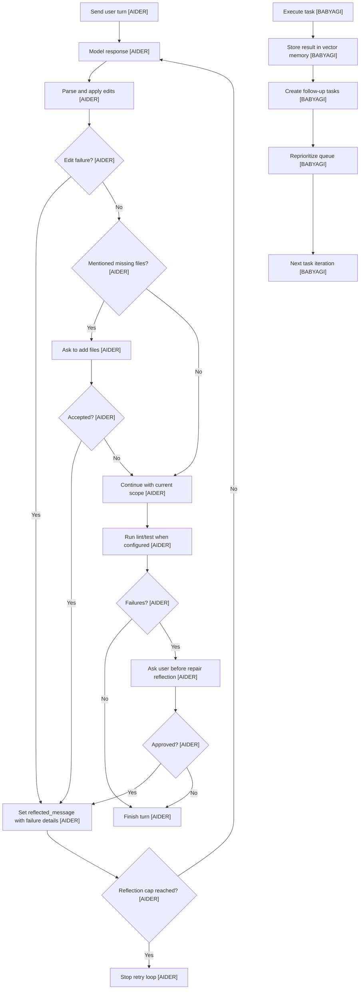
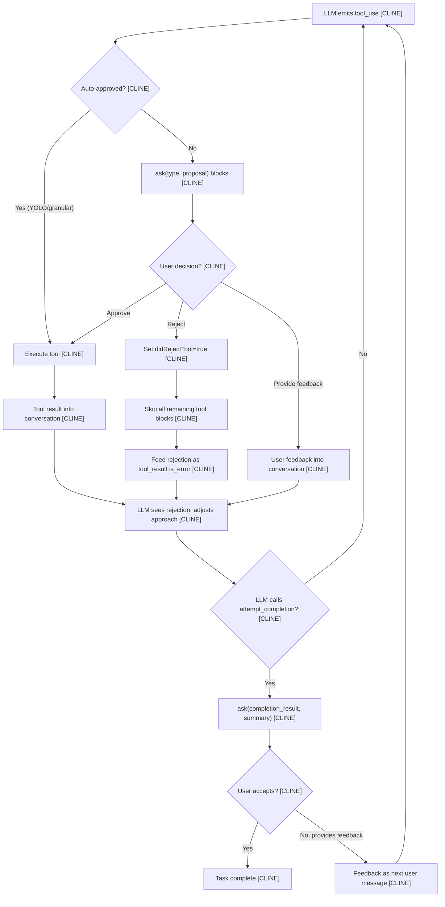
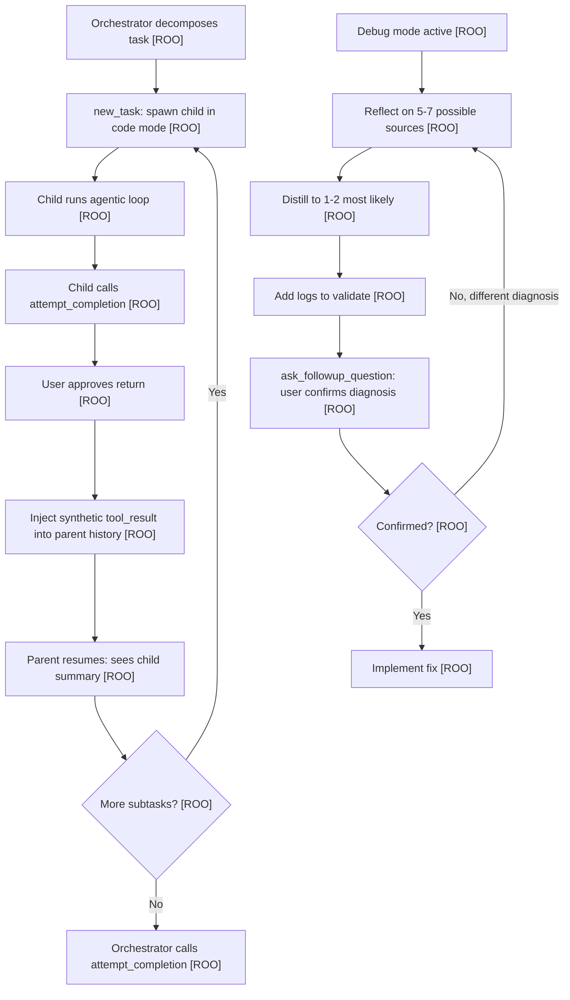
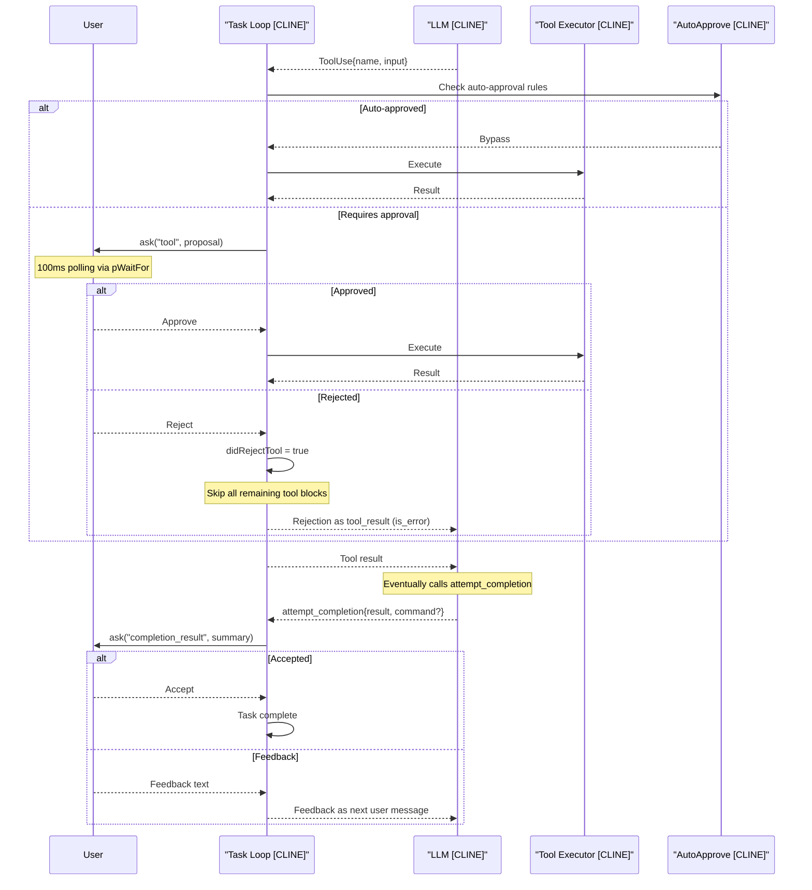

# Feedback Loops
> Module: 08_user_interaction | Status: Phase 7 | Last Agent: Phase 7 Specialist Synthesis

## 1. Overview

Feedback loops convert runtime outcomes into the next model-visible input. [AIDER] In Aider, the common retry primitive is `reflected_message`: malformed edits, file-scope changes, lint output, test output, and other repair prompts can all be routed back through the same `run_one()` loop. [AIDER] The loop is capped by `max_reflections = 3`, preventing unlimited self-repair. [AIDER]

Aider separates autonomous correction from user-approved correction. [AIDER] Edit parsing and application failures can become reflected model input as part of the coding loop, while lint and test failures require explicit user confirmation before Aider asks the model to repair them. [AIDER] Shell-command output is also gated before it is added back into chat. [AIDER]

BabyAGI has a feedback loop, but it is task-oriented rather than validation-oriented. [BABYAGI] A completed task result is stored in vector memory, then passed into task creation and prioritization prompts to reshape the queue. [BABYAGI] There is no lint/test validation, no patch failure reflection, no approval gate, and no retry state beyond the generated next tasks. [BABYAGI]

[CLINE] introduces **per-action human feedback** as the primary feedback loop. Every tool use is presented to the user via the `ask()` primitive before execution. The user can approve, reject, or provide feedback. Rejection cascades via `didRejectTool` — all subsequent tools in the same turn are skipped and a rejection message is fed back to the LLM. The `attempt_completion` tool creates a bidirectional feedback gate: the user can accept or provide feedback that loops back into the conversation. Auto-approval settings (`yoloModeToggled`, granular `autoApprovalSettings`) selectively bypass approval gates. [CLINE]

> Cross-link: AutoGPT's `WatchdogComponent` (repetition → fast_llm escalation) is documented in `agentic_loop.md`; permission denial as feedback (`ActionInterruptedByHuman`) is in `safety_guardrails.md`; Pi's `afterToolCall` + `shouldStopAfterTurn` hooks are in `safety_guardrails.md` and `tool_architecture.md`.

### [CONTINUE] CI-as-Feedback Pattern

Continue introduces a novel feedback paradigm where **CI checks function as automated code-quality feedback loops**. The CLI (`extensions/cli/`, invoked as `cn`) reads check rules from `.continue/checks/`, hydrates them with project context from context providers, calls the LLM, and posts green/red GitHub status checks with suggested diffs.

This is structurally different from all prior feedback loops in the blueprint:
- **Aider's lint/test reflection** is synchronous and in-session.
- **Cline's `checkRepeatedToolCall`** is runtime-only and loses state across sessions.
- **Continue's CI checks** are **asynchronous, cross-session, and triggered by PRs** — the feedback arrives as a GitHub status check, not an in-IDE interaction.

The check rules are version-controlled alongside source code (`.continue/checks/*.md`), so feedback criteria evolve with the codebase. This treats **code review policies as testable artifacts** — analogous to how linters and test suites provide automated feedback but applied to LLM-powered code review.

| Dimension | [AIDER] lint/test | [CLINE] checkRepeatedToolCall | [CONTINUE] CI checks |
| --- | --- | --- | --- |
| Trigger | Post-edit in session | Runtime loop detection | PR event (CI pipeline) |
| Feedback target | LLM (via retry prompt) | LLM (via mistake counter) | Developer (via GitHub status check) |
| Persistence | Session-scoped | Session-scoped | Cross-session (CI artifacts) |
| Extensibility | Fixed (lint + test) | Fixed (same-tool-same-args) | Open (any markdown rule) |

[ROO] extends the feedback pattern with **mode-driven feedback**: the active mode's roleDefinition and customInstructions shape what kind of feedback the agent produces. The `debug` mode's instructions direct the agent to "reflect on 5-7 possible sources, distill to 1-2, add logs to validate, ask the user to confirm the diagnosis before fixing" — a structured feedback cycle. The `architect` mode ends with "use switch_mode to request implementation" — forwarding the plan as feedback to the next mode. Boomerang delegation provides a third feedback path: the child's `attempt_completion` summary is injected as a synthetic `tool_result` into the parent's history. [ROO]

## 2. Blueprint Specification

| Capability | Phase 1 Blueprint | Source Pattern |
| :--- | :--- | :--- |
| Unified reflection channel | Represent repair input as a model-visible reflected message rather than hidden state. [AIDER] | `reflected_message` in the coder loop. [AIDER] |
| Reflection cap | Bound repeated self-repair attempts. [AIDER] | `max_reflections = 3`. [AIDER] |
| Edit failure feedback | Feed malformed edit output and unapplicable patches back into the model automatically. [AIDER] | Edit parser/apply failures. [AIDER] |
| File mention feedback | Ask to add missing mentioned files, then reflect the updated file set into a new pass. [AIDER] | `check_for_file_mentions()`. [AIDER] |
| Lint feedback gate | Convert lint failures into a repair prompt only after user approval. [AIDER] | `Attempt to fix lint errors?`. [AIDER] |
| Test feedback gate | Convert failing test output into a repair prompt only after user approval. [AIDER] | `Attempt to fix test errors?`. [AIDER] |
| Task-result feedback | Store execution output, create new tasks, reprioritize the queue, and execute the next task. [BABYAGI] | `execution_agent()` -> results storage -> `task_creation_agent()` -> `prioritization_agent()`. [BABYAGI] |

Feedback categories:

- Structural feedback: malformed edit blocks, failed hunk matches, ambiguous whole-file output, or blocked file targets. [AIDER]
- Context feedback: newly accepted files or changed editable/read-only scope. [AIDER]
- Operational feedback: lint errors, test failures, or shell output that the user chooses to add to chat. [AIDER]
- Goal feedback: completed task results that generate and reorder future work. [BABYAGI]

## 3. Logic Flow

1. A user turn enters `run_one()`, which resets per-message state and sends the message. [AIDER]
2. The model response is parsed and applied. [AIDER]
3. If parsing or application fails, Aider writes a reflected message describing the problem. [AIDER]
4. If the assistant mentions files outside chat, Aider asks whether to add them; accepted additions also become reflection input. [AIDER]
5. `run_one()` repeats while `reflected_message` exists and the reflection count remains under the cap. [AIDER]
6. After successful edits, Aider may run lint and test checks. [AIDER]
7. Lint or test failures become reflected repair prompts only if the user approves the repair attempt. [AIDER]
8. Shell-command output is added back to chat only if the user confirms. [AIDER]
9. In BabyAGI, the task result is always written to completed-result memory, then task creation and prioritization use that result to produce the next queue state. [BABYAGI]
10. BabyAGI does not verify the result before storing it and does not distinguish repair feedback from ordinary task generation. [BABYAGI]

## 4. Flowchart



### [CLINE] Per-Action Feedback Flow


### [ROO] Mode-Driven Feedback + Boomerang Return


## 5. Sequence Diagram

```mermaid
sequenceDiagram
    participant User
    participant Loop as "run_one Loop [AIDER]"
    participant Model as "LLM [AIDER]"
    participant Edit as "Edit/Apply Layer [AIDER]"
    participant Check as "Lint/Test/Shell Gates [AIDER]"

    User->>Loop: Submit request
    Loop->>Model: Send prompt
    Model-->>Loop: Response
    Loop->>Edit: Parse and apply edits
    alt Malformed or failed edit
        Edit-->>Loop: Failure details
        Loop->>Loop: Set reflected_message
        Loop->>Model: Retry with reflected failure
    else Edits applied
        Edit-->>Loop: Success
        Loop->>Check: Run configured checks
        alt Check failure
            Check-->>User: Ask whether to repair
            User-->>Check: Approve or decline
            Check-->>Loop: Reflected repair prompt when approved
            Loop->>Model: Retry when approved and under cap
        else Checks pass
            Loop-->>User: Final response
        end
    end
```

### [CLINE] Per-Action Approval Sequence


## 6. Variations & Trade-offs

| Variation | Strength | Cost or Risk |
| :--- | :--- | :--- |
| Unified reflected message [AIDER] | One retry mechanism handles malformed edits, context changes, and approved validation failures. [AIDER] | Requires careful tagging of feedback so the model understands the next attempt. [AIDER] |
| Reflection cap [AIDER] | Prevents endless loops after repeated failures. [AIDER] | A hard cap can stop before a repairable issue is solved. [AIDER] |
| User-gated lint/test repair [AIDER] | Keeps operational validation repair under human control. [AIDER] | Adds friction when users want fully automatic repair. [AIDER] |
| Automatic edit-failure reflection [AIDER] | Lets the model correct formatting or patch mistakes quickly. [AIDER] | Can spend extra model calls on parser-level issues. [AIDER] |
| Task-result feedback [BABYAGI] | Simple autonomous progress loop from execution result to new tasks. [BABYAGI] | No independent validation, no structured error class, and no repair-specific feedback state. [BABYAGI] |
| Per-action approval as feedback [CLINE] | Every tool use is a bidirectional feedback opportunity — the user sees exactly what's proposed and can approve, reject, or redirect. Maximum transparency. [CLINE] | High friction for multi-tool workflows unless auto-approval is configured. 100ms polling interval adds latency per tool. [CLINE] |
| `didRejectTool` cascade [CLINE] | Rejection of one tool blocks all subsequent tools in the turn — prevents partial execution of a multi-tool plan. [CLINE] | Aggressive: a rejected tool may not warrant blocking unrelated subsequent tools. The LLM must re-plan from scratch. [CLINE] |
| `attempt_completion` as feedback gate [CLINE] | The user can accept or provide feedback at task completion — a natural checkpoint for course correction. [CLINE] | Adds one more approval step per task. The LLM may call `attempt_completion` prematurely, frustrating users. [CLINE] |
| Granular auto-approval settings [CLINE] | Per-category bypass (`readFiles`, `editFiles`, `executeSafeCommands`, etc.) lets users tune the friction-safety tradeoff. [CLINE] | Configuration complexity — many toggles to manage. YOLO mode bypasses everything including dangerous operations. [CLINE] |
| Mode-driven feedback [ROO] | Different modes produce different types of feedback. Debug mode's structured "reflect → distill → validate → confirm" flow is a feedback loop encoded in the system prompt. [ROO] | Feedback quality depends on LLM following mode instructions. Not enforced at the harness level — prompt-only guidance. [ROO] |
| Boomerang completion as feedback [ROO] | Child's `attempt_completion` summary injected as a synthetic `tool_result` provides structured feedback to the parent. The parent LLM processes it as a function return value. [ROO] | Summary may lose important detail from the child's multi-step work. Parent has no access to child's intermediate steps — only the final summary. [ROO] |
| `update_todo_list` as progress feedback [ROO] | Explicit checklist maintained by the agent; `preventCompletionWithOpenTodos` blocks premature completion. Visible to user in real-time. [ROO] | Requires the LLM to explicitly maintain the list via tool calls — adds overhead. Cline's Focus Chain (`task_progress` parameter) achieves similar tracking implicitly. [ROO] |
| 9 lifecycle hooks as extensible feedback [CLINE] | `PreToolUse`, `PostToolUse`, etc. hooks let external processes inject `contextModification` (system prompt addenda, tool response modifications) into the feedback stream. [CLINE] | Hook authoring complexity; buggy hooks can silently modify or block feedback. External process adds latency. [CLINE] |

## 7. Agent Attribution Table
| Agent | Contribution | Phase Use |
| :--- | :--- | :--- |
| [AIDER] | Reflected-message retry primitive, reflection cap, edit-failure feedback, file-context feedback, and user-gated lint/test repair. | Primary source for human-in-the-loop feedback and repair design. |
| [BABYAGI] | Task-result feedback through memory, task creation, and prioritization. | Contrast pattern for goal-progress feedback without validation or tool repair. |
| [CLINE] | Per-action approval via `ask()` / `say()` paradigm with 17+ ask types; `didRejectTool` cascade blocking subsequent tools on rejection; `attempt_completion` as bidirectional feedback gate (accept / provide feedback); granular `autoApprovalSettings` per-category bypass (`readFiles`, `editFiles`, `executeSafeCommands`, `executeAllCommands`, `useBrowser`, `useMcp`); YOLO mode full bypass; `CommandPermissionController` pattern-based command allow/deny; 9 lifecycle hooks (`PreToolUse`, `PostToolUse`, etc.) with `contextModification` injection; Focus Chain implicit `task_progress` tracking; `consecutiveMistakeCount` and `mistake_limit_reached` ask type for error feedback; notification system (VS Code notifications, sound alerts). | Phase 4 — per-action approval and granular human-in-the-loop feedback. |
| [ROO] | Mode-driven feedback: `debug` mode's structured "reflect → distill → validate → confirm" cycle, `architect` mode ending with `switch_mode` to request implementation; Boomerang completion feedback via synthetic `tool_result` injection from child `attempt_completion` summary; `update_todo_list` as explicit task-progress feedback with `preventCompletionWithOpenTodos` completion gate; mode-scoped rule directories `.roo/rules-${mode}/*` providing mode-specific feedback guidance. | Phase 4 — mode-driven and delegation feedback patterns. |

## 8. Repository Implementations

### AutoGPT
- **Denial as Feedback**: In AutoGPT, if a user denies permission for an action (e.g. through `UserInteractionComponent.ask_user()`), it does not immediately terminate the task. Instead, it generates an `ActionInterruptedByHuman(feedback=...)` record which is pushed to episodic history. It also queues the feedback in `pending_user_feedback` so the next prompt explicitly includes `[USER FEEDBACK]`. This provides the LLM an opportunity to understand *why* the action was blocked and immediately pivot its approach.
