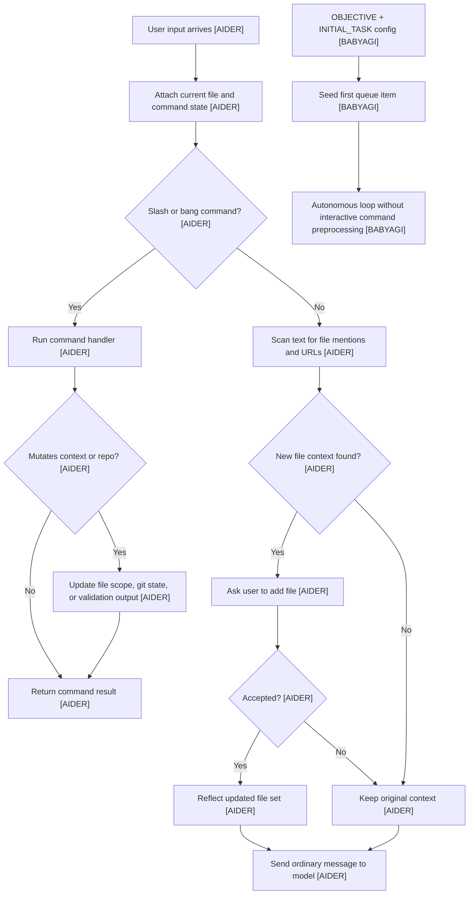
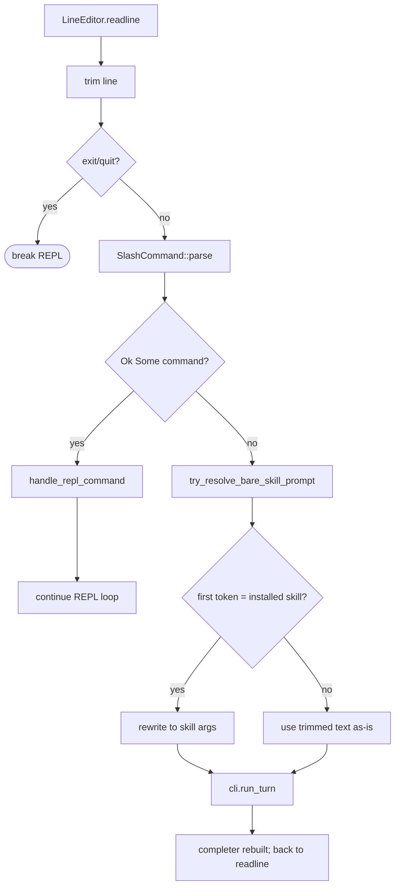
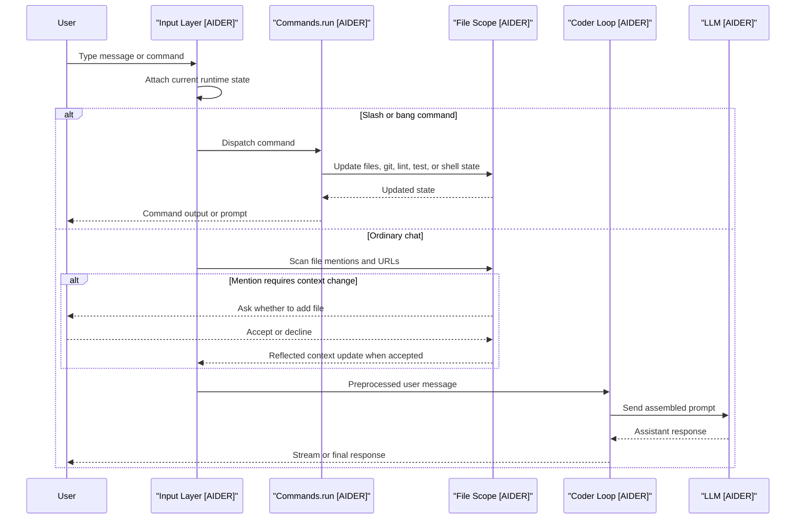
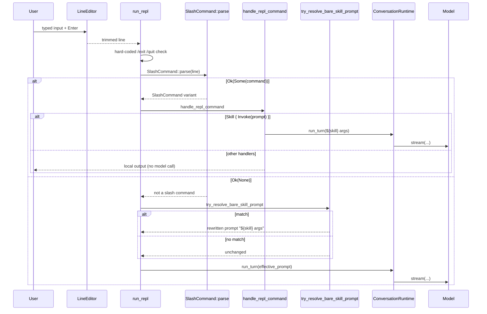

# Input Processing
> Module: 08_user_interaction | Status: Phase 7 | Last Agent: Phase 7 Specialist Synthesis

## 1. Overview

Input processing is the boundary where user text becomes either a direct agent request, a local command, a file-scope update, or an execution request.

[AIDER] In Aider, `get_input()` collects the current editable files, read-only files, addable files, command metadata, and active edit format before `preproc_user_input()` interprets the user's message. Aider gives command handling priority over ordinary chat. Slash commands and bang commands are routed through `Commands.run()` before the message is sent to the model; remaining text is scanned for file mentions and URLs, which may expand context after user confirmation. This makes user input both a conversation channel and a control plane for the agent runtime. [AIDER]

> [BABYAGI] input is the standing objective string plus a single enrichment pass (top-5 vector-recalled completed task names). The archive baseline has no interactive input preprocessing.

### [HERMES] Multi-Channel Input Gateway

Hermes processes input from 7+ messaging channels via a gateway abstraction. Each channel adapter handles platform-specific message formats:

| Channel | Input format | Adapter |
| --- | --- | --- |
| Telegram | Text, voice, images, files via Bot API | `tui_gateway/telegram_adapter.py` |
| Discord | Text, embeds, attachments via Discord.py | `tui_gateway/discord_adapter.py` |
| Slack | Text, blocks, files via Slack SDK | `tui_gateway/slack_adapter.py` |
| WhatsApp | Text, media via WhatsApp Business API | `tui_gateway/whatsapp_adapter.py` |
| Signal | Text via Signal CLI | `tui_gateway/signal_adapter.py` |
| Email | MIME messages via IMAP/SMTP | `tui_gateway/email_adapter.py` |
| CLI | stdin text via TUI gateway | `tui_gateway/cli_adapter.py` |

All adapters normalize incoming messages to a canonical `Message { sender, content, channel, metadata }` shape before passing to the agent loop. This is the **widest input surface** in the blueprint — no other agent processes input from 7+ channels.

### [OPENCLAW] 22+ Channel Adapter Abstraction

OpenClaw extends the multi-channel pattern to 22+ channels via a unified adapter interface. Each adapter implements `receive() -> Message`, `send(response)`, and `formatForChannel(content) -> PlatformSpecific`. The Canvas renderer provides a **live interactive rendering surface** for structured agent output (code blocks, tables, progress indicators) that adapts to each platform's capabilities (Telegram markdown, Discord embeds, email HTML, etc.).

[CLAUDE] Claude Code (claw-code) processes input through a **three-tier interception model** in the REPL — slash commands → bare-skill bypass → ordinary `run_turn` (claw-code: `rust/crates/rusty-claude-cli/src/main.rs:3579-3617`). Slash commands are intercepted and dispatched **before** the model sees the input; the bare-skill bypass rewrites a non-slash first-token match into a `${skill} {args}` invocation; everything else flows into `ConversationRuntime::run_turn(user_input, prompter)` where it is appended to `Session::messages` as a `ContentBlock::Text` user block. None of the dispatched slash commands inject a system message into `session.messages` — the model never observes the literal `/...` text. [CLAUDE]

## 2. Blueprint Specification

| Capability | Phase 1+2 Blueprint | Source Pattern |
| :--- | :--- | :--- |
| Input collection | Gather user text with current runtime state, including editable files, read-only files, addable files, command metadata, and active edit format. [AIDER] | `get_input()` in Aider's base coder. [AIDER] |
| Command-first parsing | Detect slash/bang commands before normal model dispatch. [AIDER] | `preproc_user_input()` delegates to `Commands.run()`. [AIDER] |
| File-scope commands | Let the user explicitly add, drop, or mark files read-only. [AIDER] | `/add`, `/drop`, and `/read-only`. [AIDER] |
| Execution commands | Let the user run shell/git/test/lint flows without treating command text as ordinary chat. [AIDER] | `/git`, `/lint`, `/test`, and shell-command handling. [AIDER] |
| Mention-based context | Scan ordinary text for filenames or URLs and ask before changing the context set. [AIDER] | File mention checks and URL ingestion flow. [AIDER] |
| Single-message path | Allow non-interactive input to enter the same message pipeline as interactive turns. [AIDER] | `run_one()`. [AIDER] |
| Objective bootstrap | Use initial configuration rather than ongoing command parsing. [BABYAGI] | `OBJECTIVE` and `INITIAL_TASK` seed the queue. [BABYAGI] |
| Slash-command interception (REPL) | `SlashCommand::parse(input)` runs *before* `cli.run_turn`; matched commands are dispatched locally and the loop `continue`s — model never sees `/...`. [CLAUDE] | `run_repl` in `main.rs:3579-3617`; `SlashCommand::parse` in `commands/src/lib.rs:1207, 1290-1496`. [CLAUDE] |
| Slash-command direct-invoke (`-p`) | First prompt token starting with `/` is parsed via `SlashCommand::parse`; `Help`/`Agents`/`Mcp`/`Skills`/`Unknown` map to `CliAction` variants without invoking the model. [CLAUDE] | `parse_args` in `main.rs:1192-1226`. [CLAUDE] |
| Slash-command resumed-session | `dispatch_resume_command` handles a slash command against a saved `Session` for one-shot invocations like `claw resume <session-path> /compact`. [CLAUDE] | `main.rs:3130+`. [CLAUDE] |
| Hard-coded REPL exits | `/exit` and `/quit` are hard-coded breaks before ordinary command dispatch. [CLAUDE] | `main.rs:3579-3617`. [CLAUDE] |
| Bare-skill bypass | A non-slash first-token match against an installed skill name rewrites input to `${skill} {args}` and forwards to `cli.run_turn`. [CLAUDE] | `try_resolve_bare_skill_prompt` at `main.rs:3604-3613`. [CLAUDE] |
| Tab completion | Completer rebuilt every loop iteration from installed skills + built-in commands. [CLAUDE] | `LineEditor::set_completions(cli.repl_completion_candidates())` at `main.rs:3580`, `input.rs:55-79`. [CLAUDE] |

### [AIDER] command classes (Phase 1 evidence)

- **Context control**: `/add`, `/drop`, `/read-only` mutate which files are editable or reference-only. [AIDER]
- **Repository control**: `/commit`, `/diff`, `/git`, `/undo` expose git-aware operations while preserving Aider's session safety checks. [AIDER]
- **Validation control**: `/lint` and `/test` run operational checks and can feed user-approved output back into the model. [AIDER]
- **Chat control**: commands such as context-mode transitions or clearing/dropping files affect how later prompts are assembled. [AIDER]

### [CLAUDE] slash-command catalog reality (Phase 2 evidence)

`SLASH_COMMAND_SPECS` contains **139** help/completion entries (`commands/src/lib.rs:59-1037`), but `SlashCommand` and `validate_slash_command_input` implement a narrower parser surface (`commands/src/lib.rs:1040-1155, 1290-1496`). Citation audit: earlier drafts claiming 87 specs were stale.

**Implemented local handlers** (do not invoke the model unless noted; see `main.rs:4396-4512`):

| Command | Handler | Notes |
| --- | --- | --- |
| `/help`, `/status`, `/cost`, `/diff`, `/version`, `/doctor`/`/providers`, `/history`, `/stats`/`/tokens`/`/cache`, `/sandbox`, `/config` | Pure local printers. | No session mutation, no model call. |
| `/compact` | `cli.compact()` → `runtime::compact_session(session, CompactionConfig { max_estimated_tokens: 0 })`. | Forces compaction and persists. |
| `/clear --confirm` | Backs up current session and replaces with a fresh one via `new_cli_session()`. | Requires `--confirm`. |
| `/memory` | `Self::print_memory()` → `render_memory_report()` against current cwd. | **Read-only** — see `persistent_memory.md`. |
| `/init` | `run_init(CliOutputFormat::Text)` → `init::initialize_repo(cwd)`. | Single-shot scaffolding; **not** rolling auto-memory. |
| `/mcp` | `print_mcp(args, format)` → `handle_mcp_slash_command` reading `RuntimeConfig.mcp().servers()`. | Read-only inspector. |
| `/skills` / `/skill` | `classify_skills_slash_command(args)` → either local catalog print or `Invoke(prompt)`. | **Invoke is the one slash-command path that goes through the LLM** — it calls `self.run_turn("${skill} <args>")` (`main.rs:4491-4499`, `commands/src/lib.rs:2420-2427`). |
| `/agents`, `/plugin`/`/plugins`/`/marketplace`, `/permissions`, `/model`, `/resume`, `/session`, `/export` | Local handlers; no model call. | Various inspectors and state mutators. |
| `/bughunter`, `/commit`, `/pr`, `/issue`, `/ultraplan`, `/teleport`, `/debug-tool-call` | Domain-specific local handlers. | (Naming differs from upstream — see audit notes.) |

**Parsed-but-stubbed commands** (`main.rs:4513-4554`) — these print `<command> is not yet implemented in this build.`:

```
/vim /upgrade /share /feedback /files /fast /summary /desktop /brief /advisor
/stickers /insights /thinkback /release-notes /security-review /keybindings
/privacy-settings /plan /review /tasks /theme /voice /usage /rename /copy
/hooks /context /color /effort /branch /rewind /ide /tag /output-style /add-dir
```

**Spec-table-only entries that fall through to `SlashCommand::Unknown`** (`commands/src/lib.rs:1494-1495`):

```
/allowed-tools /api-key /approve /deny /stop /notifications /terminal-setup
/agent /subagent /metrics
```

**Hard-coded REPL exits**: `/exit`, `/quit` (`main.rs:3579-3617`).

**Removed commands**: `/login`, `/logout` parse to a hardcoded error: `"This auth flow was removed. Set ANTHROPIC_API_KEY or ANTHROPIC_AUTH_TOKEN instead."` (`commands/src/lib.rs:1390-1396`).

**Audit reconciliation** with task.md's acceptance examples:

| task.md asks about | claw-code reality |
| --- | --- |
| `/init` | Implemented (`commands/src/lib.rs:144-150, 1365-1368`; `main.rs:4465-4468, 6089-6101`). |
| `/memory` | Implemented as **read-only** (`commands/src/lib.rs:137-143, 1361-1364`; `main.rs:4461-4464, 6023-6060`). |
| `/bug` | **Not implemented**. Closest parsed command: `/bughunter` (`commands/src/lib.rs:165-171, 1326`); `/feedback` is a stub (`commands/src/lib.rs:344-350`). |
| `/compact` | Implemented (`commands/src/lib.rs:81-87, 1322-1325`; `main.rs:4435-4438`). |
| `/clear` | Implemented with required `--confirm` (`commands/src/lib.rs:102-108, 1347-1349`; `main.rs:3162-3197, 4441`). |
| Custom commands | Surface as **skills**, not as a separate slash-command registry. `discover_skill_roots(cwd)` walks every cwd ancestor and pushes `<ancestor>/.claw/commands/`, `<ancestor>/.codex/commands/`, `<ancestor>/.claude/commands/`, plus user-scope `$CLAW_CONFIG_HOME/commands`, `$CODEX_HOME/commands`, `$HOME/.claw/commands`, `$HOME/.omc/commands` (`commands/src/lib.rs:2851-2950`). They become invokable as `/skills <name>` or via the bare-skill bypass. |

## 3. Logic Flow

1. Present or receive input with the current agent state. [AIDER]
2. If input is empty or canceled, do not dispatch an ordinary model turn. [AIDER]
3. Pass non-empty input to the preprocessor. [AIDER]
4. If the input is a slash command or bang command, execute it through the command handler and return any command result or follow-up message. [AIDER]
5. If the command changes file scope, update editable or read-only file sets before the next model call. [AIDER]
6. If the input is ordinary chat, scan for mentioned filenames and URLs. [AIDER]
7. Ask before adding newly mentioned files to editable context; accepted additions become reflected context for another pass. [AIDER]
8. Send the remaining user message into the normal `send_message()` flow. [AIDER]
9. In BabyAGI, the initial objective and task are read once, converted into the first queue item, and then the loop proceeds without per-turn user input parsing. [BABYAGI]

[CLAUDE] REPL-loop input processing in detail (`main.rs:3579-3617`):

1. **Read line** via `LineEditor` (with tab completer prefilled from `cli.repl_completion_candidates()`).
2. **Trim** the line.
3. **Hard-coded exits**: if `/exit` or `/quit`, break the loop.
4. **Slash parse**: `SlashCommand::parse(&trimmed)`.
   - On `Ok(None)` (not a slash command), proceed to step 5.
   - On `Ok(Some(command))`, dispatch via `cli.handle_repl_command(command)`; the loop `continue`s — the LLM never sees the input.
5. **Bare-skill bypass**: `try_resolve_bare_skill_prompt(cwd, &trimmed)`. If the first whitespace token matches an installed skill name, rewrite to `${skill} <args>` and proceed.
6. **Run turn**: `cli.run_turn(&effective_prompt)` enters `ConversationRuntime::run_turn`.

[CLAUDE] direct-invoke (`-p` / `--prompt`) flow:

1. `parse_args` inspects the first token.
2. If it starts with `/`, dispatch through `SlashCommand::parse` mapping `Help`/`Agents`/`Mcp`/`Skills`/`Unknown` to `CliAction` variants (`main.rs:1192-1226`).
3. Otherwise, treat the prompt as a normal user message and run a single turn.

## 4. Flowchart



[CLAUDE] REPL input flow:



## 5. Sequence Diagram



[CLAUDE] REPL one-token-becomes-three-paths:



## 6. Variations & Trade-offs

| Variation | Strength | Cost or Risk |
| :--- | :--- | :--- |
| Command-first preprocessing [AIDER] | Keeps local control actions out of the model prompt and gives users precise runtime controls. | Requires a separate command namespace and clear command/result UX. |
| Mention-based file expansion [AIDER] | Lets natural language discover missing context without forcing manual `/add` every time. | Needs confirmation gates to avoid silently expanding editable scope. |
| File-scope commands [AIDER] | Makes edit permissions legible: editable files and read-only files are distinct prompt objects. | User must understand when a file is merely visible versus editable. |
| Single-message reuse of the loop [AIDER] | Non-interactive runs share the same preprocessing and send path as chat. | Batch-style calls still inherit interactive safety assumptions. |
| Configuration bootstrap [BABYAGI] | Very small surface area: objective and initial task are enough to start. | No ongoing human command channel, no scoped file controls, and no interactive correction path. |
| Three-tier interception (slash → skill → run_turn) [CLAUDE] | One input grammar; user can mix slash commands, bare-word skills, and free chat without mode switching. | Tab-completion is the only discovery surface; novice users may not know which form to use. |
| Slash-command spec-table vs parser disparity [CLAUDE] | The help/completion table can document a richer surface than is implemented, easing future incremental rollout. | Users see commands in completion that fall to `Unknown` — must reconcile docs with parser. |
| Custom commands as skills [CLAUDE] | One discovery primitive for `.claw/commands/`, `.codex/commands/`, `.claude/commands/`, etc. | No way to bind a markdown file directly to a `/<name>` slash command without going through the skill system. |
| Bare-skill bypass [CLAUDE] | Power users can invoke skills with a single first-word token. | First-word ambiguity: a project skill named after a common verb can shadow normal chat. |
| Slash commands invisible to the model [CLAUDE] | Confidential commands (e.g. `/cost`, `/permissions`) don't pollute the model's view. | The model can't reason about why the user "stopped responding" mid-task — it has no signal that a slash command intervened. |

## 7. Agent Attribution Table

| Agent | Contribution | Phase Use |
| :--- | :--- | :--- |
| [AIDER] | Command-first input preprocessing, file mention scanning, file-scope commands, git/validation commands, and shared interactive/single-message paths. | Phase 1 primary source for input processing design. |
| [BABYAGI] | Objective and initial-task bootstrap without per-turn command processing. | Phase 1 minimal contrast for non-interactive autonomous loops. |
| [CLAUDE] | Three-tier REPL interception (slash command → bare-skill bypass → `run_turn`); `SlashCommand::parse` returning `Ok(None)` / `Ok(Some(variant))` / `Unknown`; hard-coded `/exit` `/quit` REPL breaks; 139-entry spec table vs ~30 parser categories with audit-noted divergences (`/bug` absent, `/login`/`/logout` removed); `/skills`'s `Invoke(prompt)` as the **one** slash path that calls the model; tab-completion rebuilt per iteration; `discover_skill_roots` walking `.claw/commands/`, `.codex/commands/`, `.claude/commands/`, user-scope and `$HOME/.omc/commands`; absence of literal `/...` text from `session.messages`. | Phase 2 source for slash-command architecture, skill-bypass, and command discovery. |
