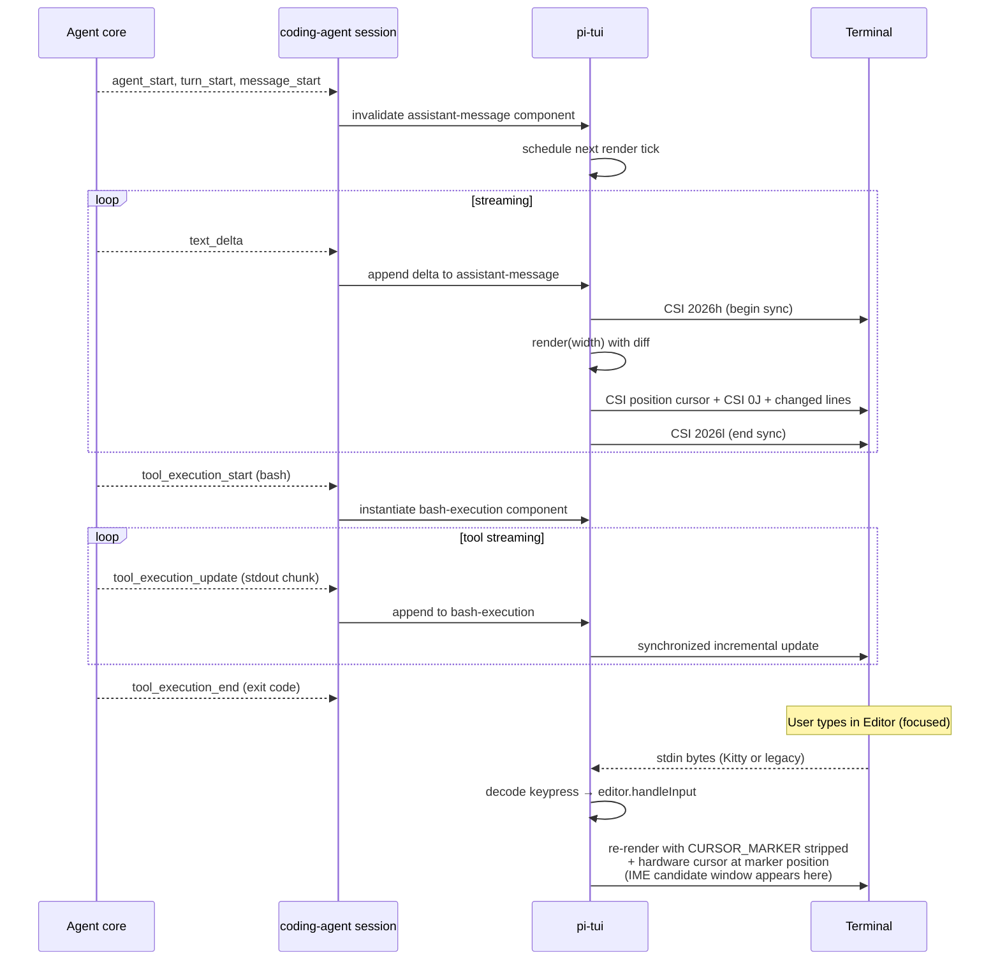

# Output Formatting
> Module: 08_user_interaction | Status: Phase 7 | Last Agent: Phase 7 Specialist Synthesis

## 1. Overview
Output formatting describes how the agent renders its reasoning, tool execution progress, and final results to the user — and how that rendering survives the realities of terminals (limited width, redraw cost, scrollback semantics, IME positioning, atomic-update support).

[PI] is the Phase 1–6 reference for first-class terminal UI primitives. The `@earendil-works/pi-tui` package (`packages/tui/`) is a minimal, dependency-free terminal UI framework with **differential rendering** — it computes the smallest screen update needed and wraps it in **synchronized output** (CSI 2026) so updates are atomic and flicker-free. The package ships with a component model, a built-in component library (Text, Editor, SelectList, Markdown, Loader, Image, etc.), keyboard handling with **Kitty protocol** support, and IME (Input Method Editor) cursor positioning via a custom `CURSOR_MARKER` zero-width APC sequence. (Pi research §5.)

[OPENCODE] [KILO] use a different approach — terminal output is owned by the higher-level "session/UI" layer; tool results are rendered by webview components in the VS Code extension or by terminal-attached output streams in the CLI. There is no equivalent of pi-tui's component-model-with-differential-rendering primitive.

[CLAUDE] [CODEX] use streaming text deltas + ad-hoc terminal control; output is line-oriented, scrollback-friendly, and does not aim for atomic redraws.

[CLINE] [ROO] are VS Code-embedded — output formatting is HTML/React in the extension webview; terminal protocols don't apply.

[AIDER] uses Rich's print + spinner; not a structural component model.

[BABYAGI] [AUTOGPT] use line-oriented `print` / `rich.print` for thoughts, criticism, and tool results — no atomic-update semantics.

## 2. Blueprint Specification

### Component model [PI]

`packages/tui/src/tui.ts:39-62` defines the `Component` interface:

```typescript
interface Component {
  render(width: number): string[];      // Return lines (no line may exceed width)
  handleInput?(data: string): void;     // Raw terminal input
  invalidate?(): void;                  // Clear cached state
  wantsKeyRelease?: boolean;            // Kitty protocol: receive key releases
}
```

Components implement `render(width: number): string[]` returning a vector of lines. Higher-level components compose lower-level ones; the TUI runtime walks the tree and computes the diff.

### Three rendering strategies [PI]

`packages/tui/src/tui.ts` (rendering logic at lines 180-350); `packages/tui/README.md:579-587` documents:

| Strategy | When | Action |
| --- | --- | --- |
| **First render** | Initial mount | Output all lines without clearing scrollback |
| **Width changed or change above viewport** | Terminal resize, or change in lines that have already scrolled past the viewport | Clear screen (`CSI 2J`) and re-render all |
| **Normal update** | Subsequent updates within current viewport | Move cursor to first changed line, clear to end of screen, render changed lines |

All updates are wrapped in **synchronized output** (`CSI 2026h` … `CSI 2026l`) for atomic, flicker-free rendering. Most TUIs don't use this; pi-tui ensures every screen update is atomic.

### Synchronized output (CSI 2026) [PI]

```
\x1b[?2026h    // Begin synchronized update
[render lines]
\x1b[?2026l    // End synchronized update
```

`packages/tui/src/tui.ts:270-330` (synchronized write logic). Supported by modern terminals (iTerm2, WezTerm, Kitty, Windows Terminal, Alacritty); unsupported terminals fall back to non-atomic updates.

### Built-in component library [PI]

| Category | Components |
| --- | --- |
| **Text** | `Text` (multi-line word-wrap with padding), `TruncatedText` (single-line ellipsis), `Markdown` (with syntax highlighting) |
| **Input** | `Input` (single-line, Ctrl+A/E/U/K, IME), `Editor` (multi-line with autocomplete, slash commands, large-paste handling) |
| **List** | `SelectList` (interactive selection with keyboard nav), `SettingsList` (cycling + submenus) |
| **Layout** | `Container` (group), `Box` (padding + bg color), `Spacer` (empty lines) |
| **Specialized** | `Loader` / `CancellableLoader` (animated spinner), `Image` (Kitty or iTerm2 protocol; falls back to text) |

### IME support via `Focusable` and `CURSOR_MARKER` [PI]

For input components to work correctly with Input Method Editors (CJK languages), they implement `Focusable`:

```typescript
interface Focusable { focused: boolean }
```

When `focused = true`, the component emits `CURSOR_MARKER` (a zero-width APC sequence) at the cursor position:

```typescript
export const CURSOR_MARKER = "\x1b_pi:c\x07";
```

The TUI scans rendered output for this marker, strips it, and positions the **hardware terminal cursor** there via `CSI <row>;<col>H`. This enables IME candidate windows to appear at the correct location.

```typescript
render(width: number): string[] {
  const marker = this.focused ? CURSOR_MARKER : "";
  const before = this.value.substring(0, this.cursorPos);
  const at = this.value[this.cursorPos] || " ";
  const after = this.value.substring(this.cursorPos + 1);
  return [before + marker + "\x1b[7m" + at + "\x1b[27m" + after];
}
```

### Kitty protocol [PI]

`Component.wantsKeyRelease?: boolean` opts a component into receiving key-release events when the terminal supports the Kitty keyboard protocol. The TUI sends `CSI > 1 u` to enable the protocol and `CSI < u` to restore on exit. This enables key-release awareness for, e.g., shift-held selection. Falls back gracefully on terminals without Kitty protocol support.

### Message stream display (coding-agent integration) [PI]

`packages/coding-agent/src/modes/interactive/components/`:

| Event | Component | Behavior |
| --- | --- | --- |
| `message_start` / `message_end` (user) | `custom-message` | Display in message list with "You" label |
| `message_start`, `message_update` with `text_delta` (assistant) | `assistant-message` | Render markdown live, append text chunks |
| `tool_execution_start`, `tool_execution_update`, `tool_execution_end` | `bash-execution` (or per-tool component) | Show command, accumulated output, exit code |
| Tool result `message_start` / `message_end` | Custom renderers in `core/export-html/tool-renderer.ts` | Format file content, bash output, etc. with code highlighting and truncation |

### Coding-agent operating modes [PI]

The same agent core supports three output formats:

| Mode | Purpose | Output |
| --- | --- | --- |
| **Interactive** | Default CLI | Real-time streaming TUI via `pi-tui` |
| **Print** | CI / scripting | Batch processing — final result(s) printed; no TUI |
| **RPC** | Headless | JSON API — events streamed as JSON over stdio |

## 3. Logic Flow

1. The TUI is initialized with a root component tree.
2. On each render tick (event-driven, not timer-based), the TUI:
   - Decides between First / Width-Changed / Normal update strategies.
   - Begins synchronized output: writes `CSI 2026h`.
   - Walks the component tree calling `render(width)`.
   - Diffs against previous lines.
   - If Normal update: moves cursor to first changed line (`CSI <row>;<col>H`), clears to end (`CSI 0J`), writes changed lines.
   - If First / Width-Changed: clears screen (`CSI 2J` for width-changed) and writes all.
   - Scans for `CURSOR_MARKER`, strips it, records cursor position.
   - If a focused component emitted `CURSOR_MARKER`: positions hardware cursor (`CSI <row>;<col>H`).
   - Ends synchronized output: writes `CSI 2026l`.
3. Keyboard input arrives via stdin; terminal-protocol handler decodes (Kitty if enabled) and routes to focused component's `handleInput(data)`.
4. Focused component mutates its state, calls `invalidate()` to mark dirty, triggers re-render.

In coding-agent integration:
1. AgentEvent stream from the agent core feeds the TUI.
2. Each event type is mapped to component update via `assistant-message`, `bash-execution`, `custom-message` etc.
3. Tool-execution events update the bash-execution component live (streamed `tool_execution_update` deltas accumulate output).
4. Tool result `message_start`/`message_end` events are rendered through custom renderers.

## 4. Flowchart
```mermaid
flowchart TD
    Trigger[Render trigger:<br/>state change, key, agent event] --> Strategy{First / WidthChange / Normal?}
    Strategy -- First --> Sync1[Begin CSI 2026 synchronized output]
    Strategy -- WidthChange --> Sync2[CSI 2J clear screen]
    Strategy -- Normal --> Sync3[Begin CSI 2026]
    Sync1 --> Walk
    Sync2 --> Walk
    Sync3 --> Walk[Walk component tree:<br/>component.render(width) → string[]]
    Walk --> Diff{Normal update?}
    Diff -- yes --> Move[CSI move cursor to first<br/>changed line]
    Move --> Clear[CSI 0J clear to end]
    Clear --> WriteLines[Write changed lines only]
    Diff -- no --> WriteAll[Write all lines]
    WriteLines --> ScanMarker[Scan output for CURSOR_MARKER<br/>strip and record position]
    WriteAll --> ScanMarker
    ScanMarker --> Focused{Focused component<br/>emitted marker?}
    Focused -- yes --> PosHW[CSI position hardware cursor<br/>for IME candidate window]
    Focused -- no --> End
    PosHW --> End[End CSI 2026 synchronized output]
```

## 5. Sequence Diagram


## 6. Variations & Trade-offs

| Pattern | Benefit | Trade-off |
| --- | --- | --- |
| **Differential rendering** [PI] | Only changed lines are written; large outputs (long tool results, markdown blocks) update efficiently. Three strategies (first / width-change / normal) handle the realistic edge cases. | Diff bookkeeping per render tick; bug in line-equality check can cause cursor drift or stale display. |
| **CSI 2026 synchronized output** [PI] | Atomic, flicker-free updates — most TUIs don't use this. iTerm2, WezTerm, Kitty, Windows Terminal, Alacritty all support it. | Unsupported terminals (older xterm, plain `tty`) fall back to non-atomic updates and can flicker. |
| **`CURSOR_MARKER` zero-width APC for IME** [PI] | IME candidate windows appear at the actual cursor position even though the rendered string is decoupled from the hardware cursor. Custom marker (`\x1b_pi:c\x07`) is invisible to terminals that don't strip it explicitly. | Markers in user content (extremely unlikely but possible) would be stripped; the marker scan is a string operation. |
| **Kitty protocol opt-in via `wantsKeyRelease`** [PI] | Components that need key-release events (shift-held selection, vim-style modifiers) declare it explicitly; others ignore key releases. Graceful fallback on legacy terminals. | Two keyboard codepaths to maintain; key parsing complexity. |
| **Component model with `render(width): string[]`** [PI] | Pure functional — each render is a fresh computation. Easy to test, easy to compose. | Recomputes everything per tick; no React-style memoization out of the box (components must implement their own caching via `invalidate()`). |
| **Three operating modes** [PI] | Same agent core powers interactive TUI, batch print mode for CI, and headless RPC mode — embedders pick the surface that matches their use case. | Three mode codepaths to maintain. |
| **Component-renders-strings vs. webview HTML** ([PI] vs [CLINE] [ROO]) | Pi's TUI is dependency-free and terminal-native; Cline/Roo's webview is HTML/React in the VS Code extension. Each fits its environment. | Pi's TUI cannot show rich HTML / interactive components; Cline/Roo cannot run in pure terminal. |

## 7. Agent Attribution Table

| Agent | Source-backed contribution |
| --- | --- |
| [PI] | `pi-tui` (`packages/tui/`) terminal UI primitives: `Component { render(width): string[], handleInput?, invalidate?, wantsKeyRelease? }` interface (`packages/tui/src/tui.ts:39-62`); **differential rendering** with three strategies (first render outputs without clearing scrollback; width-change or out-of-viewport change clears `CSI 2J` and re-renders all; normal update moves cursor to first changed line, clears to end of screen, writes changed lines only — `tui.ts:180-350`); **synchronized output via `CSI 2026h` … `CSI 2026l`** wrapping every update for atomic, flicker-free rendering (`tui.ts:270-330`); built-in component library (`Text`, `TruncatedText`, `Markdown`, `Input`, `Editor` with autocomplete + slash commands + large-paste handling, `SelectList`, `SettingsList`, `Container`, `Box`, `Spacer`, `Loader`/`CancellableLoader`, `Image` with Kitty/iTerm2 protocol fallback to text); **IME support via `Focusable` interface and `CURSOR_MARKER = "\x1b_pi:c\x07"`** zero-width APC sequence — TUI scans rendered output for the marker, strips it, and positions the hardware terminal cursor there so IME candidate windows appear at the correct location; **Kitty keyboard protocol** with `wantsKeyRelease?: boolean` opt-in for key-release events and graceful fallback on legacy terminals; coding-agent integration via `assistant-message`, `bash-execution`, `custom-message` components subscribing to `AgentEvent` stream (`packages/coding-agent/src/modes/interactive/components/`); **three operating modes** — interactive TUI, batch print for CI/scripting, headless RPC JSON API. |

> Cross-links: [OPENCODE] / [KILO] terminal output is owned by the session/UI layer rather than a TUI primitive — see `06_orchestration/task_lifecycle.md` and `01_core_loop/agentic_loop.md`. [CLINE] / [ROO] webview rendering is HTML/React in the VS Code extension — see `agentic_loop.md`. [AUTOGPT] uses line-oriented `rich.print` for thoughts, criticism, and tool results; not a structural component model.

### [ZED] GPUI Native Rendering

Zed takes a fundamentally different approach to output formatting: the agent's output is rendered directly via **GPUI** (Zed's GPU-accelerated UI framework), not via terminal protocols or web technologies. The agent panel (`crates/agent/src/agent_panel.rs`) is a native GPUI component that implements `Render`. Output includes:

- **Inline diffs** rendered directly in the editor buffer, not in a separate panel.
- **Markdown rendering** via Zed's built-in markdown parser with syntax highlighting.
- **Tool execution results** rendered as collapsible sections in the agent panel.
- **Streaming text deltas** displayed in real-time within the panel.

This is the highest-fidelity output rendering in the blueprint — GPU-accelerated, sub-frame latency, fully integrated with the editor's visual language. Trade-off: completely non-portable; output can only be rendered inside Zed.

### [OPENCLAW] Canvas Live Rendering

OpenClaw's Canvas renderer provides a **live interactive rendering surface** that adapts structured agent output to platform-specific formats:

| Platform | Rendering |
| --- | --- |
| Telegram | Markdown with inline code, escaped HTML |
| Discord | Rich embeds with code blocks |
| Slack | Block Kit with code sections |
| Email | HTML with CSS styling |
| CLI | ANSI-colored terminal output |

The Canvas maintains a persistent rendering state and supports incremental updates — as the agent streams output, the Canvas updates the platform-specific rendering in place. This is the widest output surface in the blueprint (22+ channels), trading depth of rendering (Zed's GPU fidelity) for breadth of platform support.
