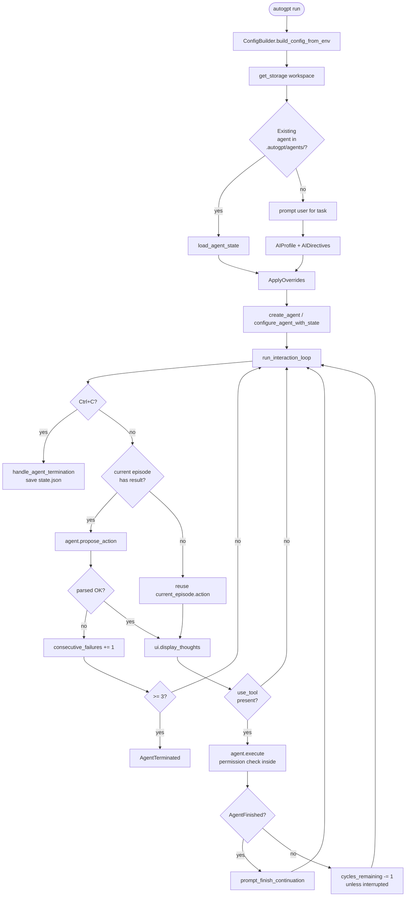
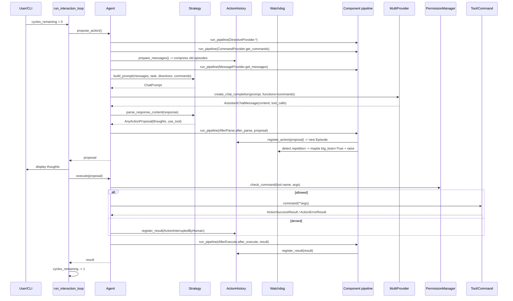

# AutoGPT Architecture Research Report

## Scope Correction & Source-of-Truth

Task 14 asks for AutoGPT's autonomous goal-seeking loop, plugin system, and long-running task management. The repository at `https://github.com/Significant-Gravitas/AutoGPT` (cloned to `./autogpt/` at HEAD `c08b9774dc90f45f0958c6c0d9e9538d094a08af`) is now a two-project monorepo:

1. `autogpt_platform/` — the *current* product: a Next.js + FastAPI + Postgres "agent platform" where users compose **Blocks** (95 of them, e.g. `claude_code.py`, `codex.py`, `agent.py`, `code_executor.py`) into directed execution graphs. This is no longer the autonomous-LLM-loop architecture the task description targets — it is closer to a workflow/automation platform with LLM steps as nodes.
2. `classic/` — explicitly marked **unsupported / for educational purposes** by `classic/CLAUDE.md`, but is the codebase that actually contains the goal-decomposition autonomous loop, the episodic memory, the plugin/component system, the multi-strategy planner, and the budget/cost machinery. It is split across three packages:
   - `classic/forge/` — the reusable framework (`BaseAgent`, components, protocols, LLM providers, file storage, agent protocol HTTP API).
   - `classic/original_autogpt/` — the AutoGPT Classic CLI agent that subclasses `forge.BaseAgent` and wires together all components.
   - `classic/direct_benchmark/` — a benchmark harness that drives the agent across different prompt strategies and models.

Therefore this report treats `classic/forge/` + `classic/original_autogpt/` as the Phase 6 baseline that the task list intends to capture, and includes a short "current platform delta" so the divergence is explicit. The "no-tools" pure 2023 BabyAGI-style `babyagi.py` skeleton found in some early forks is **not** present in this checkout — AutoGPT Classic is far more elaborate.

Local sources used:
- `classic/original_autogpt/autogpt/app/main.py` (entry, interaction loop)
- `classic/original_autogpt/autogpt/app/agent_protocol_server.py` (Agent Protocol REST mode)
- `classic/original_autogpt/autogpt/app/config.py` (`AppConfig`, `ConfigBuilder`)
- `classic/original_autogpt/autogpt/agents/agent.py` (`Agent` class, all components wired)
- `classic/original_autogpt/autogpt/agents/prompt_strategies/{one_shot,plan_execute,rewoo,reflexion,tree_of_thoughts,lats,multi_agent_debate,base}.py` (7 swappable strategies)
- `classic/original_autogpt/autogpt/agent_factory/{configurators,profile_generator}.py` (agent creation, AI-profile auto-generation)
- `classic/forge/forge/agent/{base,components,protocols,execution_context,forge_agent}.py` (framework core)
- `classic/forge/forge/components/action_history/{action_history,model}.py` (episodic memory)
- `classic/forge/forge/components/{watchdog,system,skills}/*.py` (loop detection, finish, SKILL.md plugins)
- `classic/forge/forge/command/{command,decorator,parameter}.py` (command/tool definitions)
- `classic/forge/forge/permissions.py` (5-level permission cascade)
- `classic/forge/forge/llm/providers/schema.py` + `forge/models/providers.py` (`ModelProviderBudget`, `ProviderBudget`)
- `autogpt/CLAUDE.md`, `classic/CLAUDE.md`, `classic/forge/CLAUDE.md`, `classic/original_autogpt/CLAUDE.md` (in-tree architecture notes the project has authored for coding agents)

`AGENTS.md` at the repo root is the platform contribution guide and confirms the platform / classic split.

---

## 1. Autonomous Loop

### 1.1 Two operating modes

The classic agent runs in either of two modes — both invoke the same underlying `Agent.propose_action() / Agent.execute()` pair:

| Mode | Entry | Loop driver | Cycle gating |
|---|---|---|---|
| **Interactive CLI** | `autogpt run` → `app/cli.py:run` → `app/main.py:run_auto_gpt` → `run_interaction_loop(agent)` | A `while cycles_remaining > 0` loop in `run_interaction_loop` | The new permission manager handles per-command approval. The cycle budget is now only used for SIGINT-triggered graceful shutdown (`_get_cycle_budget` returns `continuous_limit or math.inf`). |
| **Agent Protocol HTTP server** | `autogpt serve` → `app/main.py:run_auto_gpt_server` → Hypercorn + FastAPI on `localhost:8000` | One `propose_action / execute` cycle per `POST /ap/v1/agent/tasks/{id}/steps` | External — each `execute_step` call from the client runs exactly one cycle of the loop, persisting state to `state.json` between calls. |

The CLI mode is the canonical "autonomous loop". The Agent Protocol mode reuses the same code by calling `agent.propose_action()` and `agent.execute(last_proposal)` on each `execute_step` request, persisting state to disk between requests so a long task can survive restarts.

### 1.2 Single-cycle anatomy (`Agent.propose_action`)

Source: `classic/original_autogpt/autogpt/agents/agent.py:266-339`. Every cycle is a pipeline-driven prompt build → LLM call → parse:

1. `self.reset_trace()` — clear the per-cycle execution trace (used for debug logs).
2. **Collect directives** by running three pipelines through every component implementing `DirectiveProvider`:
   - `run_pipeline(DirectiveProvider.get_resources)`
   - `run_pipeline(DirectiveProvider.get_constraints)`
   - `run_pipeline(DirectiveProvider.get_best_practices)`
3. The lists are merged into the agent's per-task `directives = self.state.directives.model_copy(deep=True)` so component-supplied directives don't permanently mutate state.
4. **Collect commands**: `self.commands = await self.run_pipeline(CommandProvider.get_commands)`, then `_remove_disabled_commands()` filters the `app_config.disabled_commands` list.
5. **Lazy compress history**: unless the strategy is ReWOO in `EXECUTING` phase (which uses the cached plan), call `self.history.prepare_messages()` which triggers `EpisodicActionHistory.handle_compression(...)` to summarize older episodes via the `fast_llm` (default `gpt-3.5-turbo` / `gpt-4o-mini`) so the prompt fits under `send_token_limit`.
6. **Collect messages**: `messages = await self.run_pipeline(MessageProvider.get_messages)`. The list now includes `SystemComponent`'s clock, `ActionHistoryComponent`'s "Progress on your Task so far" summary plus the last 4 episodes verbatim, `ContextComponent`'s in-context files, and any pending user feedback.
7. **Build prompt** via `self.prompt_strategy.build_prompt(...)` (one of the 7 swappable strategies in §2). Strategy may raise `UseCachedActionException` (ReWOO `EXECUTING` phase) to skip the LLM call entirely and replay a pre-planned step.
8. **Call LLM**: `complete_and_parse(prompt)` calls `MultiProvider.create_chat_completion`. Optional `thinking_budget_tokens` (Anthropic) or `reasoning_effort` (OpenAI o-series / GPT-5) kwargs are passed through from `app_config`.
9. The strategy's `parse_response_content(response)` extracts:
   - `thoughts` — a structured object whose shape depends on strategy (always derives from `ModelWithSummary`)
   - `use_tool: AssistantFunctionCall` — the next action, taken from native OpenAI/Anthropic `tool_calls` (forge always uses native function calling, not the legacy text-JSON tool format)
   - `use_tools: list[AssistantFunctionCall]` if the model returned multiple tool calls (parallel execution path)
10. **Run `AfterParse` pipeline**: every component implementing `AfterParse[AnyProposal]` gets to inspect the proposal. Two key subscribers:
    - `ActionHistoryComponent.after_parse` — calls `event_history.register_action(proposal)`, creating a new `Episode(action=proposal, result=None)` and incrementing the cursor.
    - `WatchdogComponent.after_parse` — loop detection (see §1.4).
11. `self.config.cycle_count += 1`; return the proposal.

### 1.3 Single-cycle anatomy (`Agent.execute`)

Source: `agents/agent.py:373-460`.

1. `tools = proposal.get_tools()` — returns `[use_tool]` for single-tool calls or the full list when the strategy emitted parallel calls.
2. **Refresh commands** via `run_pipeline(CommandProvider.get_commands)` (some commands are state-dependent, e.g. `unload_skill` only appears once a skill is loaded).
3. **Permission check** for every tool: `permission_manager.check_command(tool.name, tool.arguments)`.
   - On **deny** the agent calls `do_not_execute(proposal, feedback)` which registers an `ActionInterruptedByHuman(feedback=...)` result on the current episode and appends the feedback to `pending_user_feedback` so the agent sees it next cycle.
   - On **allow with feedback** the feedback is stashed in `feedback_to_append` to be appended *after* a successful execution.
4. **Single-tool path** (`len(tools) == 1`): `_execute_tool(tool)` looks up the `Command` by name (`_get_command` walks `self.commands` in reverse so later-added commands shadow earlier ones), invokes `command(**tool_call.arguments)`, awaits if coroutine, and wraps the return value in `ActionSuccessResult(outputs=...)`. Exceptions become `ActionErrorResult.from_exception(e)`.
5. **Multi-tool path** (`len(tools) > 1`): `_execute_tools_parallel` runs every tool in `asyncio.gather(...)` returning a combined `ActionSuccessResult` whose `outputs` is `{tool_name: result}` plus an `_errors` list for partial failures.
6. **Output-size guard**: if the result's token count exceeds `send_token_limit // 3`, the result is replaced by `ActionErrorResult(reason="Command(s) returned too much output. Do not execute these commands again with the same arguments.")` — this prevents one giant tool result from blowing up the prompt next cycle.
7. **ReWOO bookkeeping**: if the strategy exposes `record_execution_result`, the result string is recorded against the planned step's `variable_name` (`#E1`, `#E2`, …) for later substitution.
8. **Run `AfterExecute` pipeline**: every component implementing `AfterExecute` sees the result. The key subscriber is `ActionHistoryComponent.after_execute` → `event_history.register_result(result)` which writes the result onto the current `Episode` and advances the cursor to `len(episodes)`.
9. If `feedback_to_append` is set, push it to `event_history.pending_user_feedback` so it surfaces in the next prompt as a `[USER FEEDBACK]` user message.
10. Return the `ActionResult`.

### 1.4 Outer loop (`run_interaction_loop`)

Source: `app/main.py:607-787`.

```text
cycle_budget = continuous_limit or math.inf       # default ∞ in continuous mode
consecutive_failures = 0

while cycles_remaining > 0:
    handle_stop_signal()                          # Ctrl+C cooperative cancel

    # --- PLAN PHASE -----------------------------------------------------
    if no current episode OR current episode already has a result:
        with spinner("Thinking..."):
            try:
                action_proposal = await agent.propose_action()
            except InvalidAgentResponseError:
                consecutive_failures += 1
                if consecutive_failures >= 3:
                    raise AgentTerminated(...)    # 3 unparseable responses = die
                continue
    else:
        action_proposal = current_episode.action  # resume from persisted partial cycle

    consecutive_failures = 0

    # --- DISPLAY PHASE --------------------------------------------------
    await ui_provider.display_thoughts(...)        # rich panel with ai_name, thoughts

    if not action_proposal.use_tool:
        continue                                   # no command emitted; re-prompt

    # --- EXECUTE PHASE --------------------------------------------------
    try:
        result = await agent.execute(action_proposal)   # permission check is INSIDE
    except AgentFinished as e:
        # finish() command raised this — see §7
        if noninteractive_mode:
            return                                # benchmark / server: exit
        next_task = await prompt_finish_continuation(...)
        if not next_task: return
        agent.state.task = next_task
        agent.event_history.episodes.clear()      # fresh context, same workspace
        cycles_remaining = _get_cycle_budget(...)
        continue

    if result.status != "interrupted_by_human":
        cycles_remaining -= 1                     # human interrupt doesn't count
    display result / error
```

This is the AutoGPT think → plan → execute → observe → repeat cycle. Crucially, observation is *implicit*: the result of `execute` is appended to `event_history`, and the next call to `propose_action` builds a prompt that includes those results via `ActionHistoryComponent.get_messages`. There is no separate "observe" step — the architecture just lets the next cycle's prompt assembly read the previous result.

### 1.5 Built-in safety / liveness mechanisms

Three mechanisms guard the autonomous loop:

| Mechanism | Where | Trigger | Effect |
|---|---|---|---|
| **`consecutive_failures`** | `app/main.py:692-702` | 3 `InvalidAgentResponseError`s in a row | Raises `AgentTerminated` → outer `run_auto_gpt` calls `handle_agent_termination` to save state. |
| **`WatchdogComponent`** | `forge/components/watchdog/watchdog.py` | Same `(use_tool.name, use_tool.arguments)` repeated, OR no tool emitted, AND agent is currently on `fast_llm` | `event_history.rewind()`, flips `config.big_brain = True` (forces `smart_llm` next cycle), and raises `ComponentSystemError` to retry the whole pipeline. After the next successful cycle, `revert_big_brain` flips it back. |
| **SIGINT** | `app/main.py:642-663` | `Ctrl+C` once → set `cycles_remaining = 1` (graceful stop after current step). Twice → `sys.exit()`. | First press just ends continuous mode; second press is a hard kill. |

The watchdog implements the only "automatic" model-routing in the codebase: it reactively escalates from fast→smart when it detects the agent looping, then reverts.

### 1.6 Mermaid: outer loop



### 1.7 Mermaid: single-cycle sequence



---

## 2. Goal Decomposition & Planning Strategies

AutoGPT Classic ships **seven swappable prompt strategies** (declared as the `PromptStrategyName` `Literal` in `app/config.py`, selected via the `PROMPT_STRATEGY` env var). The strategy is built once in `Agent._create_prompt_strategy` and held on the agent for the life of the task. Multi-step strategies have a `current_phase` enum that is mutated inside `parse_response_content`, so a single agent loop drives planning, execution, replanning, etc.

| Strategy | File | Phases | Models used | Key data structures | Key claim |
|---|---|---|---|---|---|
| `one_shot` | `one_shot.py` | none (single phase) | `fast_llm` | `AssistantThoughts {observations, reasoning, self_criticism, plan: list[str]}` | Default; baseline ReAct-style think + act per cycle. |
| `plan_execute` | `plan_execute.py` | `VARIABLE_EXTRACTION` (PS+ opt-in) → `PLANNING` → `EXECUTING` → `REPLANNING` | smart for plan/replan; fast for execute | `ExecutionPlan(goal, steps: list[PlannedStep], current_step_index, completed_steps, failed_attempts)` | "Plan-and-Act" + "Plan-and-Solve" + "Routine" — separates planning from execution; replans on failure. |
| `rewoo` | `rewoo.py` | `PLANNING` → `EXECUTING` → `SYNTHESIZING` | smart for plan/synthesize; fast for execute | `ReWOOPlan(steps, execution_results, worker_executions)` with `#E1, #E2,…` placeholder variables | "ReWOO" paper, claims 5x token efficiency vs ReAct. Whole plan is generated upfront, then `EXECUTING` phase replays cached `AssistantFunctionCall`s **without** further LLM calls (raises `UseCachedActionException`). |
| `reflexion` | `reflexion.py` | `PROPOSING` ↔ `REFLECTING` | smart for reflect; fast for propose | `Reflection {action_name, action_arguments, result_summary, what_went_wrong, what_to_do_differently, success, evaluation_score, verbal_reflection}`, `ReflexionMemory(reflections, max_reflections=20)` | "Reflexion" + "Self-Refine" — verbal reinforcement learning, pluggable evaluator (heuristic regex or LLM). |
| `tree_of_thoughts` | `tree_of_thoughts.py` | branching tree of `Thought` nodes with `categorical_evaluation: sure/maybe/impossible` | smart | `Thought {content, score, depth, children, parent, action, evaluation_votes}` | "Tree of Thoughts" paper: BFS/DFS over thoughts with self-evaluation. |
| `lats` | `lats.py` | `SELECTION` → `EXPANSION` → `EVALUATION` → `BACKPROPAGATION` → `EXECUTION` | smart for selection/evaluation | `LATSNode {value, visits, children, parent, depth, reward, reflection}` with UCT score `(value/visits) + c*sqrt(ln(parent.visits)/visits)` | "Language Agent Tree Search" — MCTS over reasoning paths, *uses sub-agents* for parallel expansion. |
| `multi_agent_debate` | `multi_agent_debate.py` | `PROPOSAL` → `CRITIQUE` → `REVISION` → `CONSENSUS` → `EXECUTION` | smart for consensus | `DebateState {proposals, critiques, revision_count, winning_proposal}` (`num_debaters=3`, `num_rounds=2`) | "Improving Factuality and Reasoning... through Multiagent Debate" — multiple sub-agents debate, then either vote or synthesize. |

All multi-step strategies inherit from `BaseMultiStepPromptStrategy` (`prompt_strategies/base.py:275`), which gives them sub-agent spawning capabilities (see §6).

### 2.1 The `one_shot` baseline

The default. Source: `prompt_strategies/one_shot.py:106-329`.

System prompt structure (`build_system_prompt` lines 161-202):

```
You are <ai_name>, <ai_role>.
Make decisions independently. Only use ask_user when you truly need clarification...

The OS you are running on is: <platform>            # if include_os_info

## Constraints
<numbered list from DirectiveProvider.get_constraints>

## Resources
<numbered list from DirectiveProvider.get_resources>

## Commands
These are the ONLY commands you can use...
<numbered list of commands with name + signature>

## Best practices
<numbered list from DirectiveProvider.get_best_practices>

## Efficiency Guidelines
You have LIMITED steps. Be efficient:
1. UNDERSTAND BEFORE ACTING: ...
2. PARALLEL EXECUTION: When multiple operations don't depend on each other, execute them simultaneously...
3. WRITE COMPLETE CODE: ...
4. VERIFY AFTER CHANGES: ...
5. FIX ROOT CAUSE: ...
6. CODE STYLE: ...
7. SECURITY: Never expose, log, or commit secrets...

## Your Task
The user will specify a task for you to execute, in triple quotes, in the next message...

## RESPONSE FORMAT
YOU MUST ALWAYS RESPOND WITH A JSON OBJECT OF THE FOLLOWING TYPE:
interface AssistantResponse {
  thoughts: { observations: string; reasoning: string; self_criticism: string; plan: string[] };
}

YOU MUST ALSO INVOKE A TOOL!
```

Followed by:

```
[user] """<task>"""
[user/assistant pairs from ActionHistoryComponent.get_messages]
[user] Determine exactly one command to use next... PARALLEL EXECUTION: When multiple operations don't depend on each other, you may call multiple independent commands simultaneously.
```

The `prefill_response` is `{\n    "thoughts":` — used as an OpenAI/non-Anthropic prefill to coax the JSON schema. Anthropic models can't combine functions API + prefill, so `use_prefill` is forced `False` when `provider_name == "anthropic"`.

The strategy claims `LanguageModelClassification.FAST_MODEL` (a TODO marks "FIXME: dynamic switching"), so `Agent.llm` resolves to `fast_llm` unless `WatchdogComponent` flipped `big_brain`.

Parsing (`parse_response_content` 273-328):
1. If `response.content` is empty but `tool_calls` are present (GPT-5 path), use a default thoughts dict.
2. Otherwise call `extract_dict_from_json(response.content)`.
3. Always require at least one `tool_call`. The first tool call's `function` becomes `use_tool`. If multiple tool calls were emitted, they are stored in `use_tools` for parallel execution by `Agent._execute_tools_parallel`.
4. Validate against `OneShotAgentActionProposal` Pydantic model. Attach the raw `AssistantChatMessage` for later replay in history.

### 2.2 `plan_execute` — explicit decomposition

Initial planner instruction (`PlanExecutePromptConfiguration.DEFAULT_PLANNER_INSTRUCTION`):

```
You need to create a step-by-step plan to accomplish the given task.

For each step:
1. Describe what needs to be done
2. Specify which command/tool will be used
3. Note any dependencies on previous steps

Format your plan as a numbered list:
1. [Description] - Command: [command_name]
2. [Description] - Command: [command_name]
...

After the plan, provide your response in the required JSON format
and invoke the command for the FIRST step only.
```

Plan extraction is regex-based (`_extract_plan_from_response` lines 727-774):
- Primary regex: `^(\d+)\.\s+(.+?)(?:\s*[-–—]\s*(?:Command|Tool|Action):\s*(\w+))?(?=\n\d+\.|\n*$)`
- Fallback: a simpler `^\s*(\d+)\.\s+(.+)$` if the structured regex finds nothing.

Each match becomes a `PlannedStep(thought, tool_name, tool_arguments={}, status="pending")`. The plan is stored on the strategy as `self.current_plan`. When `EXECUTING`, the prompt switches to `executor_instruction` which interpolates `{step_num}`, `{progress}` (from `ExecutionPlan.get_progress_summary()`), and `{current_step}`.

Replan trigger (`record_step_failure`): if `mark_step_failed` returns `True` (after `failed_attempts >= max_retries`, default 3) **and** `enable_replanning` and `replan_count < max_replan_attempts` (default 3), `current_phase` flips to `REPLANNING`. The replan prompt re-includes the original goal, completed-step summaries, the failed step, and the error.

PS+ extension (Plan-and-Solve Plus, `arxiv.org/abs/2305.04091`): an optional `VARIABLE_EXTRACTION` phase pre-extracts `ExtractedVariable` and `CalculationStep` records before planning, formatted into the system prompt as a `## Problem Context (PS+)` section.

### 2.3 `rewoo` — plan-once / execute-without-LLM

The most token-efficient multi-step strategy. The planner instruction asks for steps in the exact form:

```
Plan: <reasoning>
#E1 = tool_name(arg1="value1", arg2="value2")

Plan: <reasoning>
#E2 = tool_name(arg1="value1", arg2=#E1)
```

Critical behavior:
- Planner phase parses the entire plan (including dependency graph via `depends_on`) into `ReWOOPlan.steps`.
- `EXECUTING` phase: `Agent.propose_action` calls `prompt_strategy.build_prompt`, which raises `UseCachedActionException(action_proposal=<replayed step>)`. `Agent.propose_action` catches the exception (string-name comparison, not import, to avoid cycles), runs `AfterParse.after_parse` to register the action in history, and returns *without* an LLM call. This is where the "5x token efficiency" claim comes from.
- After execution, `Agent.execute` calls `record_execution_result(variable_name, result_str, error)` on the strategy, which `substitute_variables` will use when serializing later steps.
- `SYNTHESIZING` phase prompts the model to call `finish` with the final answer, given the plan and all collected results.
- Compression in `ActionHistoryComponent` is disabled when the strategy is ReWOO `EXECUTING` (`Agent.propose_action` lines 290-298) since prompt-building is skipped.

### 2.4 `reflexion` — verbal reinforcement learning

Two key types from `prompt_strategies/base.py:83-163`:

```python
class Reflection:
    action_name: str
    action_arguments: dict
    result_summary: str
    what_went_wrong: str             # structured format
    what_to_do_differently: str
    success: bool
    timestamp: datetime
    verbal_reflection: str           # verbal format (paper-style free-form)
    reflection_format: "structured" | "verbal"
    evaluation_score: float | None   # from Evaluator

class ReflexionMemory:
    reflections: list[Reflection]    # max 20, FIFO trimmed
    def get_relevant_reflections(action_name=None, limit=5)
    def get_failed_reflections(limit=5)
```

Loop:

1. **PROPOSING phase**: prompt includes a `## Lessons from Past Attempts` section (top-N relevant reflections, formatted via `Reflection.to_prompt_text()`).
2. **Action recorded**: parser calls `record_action(action_name, action_arguments)` after parsing the proposal.
3. **After execution**, `_process_latest_result_from_messages` (called at the *start* of next `build_prompt`) sniffs `messages` for `ToolResultMessage` and calls `record_result(content, success=not is_error)`.
4. `record_result` runs the **Evaluator** (`evaluator_type=HEURISTIC` by default — regex-pattern match on `error|failed|exception|traceback|invalid|...` vs `success|completed|done|...`, returns `EvaluationResult(success, score, feedback)`. `EvaluatorType.LLM` is declared but currently falls back to heuristic (`if self.config.evaluator_type == EvaluatorType.HEURISTIC: ... else: # would need LLM call ... fall back to heuristic`).
5. If `always_reflect or not success`, `current_phase = REFLECTING`.
6. Next cycle, `build_prompt` builds either a structured-JSON reflection prompt or a free-form verbal one (chosen by `_get_reflection_format`: explicit config, or `auto` = verbal when an evaluation is present).
7. `parse_response_content` in `REFLECTING` phase calls `_process_reflection`, which constructs a `Reflection` object and stores it in `self.memory`. Returns `current_phase` to `PROPOSING`.
8. Retry counter (`max_retry_attempts=3`) bumps when the reflection's `should_retry=True` so the strategy doesn't loop forever on the same failure.

### 2.5 `tree_of_thoughts`, `lats`, `multi_agent_debate` — sub-agent enabled

These three strategies depend on the **sub-agent infrastructure** (`forge/agent/execution_context.py` + `BaseMultiStepPromptStrategy.spawn_sub_agent` etc., see §6). They are too long to quote in full, but the pattern is shared:

- The strategy keeps a search structure (`Thought` tree, `LATSNode` MCTS tree, `DebateState`) on its own object.
- During the expansion / proposal / candidate phase, it calls `await self.spawn_and_run(task=<sub-question>, max_cycles=...)` for each candidate. Each sub-agent runs a fresh propose/execute loop with a write-restricted `FileStorage` (sibling agents can read parent workspace but only write to `.sub_agents/{agent_id}/`) and a reduced budget (`max_depth -= 1`).
- Results from sub-agents update the search structure (`Thought.score`, `LATSNode.value/visits`, `AgentProposal.confidence`).
- Eventually a single best `AssistantFunctionCall` is selected and passed back as the cycle's `proposal`.

This is one of two distinct sub-agent patterns in the codebase (the other being the runtime fork in §6).

### 2.6 Mermaid: ReWOO flow

```mermaid
flowchart TD
    Start([Task]) --> Plan[PLANNING phase<br/>smart_llm builds full plan<br/>#E1, #E2, #E3...]
    Plan --> Parse[Parse #En = tool_name(args)<br/>regex extract dependency graph]
    Parse --> Step[EXECUTING phase<br/>get next executable step]
    Step --> Cached{cached action<br/>in plan?}
    Cached -- yes --> Replay[Strategy raises<br/>UseCachedActionException<br/>NO LLM CALL]
    Replay --> Exec[Agent.execute<br/>register result for #En]
    Cached -- no --> LLM[fast_llm chooses next tool<br/>only happens if plan exhausted]
    LLM --> Exec
    Exec --> Substitute[substitute_variables in next step]
    Substitute --> More{more steps?}
    More -- yes --> Step
    More -- no --> Synth[SYNTHESIZING phase<br/>smart_llm reads plan + all results<br/>call finish with answer]
```

---

## 3. Plugin / Extensibility System

The classic AutoGPT codebase has had three different "plugin" eras, two of which are still present in this checkout:

### 3.1 Component system (current primary extension surface)

`forge/agent/components.py` + `forge/agent/protocols.py`. This is the canonical way to extend AutoGPT Classic in 2024–2025.

Two base classes:

```python
class AgentComponent(ABC):
    _run_after: list[type[AgentComponent]] = []   # topological sort key
    _enabled: bool | Callable[[], bool] = True
    _disabled_reason: str = ""

    def run_after(self, *components) -> Self      # fluent ordering API
    @property
    def enabled(self) -> bool

class ConfigurableComponent(ABC, Generic[BM]):    # mix-in for env-driven config
    config_class: ClassVar[type[BM]]              # required Pydantic model
    @property
    def config(self) -> BM                        # auto-loads from env
```

Components implement one or more **protocols** from `forge/agent/protocols.py`:

| Protocol | Method | Used for |
|---|---|---|
| `DirectiveProvider` | `get_constraints()` / `get_resources()` / `get_best_practices()` returning `Iterator[str]` | Inject text into system prompt sections. |
| `CommandProvider` | `get_commands() -> Iterator[Command]` | Register tools the LLM can call. |
| `MessageProvider` | `get_messages() -> Iterator[ChatMessage]` | Inject user/system messages into the prompt (history, clock, file context). |
| `AfterParse[AnyProposal]` | `after_parse(proposal)` | React to a fresh proposal (history register, watchdog detect). |
| `AfterExecute` | `after_execute(result)` | React to an executed action's result (history register). |
| `ExecutionFailure` | `execution_failure(error)` | Recover from pipeline-level failures. |

#### Discovery & ordering

`AgentMeta.__call__` (the metaclass on `BaseAgent`) intercepts instance creation: `BaseAgent.__init__` finishes, then the metaclass calls `instance._collect_components()`. `_collect_components` enumerates every attribute on `self` that `isinstance(getattr(self, attr), AgentComponent)`, then calls `_topological_sort` to order them by `_run_after`.

In the wired-up `Agent` (`autogpt/agents/agent.py:166-228`), 18 components are attached in `__init__`:

```
SystemComponent
ActionHistoryComponent.run_after(WatchdogComponent).run_after(SystemComponent)
UserInteractionComponent (only when not noninteractive_mode)
FileManagerComponent
CodeExecutorComponent (Docker container per agent)
GitOperationsComponent
ImageGeneratorComponent
WebSearchComponent
WebPlaywrightComponent
ContextComponent
TodoComponent
ArchiveHandlerComponent
ClipboardComponent
DataProcessorComponent
HTTPClientComponent
MathUtilsComponent
TextUtilsComponent
WatchdogComponent.run_after(ContextComponent)
PlatformBlocksComponent (only enabled when PLATFORM_API_KEY is set)
SkillComponent (SKILL.md plugin, see §3.3)
```

#### Pipeline retry semantics (`base.py:177-253`)

```python
async def run_pipeline(protocol_method, *args, retry_limit=3) -> list:
    while pipeline_attempts < retry_limit:
        try:
            for component in self.components:
                if not isinstance(component, protocol_class): continue
                if not component.enabled: continue
                while component_attempts < retry_limit:
                    try:
                        result = method(*args)
                        method_result.extend(result if not None)
                        break
                    except ComponentEndpointError:
                        component_attempts += 1   # retry same component
                break
        except EndpointPipelineError:
            args = self._selective_copy(original_args)   # reset args
            pipeline_attempts += 1                       # restart pipeline
            continue
        except Exception:
            raise
```

Three exception levels:
- `ComponentEndpointError` — retry just that component (3x).
- `EndpointPipelineError` — restart whole pipeline (3x), with original args restored.
- `ComponentSystemError` — propagates through the pipeline; `WatchdogComponent` raises this to force a fresh prompt build.

#### Command decorator

`forge/command/decorator.py` + `forge/command/command.py`. Methods on a `CommandProvider` are decorated with `@command`:

```python
@command(
    names=["greet", "hello"],
    description="Greet a user",
    parameters={
        "name": JSONSchema(type=JSONSchema.Type.STRING, required=True),
        "greeting": JSONSchema(type=JSONSchema.Type.STRING, required=False),
    },
)
def greet(self, name: str, greeting: str = "Hello") -> str:
    return f"{greeting}, {name}!"
```

The decorator builds a `Command(names, description, method, parameters)` object. `Command.__get__` is a descriptor that re-binds `method` to the instance when accessed, so `self.greet` returns a fresh bound `Command` each time. `_parameters_match` validates that the decorator's declared parameters exactly match the function signature minus `self` — discrepancies raise at class-definition time. `function_specs_from_commands(...)` (in `forge/llm/providers/utils.py`) converts a `list[Command]` into the `CompletionModelFunction` JSON spec sent to the LLM.

### 3.2 Skills (`SKILL.md` Agent Skills)

A second extensibility layer added to align with Anthropic's open Agent Skills standard. Source: `forge/components/skills/`.

`SkillComponent` implements `DirectiveProvider`, `MessageProvider`, `CommandProvider`. Configuration:

```python
class SkillConfiguration(BaseModel):
    skill_directories: list[Path] = [
        Path(".autogpt/skills"),
        Path.home() / ".autogpt/skills",
    ]
    max_loaded_skills: int = 5      # cap, range 1-20
```

Progressive disclosure (3 levels):
- **L1 METADATA**: every `SKILL.md` discovered at startup is parsed for YAML frontmatter (`name`, `description`, `license`, `allowed-tools`, `author`, `version`, `tags`). Always loaded into the prompt as `## Available Skills` (~100 tokens/skill).
- **L2 FULL_CONTENT**: when the LLM calls `load_skill(skill_name)`, the body of `SKILL.md` is read (validated against `name: ^[a-z0-9-]+$`, max 64 chars; description ≤ 1024 chars) and surfaced as `## Skill: <name>\n<content>` plus a list of additional files.
- **L3 ADDITIONAL**: when the LLM calls `read_skill_file(skill_name, filename)`, sibling files (anything in the skill directory other than `SKILL.md`) are loaded on demand.

Surfaced commands: `list_skills`, `load_skill`, and once any skill is loaded, `unload_skill` and `read_skill_file`. The `unload_skill` command resets `load_level` to METADATA so the freed body comes out of the prompt.

This is qualitatively different from the component system: skills are *runtime-discoverable* and *user-contributable* without writing Python — just drop a `SKILL.md` into `.autogpt/skills/` and it appears.

### 3.3 Legacy plugin system (defunct in this checkout)

The `classic/original_autogpt/plugins/` directory exists but is empty (not even an `__init__.py`). The `autogpt.bat` and `Dockerfile.autogpt` reference an older "plugins" loader, but the active codebase no longer wires it in — `setup.py` has no plugin-deps install, and `app/main.py` no longer respects `install_plugin_deps`. Historical AutoGPT 0.4.x supported Python plugin classes via `auto_gpt_plugin_template` (PluginManager looked for classes implementing `AutoGPTPluginTemplate` lifecycle hooks). All such plugin sites have been replaced by the component / skills system above.

### 3.4 PlatformBlocksComponent — bridge to the new platform

`Agent.__init__` instantiates `self.platform_blocks = PlatformBlocksComponent()`, which is enabled only when `PLATFORM_API_KEY` is set. This is a thin component that exposes blocks from `autogpt_platform/backend/backend/blocks/` (e.g. `claude_code.py`, `codex.py`, `code_executor.py`) as `Command` objects callable from the classic agent. It is the explicit bridge between the unsupported "loop" architecture and the supported "graph" architecture.

---

## 4. Memory Backend

### 4.1 Episodic action history (the actual short-/medium-term memory)

The 2023 BabyAGI / AutoGPT design used Pinecone or local FAISS as a vector store of past task results. This checkout has **no vector store**. Instead, all "memory" is the `EpisodicActionHistory` (`forge/components/action_history/model.py` + `action_history.py`).

```python
class Episode(BaseModel, Generic[AnyProposal]):
    action: AnyProposal              # the proposal (thoughts + use_tool)
    result: ActionResult | None      # outcome (success/error/interrupted_by_human)
    summary: str | None = None       # LLM-generated 1-line compression

class EpisodicActionHistory(BaseModel, Generic[AnyProposal]):
    episodes: list[Episode]
    cursor: int = 0
    pending_user_feedback: list[str]
    _lock: asyncio.Lock              # for parallel compression
```

Lifecycle hooks (driven by the component pipeline):
- `register_action(proposal)` is called from `ActionHistoryComponent.after_parse` → appends a half-built `Episode(action=proposal, result=None)`.
- `register_result(result)` is called from `after_execute` → fills in `Episode.result`, advances `cursor` to `len(episodes)`.
- `append_user_feedback(feedback)` queues human feedback for inclusion in the next prompt.
- `rewind(n)` pops the current partial episode plus n full episodes — used by `WatchdogComponent` to force a re-think.

### 4.2 Compression strategy

`EpisodicActionHistory.handle_compression` (called via `prepare_messages` at the top of every `propose_action`):

```python
n = len(episodes)
if n <= full_message_count: return        # default 4 — nothing to compress
older = episodes[: n - full_message_count]
to_summarize = [ep for ep in older if ep.summary is None]   # idempotent

# Per-episode summary, parallelized via asyncio.gather:
summarize_text(
    ep.format(),
    instruction=("The text represents an action, the reason for its execution, "
                 "and its result. Condense the action taken and its result into "
                 "one line. Preserve any specific factual information gathered "
                 "by the action."),
    llm_provider=fast_llm,                # default gpt-3.5-turbo / gpt-4o-mini
    spacy_model="en_core_web_sm",         # spaCy chunks long episodes first
)
```

Once summarized, an episode keeps its `summary` forever (no re-summarization). Messages emitted by `ActionHistoryComponent.get_messages` then differ for old vs. recent episodes:

- **Last 4 (`full_message_count`)**: the original `assistant` message (with `tool_calls`) + a `ToolResultMessage` per tool call. This preserves API contract — both Anthropic and OpenAI require every `tool_use` / `function_call` to be followed by a matching `tool_result`. `_make_result_messages` handles the parallel-tool-call case by emitting one `ToolResultMessage` per `tool_call.id`, splitting `outputs_dict` per tool name.
- **Older episodes**: a single `## Progress on your Task so far` user message that lists `* Step <i>: <summary>` for each compressed episode, capped at `max_tokens=1024` — once the running token total exceeds the cap, older summaries are dropped.

Net effect: the prompt grows linearly in tool-call detail for the last 4 actions and logarithmically (compressed) for everything older, with a hard token cap.

### 4.3 Long-term memory: state.json

There is **no semantic / vector memory**. Long-term memory is just `state.json` written by `FileManagerComponent.save_state()`:

```
{workspace}/.autogpt/agents/AutoGPT-{agent_id}/
├── state.json          # AgentSettings (Pydantic dump, full history)
├── permissions.yaml    # agent-specific allow/deny rules
└── workspace/          # agent's sandboxed FS
```

`AgentSettings` includes `ai_profile`, `directives`, `task`, the full `EpisodicActionHistory` (with summaries already baked in), the `BaseAgentConfiguration` (incl. `cycle_count`), and `context: AgentContext` (in-prompt files). Resuming = `AgentManager.load_agent_state(agent_id)` parses the JSON back into `AgentSettings` and `_configure_agent` rebuilds the `Agent` over it.

The Agent Protocol server (`agent_protocol_server.py:148, 272, 357`) calls `agent.file_manager.save_state()` after every API request that creates or executes a step — so each HTTP cycle is persisted.

### 4.4 Strategy-specific memory

In addition to the episodic action history, multi-step strategies hold their own per-task memory on the strategy object (not in `state.json`, so it is *not* preserved across restarts):

- `ReWOOPromptStrategy.current_plan: ReWOOPlan` with `execution_results: dict[var_name, str]`.
- `PlanExecutePromptStrategy.current_plan: ExecutionPlan` plus `ps_plus_context: PSPlusContext` (extracted variables and verified calculations).
- `ReflexionPromptStrategy.memory: ReflexionMemory` — capped at `max_reflections=20`, FIFO. **Notably, `ReflexionPromptStrategy.reset()` explicitly does NOT clear memory**: "Keep memory across tasks - that's the point of Reflexion!"

Reflexion is the only strategy whose private memory is intended to outlive the task; whether that survives a restart depends on whether the agent is resumed in the same process or via `state.json` (the strategy is *not* serialized into state.json, so a process restart does erase the reflections — this is a real limitation worth flagging in the synthesis).

---

## 5. Self-Critique & Progress Evaluation

Self-critique appears at three levels in the architecture:

### 5.1 Built into every prompt — `self_criticism` field

Every strategy's `Thoughts` model includes a `self_criticism: str` field that the LLM is forced to fill on every cycle (since the schema is dumped into the prompt as a TypeScript interface and the model is told `YOU MUST ALWAYS RESPOND WITH A JSON OBJECT OF THE FOLLOWING TYPE`). The `SystemComponent.get_best_practices` directives explicitly instruct:

```
Continuously review and analyze your actions to ensure
you are performing to the best of your abilities.
Constructively self-criticize your big-picture behavior constantly.
Reflect on past decisions and strategies to refine your approach.
```

This is *built-in self-criticism* in every cycle, regardless of strategy. The CLI prints it as a `CRITICISM:` block in `print_assistant_thoughts` so the user can see it.

### 5.2 Reflexion strategy — explicit feedback loop

§2.4 covered this in detail. The mechanics:

1. **Evaluator** (`_evaluate_heuristic` lines 467-526). Heuristic — scans result text for `error|failed|exception|traceback|invalid|not found|permission denied|timeout|refused|cannot|unable to` vs `success|completed|done|finished|created|saved`. If both appear, the *first occurrence* wins. Returns `EvaluationResult(success: bool, score: 0.2 or 0.8, feedback)`.
2. **Reflection prompt** — chosen between *structured* (JSON `ReflectionOutput`) or *verbal* (free-form starting with `Reflection: `). The structured prompt asks 5 questions:

   ```
   1. What worked well?
   2. What didn't work?
   3. If it failed, what's the root cause?
   4. What's the key lesson for future attempts?
   5. Should you retry with a different approach?
   ```

   The verbal prompt is paper-faithful: a few sentences of natural-language reflection.
3. **Lessons surfaced next cycle**: `## Lessons from Past Attempts\n- Action 'foo' failed: ...\n  - Issue: ...\n  - Lesson: ...`. The LLM is instructed to fill `lessons_applied: list[str]` on the next proposal so the trace shows which lessons drove which actions.
4. **Retry counter** (`max_retry_attempts=3`) prevents reflection loops on the same failure.

### 5.3 ToT and Multi-Agent Debate — multi-perspective critique

- ToT's `categorical_evaluation: "sure" | "maybe" | "impossible"` field (per the Tree-of-Thoughts paper) is used as a categorical self-evaluator at every node. Multi-sample evaluation aggregates votes via `evaluation_votes: dict[str, int]`.
- Multi-agent debate's `CRITIQUE` phase is structured as:

  ```
  STRENGTHS: <what's good>
  WEAKNESSES: <potential issues>
  SUGGESTIONS: <how to improve>
  SCORE: <0.0-1.0>
  ```

  Sub-agents critique each other's proposals; the `CONSENSUS` phase either votes (`use_voting=True`) or synthesizes (`use_voting=False`).

### 5.4 Strategic divergence: implicit vs explicit critique

The same agent runtime supports two paradigms:
- *Implicit / continuous* (one_shot, plan_execute, ReWOO): `self_criticism` is asked for every turn but no follow-up step uses it programmatically — it's shown to the user and fed back through history.
- *Explicit / staged* (Reflexion, ToT, LATS, Debate): a dedicated phase exists for evaluating prior actions; the strategy mutates its own state machine based on those evaluations.

This is a useful modeling distinction the blueprint should preserve.

---

## 6. Sub-Agent System (two distinct mechanisms)

### 6.1 Strategy-level sub-agents (`ExecutionContext`)

`forge/agent/execution_context.py` introduces an `ExecutionContext` that the root agent creates in `Agent._create_root_execution_context` and child contexts derive via `create_child_context(child_agent_id)`. Resource budget:

```python
@dataclass
class ResourceBudget:
    max_depth: int = 5                 # nesting depth
    max_sub_agents: int = 25
    max_cycles_per_agent: int = 50
    max_tokens_total: int = 0          # 0 = unlimited
    inherited_deny_rules: list[str]    # always inherited
    explicit_allow_rules: list[str]    # NOT inherited — child must get them explicitly

    def create_child_budget() -> ResourceBudget:
        return ResourceBudget(
            max_depth=self.max_depth - 1,           # decrements!
            max_sub_agents=self.max_sub_agents,
            max_cycles_per_agent=self.max_cycles_per_agent,
            inherited_deny_rules=self.inherited_deny_rules.copy(),
            explicit_allow_rules=[],                # reset on each level
        )
```

`ExecutionContext.can_spawn_sub_agent()` returns False if:
- The context has been cancelled.
- `budget.max_depth <= 0`.
- Number of sub-agents already at `budget.max_sub_agents`.
- No `agent_factory` is registered.

File-storage isolation in `_create_child_storage`:

```python
return self.file_storage.clone_with_subroot(f".sub_agents/{child_agent_id}")
```

A note in the source flags this as a simplification: a more sophisticated implementation would allow read-from-parent / write-to-child, but `clone_with_subroot` currently restricts both to the child path.

`BaseMultiStepPromptStrategy` (in `prompt_strategies/base.py:275-585`) exposes:
- `set_execution_context(ctx)` — called by `Agent.__init__` for strategies that need it.
- `can_spawn_sub_agent()`
- `await spawn_sub_agent(task, ai_profile?, directives?, strategy?) -> SubAgentHandle`
- `await run_sub_agent(handle, max_cycles?) -> Any` — bounded by `sub_agent_timeout_seconds=300` and `sub_agent_max_cycles=25` (defaults).
- `await spawn_and_run(...)` — fluent helper that spawns + runs.
- `await run_parallel(tasks, strategy?, max_cycles?) -> list[Any]` — used by debate.

The sub-agent's loop is `_run_agent_loop`: it calls `agent.propose_action()` and watches for `proposal.use_tool.name == "finish"`, returning the `reason` argument. If max_cycles is hit without finish, the handle is marked `summary="Reached max cycles (...)"` and `result=None`.

This is the mechanism used by `tree_of_thoughts`, `lats`, and `multi_agent_debate`.

### 6.2 Multiple-agents-in-one-workspace (manual)

The CLI mode lists existing agents under `.autogpt/agents/` at startup and lets the user pick one to resume; the AgentProtocolServer creates one `AutoGPT-<task_id>` agent per `POST /tasks`. These coexist in the same workspace but are independent — they don't talk to each other. `AgentManager.list_agents()` and `AgentManager.generate_id(ai_profile.ai_name)` enumerate / mint IDs.

### 6.3 AI profile auto-generation (one-shot meta-agent)

`agent_factory/profile_generator.py` defines `AgentProfileGenerator`, a one-call meta-prompt that takes a user task string and emits an AI profile via a single tool call to a `create_agent` function. The system prompt includes a hard-coded example (`CMOGPT` for marketing tasks) that primes the smart_llm to produce role-appropriate names, descriptions, and 1-5 best-practices/constraints. The CLI in `main.py:run_auto_gpt` currently has this *commented out* — `interactively_revise_ai_settings` is used instead — but the function is wired and tested. So this is a latent meta-agent used for benchmark and server flows.

---

## 7. Budgets, Limits & Termination

AutoGPT distinguishes four budget axes:

| Axis | Where | Default | Effect on overrun |
|---|---|---|---|
| **Cycle count** | `BaseAgentConfiguration.cycle_budget` (1) and `cycles_remaining` in `run_interaction_loop` | CLI continuous mode: ∞; non-continuous: 1 then prompt; `continuous_limit: 0` | Outer loop `while cycles_remaining > 0` exits; CLI saves state. |
| **Token budget per prompt** | `BaseAgentConfiguration.send_token_limit` and `ActionHistoryConfiguration.max_tokens` (1024) | None for prompt (defaults to `llm.max_tokens * 3 // 4`); 1024 for history summaries | Old episodes summarized; oldest summaries dropped past cap. Tool results larger than `send_token_limit // 3` are replaced with an error message. |
| **Money / API cost** | `ModelProviderBudget` (in `forge/llm/providers/schema.py`) tracks `total_budget`, `total_cost`, `remaining_budget`. Per-task budget tracked in `AgentProtocolServer._task_budgets: defaultdict[str, ModelProviderBudget]` | `total_budget = math.inf` | `update_usage_and_cost` decrements `remaining_budget`; *currently not enforced as a hard stop* — it's only logged. The `agent_protocol_server` reports `task_total_cost` in `additional_output` per step, and at server shutdown logs the sum of all `_task_budgets`. |
| **Sub-agent depth/count** | `ResourceBudget` in `ExecutionContext` (see §6) | `max_depth=5`, `max_sub_agents=25`, `max_cycles_per_agent=50` | `can_spawn_sub_agent()` returns False once exceeded; spawn calls raise `RuntimeError`. |

**Termination conditions** for the autonomous loop:

1. **Self-termination** — the LLM calls `finish(reason: str, suggested_next_task?: str)` (defined in `SystemComponent.finish`, which raises `AgentFinished`). In CLI mode this triggers `prompt_finish_continuation`, which either exits (empty input) or restarts with a new task in the same workspace, clearing `event_history.episodes`. In non-interactive mode (server / benchmark) it just exits.
2. **User interrupt** — first `Ctrl+C` sets `cycles_remaining = 1`, second exits via `sys.exit()`.
3. **Failure cap** — 3 consecutive `InvalidAgentResponseError`s raise `AgentTerminated`.
4. **Cycle limit** — `--continuous-limit N` flag.
5. **Permission deny** — does NOT terminate; the denial becomes an `ActionInterruptedByHuman` and the agent re-plans next cycle. So the user can effectively redirect the agent without stopping it.
6. **Sub-agent timeout** — `asyncio.wait_for(_run_agent_loop, timeout=sub_agent_timeout_seconds)` wraps every sub-agent run; on timeout the handle is `FAILED` but the parent is unaffected.

There is **no token-based hard stop** — `total_budget` is logged but not used to abort. This is a real gap relative to systems like Codex that hard-cap cycles or tokens per task.

---

## 8. Permissions (newer-than-classic but relevant)

Although §5 of the brief doesn't explicitly call this out, AutoGPT's permission system materially shapes the autonomous loop, so it is worth recording. Source: `forge/permissions.py` + `app/main.py:114-189`.

A 5-level cascade evaluated **first-match-wins**:

1. **Agent deny list** (`{agent_dir}/permissions.yaml`) → block.
2. **Workspace deny list** (`{workspace}/.autogpt/autogpt.yaml`) → block.
3. **Agent allow list** → allow (and fire `on_auto_approve`).
4. **Workspace allow list** → allow.
5. **Session-denied set** (in-memory `_session_denied`) → block.
6. **Prompt user** (interactive) — choices `Once / Always (this agent) / Always (all agents) / Deny`, optionally with feedback.

Patterns follow `command_name(glob_pattern)`. `**` matches `/`, `*` does not. The token `{workspace}` is replaced with the absolute workspace path. Pattern *generalization* on first approval rewrites a specific path to its parent directory's `*` (e.g. approving `read_file(/x/y/z.txt)` saves `read_file({workspace}/x/y/*)`).

Default workspace deny rules (auto-generated if missing) cover `.env`, `.env.*`, `.key`, `.pem`, `rm -rf:*`, `sudo:*`. Default allow rules cover `read_file/{workspace}/**`, `write_to_file/{workspace}/**`, `list_folder/{workspace}/**`, `web_search(*)`.

Why this is interesting for the blueprint:
- Permission denial **flows into the agent's context** as an `ActionInterruptedByHuman` result with feedback text, so the LLM sees *why* and can pivot. This is a richer human-in-the-loop pattern than Cline's per-action approval (which surfaces at the UI level only).
- Approving a command can come *with feedback* that is appended to history as a `[USER FEEDBACK]` user message in the next prompt.

---

## 9. LLM Routing

`forge/llm/providers/multi.py` (the `MultiProvider`) is a thin dispatcher that picks an underlying provider (OpenAI, Anthropic, Groq, LiteLLM) based on the model name. Per `forge/CLAUDE.md`:

```python
OpenAIModelName.GPT3, GPT3_16k, GPT4, GPT4_32k, GPT4_TURBO, GPT4_O
AnthropicModelName.CLAUDE3_OPUS/_SONNET/_HAIKU,
                  CLAUDE3_5_SONNET/_v2/_HAIKU,
                  CLAUDE4_SONNET/_OPUS, CLAUDE4_5_OPUS
GroqModelName.LLAMA3_8B/_70B, MIXTRAL_8X7B
```

`AppConfig.smart_llm` (default `gpt-4-turbo`) and `fast_llm` (default `gpt-3.5-turbo`) are the only two slots. `Agent.llm` returns whichever is selected by `BaseAgentConfiguration.big_brain` (default True → smart). Strategies declare `llm_classification: SMART_MODEL | FAST_MODEL` per phase, and `Agent.complete_and_parse` injects:

- `thinking_budget_tokens` (Anthropic Claude 3.7+) — passed directly to the API.
- `reasoning_effort` (`low|medium|high`, OpenAI o-series and GPT-5).

Plus per-provider provider headers from the agent protocol mode: `AP-TaskID`, `AP-StepID`, `AutoGPT-UserID` are injected as `extra_request_headers` by `_get_task_llm_provider`.

The watchdog component is the only autonomous routing decision point — it bumps `big_brain=True` on detected loops, then reverts after one successful smart-LLM cycle.

---

## 10. Current Platform Delta (`autogpt_platform/`)

For completeness, the *supported* AutoGPT product diverges architecturally:

- **Block-based execution graphs**, not autonomous loops. Source: `autogpt_platform/backend/backend/blocks/` contains 95 blocks. Each block is a Python class with typed input/output schemas; users compose them in a Next.js graph editor (`autogpt_platform/frontend`). Examples: `claude_code.py`, `codex.py`, `agent.py`, `code_executor.py`, `email_block.py`, `web_search.py`.
- **FastAPI + Postgres + Prisma** backend (`autogpt_platform/backend/backend/exec.py`, `executor/`, `data/`, schema in `autogpt_platform/schema.prisma`). The platform persists graphs as user-owned data and supports multi-tenant execution.
- **No goal-decomposing autonomous loop**: graphs are explicit dataflow DAGs; LLM nodes (`claude_code.py`, etc.) are individual steps, not orchestrators of further LLM calls. The closest equivalent to the classic `Agent` is the `agent.py` block, which embeds a sub-call to a "remote" classic-style agent service.
- **PlatformBlocksComponent** (in classic) is the bridge: when `PLATFORM_API_KEY` is set, classic exposes selected platform blocks as ordinary `Command`s.

For the blueprint synthesis, AutoGPT's architectural contribution comes overwhelmingly from `classic/`. The platform is best characterized as an evolution toward "blocks as building primitives" similar to LangFlow / n8n / make.com — useful as a context note, but not a goal-seeking autonomous-loop pattern.

---

## 11. Unique / Novel Patterns vs Other Phase 1-5 Agents

Patterns AutoGPT contributes to the blueprint that have not (per `agent_registry.md` Phase 1–5 statuses) been documented yet:

1. **Swappable prompt-strategy state machine**. A single agent runtime supports 7 dramatically different planning paradigms (one-shot, plan-execute, ReWOO, Reflexion, ToT, LATS, debate) by hot-swapping a `BaseMultiStepPromptStrategy` instance. Each strategy holds its own phase enum and mutates it inside `parse_response_content`. Aider has only one edit-format selection at startup; Claude Code has fixed loop semantics; Cline/Roo/Kilo have modes but those modes share a single ReAct-style loop. AutoGPT's strategy abstraction is broader.

2. **`UseCachedActionException` — skipping the LLM call**. ReWOO's `EXECUTING` phase replays the cached function call by raising a typed exception out of `build_prompt`, which `Agent.propose_action` catches by *string name* (to avoid an import cycle). The agent runs `AfterParse.after_parse` to register the action in history, increments `cycle_count`, and returns — *without* an LLM call. This is a token-optimization pattern not seen in other agents.

3. **Pipeline retry semantics**: the three-tier exception system (`ComponentEndpointError` retry-component, `EndpointPipelineError` restart-pipeline-with-original-args, `ComponentSystemError` raise-out-and-let-watchdog-handle-it). Aider has linter-feedback retry but no general pipeline.

4. **`run_after()` topological sort of components**. Cline/Roo/Kilo wire components imperatively; AutoGPT declares ordering via fluent `run_after(WatchdogComponent)` and the metaclass auto-sorts. This makes component ordering an explicit declarative concern.

5. **Lazy compression of action history**. The summary pipeline runs only when the next prompt actually needs the older episodes; in ReWOO `EXECUTING` mode it's skipped entirely. Other agents either compress eagerly (per turn) or never compress.

6. **Permission denial as agent feedback**. Most permission systems (Cline, Roo, Kilo) communicate denial out-of-band; AutoGPT injects the denial back into the agent's context as `ActionInterruptedByHuman(feedback=...)`, so the LLM can pivot without losing the cycle.

7. **Sub-agent depth/budget tree** with reset-on-each-level allow rules. The `ResourceBudget.create_child_budget` decrements `max_depth` and zeroes out `explicit_allow_rules` so children must get explicit permissions. Roo's Boomerang pattern spawns sub-agents but doesn't have this hierarchical budget tree.

8. **Pluggable evaluator** (Reflexion). The codebase declares both `HEURISTIC` (regex) and `LLM` evaluator types in `EvaluatorType` enum. Currently only heuristic is implemented but the abstraction is in place, distinct from "always trust the LLM's self-assessment".

9. **`SKILL.md` 3-level progressive disclosure**. Metadata always loaded, body loaded on `load_skill()`, sibling files loaded on `read_skill_file()`, with `unload_skill()` to free context. Roo Code's custom modes have static system prompts; AutoGPT's skills are dynamically swappable mid-task.

10. **Phase-based prompt schema mutation**. In ReWOO, the `parse_response_content` method does *more than parse* — it advances `current_phase`, extracts plans, records execution variables. The strategy is a state machine driven by parse calls, not by external orchestration. This pattern enables planning-then-execution flows without a separate orchestrator.

---

## 12. Section-by-section coverage map for synthesis (Task 16)

| Acceptance section | Where in this report | Likely target docs |
|---|---|---|
| Autonomous Loop | §1 | `01_core_loop/agentic_loop.md`, `01_core_loop/turn_lifecycle.md` |
| Goal Decomposition | §2 (esp. plan_execute, ReWOO) | `02_cognition/task_decomposition.md`, `02_cognition/planning_strategies.md` |
| Plugin System | §3 (components, skills, decorator) | `05_action_and_tools/tool_architecture.md`, `05_action_and_tools/extensibility.md` |
| Memory Backend | §4 (episodic + state.json + strategy memory) | `04_memory/working_memory.md`, `04_memory/episodic_memory.md`, `04_memory/persistent_memory.md` |
| Self-Critique | §5 (Reflexion + built-in self_criticism) | `02_cognition/reasoning_patterns.md` |
| Budget & Limits | §7 (cycle/token/cost/depth) | `07_permissions_and_governance/safety_guardrails.md` |
| Sub-agents | §6 | `06_orchestration/multi_agent_patterns.md` |
| Permissions | §8 | `07_permissions_and_governance/permission_model.md` |
| Model Routing | §9 (multi_provider + watchdog) | `02_cognition/model_routing.md` |
| Platform delta | §10 | mention in `architectural_hierarchy.md` v6 changelog |
| Novel patterns | §11 | seed material for `architectural_hierarchy.md` v6 |
