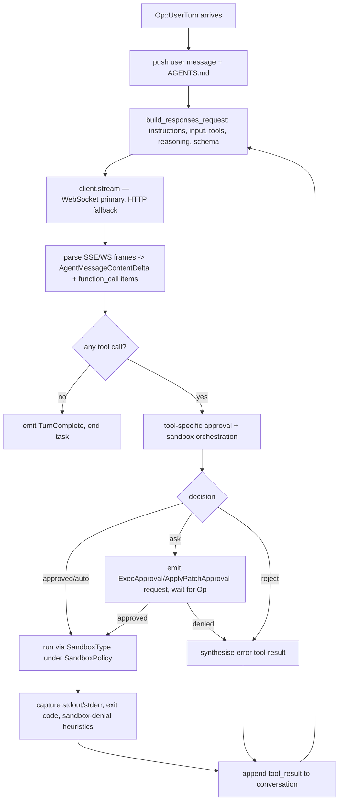

# [CODEX] Architecture Research Report

**Task 7 of the Master AI Agent Blueprint** — research feeder for the unified architecture synthesis.

## Source-of-truth note

Task 7 names `./codex/` as the primary source. At verification time that directory was not present under `/Users/deepg/Desktop/agent`, so this repair pass used a local shallow checkout of `openai/codex` at `/tmp/codex-review`, commit `87bc72408c5ef08f8d21f2cdd00c55451c3be33f`. The analysis below is source-verified against that checkout, not reconstructed from partial `raw.githubusercontent.com` fetches.

The repository is large and rapidly evolving. The Rust workspace lives under `codex-rs/` and contains 80+ crates, including newer crates such as `code-mode`, `realtime-webrtc`, `cloud-tasks*`, `process-hardening`, `windows-sandbox-rs`, `responses-api-proxy`, and `connectors`. Specific line numbers will drift, but the symbol names and control-flow claims in this report were checked directly against the local checkout.

Companion reports analysed for stylistic and rigour parity:
- `/Users/deepg/Desktop/agent/docs/_research/aider_research.md`
- `/Users/deepg/Desktop/agent/docs/_research/claude_code_research_part1.md`

---

## 1. Core Architecture

### 1.1 Workspace shape

`codex-rs/` is a single Cargo workspace whose `Cargo.toml` `[workspace] members` array enumerates 80+ member crates (`codex-rs/Cargo.toml`). The crates fall into roughly seven layers; only the load-bearing ones are described here.

**Front-ends (binaries the user actually runs):**

- `cli/` — the `codex` multitool. It is a thin clap wrapper that dispatches to `exec`, `tui`, `mcp`, `mcp-server`, `sandbox`, `login`, and other subcommands.
- `tui/` — full-screen interactive terminal UI built on **ratatui 0.29** (declared in `codex-rs/Cargo.toml` `[workspace.dependencies]`). This is what `codex` (no subcommand) launches.
- `exec/` — non-interactive headless runner (`codex exec PROMPT`). Reads prompt from argv or stdin, runs the agent loop until the task is complete, and exits. Used for CI / automation.
- `exec-server/` — long-lived server variant of `exec`.
- `app-server/` + `app-server-protocol/` + `app-server-client/` — IDE-host integration surface (used by the IDE plug-ins; speaks a JSON line protocol, not a TUI).
- `mcp-server/` — exposes Codex itself as an MCP server so external agents can drive it.
- `responses-api-proxy/` — local proxy in front of the Responses API.

**Core engine:**

- `core/` — the agent runtime (Session, Turn, model client, tool dispatch, safety gate, AGENTS.md discovery, compaction). `codex-rs/README.md` describes the long-term intent: *"The crate is intended to be reusable and may be published as a library at some point in the future."*
- `protocol/` — wire types (`Op`, `Event`, `EventMsg`, `SandboxPolicy`, `AskForApproval`, `ReviewDecision`, etc.) shared between `core` and every front-end.
- `state/`, `rollout/`, `rollout-trace/`, `thread-store/` — persistent session/turn storage.
- `apply-patch/` — parser+applier for the custom patch envelope format (see §4.2).

**Sandboxing:**

- `sandboxing/` — cross-platform sandbox abstraction. Holds `seatbelt.rs`, `landlock.rs`, `bwrap.rs`, `manager.rs`, `policy_transforms.rs`, plus the embedded SBPL files `seatbelt_base_policy.sbpl`, `seatbelt_network_policy.sbpl`, `restricted_read_only_platform_defaults.sbpl`.
- `linux-sandbox/` — the standalone helper binary `codex-linux-sandbox`. The `core` crate spawns it as a child to run a sandboxed command on Linux. Files: `bwrap.rs`, `landlock.rs`, `launcher.rs`, `linux_run_main.rs`, `proxy_routing.rs`, `vendored_bwrap.rs`.
- `windows-sandbox-rs/` — Windows restricted-token / job-object backend (newer than the Linux/macOS path).
- `execpolicy/` — policy-rule grammar and matcher for classifying commands as "safe" vs. "must-ask". Modules: `policy`, `parser`, `rule`, `execpolicycheck` (`codex-rs/execpolicy/src/lib.rs`).
- `process-hardening/` — `prctl(PR_SET_NO_NEW_PRIVS)` and friends.

**Tools / MCP / providers:**

- `tools/`, `core-skills/`, `core-plugins/`, `plugin/`, `skills/` — built-in tool surface and skill plumbing.
- `codex-mcp/`, `rmcp-client/` — MCP client (Codex calls outwards to MCP servers).
- `model-provider/`, `model-provider-info/`, `models-manager/`, `lmstudio/`, `ollama/`, `chatgpt/`, `aws-auth/` — provider adapters.

**Utilities:** `utils/*` (an entire family — `approval-presets`, `path-utils`, `output-truncation`, `cli`, `pty`, etc.), `git-utils/`, `file-search/`, `terminal-detection/`, `network-proxy/`, `keyring-store/`, `secrets/`, `otel/`, `hooks/`, `feedback/`, `analytics/`.

**Notable workspace-pinned dependencies** (`codex-rs/Cargo.toml [workspace.dependencies]`): `tokio` 1.x, `ratatui` 0.29.0, `reqwest` 0.12, `landlock` 0.4.4. The Rust runtime is async/Tokio throughout.

### 1.2 The agent loop, Session, Turn

The headline abstraction in Codex's `protocol/` crate is a **Submission/Event** queue pair:

- A **Submission Queue (SQ)** is the UI → core direction. In current source, `Submission` is `Submission { id: String, op: Op, trace: Option<W3cTraceContext> }`.
- An **Event Queue (EQ)** is the core → UI direction. `Event` is `Event { id: String, msg: EventMsg }`, using the same id to correlate replies with the originating submission.
- `Op` is `#[non_exhaustive]`; `EventMsg` is not currently marked that way.

The runtime lifecycle is **Session → active turn → one or more model/tool cycles**:

1. **Session.** Front-ends construct a configured `Session`/runtime with cwd, model, `SandboxPolicy`, `AskForApproval`, provider, history, MCP connections, hooks, and feature flags. Current `Op` no longer has a `ConfigureSession` bootstrap variant; configuration is acknowledged to clients through `EventMsg::SessionConfigured`.
2. **Turn.** A user-facing request arrives as `Op::UserTurn` or one of the legacy/compat input shapes. Only one active turn runs for a session at a time; other user actions arrive as queue submissions.
3. **Model/tool loop.** Each cycle builds a Responses API request, streams model output, executes any tool calls, appends tool results to history, then repeats until the model emits a final assistant message with no further tool calls.

Current `Op` variants are broader than the legacy protocol doc. The structurally important ones include:

```text
Op::Interrupt / CleanBackgroundTerminals
Op::UserInput / UserTurn / UserInputWithTurnContext
Op::ExecApproval { id, turn_id, decision }
Op::PatchApproval { id, decision }
Op::ResolveElicitation
Op::UserInputAnswer
Op::RequestPermissionsResponse
Op::DynamicToolResponse
Op::ListMcpTools / RefreshMcpServers
Op::Compact / Undo / Review / ThreadRollback
Op::RunUserShellCommand
Op::ListModels / ListSkills / ReloadUserConfig
Op::AddToHistory / GetHistoryEntryRequest
Op::RealtimeConversation*
Op::Shutdown
```

`EventMsg` variants are numerous. The structurally important ones include:

```text
TurnStarted / TurnComplete           // v1 wire names task_started/task_complete, with v2 aliases
AgentMessage / AgentMessageDelta / AgentMessageContentDelta
ExecApprovalRequest                  // gate for command execution
ApplyPatchApprovalRequest            // gate for apply_patch
RequestPermissions / RequestUserInput / ElicitationRequest
McpToolCallBegin / McpToolCallEnd
WebSearchBegin / WebSearchEnd
ImageGenerationBegin / ImageGenerationEnd / ViewImageToolCall
ContextCompacted / ThreadRolledBack
Error / Warning / GuardianWarning
```

The dual `Op::ExecApproval { ... }` / `EventMsg::ExecApprovalRequest(...)` and `Op::PatchApproval { ... }` / `EventMsg::ApplyPatchApprovalRequest(...)` shape means approval is a *full round-trip through the wire protocol*: the core crate emits an event, the UI prompts the human, the UI sends back a `ReviewDecision` as an `Op`, and only then does the core proceed. This is materially different from Aider's in-process `ConfirmAsk`, and even from Claude Code's runtime `prompter` callback in the clone studied for the companion report. Codex's design is queue-mediated end-to-end, which lets the same `core` crate drive a TUI, a headless `exec`, an MCP server, and IDE/app integrations.

The agent loop, conceptually (`codex-rs/core/src/client.rs`, `core/src/session/*`, `core/src/tools/*`, `core/src/safety.rs`, `protocol/src/protocol.rs`):



### 1.3 Model client — Responses API, not Chat Completions

`codex-rs/core/src/client.rs` implements **only the OpenAI Responses API**, not Chat Completions. The selection is hard-coded; there is no Chat Completions branch in `client.rs`. Notable specifics:

- Dual transport: WebSocket primary, HTTP SSE fallback. Once a WebSocket fails with `UPGRADE_REQUIRED` (or similar), the session is pinned to HTTP for the remainder.
- Request builder: `build_responses_request()` assembles `model`, `instructions` (system prompt), `input` (conversation), `tools` (via `create_tools_json_for_responses_api`), `reasoning` (effort + summary), `verbosity`, and `output_schema` with strict-mode flags.
- Tools are serialised once per request and reused.

Contrast to Aider: Aider goes through **LiteLLM** so it works against any provider; Aider's primary edit-format channel is *string-shaped* (SEARCH/REPLACE blocks parsed out of free-text assistant messages), not OpenAI tool calls. Codex's first-class shape is `function_call` items in the Responses API, with `apply_patch` itself being one of those tools.

---

## 2. Sandbox Model — the headline section

Codex's defining philosophy is **sandbox-first**: every command and patch executes inside an OS-native sandbox by default, and the approval policy is composed *on top of* the sandbox rather than the other way around. The dispatcher in `codex-rs/sandboxing/src/manager.rs` translates a high-level `SandboxPolicy` into OS-native primitives:

| Platform | Backend | Code |
|---|---|---|
| macOS | `sandbox-exec` (Seatbelt / SBPL) | `codex-rs/sandboxing/src/seatbelt.rs` |
| Linux  | bubblewrap filesystem sandbox + seccomp/no_new_privs via the `codex-linux-sandbox` helper; Landlock filesystem rules are legacy fallback/reference code | `codex-rs/linux-sandbox/src/*`, `codex-rs/sandboxing/src/*` |
| Windows | Restricted Token + Job Object | `codex-rs/windows-sandbox-rs/`, `codex-rs/sandboxing/...` |

### 2.1 The shared `SandboxPolicy` enum

`codex-rs/protocol/src/protocol.rs` defines the policy shape as:

```rust
#[derive(Debug, Clone, PartialEq, Eq, Serialize, Deserialize, Display, JsonSchema, TS)]
#[serde(tag = "type", rename_all = "kebab-case")]
pub enum SandboxPolicy {
    #[serde(rename = "danger-full-access")]
    DangerFullAccess,
    #[serde(rename = "read-only")]
    ReadOnly { network_access: bool },
    #[serde(rename = "external-sandbox")]
    ExternalSandbox { network_access: NetworkAccess },
    #[serde(rename = "workspace-write")]
    WorkspaceWrite {
        writable_roots: Vec<AbsolutePathBuf>,
        network_access: bool,
        exclude_tmpdir_env_var: bool,
        exclude_slash_tmp: bool,
    },
}
```

Four variants — `DangerFullAccess`, `ReadOnly`, `WorkspaceWrite`, `ExternalSandbox`. Network access is a *per-variant* boolean (`ReadOnly`/`WorkspaceWrite`) or a typed enum (`NetworkAccess` for `ExternalSandbox`); it is **disabled by default** in every sandboxed mode and is opt-in. `WorkspaceWrite` carries:

- `writable_roots: Vec<AbsolutePathBuf>` — the only paths the sandbox will allow writes to.
- `exclude_tmpdir_env_var` — whether to *not* whitelist `$TMPDIR`.
- `exclude_slash_tmp` — whether to *not* whitelist `/tmp`.

The defaults imply that absent these "exclude" flags, `$TMPDIR` and `/tmp` are normally added to the writable set on top of `writable_roots` (so that build tools that need `/tmp` work out of the box).

### 2.2 macOS: Seatbelt (`sandbox-exec`)

Seatbelt is the kernel-level mandatory access control framework macOS exposes via the `/usr/bin/sandbox-exec` binary, using a Lisp-like policy DSL called **SBPL** (Sandbox Profile Language).

**Where the policy is built.** `codex-rs/sandboxing/src/seatbelt.rs` exposes a `create_seatbelt_command_args()` (function name observed in the source) which assembles:

1. **Base policy** — `include_str!("seatbelt_base_policy.sbpl")` loads an embedded `.sbpl` file at compile time.
2. **File read rules** — derived from the filesystem policy (e.g., `ReadOnly` → no file-write rules; `WorkspaceWrite` → file-write subpath rules per writable root).
3. **File write rules** — one `(allow file-write* (subpath (param "WRITABLE_ROOT_<n>")))` per writable root. If exclusions exist (e.g., `.git`, `.agents`, `.codex`), the rule wraps in `(require-all ... (require-not (subpath (param "EXCLUDE_<n>"))))` form.
4. **Deny read patterns** — glob-based exclusions for paths that must remain unreadable (secrets folders).
5. **Network rules** — `include_str!("seatbelt_network_policy.sbpl")` or a dynamically built loopback-only stanza.
6. **Platform defaults** — `include_str!("restricted_read_only_platform_defaults.sbpl")` appended only when `include_platform_defaults == true`.

These are concatenated with `\n` into a single SBPL string. The shell out is essentially:

```text
/usr/bin/sandbox-exec \
    -p "<concatenated SBPL>" \
    -DWRITABLE_ROOT_0=/abs/path/to/cwd \
    -DWRITABLE_ROOT_1=/abs/path/to/other \
    -DEXCLUDE_0=/abs/path/to/cwd/.git \
    -- /bin/zsh -lc "<user-or-model command>"
```

The `-D KEY=VAL` flags pass paths as named SBPL parameters so the same compiled policy template parameterises per call. The `--` separator is mandatory before the actual command.

**Base profile contents.** The `seatbelt_base_policy.sbpl` file is embedded in the binary. Its load-bearing shape is:

- `(version 1)` and `(deny default)` — closed-by-default. Anything not explicitly allowed is denied.
- `(allow process-exec)` and `(allow process-fork)` — child processes can fork and exec, inheriting policy.
- `(allow signal (target same-sandbox))` — processes inside the sandbox can signal each other.
- `(allow file-write-data (literal "/dev/null"))` and read/write rules for `/dev/ptmx`, `/dev/tty*`, the slave-PTY family — needed for any interactive subprocess.
- `(allow sysctl-read ...)` — a long list of hardware/kernel sysctls (CPU type, cache geometry, OS version, hostname, process limits) — needed because libc calls `sysctlbyname` during init.
- `(allow ipc-posix-sem)` and `(allow ipc-posix-shm-read*/write*)` for POSIX semaphores and shared memory — Python `multiprocessing` and PyTorch/libomp's `__KMP_REGISTERED_LIB_*` registration require this.
- `(allow user-preference-read)` — needed by macOS' `cfprefsd` / CoreFoundation initialisation; without it `defaults`-backed code fails.
- File reads are typically broad (read-everything-except-secrets); writes are gated.

The base profile follows the same broad closed-by-default shape as other macOS Seatbelt profiles: deny by default, then add narrow process, device, IPC, preference, sysctl, file, and network allowances as needed.

**Network.** By default `(deny network*)` is in force through the closed base policy. When unrestricted network is enabled, the dynamic policy permits outbound and inbound network APIs. In managed-proxy mode, the policy is narrower: it allows local binding, loopback inbound/outbound, DNS, selected local proxy ports, and configured Unix socket paths instead of simply opening all egress.

**Writable-roots translation.** `build_seatbelt_access_policy("file-write*", "WRITABLE_ROOT", ...)` takes the `writable_roots` Vec, emits one `(allow file-write* (subpath (param "WRITABLE_ROOT_<n>")))` per entry, then wraps protected subpaths with `(require-not (subpath (param ...)))` clauses. Even in `WorkspaceWrite` mode, top-level `.git`, `.agents`, and `.codex` are treated as protected read-only subpaths when present, with `.codex` protected pre-creation at the workspace root so first-time creation still flows through the protected-path approval path.

**Limits.** Seatbelt cannot block raw network at packet level if `network*` is allowed (only at API level), and it does not isolate the process namespace. Codex relies on Seatbelt strictly for filesystem and high-level network access control, and on the fact that macOS's process sandbox is unforgeable from within the sandboxed process.

### 2.3 Linux: bubblewrap + Landlock + seccomp

Linux has three relevant primitives in this codebase, but the default path is **not** "apply all three at once." Modern Codex uses bubblewrap for filesystem isolation, then re-enters the helper inside that mount/network namespace to apply seccomp and `PR_SET_NO_NEW_PRIVS`. Landlock filesystem rules remain in the helper as a legacy fallback/reference path.

**Helper binary.** Rather than restrict the long-lived parent CLI, Codex spawns `codex-linux-sandbox` from the `linux-sandbox/` crate. The parent serializes the resolved policies and command context, then invokes the helper with arguments shaped like:

```text
codex-linux-sandbox \
    --sandbox-policy-cwd <cwd> \
    --command-cwd <cwd-if-needed> \
    --sandbox-policy <json> \
    --file-system-sandbox-policy <json> \
    --network-sandbox-policy <json> \
    -- <command-to-run>
```

If filesystem access is unrestricted and no managed proxy is active, the helper can skip bubblewrap and only apply the in-process network restrictions needed for the requested network policy. Otherwise the normal path is the two-stage bwrap flow below.

**Bubblewrap layer (`codex-rs/linux-sandbox/src/bwrap.rs`).** Bubblewrap (`bwrap`) is the user-namespace-based unprivileged sandbox originally written for Flatpak. Codex either uses system `bwrap` or its vendored fallback. Current bwrap flags include:

- `--new-session` and `--die-with-parent`.
- `--unshare-user` and `--unshare-pid` on both full-filesystem and restricted-filesystem paths.
- `--unshare-net` when network mode requires an isolated network namespace, including restricted networking and managed-proxy modes.
- Either `--ro-bind / /` for the default full-read policy, or `--tmpfs /` plus scoped `--ro-bind` mounts for restricted-read policies.
- `--bind <writable_root> <writable_root>` for writable roots.
- `--ro-bind <protected_subpath> <protected_subpath>` to re-apply read-only protection beneath writable roots.
- `--dev /dev` and optional `--proc /proc`.

The current source does **not** add `--unshare-ipc`, `--unshare-uts`, or `--unshare-cgroup` in the main bwrap builder. Restricted-read policies also do not always start from `--ro-bind / /`; they may start from `--tmpfs /` and layer back only the readable subtrees.

**Landlock layer (`codex-rs/linux-sandbox/src/landlock.rs`).** This file now describes itself as in-process primitives for `no_new_privs` and seccomp, with Landlock helpers retained as legacy/backup utilities. The Landlock filesystem function still shows the intended rule shape: ABI v5, read access over `/`, read-write `/dev/null`, read-write writable roots, then `restrict_self()`. But that function is explicitly marked currently unused because filesystem sandboxing is performed via bubblewrap.

**Seccomp layer.** After bubblewrap has established the filesystem view, the helper re-enters itself with `--apply-seccomp-then-exec`. In that inner stage it may:

- set `PR_SET_NO_NEW_PRIVS`;
- install a default-allow seccomp filter that always denies `ptrace` and `io_uring_setup` / `io_uring_enter` / `io_uring_register`;
- add network syscall denies depending on `NetworkSandboxPolicy`.

Network modes are:

- **Restricted** — deny outbound/inbound network syscalls while still allowing Unix-socket IPC needed by local tools.
- **Proxy-routed** — allow IP sockets inside the isolated namespace so traffic can reach the managed bridge, but deny Unix socket paths that could bypass the proxy.
- **No network seccomp filter** — when full network is allowed and no managed proxy route is being enforced.

Violations are returned as normal sandbox errors to the tool runtime, which can either report them to the model or enter the approval/escalation path depending on `AskForApproval`, the tool's `escalate_on_failure()` behavior, and whether the request is eligible for no-sandbox retry.

### 2.4 Network: disabled by default, narrowly re-enabled

Three orthogonal places gate network:

1. **`SandboxPolicy::*::network_access`** — the high-level toggle. Default `false`.
2. **Seatbelt closed-by-default policy** on macOS, with dynamic full-network or managed-proxy network stanzas only when enabled.
3. **Linux bwrap network namespace** plus seccomp `Restricted` / `ProxyRouted` modes, depending on whether network is disabled, fully enabled, or routed through a managed proxy.

The `network-proxy/` and `responses-api-proxy/` crates are the way Codex offers "agent has network through a proxy you control" — the proxy whitelists egress hosts (often just `api.openai.com`) and the seccomp `ProxyRouted` mode plus loopback-only Seatbelt rule keep the agent boxed in.

### 2.5 Filesystem: `WorkspaceWrite` vs `ReadOnly`

`WorkspaceWrite` is the default workspace-capable sandbox. `writable_roots` is normally derived as `[cwd]`, optionally unioned with `[$TMPDIR, /tmp]` unless `exclude_*` flags are set. Top-level `.git`, `.agents`, and `.codex` are demoted to read-only protected subpaths when present; `.codex` is also protected before creation at the workspace root. The only way the agent can mutate protected project metadata is to leave the normal raw file-write path and go through an explicitly approved command or permission flow.

Escape paths the design specifically guards against:

- **Symlink traversal** — bwrap handles via `--ro-bind` (the kernel resolves symlinks against the *post-bind* mount table, so a symlink in cwd pointing to `/etc/shadow` resolves under the read-only host root). On macOS, Seatbelt's `(literal …)` and `(subpath …)` rules apply to the resolved path.
- **Confused-deputy via `git`** — `.git` is read-only, so the agent cannot rewrite history, change hooks, or write into the index without going through `git` itself, which is a separate approval-gated exec call.
- **`io_uring`** — explicitly denied by seccomp.
- **`ptrace` injecting into another process** — denied.

---

## 3. Autonomy Levels / Approval Policy

### 3.1 The `AskForApproval` enum

`codex-rs/protocol/src/protocol.rs` defines:

```rust
#[derive(Debug, Clone, Copy, Default, PartialEq, Eq, Hash, Serialize, Deserialize, Display, JsonSchema, TS)]
#[serde(rename_all = "kebab-case")]
pub enum AskForApproval {
    #[serde(rename = "untrusted")]
    UnlessTrusted,
    OnFailure,
    #[default]
    OnRequest,
    #[strum(serialize = "granular")]
    Granular(GranularApprovalConfig),
    Never,
}
```

`OnFailure` is marked deprecated in the source comments: commands are auto-approved into the sandbox, but sandbox failures may be escalated to the user for no-sandbox execution. `Never` is different: it does not ask on failure; the failure is returned to the model. `GranularApprovalConfig` carries booleans for `sandbox_approval`, `rules`, `skill_approval`, `request_permissions`, and `mcp_elicitations`, letting users turn specific prompt categories into allow-or-reject decisions.

### 3.2 The CLI/preset surface

`codex-rs/utils/approval-presets/src/lib.rs` defines:

| Preset name (`--approval-preset` / config key) | `AskForApproval` | `SandboxPolicy` |
|---|---|---|
| `read-only` | `OnRequest` | `ReadOnly { network_access: false }` |
| `auto` | `OnRequest` | `WorkspaceWrite { … }` |
| `full-access` | `Never` | `DangerFullAccess` |

These are the three *named presets* in the current source. Older Codex copy often used `suggest`, `auto-edit`, and `full-auto`; in the current Rust source those are better treated as user-facing/autonomy labels over the explicit `AskForApproval × SandboxPolicy` pair:

| Label | Current source mapping | Practical effect |
|---|---|---|
| `suggest` / `read-only` | `OnRequest` + `ReadOnly { network_access: false }` via the `read-only` preset | Reads can proceed; writes, network, and most command execution need approval or are rejected if no approval path is available. |
| `auto-edit` / `auto` | `OnRequest` + `WorkspaceWrite { network_access: false, writable_roots: ... }` via the `auto` preset | `apply_patch` to writable roots auto-applies under sandbox; non-dangerous, non-escalated commands run sandboxed; network, escalated permissions, protected paths, and dangerous commands prompt. |
| `full-auto` in `codex exec` | `--full-auto` sets `SandboxMode::WorkspaceWrite`; headless `exec` separately defaults `approval_policy` to `Never` | Commands and patches run without interactive prompts, but still under the workspace sandbox. Sandbox denials are returned to the model rather than retried without a sandbox. |
| `full-access` / bypass | `Never` + `DangerFullAccess` via `full-access` preset or `--dangerously-bypass-approvals-and-sandbox` | No approval prompts and no Codex-managed OS sandbox. This is the explicit unsafe escape hatch. |

`--full-auto` is therefore **not** equivalent to the `auto` preset. `auto` is `OnRequest + WorkspaceWrite`; `codex exec --full-auto` contributes `WorkspaceWrite` while the headless runner's default approval override contributes `Never`.

### 3.3 The approval and sandbox decision paths

There is no single universal gate. `core/src/safety.rs` is the patch-safety gate; command execution uses `core/src/exec_policy.rs`, `core/src/tools/sandboxing.rs`, and `core/src/tools/orchestrator.rs`; MCP, skills, and permission requests have their own category gates.

For `apply_patch`, `safety.rs` uses:

```rust
pub enum SafetyCheck {
    AutoApprove { sandbox_type: SandboxType, user_explicitly_approved: bool },
    AskUser,
    Reject { reason: String },
}
```

`assess_patch_safety(action, policy, sandbox_policy, file_system_sandbox_policy, cwd, windows_sandbox_level)` returns a `SafetyCheck`. The patch decision tree is:

```text
1. patch.is_empty()                                              → Reject("empty patch")
2. policy == UnlessTrusted                                       → AskUser
3. constrained_to_writable_paths(patch) || policy == OnFailure:
     a. sandbox_policy in {DangerFullAccess, ExternalSandbox}    → AutoApprove(sandbox_type=None)
     b. platform sandbox available                               → AutoApprove(sandbox_type=<that>)
     c. platform sandbox unavailable AND policy rejects sandbox-approval
                                                                 → Reject("no sandbox available")
     d. otherwise                                                 → AskUser
4. policy is Granular with sandbox_approval=false                → Reject(reason)
5. otherwise                                                      → AskUser
```

`is_write_patch_constrained_to_writable_paths()` normalises every `Add/Update/Delete/Move` target through `..` resolution, lowercases on case-insensitive filesystems, and tests each against the writable-roots set.

For shell-like tools (`shell`, `shell_command`, `exec_command`), the handler builds an `ExecApprovalRequirement` through exec-policy evaluation. The important branches are:

- dangerous commands or missing sandbox protections prompt the user for `OnFailure`, `OnRequest`, `UnlessTrusted`, and `Granular`; under `Never`, they are forbidden unless the sandbox is explicitly disabled by `DangerFullAccess` or `ExternalSandbox`;
- `Never` and `OnFailure` skip the initial approval for ordinary commands and rely on the sandbox;
- `OnRequest` allows ordinary non-escalated commands in a restricted sandbox, but prompts for explicit sandbox overrides, network/permission amendments, dangerous commands, and policy rules that say `prompt`;
- `Granular` mirrors the relevant branch but converts disabled categories into automatic rejection;
- after a sandbox denial, the orchestrator may ask for no-sandbox retry only for policies/tools that allow it (`OnFailure`, `UnlessTrusted`, or `Granular` with sandbox approval enabled). `Never` and ordinary `OnRequest` do not silently retry without sandbox.

**Per-tool gate matrix:**

| Mode / preset | Read-only observations (`shell cat`, `list_dir`, MCP resources, `view_image`) | `apply_patch` to writable root | `apply_patch` outside writable/protected roots | Ordinary shell command | Dangerous / network / escalated shell |
|---|---|---|---|---|---|
| `read-only` (`OnRequest` + `ReadOnly`) | Allowed when the underlying tool is available and policy permits reading | Asks or rejects because no writable root is available | Asks or rejects | Usually prompts because filesystem sandbox is read-only/restricted | Prompts; can be rejected by policy |
| `auto` (`OnRequest` + `WorkspaceWrite`) | Allowed | Auto-approved, executed inside platform sandbox | Asks, or rejects if the policy disallows the prompt | Runs sandboxed without prompt when non-dangerous and non-escalated | Prompts for network, sandbox override, dangerous command, or exec-policy rule |
| `OnFailure` + sandboxed policy | Allowed | Auto-approved in sandbox | Attempted in sandbox; sandbox denial can prompt for no-sandbox retry | Runs sandboxed without prompt | Sandbox failure can prompt for retry without sandbox |
| `Never` + sandboxed policy | Allowed | Auto-approved if constrained to writable paths | Rejected before execution if not constrained | Runs sandboxed without prompt | Dangerous commands can be forbidden; sandbox denials are returned to the model, not escalated |
| `Granular` | Allowed unless a category-specific flag applies | Depends on `sandbox_approval` and path safety | Disabled categories reject instead of prompting | Depends on `sandbox_approval`, `rules`, and cached approvals | Disabled categories reject instead of prompting |
| `full-access` / bypass (`Never` + `DangerFullAccess`) | Unrestricted by Codex sandbox | Auto-approved without Codex sandbox | Auto-approved without Codex sandbox | Runs unsandboxed without prompt | Runs unsandboxed without prompt |

Crucially: **`Never` alone does not mean unsandboxed shell**. `Never` means "do not ask"; the selected `SandboxPolicy` still determines containment. The only way to drop Codex's OS sandbox is to select `DangerFullAccess` or an external sandbox mode whose enforcement is delegated outside Codex.

This is the key axis on which Codex differs from Claude Code (see §6).

### 3.4 Approval as a wire-protocol round-trip

When a command or patch needs approval, the agent loop emits `EventMsg::ExecApprovalRequest(...)` or `EventMsg::ApplyPatchApprovalRequest(...)` and parks the turn. The UI surfaces a prompt. The user's reply comes back as `Op::ExecApproval { id, turn_id, decision }` or `Op::PatchApproval { id, decision }`. Until that submission lands on the SQ, the turn remains blocked. This is a fundamentally different shape from the Aider in-process `io.confirm_ask` Python call — Codex's approval loop survives across IPC, IDE plug-ins, and MCP-server invocations of Codex by other agents.

`ReviewDecision` includes `Approved`, `ApprovedForSession`, `ApprovedExecpolicyAmendment`, `NetworkPolicyAmendment`, `Denied`, `TimedOut`, and `Abort`, so approval replies can both answer the immediate prompt and optionally persist command/network policy amendments.

---

## 4. Tool System

### 4.1 Catalog

The model-facing tool surface is assembled by `codex-rs/tools/src/tool_registry_plan.rs` and serialized through `codex_tools::create_tools_json_for_responses_api`, which `core/src/client.rs` calls while building each Responses API request. The important families are:

- **Shell family.** The configured shell type chooses among `shell`, `local_shell`, `exec_command` + `write_stdin`, or `shell_command`.
  - `shell` is a function tool with `command: string[]`, `workdir?`, `timeout_ms?`, plus optional approval/escalation parameters when enabled.
  - `local_shell` is a `ToolSpec::LocalShell` custom tool, not the same JSON schema as `shell`.
  - `exec_command` is the unified exec tool with required `cmd: string`, plus `workdir`, `shell`, `tty`, `yield_time_ms`, `max_output_tokens`, optional `login`, and approval fields. `write_stdin` attaches input to a running unified exec session.
  - `shell_command` is a function tool with `command: string`, not a string array.
- **`apply_patch`.** Implemented by the standalone `codex-rs/apply-patch/` crate and exposed through `codex-rs/tools/src/apply_patch_tool.rs`. GPT-5-style models get a **freeform grammar tool** named `apply_patch`; GPT-OSS-style fallback gets a JSON function tool with `{ "input": string }`, `strict: false`. There is no current `{ "patch": string }` schema.
- **Planning and user interaction.** `update_plan` is always registered; `request_user_input` asks the user a non-approval question and replies through `Op::UserInputAnswer`; `request_permissions` is optionally registered and goes through the permission profile / `Granular.request_permissions` flow.
- **MCP and dynamic tools.** When MCP tools are available, Codex also exposes MCP resource helpers (`list_mcp_resources`, `list_mcp_resource_templates`, `read_mcp_resource`) and maps server-provided tools into the model tool namespace.
- **Search and media.** `web_search` is constructed by `create_web_search_tool(...)` when enabled by config/provider mode. Image generation and `view_image` are separate tool specs when enabled.
- **Experimental / code-mode tools.** The registry can add `list_dir`, test sync tools, and collaboration / multi-agent tools depending on feature flags and mode.

Codex still does not expose a Claude-style general `read_file` / `write_file` pair by default. Reading is usually through shell commands, MCP resource reads, `list_dir`, or image-specific loading; structured file mutation is primarily `apply_patch`, with shell writes possible only through the same command approval and sandbox pipeline as any other command.

### 4.2 The `apply_patch` envelope format

The format is defined and parsed by `codex-rs/apply-patch/src/lib.rs`. The envelope is **not** unified diff; it is a custom textual format whose tokens are:

```text
*** Begin Patch
*** Add File: path/to/new.py
+from __future__ import annotations
+
+def hello():
+    return "hi"
*** Update File: existing/file.py
*** Move to: existing/renamed.py            (optional, paired with Update)
@@
 unchanged context line
-old line
+new line
@@ def some_function():
 unchanged within hunk
-removed
+added
*** Delete File: dead/file.py
*** End Patch
```

Token semantics:

- **Sentinels:** `*** Begin Patch` opens, `*** End Patch` closes. The freeform tool grammar expects the payload to be the patch itself (`start: begin_patch hunk+ end_patch`). The lower-level parser trims surrounding whitespace, but it does not treat arbitrary prose before/after the envelope as part of a valid patch payload.
- **Action verbs:** `*** Add File: <path>`, `*** Update File: <path>`, `*** Delete File: <path>`, `*** Move to: <path>` (only valid immediately following an `Update File:` action). The grammar requires exact token lines; the parser is slightly more lenient about trimmed header lines.
- **Hunk markers:** `@@` introduces a change chunk inside an `Update File:` action. An optional anchor string can follow on the same line (e.g. `@@ def some_function():`) which the parser uses to disambiguate which occurrence to patch when the same context appears multiple times.
- **Line prefixes** inside a hunk: `+` add, `-` remove, ` ` (space) context. Empty lines within a chunk are permitted.
- **End-of-file marker:** `*** End of File` after the last hunk indicates the patch consumes the literal end of the file (used to apply changes that touch the trailing newline).

The applier is fuzzy, but only in narrow source-matching passes:

1. exact match;
2. match after trimming trailing whitespace;
3. match after trimming both sides;
4. match after folding common Unicode punctuation and space variants to ASCII equivalents.

Trailing-newline repair is handled separately by the apply path. The matcher does **not** perform NFC normalization and does **not** do broad similarity search like Aider's `flexible_search_and_replace` heuristics. Codex relies on the patch to include enough context and can use the optional `@@ <anchor>` text to disambiguate repeated regions.

This is structurally close to GNU `patch` / unified diff but with the explicit `*** Begin Patch / *** End Patch` envelope and the `Add File:` / `Delete File:` / `Move to:` action verbs replacing the `--- /dev/null` and `+++ b/path` conventions. The envelope and grammar make the edit payload unambiguous to the tool runtime.

### 4.3 Tool-call schema flowing to the model

Representative current tool shapes:

```text
shell:
  type: function
  strict: false
  required: ["command"]
  parameters: command: string[], workdir?: string, timeout_ms?: number, approval fields?

exec_command:
  type: function
  strict: false
  required: ["cmd"]
  parameters: cmd: string, workdir?: string, shell?: string, tty?: boolean,
              yield_time_ms?: number, max_output_tokens?: number, login?: boolean,
              approval fields?

shell_command:
  type: function
  strict: false
  required: ["command"]
  parameters: command: string, workdir?: string, timeout_ms?: number, login?: boolean,
              approval fields?

apply_patch, default:
  type: freeform custom tool
  name: apply_patch
  format: grammar / lark
  payload: the patch text itself, not JSON

apply_patch, JSON fallback:
  type: function
  strict: false
  required: ["input"]
  parameters: input: string
```

The exact active set is configuration-dependent: no-environment runs omit host-execution tools; MCP resources only appear when MCP tools are present; `web_search`, image generation, `view_image`, `request_permissions`, `list_dir`, and collaboration tools are feature/config gated.

---

## 5. Context Management

### 5.1 AGENTS.md discovery

`codex-rs/core/src/agents_md.rs` implements project-doc injection. Behaviour observed:

1. **Project root discovery.** From cwd, walk ancestors looking for `project_root_markers` (default: `.git`). The deepest ancestor containing a marker is the project root. If none found, the cwd is itself the root.
2. **File collection.** Walk *back down* from project root to cwd, inclusive. At each directory, look for the candidate filenames in precedence order returned by `candidate_filenames()`:
   - `AGENTS.override.md` (preferred local override)
   - `AGENTS.md` (canonical)
   - Plus any user-configured fallback names
3. **Concatenation.** Discovered files are concatenated with `"\n\n"` separators in root-to-leaf order — so a leaf `AGENTS.md` overrides/appends to the root one.
4. **Budget.** `read_agents_md()` enforces `project_doc_max_bytes`; files exceeding remaining budget are *truncated*, not skipped, so leaf instructions still get partial inclusion.
5. **Final assembly.** `user_instructions_with_fs()` joins the user-configured base instructions with the discovered AGENTS.md content using a literal separator: `"\n\n--- project-doc ---\n\n"`.

This is the equivalent of Claude Code's `CLAUDE.md` discovery, with two key differences:

- **Filename precedence** in Codex is `AGENTS.override.md > AGENTS.md`; Claude Code's `claw-code` reimplementation walks `CLAUDE.md`, `CLAUDE.local.md`, `.claw/CLAUDE.md`, `.claw/instructions.md` in that order.
- **Direction.** Codex walks *root → leaf* (the leaf wins); Claude Code's loader is leaf → root (which the leaf inherits-from).

### 5.2 Conversation compaction

`codex-rs/core/src/compact.rs`:

- **Trigger.** Two paths: auto-compaction mid-task when the request approaches the model's input-token limit, and manual `Op::Compact`.
- **Token budget.** A constant `COMPACT_USER_MESSAGE_MAX_TOKENS = 20_000` caps how much user-message content is preserved verbatim during compaction. Older user messages are iterated *in reverse*, accumulated until the cap is hit, then the next one is truncated to fit remaining capacity.
- **Summary generation.** Codex uses a "Memento" strategy — instead of asking the model for a fresh narrative summary, it takes *the last assistant message of the turn* (which by Codex's prompt design is supposed to be a structured turn-end summary) and re-encodes it with a `SUMMARY_PREFIX` as a synthesised user message in the replacement history.
- **Initial-context handling.** An `InitialContextInjection` enum controls reinsertion:
  - `DoNotInject` — pre-turn compaction clears initial context; the next turn re-injects via the normal AGENTS.md path.
  - `BeforeLastUserMessage` — mid-turn compaction reinjects the AGENTS.md content right above the last user message, preserving the model's training-time expectation that the instructions sit immediately before the active query.
- **Ghost snapshots.** Pre-compaction history is preserved as `ghost_snapshots` so the user can `Op::Undo` back across a compaction.

### 5.3 Image / multimodal inputs

The tool registry can expose image generation and `view_image`. `view_image` loads a local image and emits `EventMsg::ViewImageToolCall`; the Responses API request path can carry image content when a front-end supplies multimodal input.

### 5.4 `/compact` and other slash commands

The TUI exposes `/compact`, `/undo`, `/review`, `/list-models`, `/skills`, `/mcp` as slash commands that map directly to `Op::Compact`, `Op::Undo`, `Op::Review`, `Op::ListModels`, `Op::ListMcpTools`. The `cli/` and `tui/` crates are the only places that translate keystrokes to `Op`; `core/` only sees `Op` values, never strings — a clean separation.

---

## 6. Contrast with Aider and Claude Code

### 6.1 Core loop and retry channel

| Axis | Aider | Claude Code / claw-code | Codex |
|---|---|---|---|
| Primary loop | Interactive Python `Coder` loop: assemble chat chunks, stream through LiteLLM, parse edits from assistant text, apply/commit, then optionally lint/test. | Runtime `run_turn`: send Anthropic-style request, collect assistant tool uses, run hooks, authorize, execute tools, append tool results, repeat. | Rust `Session` receives `Op::UserTurn`, streams Responses API items, dispatches tools through queue-mediated runtime, emits `EventMsg` events, repeats until no tool calls remain. |
| Retry primitive | `reflected_message` feeds malformed edits, file-discovery changes, or confirmed lint/test failures back into the next model pass. | Tool errors and hook feedback become `tool_result` blocks in conversation history. | Tool results, sandbox denials, approval denials, and patch errors are returned as structured tool outputs/events and fed into the next Responses API cycle. |
| Boundary | Mostly in-process Python objects and git commits. | In-process Rust runtime traits plus hook subprocesses. | Protocol boundary is explicit: UI/app submits `Op`, core emits `EventMsg`; approval and user-input pauses survive across TUI, headless exec, IDE/app server, and MCP-server surfaces. |

The key Codex difference is not just "Rust instead of Python/TypeScript"; it is that the agent loop is protocolized. Approval, compaction, background terminals, realtime conversation, MCP, and tool lifecycle are all observable queue messages rather than private callbacks.

### 6.2 Sandbox and blast-radius control

Aider has no OS sandbox. It relies on git scoping, file-in-chat rules, and user confirmation before risky actions such as shell commands, lint/test repair, out-of-chat edits, and commits. If a command is approved, it runs with the user's normal OS permissions.

Claude Code / claw-code is permission-first. Tool specs carry required permission levels (`ReadOnly`, `WorkspaceWrite`, `DangerFullAccess`), settings add allow/deny/ask rules, hooks can override decisions, and the prompter resolves escalation. The `bash` tool has sandbox-related parameters, but containment is not the organizing runtime invariant in the companion source.

Codex is sandbox-first. Shell and patch execution are routed through an OS-native sandbox selected from a shared policy: macOS Seatbelt, Linux bubblewrap + seccomp (with legacy Landlock fallback), Windows restricted-token/job-object support, or an explicit external/full-access mode. `AskForApproval` decides whether to ask; `SandboxPolicy` decides what is physically possible. `Never` without `DangerFullAccess` still means "no prompts inside the sandbox," not "unsandboxed."

### 6.3 Autonomy and approval semantics

Aider's autonomy is mostly workflow-level: it can auto-apply edits in the selected edit format, auto-commit, and optionally run lint/test, but several repair actions still ask the user before feeding outputs back into the loop. Confirmation is local/in-process and tied to file scope, shell commands, dirty files, git state, and lint/test repair.

Claude Code / claw-code has mode-and-rule authorization: CLI/config modes map to `ReadOnly`, `WorkspaceWrite`, or `DangerFullAccess`; rules and hooks can allow, ask, or deny by tool and subject; `--allowedTools` changes what the model can see. The prompter is an authorization callback, and residual deny/hook gates can still block work even under broad modes.

Codex exposes a two-dimensional matrix:

- `SandboxPolicy`: `ReadOnly`, `WorkspaceWrite`, `ExternalSandbox`, `DangerFullAccess`.
- `AskForApproval`: `UnlessTrusted`, `OnFailure`, `OnRequest`, `Granular`, `Never`.

That makes autonomy compositional. `auto` is `OnRequest + WorkspaceWrite`; `full-access` is `Never + DangerFullAccess`; headless `exec --full-auto` combines `WorkspaceWrite` with the runner's default `Never`. Shell, patch, MCP elicitation, skill approval, and `request_permissions` each have category-specific gates, but all visible human decisions flow back through protocol events such as `ExecApprovalRequest`, `ApplyPatchApprovalRequest`, and `RequestPermissions`.

### 6.4 Tool and edit model

Aider edits are primarily text-protocol edits parsed from assistant messages. It supports many edit formats (`diff`, `diff-fenced`, `whole`, `udiff`, `patch`, architect/editor variants), with fuzzy matching and reflection when parsing/apply fails. Shell commands may be extracted from text and confirmed separately.

Claude Code / claw-code exposes a large typed tool catalog: `read_file`, `write_file`, `edit_file`, `bash`, `glob_search`, `grep_search`, web tools, todo tools, notebook tools, agents, MCP, and more. The model emits structured tool-use blocks and the runtime authorizes each tool by required permission.

Codex keeps the default editing surface narrower. It has shell variants, `apply_patch`, planning/user-input tools, MCP resources/tools, web search, image tools, and feature-gated extras, but no default general-purpose `read_file`/`write_file` pair. The central edit primitive is the `apply_patch` freeform grammar: multi-file, multi-action, explicit add/update/delete/move, sandbox-assessed before execution. This is between Aider's "parse edits out of prose" and Claude's "single-file typed edit tool."

### 6.5 Context and project instructions

Aider's context is file-set driven. Users add/drop editable and read-only files; the repo-map supplies computed graph-ranked snippets for files outside the chat; summaries compress older history. The model is repeatedly reminded that only added files are editable.

Claude Code / claw-code assembles a system prompt with environment, settings, project context, and instruction files. It discovers `CLAUDE.md`, `CLAUDE.local.md`, `.claw/CLAUDE.md`, and `.claw/instructions.md`, and runs auto-compaction after turns when token thresholds are exceeded.

Codex uses `AGENTS.override.md` / `AGENTS.md` discovery from project root to cwd, concatenates project docs under a `--- project-doc ---` separator, and uses Memento compaction to replace older history with a summary plus selected recent user messages. Project instructions are vendor-neutral (`AGENTS.md`) and injected as part of the session/turn context, while Responses API response ids and protocol events give the runtime explicit checkpoints for undo, rollback, and compaction.

---

## 7. What Codex contributes to the Master Blueprint

To frame the synthesis explicitly:

1. **Sandbox-first execution.** The blueprint should treat the sandbox as a *property of the runtime*, not a *feature of a tool*. Permissions decide whether a human is consulted; sandboxes decide what is physically possible. The two should compose, not substitute.
2. **Per-platform sandbox abstraction with a shared `SandboxPolicy` enum.** The pattern of "one `SandboxPolicy` type, three OS backends, one `manager.rs` dispatcher" is directly transferable. The policy type carries `writable_roots`, `network_access`, and platform-default toggles in a flat shape; the dispatcher translates per OS.
3. **Approval as a wire-protocol round-trip, not an in-process callback.** The Submission/Event queue shape is what lets Codex's same `core` crate drive a TUI, a headless `exec`, an MCP server, and an IDE plug-in. A unified blueprint should adopt this rather than the in-process-callback pattern Aider and claw-code use.
4. **`AskForApproval × SandboxPolicy` as a 2D matrix.** Decoupling "ask the human?" from "what can run?" produces a five-mode approval surface (`UnlessTrusted`, `OnRequest`, `OnFailure`, `Granular`, `Never`) and a separate four-mode containment surface (`ReadOnly`, `WorkspaceWrite`, `ExternalSandbox`, `DangerFullAccess`).
5. **`apply_patch` envelope.** As an alternative to Aider's many edit formats and Claude Code's typed `edit_file`, the envelope hits a sweet spot — multi-file, multi-action, grammar-constrained for the model, and shipped in a standalone reusable crate.
6. **Standalone sandbox helper binary.** `codex-linux-sandbox` as a separate executable that the parent execs into is a clean way to scope kernel-level restrictions without tainting the long-lived agent process.
7. **AGENTS.md as a vendor-neutral convention.** The blueprint's project-doc layer should pick a vendor-neutral filename and document the precedence/walking direction explicitly, rather than baking the agent's brand into the filename.

---

## Sources

- Local verification checkout: `/tmp/codex-review`, `openai/codex` commit `87bc72408c5ef08f8d21f2cdd00c55451c3be33f`.
- [openai/codex on GitHub](https://github.com/openai/codex) — upstream repository.
- `codex-rs/Cargo.toml` — workspace members and pinned dependencies.
- `codex-rs/core/src/{client,safety,agents_md,compact,exec_policy}.rs` and `codex-rs/core/src/session/*` — model client, patch safety, AGENTS.md discovery, compaction, exec-policy decisions, session/turn runtime.
- `codex-rs/core/src/tools/{sandboxing,orchestrator}.rs`, `codex-rs/core/src/tools/handlers/*`, `codex-rs/core/src/tools/runtimes/*` — command approval, sandbox retry, shell/apply_patch execution.
- `codex-rs/tools/src/{tool_registry_plan,tool_spec,local_tool,apply_patch_tool}.rs` and `codex-rs/tools/src/tool_apply_patch.lark` — model-facing tool registry, shell schemas, freeform/JSON `apply_patch` specs.
- `codex-rs/protocol/src/{protocol,permissions}.rs` — `Op`, `Event`, `EventMsg`, `SandboxPolicy`, `AskForApproval`, `ReviewDecision`, protected writable-root subpaths.
- `codex-rs/sandboxing/src/{seatbelt,manager,policy_transforms}.rs` and embedded `seatbelt_base_policy.sbpl`, `seatbelt_network_policy.sbpl`, `restricted_read_only_platform_defaults.sbpl`.
- `codex-rs/linux-sandbox/src/{bwrap,landlock,launcher,linux_run_main,proxy_routing,vendored_bwrap}.rs` — standalone Linux sandbox helper.
- `codex-rs/apply-patch/src/{lib,parser,seek_sequence}.rs` — apply_patch envelope parser and fuzzy matching.
- `codex-rs/execpolicy/src/lib.rs` — exec-policy grammar/matcher.
- `codex-rs/utils/approval-presets/src/lib.rs` — `read-only` / `auto` / `full-access` presets.
- `codex-rs/exec/src/{cli,lib,main}.rs` — non-interactive runner CLI surface and `--full-auto` handling.
- `codex-rs/README.md` — high-level architecture and CLI subcommand overview.
- Companion reports for style/rigour: `docs/_research/aider_research.md`, `docs/_research/claude_code_research_part1.md`.
