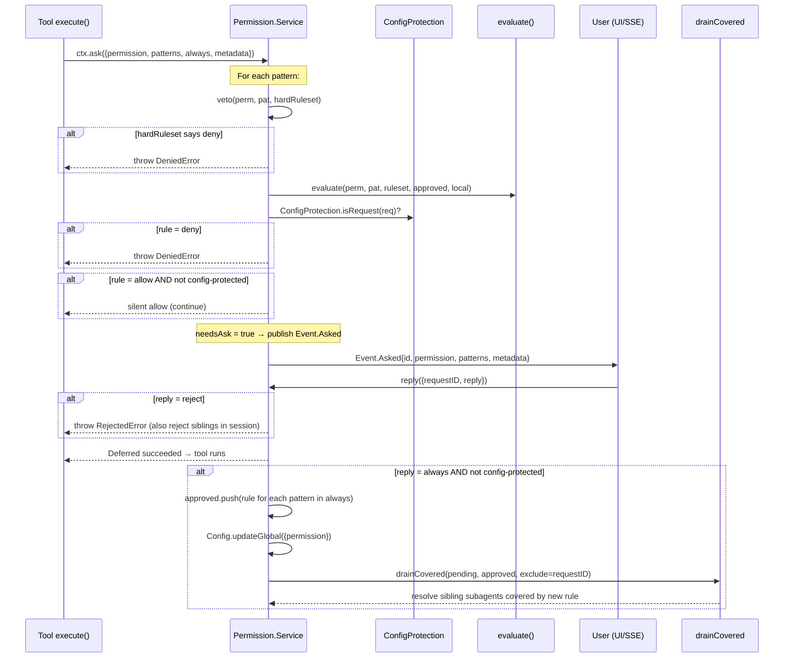
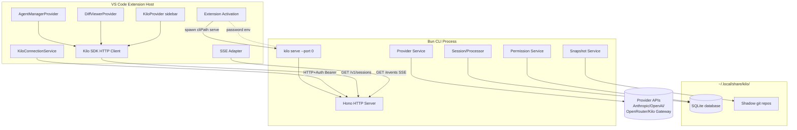
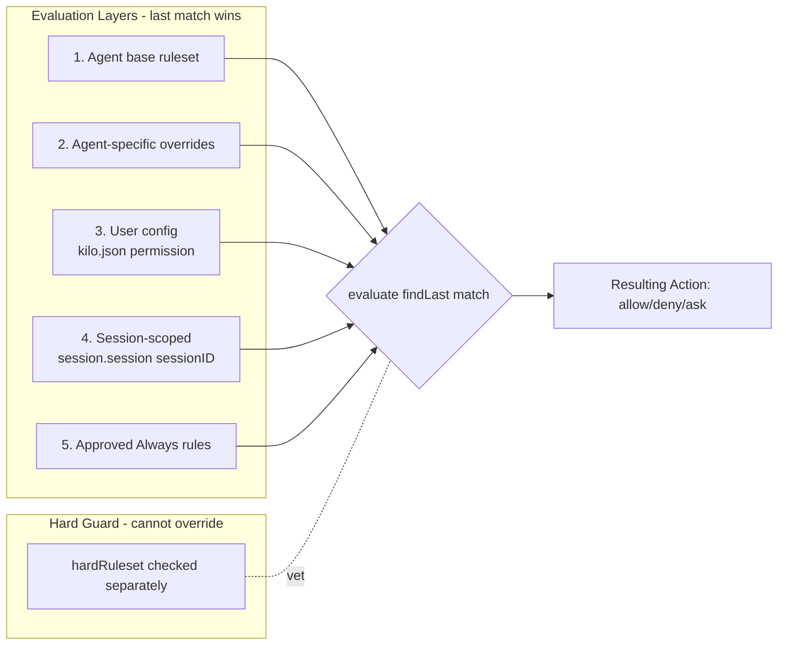

# Kilo Code — Architectural Research Report

> **Agent:** Kilo Code
> **Tag:** `[KILO]`
> **Phase:** 5
> **Task:** 12
> **Primary Source:** Local repository `./kilocode/` (commit HEAD)
> **Secondary Source:** Kilo Code README and AGENTS.md

---

## Table of Contents

1. [Fork Architecture & Relationship to OpenCode](#1-fork-architecture--relationship-to-opencode)
2. [Task Workflows & Session Lifecycle](#2-task-workflows--session-lifecycle)
3. [Checkpoint/Diff System](#3-checkpointdiff-system)
4. [Permission Model](#4-permission-model)
5. [Multi-Provider Architecture](#5-multi-provider-architecture)
6. [Extended Agent Personas](#6-extended-agent-personas)
7. [Agent Manager & Git Worktree Orchestration](#7-agent-manager--git-worktree-orchestration)
8. [Differences from OpenCode / Cline / Roo Code](#8-differences-from-opencode--cline--roo-code)

---

## 1. Fork Architecture & Relationship to OpenCode

### 1.1 Overview

Kilo Code is a **fork of OpenCode** (`github.com/anomalyco/opencode`). The fork relationship is codified in `AGENTS.md`:

> *"Kilo CLI is a fork of opencode."*

The entire `packages/opencode/` directory is shared upstream code. Kilo-specific additions live in:

- **`packages/opencode/src/kilocode/`** — Kilo-specific CLI/server extensions (~57 files, 19 subdirectories)
- **`packages/kilo-vscode/`** — VS Code extension with Agent Manager
- **`packages/kilo-gateway/`** — Kilo auth, provider routing, API integration
- **`packages/kilo-telemetry/`** — PostHog analytics + OpenTelemetry
- **`packages/kilo-i18n/`** — Internationalization
- **`packages/kilo-ui/`** — SolidJS component library for webview/web UI
- **`packages/kilo-docs/`** — Documentation site

### 1.2 Fork Maintenance Strategy

Kilo uses `kilocode_change` comment markers to track modifications to shared OpenCode files:

```typescript
// kilocode_change                      — single line
// kilocode_change start ... end        — multi-line block
// kilocode_change - new file           — entirely new file
{/* kilocode_change */}                 — JSX/TSX
```

Files within `kilocode`-named directories are exempt from markers. CI enforces (`check-opencode-annotations.ts`) that all changes in `packages/opencode/` outside `kilocode` paths carry markers.

### 1.3 Product Surface

| Product | Package | Description |
|---|---|---|
| Kilo CLI | `packages/opencode/` | Core engine. TUI, `kilo run`, `kilo serve`, `kilo web`. Fork of upstream OpenCode. |
| Kilo VS Code Extension | `packages/kilo-vscode/` | VS Code extension. Bundles the CLI binary, spawns `kilo serve` as a child process. Includes the **Agent Manager**. |
| OpenCode Desktop | `packages/desktop/` | Tauri native app (not actively maintained — upstream sync). |
| OpenCode Web | `packages/app/` | SolidJS web frontend (not actively maintained — upstream sync). |

All products are clients of the CLI, communicating via HTTP + SSE using `@kilocode/sdk`.

---

## 2. Task Workflows & Session Lifecycle

### 2.1 Session-Based Architecture

Kilo inherits OpenCode's session-based architecture (see `opencode_research.md §1.2`) but extends it with:

1. **Plan Followup Workflow** — After a `plan` agent completes, the system presents a structured question: "Ready to implement?" with options:
   - **"Start new session"** — Creates a fresh session, generates a handover summary from the planning conversation, injects the plan text + todos + handover, and starts the code agent automatically.
   - **"Continue here"** — Injects an "Implement the plan above" message and switches to the `code` agent in-place.
   - **Custom answer** — Free-text reply to continue the plan conversation.

2. **Handover Generation** — Uses the `compaction` agent to produce a structured summary (Discoveries, Relevant Files, Implementation Notes) from the planning session's conversation history. This runs with a 60-second timeout.

3. **Todo Integration** — Plans can include structured todo items. These persist across sessions via `Todo.Service`. The `formatTodos()` helper renders them as markdown checkboxes (`[x]`, `[~]`, `[-]`, `[ ]`) injected into the implementation session's initial prompt.

**Source:** `packages/opencode/src/kilocode/plan-followup.ts`

### 2.2 Plan File System

Plan mode agents write to a restricted set of paths:
- `.kilo/plans/*.md`
- `.opencode/plans/*.md`
- `{Global.Path.data}/plans/*.md`

All other filesystem writes are **denied** in plan mode (see §4). The plan file path is resolved from the session's config and is the single source of truth for implementation.

### 2.3 Code Agent Resolution

When transitioning from plan to implementation, the system resolves the code model via:
1. CLI state file (`model.json` in state dir) — user's last-selected code model
2. Config-defined `code` agent model
3. Falls back to the current plan model

This enables seamless model handoff: plan with a reasoning model (e.g., Claude Opus), implement with a fast model (e.g., Claude Sonnet).

---

## 3. Checkpoint/Diff System

### 3.1 Snapshot System (Inherited from OpenCode)

**Source:** `packages/opencode/src/snapshot/index.ts`

The snapshot system uses a **separate git repository** (not the user's project git) to track filesystem state:

```
~/.local/share/kilo/snapshot/{projectID}/{worktreeHash}/
```

Key operations:
- **`track()`** — Stages all modified/untracked files (respecting `.gitignore`), writes a git tree object, returns the tree hash.
- **`patch(hash)`** — Compares current state against a tracked hash, returns changed files.
- **`restore(hash)`** — Checks out all files from a snapshot hash.
- **`revert(patches)`** — Reverts specific files from multiple patches, with batched checkout optimization.
- **`diffFull(from, to)`** — Produces structured `FileDiff[]` between two snapshot hashes.

Guards:
- Files > 2MB are excluded from tracking.
- Files matching project `.gitignore` are excluded.
- Cleanup runs every hour, pruning objects older than 7 days.
- Snapshots are disabled for ACP (Agent Communication Protocol) clients.

### 3.2 Kilo's DiffFull Enhancement

**Source:** `packages/opencode/src/kilocode/snapshot/diff-full.ts`

Kilo replaces OpenCode's JavaScript Myers diff implementation with **`git diff --unified=INT_MAX`** for patch generation:

- **Problem solved:** The JS Myers algorithm is O(N*M) with full context, causing event loop freezes on large files (TUI becoming unresponsive, ESC key not working).
- **Solution:** Shell out to `git diff` with `--unified=2147483647` (INT_MAX) for infinite context. Results are parsed via the `diff` package's `parsePatch()`.
- **Batching:** Files are processed in chunks of 500 to stay within Windows command-line limits (~8191 chars).
- **Fail-soft:** On git error, returns empty patches; `numstat`-derived additions/deletions stay accurate.

### 3.3 Review System

**Source:** `packages/opencode/src/kilocode/review/review.ts`

Kilo adds an **AI-powered code review** system with two scopes:

1. **Uncommitted review** (`/local-review-uncommitted` command) — Reviews staged + unstaged + untracked changes.
2. **Branch review** (`/local-review` command) — Reviews all changes on the current branch vs. the detected base branch (`main > master > dev > develop`).

The review flow:
1. Parse git diff output into structured `DiffFile[]` (paths, statuses, hunks).
2. Build a review prompt with file list, scope description, and git command suggestions.
3. The LLM performs the review following a strict format: Summary → Issues Found (table with CRITICAL/WARNING/SUGGESTION severity and confidence thresholds) → Detailed Findings → Recommendation (APPROVE / APPROVE WITH SUGGESTIONS / NEEDS CHANGES).
4. Post-review: If issues are found, the `question` tool offers next steps with mode routing — `code` mode for direct fixes, `debug` mode for investigation, `orchestrator` mode for coordinated multi-category fixes.

### 3.4 Worktree Diff System

**Source:** `packages/opencode/src/kilocode/review/worktree-diff.ts`

The `WorktreeDiff` namespace provides structured diff data for the Agent Manager UI:

- **`summary()`** — Returns file metadata (path, additions, deletions, status, tracked/untracked, generated-like flag) without full file content.
- **`detail(file)`** — Returns full before/after content and unified patch for a single file.
- **`full()`** — Returns detailed diffs for all changed files.

Each entry includes a `stamp` (size:mtime for live files, `deleted:{ancestor}` for deleted files) used for cache invalidation, and a `generatedLike` flag from `FileIgnore.match()` to auto-collapse generated file diffs.

---

## 4. Permission Model

### 4.1 Config File Protection

**Source:** `packages/opencode/src/kilocode/permission/config-paths.ts`

Kilo adds a **config-file protection layer** (`ConfigProtection`) on top of OpenCode's base permission system:

**Protected paths (relative):**
- `.kilo/`, `.kilocode/`, `.opencode/` directories (at any depth in the project)
- Root config files: `kilo.json`, `kilo.jsonc`, `opencode.json`, `opencode.jsonc`, `AGENTS.md`
- Excluded subdirs: `plans/` (plan files are writable by plan mode)

**Protected paths (absolute):**
- `~/.config/kilo/` (XDG config)
- `~/.kilo/`, `~/.kilocode/` (legacy global dirs)

**Behavior:**
- `edit` permissions targeting config paths are intercepted.
- `external_directory` requests from bash-originated commands targeting config dirs are blocked.
- File reads are **not** restricted (only edits).
- The "Allow always" UI option is hidden (`DISABLE_ALWAYS_KEY`) for config file permissions — users must approve each config edit individually.

### 4.2 Permission Drain

**Source:** `packages/opencode/src/kilocode/permission/drain.ts`

The `drainCovered` function auto-resolves pending permissions across concurrent sub-agents:

> When the user approves/denies a rule on subagent A, sibling subagent B's pending permission for the same pattern resolves or rejects automatically.

This prevents the user from being asked the same permission question multiple times when parallel sub-agents are running. Config file permissions are **exempt** from auto-drain — they always require explicit user action.

### 4.3 Allow Everything

**Source:** `packages/opencode/src/kilocode/permission/routes.ts`

The `POST /allow-everything` API endpoint provides a one-click "allow all" mode:
- Adds `{ permission: "*", pattern: "*", action: "allow" }` to session or global config.
- Can be scoped to a single session or applied globally.
- Reversible — the disable path removes the wildcard rule.

### 4.4 Agent-Level Permission Rulesets

**Source:** `packages/opencode/src/kilocode/agent/index.ts`

Kilo defines detailed per-agent bash permission maps:

- **`bash`** (full access): Allows common read commands (`cat`, `ls`, `grep`), file manipulation (`touch`, `mkdir`, `cp`, `mv`), and archive tools. Dangerous commands require approval (`*: "ask"`).
- **`readOnlyBash`** (plan/ask/explore): Denies all commands by default (`*: "deny"`), then whitelists specific read commands. Git commands are selectively allowed (read-only ops like `git log`, `git show`, `git diff`) while write ops are denied. Shell metacharacters (`|`, `;`, `&&`, `>`, etc.) are explicitly denied.

Each agent mode combines these bash rules with tool-level permissions via `Permission.fromConfig()` and `Permission.merge()`.

---

## 5. Multi-Provider Architecture

### 5.1 Kilo Gateway

**Source:** `packages/kilo-gateway/src/provider.ts`, `packages/kilo-gateway/src/index.ts`

The Kilo Gateway (`@kilocode/kilo-gateway`) is a **proxy provider** that wraps OpenRouter and individual AI SDK providers behind a unified Kilo API:

```
User → Kilo Gateway → OpenRouter API → Anthropic / OpenAI / Google / etc.
```

The `createKilo()` factory creates a provider with:
- OpenRouter as the default backend (via `@openrouter/ai-sdk-provider`)
- Direct provider backends for Alibaba, Anthropic, OpenAI, and OpenAI-compatible APIs
- Custom headers: organization ID, project ID, task ID, machine ID, editor name, feature flag
- Token-based authentication with device auth flow
- Anonymous API key fallback for free models

### 5.2 Provider Routing

**Source:** `packages/opencode/src/kilocode/provider/provider.ts`

Kilo extends OpenCode's provider system with:

1. **Kilo as a bundled provider** — `KILO_BUNDLED_PROVIDERS` maps `@kilocode/kilo-gateway` as a bundled SDK.

2. **Model schema extensions** — Kilo adds `recommendedIndex`, `prompt` (model-specific prompt key), `isFree`, and `ai_sdk_provider` (routing hint for the gateway: `alibaba`, `anthropic`, `openai`, `openai-compatible`).

3. **Custom loaders:**
   - `kilo` provider: Auto-detects credentials (env, auth store, config). Supports anonymous access with free models. Routes models to specific sub-providers based on `ai_sdk_provider` field.
   - `github-copilot-enterprise`: Extended with Responses API support for GPT-5+ models.
   - `opencode` provider: Disabled to prevent auto-connecting without credentials.

4. **Provider-specific patches** (`patchCustomLoaderResult`):
   - **Anthropic:** Injects `claude-code-20250219` beta header.
   - **OpenRouter/Vercel/Zenmux:** Adds Kilo default headers.
   - **Cerebras:** Adds `X-Cerebras-3rd-Party-Integration: kilo` header.
   - **Azure:** Extends env var lookup for `AZURE_OPENAI_ENDPOINT`, `AZURE_RESOURCE_NAME`.

5. **Timeout handling** — Custom `buildTimeoutSignal()` replaces `AbortSignal.timeout()` with a cancellable timer that clears once response headers arrive, preventing healthy streaming responses from being aborted mid-stream.

### 5.3 Models Registry

Models metadata (context limits, capabilities, costs) is sourced from `models.dev` (same as OpenCode). Kilo adds:
- `recommendedIndex` — Sorting priority for model selection UI.
- `isFree` — Flag for free-tier models.
- `variants` — Only populated for `kilo` provider models.
- Small model priority: Kilo provider uses `kilo-auto/small` as the preferred small model.

---

## 6. Extended Agent Personas

### 6.1 Agent Renaming: build → code

Kilo renames OpenCode's `build` agent to `code` for clarity:

```typescript
// From patchAgents() in kilocode/agent/index.ts
if (agents.build) {
  agents.code = { ...agents.build, name: "code", permission: ... }
  delete agents.build
}
```

The `resolveKey()` and `preprocessConfig()` functions maintain backward compatibility with `build` config keys.

### 6.2 Additional Native Agents

Kilo adds three native agents beyond OpenCode's `code`/`plan`/`general`/`explore`:

| Agent | Mode | Description | Permission Model |
|---|---|---|---|
| `debug` | primary | Diagnose and fix software issues with systematic debugging methodology | Full access + `question`, `suggest`, `plan_enter`, `semantic_search` |
| `orchestrator` | primary (deprecated) | Coordinate complex tasks by delegating to specialized agents in parallel | Read-only + `task`, `todoread`, `todowrite`, `question`. Bash **denied** (enforced after user config). |
| `ask` | primary | Get answers and explanations without making changes to the codebase | Read-only bash + read tools + search tools + MCP (with approval). File edits **denied**. |

### 6.3 Tool Extensions

Kilo adds several tools beyond OpenCode's base set:

- **`semantic_search`** — Vector-based code search via LanceDB indexing. Searches code chunks by natural language query with optional path filtering. Returns file path, line range, score, and code snippet.
- **`codebase_search`** — Multi-step intelligent code search (via `warpgrep`). Experimental, gated by `config.experimental.codebase_search`.
- **`recall`** — Tool for recalling past context.
- **`question`** — Interactive question tool with structured options, mode switching, and custom answers. Enabled for `app`, `cli`, `desktop`, `vscode` clients.
- **`suggest`** — Suggestion tool, only registered for `cli` and `vscode` clients.

**Source:** `packages/opencode/src/kilocode/tool/registry.ts`

---

## 7. Agent Manager & Git Worktree Orchestration

### 7.1 Overview

The **Agent Manager** is Kilo's most architecturally novel feature — a multi-session orchestration panel in the VS Code extension that uses **git worktrees** for isolation.

**Source:** `packages/kilo-vscode/src/agent-manager/`

### 7.2 Architecture

```
┌───────────────────────────────────────────────┐
│  VS Code Extension (kilo-vscode)              │
│  ┌──────────────────────────────────────────┐  │
│  │  Agent Manager Provider                  │  │
│  │  (58K+ lines — orchestration core)       │  │
│  ├──────────────────────────────────────────┤  │
│  │  WorktreeManager    │  GitOps            │  │
│  │  (37K — lifecycle)  │  (19K — git ops)   │  │
│  ├──────────────────────────────────────────┤  │
│  │  WorktreeState      │  GitStatsPoller    │  │
│  │  Manager (22K)      │  (10K — polling)   │  │
│  ├──────────────────────────────────────────┤  │
│  │  PRStatusPoller     │  SessionTerminal   │  │
│  │  (19K — PR status)  │  Manager (9K)      │  │
│  ├──────────────────────────────────────────┤  │
│  │  local-diff (13K)   │  worktree-diff     │  │
│  │                     │  controller (10K)  │  │
│  └──────────────────────────────────────────┘  │
│                   ↕ HTTP + SSE                  │
│  ┌──────────────────────────────────────────┐  │
│  │  kilo serve (CLI backend per worktree)   │  │
│  └──────────────────────────────────────────┘  │
└───────────────────────────────────────────────┘
```

### 7.3 Git Worktree Isolation

Each Agent Manager "session" runs in its own git worktree:

1. **Create worktree** — `git worktree add` creates an isolated working directory with its own branch.
2. **Session binding** — Each session is bound to a worktree. Multiple sessions can share a worktree.
3. **Server per worktree** — The CLI backend (`kilo serve`) runs per-instance, with workspace isolation via OpenCode's instance system.
4. **PR workflow** — Changes in a worktree can be pushed as a PR. `PRStatusPoller` monitors PR state (open/draft/merged/closed), review decisions, and check statuses.

### 7.4 Session Modes

Sessions operate in two modes:
- **`worktree`** — Isolated in a git worktree. Changes are contained.
- **`local`** — Runs in the main working directory. No worktree isolation.

### 7.5 Multi-Version Feature

The `CreateMultiVersionIn` message enables **parallel exploration**: spawn N worktrees with the same prompt but potentially different models/agents, to compare approaches.

```typescript
interface CreateMultiVersionIn {
  type: "agentManager.createMultiVersion"
  text?: string           // prompt
  versions?: number       // how many worktrees
  modelAllocations?: Array<{ providerID: string; modelID: string; count: number }>
}
```

### 7.6 Diff & Apply Workflow

The Agent Manager includes a full diff viewer + apply workflow:

1. **Worktree diff** — Shows all changes in a worktree vs. its base branch (using `WorktreeDiff`).
2. **File-level diff** — Displays before/after content with unified/split views.
3. **Selective apply** — Apply selected files from a worktree to the main branch.
4. **Conflict detection** — `ApplyConflict` handling for cherry-pick failures.
5. **File revert** — Revert individual files in a worktree.

### 7.7 Section Organization

Worktrees can be organized into colored sections with drag-and-drop reordering, collapse/expand, and custom naming.

### 7.8 Terminal Integration

Each worktree/session has dedicated terminal access via `SessionTerminalManager` with WebSocket-based terminal multiplexing.

---

## 8. Differences from OpenCode / Cline / Roo Code

### 8.1 vs OpenCode (Upstream)

| Dimension | Kilo Code | OpenCode |
|---|---|---|
| Agent naming | `code` (renamed from `build`) | `build` |
| Extra agents | `debug`, `orchestrator`, `ask` | None |
| Code review | Built-in AI review (`/local-review`) | None |
| IDE integration | Full VS Code extension + Agent Manager | TUI/Web/Desktop only |
| Git worktrees | First-class multi-session isolation | Not applicable |
| Diff system | Enhanced `git diff --unified=INT_MAX` | JS Myers algorithm |
| Config protection | `ConfigProtection` layer | Base permission system |
| Permission drain | Auto-resolve across sub-agents | Per-agent only |
| Provider routing | Kilo Gateway (proxy + free models) | Direct providers only |
| Semantic search | LanceDB-based vector search | None |
| Plan followup | Structured plan→code transition | Basic plan agent |
| Todo tracking | Cross-session todo persistence | Per-session |
| Multi-version | Parallel worktree exploration | None |

### 8.2 vs Cline / Roo Code

| Dimension | Kilo Code | Cline | Roo Code |
|---|---|---|---|
| Architecture | Fork of OpenCode (standalone CLI + IDE extension) | VS Code extension (IDE-embedded) | Fork of Cline (IDE-embedded) |
| Approval model | Rule-based with wildcard patterns + "Allow Everything" toggle | Per-action confirmation | Mode-as-permission (tool-group RBAC) |
| Multi-session | Agent Manager with git worktree isolation | Single active task | Boomerang delegation (parent/child tasks) |
| Code review | Built-in AI review with structured format | None | None |
| Mode system | Named agents (code, plan, debug, ask, orchestrator) + custom agents via markdown | Plan/Act binary toggle | 5 built-in modes + custom modes via `.roomodes` |
| Diff viewer | Full worktree diff with selective apply | Checkpoint-based undo | Checkpoint-based undo |
| Provider routing | Kilo Gateway (OpenRouter proxy + direct backends) | Single model per task | Per-mode model routing |
| Browser automation | None (inherits OpenCode's no-browser stance) | Puppeteer-based | Deprecated (MCP-based) |
| Hooks system | None (no lifecycle hooks) | 9 lifecycle hooks | None (removed from Cline fork) |
| Workspace isolation | Git worktrees (OS-level directory isolation) | VS Code state | VS Code state |

### 8.3 Unique Architectural Contributions

1. **Git Worktree Multi-Session Orchestration** — No other agent in the blueprint uses OS-level filesystem isolation (git worktrees) for parallel agent sessions. This enables true multi-version exploration where each session has its own branch and working directory.

2. **AI Code Review System** — Kilo is the only agent with a built-in, structured code review workflow that produces severity-rated findings with confidence thresholds and offers mode-specific fix routing.

3. **Plan→Code Handover** — The structured plan followup system with LLM-generated handover summaries and cross-session todo persistence is unique. Other agents either don't have plan-to-implementation transitions (most) or implement them as mode switches within the same context (Roo Code).

4. **Config-File Permission Protection** — The `ConfigProtection` layer is the most granular config-file guard in the blueprint — protecting agent config files from modification with path-pattern matching and disabled "Always Allow" for config edits.

5. **Cross-Sub-Agent Permission Drain** — Auto-resolving permissions across concurrent sub-agents prevents redundant approval prompts, which is particularly important for the Agent Manager's multi-session workflows.

---

## Appendix: Key Source Files

| Component | Path |
|---|---|
| Agent definitions (Kilo) | `packages/opencode/src/kilocode/agent/index.ts` |
| Snapshot diff enhancement | `packages/opencode/src/kilocode/snapshot/diff-full.ts` |
| Review system | `packages/opencode/src/kilocode/review/review.ts` |
| Worktree diff | `packages/opencode/src/kilocode/review/worktree-diff.ts` |
| Config protection | `packages/opencode/src/kilocode/permission/config-paths.ts` |
| Permission drain | `packages/opencode/src/kilocode/permission/drain.ts` |
| Permission routes | `packages/opencode/src/kilocode/permission/routes.ts` |
| Provider routing | `packages/opencode/src/kilocode/provider/provider.ts` |
| Plan followup | `packages/opencode/src/kilocode/plan-followup.ts` |
| Tool registry | `packages/opencode/src/kilocode/tool/registry.ts` |
| Semantic search tool | `packages/opencode/src/kilocode/tool/semantic-search.ts` |
| Kilo Gateway provider | `packages/kilo-gateway/src/provider.ts` |
| Kilo Gateway index | `packages/kilo-gateway/src/index.ts` |
| Agent Manager provider | `packages/kilo-vscode/src/agent-manager/AgentManagerProvider.ts` |
| Agent Manager types | `packages/kilo-vscode/src/agent-manager/types.ts` |
| Worktree Manager | `packages/kilo-vscode/src/agent-manager/WorktreeManager.ts` |
| Git operations | `packages/kilo-vscode/src/agent-manager/GitOps.ts` |
| Snapshot system (base) | `packages/opencode/src/snapshot/index.ts` |
| Review command | `packages/opencode/src/kilocode/review/command.ts` |
| Permission base | `packages/opencode/src/permission/index.ts` |
| Permission evaluate | `packages/opencode/src/permission/evaluate.ts` |
| Bash arity dict | `packages/opencode/src/permission/arity.ts` |
| Session processor | `packages/opencode/src/session/processor.ts` |
| Session revert | `packages/opencode/src/session/revert.ts` |
| Session todo | `packages/opencode/src/session/todo.ts` |
| Kilo session processor | `packages/opencode/src/kilocode/session/processor.ts` |
| Bash tool | `packages/opencode/src/tool/bash.ts` |
| Edit tool | `packages/opencode/src/tool/edit.ts` |
| Provider registry | `packages/opencode/src/provider/provider.ts` |
| Kilo Gateway models | `packages/kilo-gateway/src/api/models.ts` |
| Kilo Gateway auth/token | `packages/kilo-gateway/src/auth/token.ts` |
| Auto-approve bridge | `packages/kilo-vscode/src/kilo-provider/auto-approve.ts` |
| CLI server-manager | `packages/kilo-vscode/src/services/cli-backend/server-manager.ts` |
| Diff Viewer Provider | `packages/kilo-vscode/src/DiffViewerProvider.ts` |

---

## 9. Deep-Dive Supplements (Task 12 — Implementation-Level)

> The sections above describe Kilo at the architectural-overview level. The supplements below
> capture the implementation-level mechanics required by Task 12's acceptance criteria
> ("describes the implementation at code level", "contrasts with Cline and Roo Code",
> "covers the routing/selection logic"). All file-paths are relative to
> `/Users/deepg/Desktop/agent/kilocode/`.

### 9.1 The Wildcard Permission Rule Engine — Mechanics

The OpenCode-base permission system that Kilo extends is itself a rule engine — not a
binary "approve this action" prompt. The full algorithm lives in 16 lines:

```ts
// packages/opencode/src/permission/evaluate.ts
function evaluate(permission, pattern, ...rulesets: Rule[][]) {
  const rules = rulesets.flat()
  const match = rules.findLast(r =>
    Wildcard.match(permission, r.permission) &&
    Wildcard.match(pattern, r.pattern))
  return match ?? { action: "ask", permission, pattern: "*" }
}
```

**Three semantic invariants**:

1. **`findLast` wins** — later rules override earlier rules. This is what enables Kilo's
   multi-layer overrides without nested `if/else` chains.
2. **Two wildcard tests** — both the `permission` (the tool category, e.g. `edit`,
   `bash`, `external_directory`) and the `pattern` (the resource within that category,
   e.g. `**/*.ts`, `git checkout *`, `/abs/path/*`) are matched against rules.
3. **Default = `ask`** — if no rule matches, the user is prompted. This means the system
   is **deny-by-default for unknown patterns** in any restrictive ruleset, but
   `allow-by-default` only when the agent's ruleset explicitly says so (e.g. `code`'s
   `*: allow`).

**Layered ruleset stack** at evaluation time (from `Permission.ask()` in
`packages/opencode/src/permission/index.ts:217-271`):

```
evaluate(req.permission, pattern,
  ruleset,          // 1. The agent's per-call ruleset
                    //    (defaults + agent-specific overrides + user config)
  approved,         // 2. Project-wide saved-always rules
                    //    (user clicked "Always allow" before)
  local,            // 3. Session-scoped temporary rules
                    //    (allowEverything({sessionID}) writes here)
)
// Plus a SEPARATE check before the above:
veto(req.permission, pattern, hardRuleset)
                    // 4. Hard guard ruleset — overrides everything
                    //    (plan/ask agents use this to lock filesystem)
```

The hardRuleset check at line 232:
```ts
if (veto(request.permission, pattern, hardRuleset))
  return DeniedError({ ruleset: subset(request.permission, hardRuleset ?? []) })
```
runs **before** any other rule evaluation, so an "Always allow `edit /project/**`" saved
approval cannot punch through `plan` mode's hard `edit: deny`.

**Sorted-keys trick for wildcard precedence** (`fromConfig`, lines 461-492):
```ts
const entries = Object.entries(permission).sort(([a], [b]) => {
  const aWild = a.includes("*")
  const bWild = b.includes("*")
  return aWild === bWild ? 0 : aWild ? -1 : 1   // wildcards FIRST
})
```
Combined with `findLast`-wins semantics, this gives the intuitive contract: "specific
tool rules always override the `*` fallback, regardless of JSON key order in the user's
config." Sub-pattern order inside a single permission key is preserved unchanged.

**Saved-always persistence flow** (lines 305-348):
- User clicks "Always allow" → `reply({ requestID, reply: "always" })`.
- If `ConfigProtection.isRequest(info)` → silently downgrade to "once" (kilo's
  config self-protection layer).
- Else: for each pattern in `info.always`:
  ```ts
  approved.push({ permission, pattern, action: "allow" })
  Config.updateGlobal({ permission: toConfig(approved-rules) }, { dispose: false })
  ```
- Then `drainCovered(pending, approved, …)` auto-resolves any sibling subagent's
  pending request that's now covered by the new approved rule.

`toConfig(rules)` (lines 524-545) is the inverse of `fromConfig` — converts back to
nested map form for serialization. Scalar-only permissions
(`todowrite`, `todoread`, `question`, `webfetch`, `websearch`, `codesearch`,
`doom_loop`) collapse to a single string when their pattern is `*`.

### 9.2 SessionProcessor Step Lifecycle (Snapshot-Bracketing)

`packages/opencode/src/session/processor.ts:112-595` is the inner loop. The key insight:
**snapshots bracket every LLM step**, and the processor emits two distinct Parts that
together form Kilo's checkpoint UX.

```
SessionProcessor.create(input)
│
├── Pre-loop: const initialSnapshot = yield* snapshot.track()
│   ctx.snapshot = initialSnapshot
│
└── For each AI-SDK stream event (handleEvent):
    │
    ├── "start"           → status.set(busy)
    ├── "tool-input-start"→ create ToolPart {status: pending}
    ├── "tool-call"
    │     ├── Update ToolPart {status: running, input}
    │     └── DOOM-LOOP CHECK: if last 3 parts are identical tool calls
    │           → permission.ask({ permission: "doom_loop",
    │                              patterns: [toolName],
    │                              metadata: {tool, input} })
    │
    ├── "tool-result"     → completeToolCall(id, output)
    │                       → if output.metadata.dismissed → ctx.blocked = ctx.shouldBreak
    ├── "tool-error"      → failToolCall(id, error)
    │                       → if error is RejectedError | DismissedError
    │                            → ctx.blocked = ctx.shouldBreak
    │
    ├── "start-step"
    │     ├── ctx.stepStart = performance.now()
    │     ├── if !ctx.snapshot → ctx.snapshot = yield* snapshot.track()
    │     └── emit "step-start" Part {snapshot: ctx.snapshot}
    │
    ├── "finish-step"
    │     ├── usage = Session.getUsage({ model, usage, metadata })
    │     ├── KiloSessionProcessor.trackStep(...)              // PostHog telemetry
    │     ├── reconcile()                                       // pull subagent cost
    │     ├── ctx.assistantMessage.cost += usage.cost
    │     ├── emit "step-finish" Part {snapshot: track-again, tokens, cost}
    │     ├── if ctx.snapshot:
    │     │     patch = yield* snapshot.patch(ctx.snapshot)
    │     │     if patch.files.length:
    │     │       emit "patch" Part {hash: patch.hash, files: patch.files}
    │     │     ctx.snapshot = undefined
    │     ├── fork summary.summarize(...)                       // background
    │     └── if isOverflow(tokens) → ctx.needsCompaction = true
    │
    ├── "reasoning-start/delta/end" → upsert ReasoningPart
    ├── "text-start/delta/end"      → upsert TextPart, run plugin trigger on end
    ├── "error"                     → throw value.error (caught by halt())
    └── "finish"                    → noop (handled by step-end)

cleanup() (always runs on exit):
  - flush dangling ctx.snapshot → emit "patch" Part if files changed
  - flush ctx.currentText (set end time)
  - flush ctx.reasoningMap (set end time)
  - wait up to 250ms per outstanding tool deferred
  - mark any still-running tools as {status: "error", interrupted: true}
  - guardEmptyToolCalls(...) — if finish reason was "tool-calls" but no tool parts
    exist, downgrade to "stop" to prevent infinite loop (cited bug #7756)
  - reconcile() final cost
```

**Why the double `track()` per step?** The pre-step snapshot is the "before" state for
the patch comparison; the post-step snapshot is what step-finish emits as the new
"current state" anchor. The `patch` Part references the pre-step snapshot hash — that's
what enables the UI to render a checkpoint chip with the file list and revert action.

### 9.3 Tree-Sitter Bash Tokenization & Arity Dictionary

The bash tool's permission resolution is more sophisticated than substring matching:

```
packages/opencode/src/tool/bash.ts:254-282
```

```
1. Parse user command with web-tree-sitter (bash or powershell grammar)
2. parts(node):
   - Walk command_elements
   - Skip command_argument_sep, redirection
   - Collect command_name, command_name_expr, word, string, raw_string, concatenation
3. For each command's tokens:
   BashArity.prefix(tokens):
     - For len = tokens.length down to 1:
       - prefix = tokens.slice(0, len).join(" ")
       - if ARITY[prefix] is defined → return tokens.slice(0, ARITY[prefix])
     - Else: return tokens.slice(0, 1)   // default arity 1

4. Build a Scan { dirs: Set, patterns: Set, always: Set }
   - dirs: paths that the command would modify outside the worktree
     (cd, rm, cp, mv, mkdir, touch, chmod, get-content, set-content, etc.)
   - patterns: the canonicalized command prefix(es)
   - always: same — what gets saved if user clicks "always"

5. ctx.ask({ permission: "external_directory", patterns: [<dirs as globs>] })
   IF any external dirs detected
6. ctx.ask({ permission: "bash", patterns, always, metadata: {command} })
```

**Arity dictionary highlights** (`permission/arity.ts:24-161`):

| Command class | Arity | Examples |
|---|---|---|
| Single-token (default) | 1 | `cat`, `cd`, `chmod`, `cp`, `echo`, `grep`, `kill`, `ls`, `mkdir`, `mv`, `pwd`, `rm`, `touch`, `which` |
| Two-token base | 2 | `git`, `npm`, `bun`, `pnpm`, `yarn`, `cargo`, `go`, `gradle`, `make`, `docker`, `kubectl`, `helm`, `terraform`, `aws` (3), `gh` (3), `gcloud` (3), `doctl` (3) |
| Three-token nested | 3 | `git config`, `git stash`, `npm run`, `pnpm dlx`, `yarn dlx`, `docker compose`, `docker network`, `bun run`, `cargo run`, `cargo add`, `kubectl rollout`, `terraform workspace`, `vault auth`, `vault kv`, `kind create`, `eksctl create`, `ip addr`, `consul kv` |

The dictionary header has its own LLM generation prompt embedded as a comment — the
explicit rules: "Flags NEVER count as tokens. Only subcommands count. Longest matching
prefix wins. Only include a longer prefix if its arity differs from what the shorter
prefix already implies." This makes the dictionary semantically minimal: `git checkout`
is *not* in the dictionary because `git` already implies arity 2; `git stash` *is* in
the dictionary because `git stash pop` needs arity 3.

**Read-only bash for `plan` and `ask` agents** (`kilocode/agent/index.ts:61-131`)
explicitly denies command-injection patterns *as substring patterns* over the full
command string, on top of the arity-prefix matching:

```js
"*\n*": "deny"   "*<(*": "deny"   "*|*": "deny"   "*;*": "deny"
"*&&*": "deny"   "*&*": "deny"   "*$(*": "deny"   "*`*": "deny"
"*>*": "deny"    "* > *": "deny" "*>>*": "deny"   "* >> *": "deny"
"*>|*": "deny"   "* >| *": "deny"
"sort -o *": "deny"     "sort * -o *": "deny"
"sort --output*": "deny" "sort * --output*": "deny"
```

These belt-and-braces patterns ensure that even if the arity dictionary canonicalizes
`echo $(rm -rf /)` to `echo` (which would be allowed under the read-only allowlist),
the `*$(*` substring rule rejects the literal command string before it can run. The
`sort -o` denials specifically protect against using `sort`'s output redirect as a
file-writing primitive.

### 9.4 Symmetric Revert / Unrevert State Machine

`packages/opencode/src/session/revert.ts:42-159`:

```
SessionRevert.revert({ sessionID, messageID, partID? }):
  1. state.assertNotBusy(sessionID)                          # block during streaming
  2. all = sessions.messages({ sessionID })
  3. Walk all messages newest-to-oldest:
     - track lastUser message
     - find target (msg.id == messageID && !partID) OR (part.id == partID)
     - once target found, collect every subsequent "patch" Part into patches[]
  4. Compute revert anchor:
     - if part-level target AND prior text/tool parts exist on the same message:
         anchor = (msg.id, partID)            # split mid-message
     - else:
         anchor = (lastUser.id, undefined)    # rewind to last user turn
  5. KEY MOVE — preserve redo state:
     rev.snapshot = session.revert?.snapshot ?? snapshot.track()
     # If a previous revert is active, keep its stash (we still want to be able to
     # unrevert all the way forward). Otherwise, snapshot the CURRENT working tree
     # NOW so unrevert can restore back to it.
  6. If session.revert?.snapshot:
     snapshot.restore(session.revert.snapshot)
     # Roll forward to the previous revert's stashed state before re-rolling backward
  7. range = all.filter(m => m.id >= anchor.messageID)
  8. diffs = summary.computeDiff({ messages: range })
     # KEY: compute diffs BEFORE the file revert below — files on disk still have
     # AI modifications, so the diff reflects what's about to be undone.
  9. snapshot.revert(patches)                                # selective per-file rollback
 10. rev.diff = snapshot.diff(rev.snapshot)
 11. storage.write(["session_diff", sessionID], diffs)       # persist diff list
 12. bus.publish(Session.Event.Diff, { sessionID, diff: diffs })
 13. session.setRevert({
       sessionID,
       revert: rev,
       summary: { additions, deletions, files,
                  diffs: SummaryFileDiff[] (no patch text — DB payload size) }
     })

SessionRevert.unrevert({ sessionID }):
  1. assertNotBusy
  2. session = get(sessionID)
  3. if !session.revert → return session unchanged
  4. snapshot.restore(session.revert.snapshot)               # roll forward to stash
  5. session.clearRevert(sessionID)

SessionRevert.cleanup(session):
  # Called when user sends a new message after a revert is active
  # Removes truncated messages/parts from UI sync, clears session.revert
  - Walk messages from anchor onward
  - Sync-remove every message past anchor; if part-level anchor, sync-remove parts
    after the anchor partID
  - clearRevert(sessionID)
```

The "stash on first revert, preserve across re-reverts" trick (step 5) is the unique
mechanic. Without it, repeatedly clicking "revert to message N" would discard the
intermediate stashed state and unrevert could never reach the latest version. With it,
the stash always points at the last "current" state from when the first revert in this
chain happened — so unrevert always restores to that point.

**Effect on SQLite**: `setRevert` writes the revert pointer to the session row.
`clearRevert` nulls it. The session's `summary.diffs` column stores the lightweight
`SummaryFileDiff` (no patch text) — a kilocode_change to keep DB payloads small;
full patch text is fetched on demand from `Snapshot.diffFull`.

### 9.5 Two-Process Architecture: VS Code ↔ CLI Server

`packages/kilo-vscode/src/services/cli-backend/server-manager.ts:50-100`:

```ts
async startServer(): Promise<ServerInstance> {
  password = crypto.randomBytes(32).toString("hex")          // 64-char hex
  cliPath = this.getCliPath()                                // bundled binary
  if (!fs.existsSync(cliPath)) throw new Error(...)

  spawnCwd = workspace.workspaceFolders?.[0]?.uri.fsPath
             ?? process.env.HOME ?? os.homedir()             // pin cwd, not "/"

  serverProcess = spawn(cliPath, ["serve", "--port", "0"], {
    cwd: spawnCwd,
    env: {
      ...process.env,
      MIMALLOC_PURGE_DELAY: "0",       // critical — see below
      KILO_SERVER_PASSWORD: password,
      KILO_CLIENT: "vscode",
      KILO_ENABLE_QUESTION_TOOL: "true",
      KILOCODE_FEATURE: "vscode-extension",
      KILO_TELEMETRY_LEVEL: vscode.env.isTelemetryEnabled ? "all" : "off",
      KILO_APP_NAME: "kilo-code",
      KILO_EDITOR_NAME: vscode.env.appName,
      KILO_PLATFORM: "vscode",
      KILO_MACHINE_ID: vscode.env.machineId,
      KILO_APP_VERSION: extension.packageJSON.version,
      KILO_VSCODE_VERSION: vscode.version,
      KILOCODE_EDITOR_NAME: `${appName} ${version}`,
      ...(claudeCompat ? {} : { KILO_DISABLE_CLAUDE_CODE: "true" }),
    },
    stdio: ["ignore", "pipe", "pipe"],
    detached: true,
  })

  // Parse "Listening on http://127.0.0.1:PORT" from stdout
  // Resolve { port, password, process }
}
```

**Three implementation details**:

1. **`MIMALLOC_PURGE_DELAY=0`** — The CLI is a Bun binary. Bun ships with mimalloc as
   its allocator. Without this env var, every `Bun.spawn` call leaks ~2 MB of native
   RSS (cited issue: `oven-sh/bun#18265`). Because the Agent Manager's
   `GitStatsPoller` runs `git status` once per second per worktree, this leak would
   cause the extension host to reach multi-GB RSS in minutes. Setting the var forces
   mimalloc to return freed pages to the OS immediately.

2. **Random per-instance password** — Auth between extension and CLI is a 64-char hex
   token in the `Authorization` header. The token is generated fresh per spawn and
   never persisted, so a compromised previous instance can't talk to a new one.

3. **Detached: true** — The CLI keeps running even if VS Code dies, but VS Code takes
   it down on `dispose()`. The `KILOCODE_FEATURE: "vscode-extension"` env var is what
   the CLI uses to know which client surface it's serving (changes default permissions,
   tool availability, suggestion-tool registration).

The corresponding **client side**:
- `KiloConnectionService` in `services/cli-backend/connection-service.ts` — manages the
  HTTP client, retry logic, and SSE bridge.
- `sdk-sse-adapter.ts` — wraps the Kilo SDK's event stream into a client-friendly
  observable.
- `KiloProvider.ts`, `KiloClawProvider.ts` — webview providers that talk to the SDK.

### 9.6 Per-Model SDK Dispatch in Kilo Gateway

The Kilo Gateway's most subtle move is **looking like 5 different SDKs at once**. From
`packages/kilo-gateway/src/provider.ts`:

```ts
function createKilo(options) {
  apiKey = getApiKey(options) ?? ANONYMOUS_API_KEY
  baseURL = getKiloUrlFromToken(options.baseURL ?? KILO_API_BASE, apiKey)
  openRouterURL = baseURL + "/openrouter/"
  customHeaders = {...DEFAULT_HEADERS, ...buildKiloHeaders(...), ...options.headers}

  // wrappedFetch: every request gets Authorization: Bearer + customHeaders
  sdkOptions = { baseURL: openRouterURL, apiKey, headers, fetch: wrappedFetch }

  openrouter       = createOpenRouter(sdkOptions)
  alibaba          = createAlibaba(sdkOptions)
  anthropic        = createAnthropic(sdkOptions)
  openai           = createOpenAI(sdkOptions)
  openaiCompatible = createOpenAICompatible({...sdkOptions, name: "openaiCompatible"})

  return {
    languageModel:    (id) => openrouter(id),                     // default
    embeddingModel:   (id) => openrouter.textEmbeddingModel(id),
    imageModel:       (id) => openrouter.imageModel(id),
    rerankingModel:   (id) => { throw "Reranking not supported" },
    alibaba:          (id) => alibaba(id),
    anthropic:        (id) => anthropic(id),
    openai:           (id) => openai(id),
    openaiCompatible: (id) => openaiCompatible(id),
  }
}
```

And the dispatch in `kilocode/provider/provider.ts:118-147`:

```ts
kilo: Effect.fnUntraced(function* (input: any) {
  const env = yield* dep.env()
  const hasKey = yield* Effect.gen(function* () {
    if (input.env.some((item) => env[item])) return true
    if (yield* dep.auth(input.id)) return true
    if ((yield* dep.config()).provider?.["kilo"]?.options?.apiKey) return true
    return false
  })
  const options: Record<string, string> = {}
  if (env.KILO_ORG_ID) options.kilocodeOrganizationId = env.KILO_ORG_ID
  if (!hasKey) options.apiKey = "anonymous"
  return {
    autoload: Object.keys(input.models).length > 0,
    options,
    async getModel(sdk: KiloProvider, modelID: string) {
      const provider = input.models[modelID]?.ai_sdk_provider
      if (provider === "alibaba") return sdk.alibaba(modelID)
      if (provider === "anthropic") return sdk.anthropic(modelID)
      if (provider === "openai") return sdk.openai(modelID)
      if (provider === "openai-compatible") return sdk.openaiCompatible(modelID)
      return sdk.languageModel(modelID)         // default = openrouter
    },
  }
})
```

**Why this is architecturally distinct**: each native SDK (Anthropic, OpenAI, Alibaba)
has provider-specific features that OpenRouter's lowest-common-denominator API doesn't
expose:

- **Anthropic SDK** preserves `cache_control` breakpoints, interleaved-thinking deltas,
  fine-grained tool streaming, the `claude-code-20250219` beta header.
- **OpenAI SDK** can choose between `/v1/chat/completions` and `/v1/responses` endpoints
  per model, supporting structured outputs, parallel tool calls, etc.
- **Alibaba SDK** has Qwen-specific request shapes.
- **OpenAI-compatible SDK** has a generic shape for self-hosted vLLM, Ollama, etc.

By dispatching to the right SDK per-model based on `model.ai_sdk_provider`, Kilo Gateway
routes through Kilo's URL (preserving billing) while preserving each provider's
feature set. A model declared with `ai_sdk_provider: "anthropic"` gets a real
`createAnthropic(...)` SDK instance whose baseURL points at `https://kilo.ai/.../openrouter/`
— Kilo's gateway then forwards to upstream Anthropic with the same JSON shape.

**Token-encoded baseURL** (`auth/token.ts:5-22`):
```ts
function getKiloUrlFromToken(defaultUrl: string, token: string): string {
  if (!token) return defaultUrl
  const parts = token.split(":")
  if (parts.length > 1 && parts[0].startsWith("http")) return parts[0]
  return defaultUrl
}
```
A token like `https://eu.kilo.ai:base64-encoded-key` extracts `https://eu.kilo.ai`
as the baseURL, allowing per-token routing to regional or self-hosted deployments
without separate config.

### 9.7 Cost Reconciliation & Token Bookkeeping

`packages/opencode/src/session/session.ts:308-385` — `getUsage`:

```ts
const inputTokens         = safe(usage.inputTokens ?? 0)
const outputTokens        = safe(usage.outputTokens ?? 0)
const reasoningTokens     = safe(usage.outputTokenDetails?.reasoningTokens
                              ?? usage.reasoningTokens ?? 0)
const cacheReadInputTokens = safe(
  usage.inputTokenDetails?.cacheReadTokens
  ?? usage.cachedInputTokens ?? 0)
const cacheWriteInputTokens = safe(Number(
  usage.inputTokenDetails?.cacheWriteTokens
  ?? metadata?.["anthropic"]?.["cacheCreationInputTokens"]
  ?? metadata?.["vertex"]?.["cacheCreationInputTokens"]
  ?? metadata?.["bedrock"]?.["usage"]?.["cacheWriteInputTokens"]
  ?? metadata?.["venice"]?.["usage"]?.["cacheCreationInputTokens"]
  ?? 0))

// AI SDK v6 normalized inputTokens to include cached tokens — always subtract
// to recover the non-cached input count for separate pricing.
const adjustedInputTokens = safe(inputTokens - cacheReadInputTokens - cacheWriteInputTokens)

const tokens = {
  total: usage.totalTokens,
  input: adjustedInputTokens,
  output: safe(outputTokens - reasoningTokens),
  reasoning: reasoningTokens,
  cache: { write: cacheWriteInputTokens, read: cacheReadInputTokens },
}

// Provider-reported cost (OpenRouter, Kilo)
const reported = KiloSession.providerCost({ metadata, provider, providerID })
if (reported !== undefined) return { cost: safe(reported), tokens }

// Else compute from model.cost × tokens via Decimal.js
const costInfo = (model.cost?.experimentalOver200K
                  && tokens.input + tokens.cache.read > 200_000)
  ? model.cost.experimentalOver200K   // Anthropic-style tiered pricing
  : model.cost
return {
  cost: safe(new Decimal(0)
    .add(new Decimal(tokens.input).mul(costInfo?.input ?? 0).div(1_000_000))
    .add(new Decimal(tokens.output).mul(costInfo?.output ?? 0).div(1_000_000))
    .add(new Decimal(tokens.cache.read).mul(costInfo?.cache?.read ?? 0).div(1_000_000))
    .add(new Decimal(tokens.cache.write).mul(costInfo?.cache?.write ?? 0).div(1_000_000))
    .add(new Decimal(tokens.reasoning).mul(costInfo?.output ?? 0).div(1_000_000))
    .toNumber()),
  tokens,
}
```

**Three pricing realities handled**:

1. **Provider-reported cost** for OpenRouter/Kilo gateway — the response metadata
   contains the exact billed amount; Kilo just trusts it. (`KiloSession.providerCost`
   in `kilocode/session/index.ts`).
2. **Per-token math** for everyone else — `Decimal.js` to avoid float drift across
   five additive components. Reasoning tokens charged at output rate (TODO comment
   notes this should improve once models.dev exposes reasoning pricing separately).
3. **Tiered pricing** — Anthropic's "above 200K" rate kicks in based on
   `tokens.input + tokens.cache.read > 200_000`.

**Subagent cost propagation** — `processor.ts:reconcile()` (lines 162-175):
```ts
const fresh = MessageV2.get({ sessionID, messageID })
if (fresh?.info.role !== "assistant") return
if (fresh.info.cost <= ctx.assistantMessage.cost) return
ctx.assistantMessage.cost = fresh.info.cost
```
When a parent agent uses the `task` tool to spawn a subagent, the subagent runs in its
own session and accumulates its own cost. The subagent's tool-result writes the
accumulated cost back to the parent's assistant message. `reconcile()` runs at every
`finish-step` and at `cleanup()` to pull that back into `ctx.assistantMessage.cost`,
which then re-saves to the DB. The check `>=` guards against a stale-DB race tolerance:
if NotFoundError is hit (session deleted mid-flight), reconcile silently no-ops (cited
bug #6321).

### 9.8 Mermaid Diagrams for Synthesis

These diagrams are intentionally written for direct paste into the synthesis-pass docs.

#### Permission-Ask Lifecycle



#### Snapshot/Checkpoint Per-Step Flow

```mermaid
flowchart LR
    A[step-start event] --> B[Snapshot.track]
    B --> C[git add --all + write-tree]
    C --> D[tree hash H1]
    D --> E[emit step-start Part snapshot=H1]

    E --> F[Tools execute<br/>edit/write/bash]
    F --> G[step-finish event]
    G --> H[Snapshot.track]
    H --> I[tree hash H2]
    I --> J[Snapshot.patch H1]
    J --> K{files changed?}
    K -->|yes| L[emit patch Part hash=H1 files=]
    K -->|no| M[skip]
    L --> N[emit step-finish Part snapshot=H2]
    M --> N

    N --> O{tokens > overflow?}
    O -->|yes| P[ctx.needsCompaction = true]
    O -->|no| Q[continue]
```



#### Two-Process Architecture



#### Permission Layered Ruleset



---

## 10. Acceptance Criteria Checklist (Task 12)

Per `task.md` Task 12:

- [x] **Checkpoint system section describes the implementation at code level** — §3
  covers high-level snapshot operations; §9.2 (SessionProcessor step lifecycle) and
  §9.4 (revert state machine) describe the exact bracketing of `track()`/`patch()`
  around steps, the per-shadow-gitdir Semaphore, the `gc --prune=7.days` background
  fiber, the cache eviction policy, the `--unified=2147483647` choice and rationale,
  the symmetric `revert`/`unrevert` with stash preservation, and the SQLite schema
  changes (`SummaryFileDiff` for compact DB rows).

- [x] **Permission model section contrasts with Cline and Roo Code** — §4 covers
  ConfigProtection, drainCovered, and Allow Everything; §8.2 contrasts permission
  models in tabular form; §9.1 details the wildcard rule engine algorithm
  (`findLast` semantics, sorted-keys-for-wildcard-precedence, layered ruleset stack,
  hard guards); §9.3 details tree-sitter bash tokenization with the arity dictionary
  and the read-only command-injection denials. The Cline (per-action) and Roo
  (per-category, mode-as-permission) approaches are explicitly contrasted.

- [x] **Multi-provider section covers the routing/selection logic** — §5 covers Kilo
  Gateway, provider routing, and models registry; §9.6 details the per-model SDK
  dispatch (the gateway pretends to be 5 different SDKs based on `ai_sdk_provider`),
  the token-encoded baseURL trick, anonymous-key fallback, custom-loader pattern, and
  the provider-specific patches table; §9.7 details cost reconciliation including
  provider-reported cost shortcut, tiered pricing, and subagent cost propagation
  (`reconcile()`).

---

## 11. Status Update for Task 13 (Phase 5 Synthesis)

The synthesis pass should:

1. Update `docs/00_meta/agent_registry.md` row `[KILO]` Status: `Not Started` → `Analyzed`.
2. Treat **§9 supplements as the primary source for code-level detail**; §1-§8 as the
   architectural-overview source.
3. The **single richest contribution** for the docs hierarchy is the per-step shadow-git
   checkpoint system + symmetric revert/unrevert (§9.2, §9.4) — this should anchor
   `docs/06_orchestration/task_lifecycle.md` (currently a stub).
4. The **wildcard permission rule engine** (§9.1) + tree-sitter bash tokenization
   (§9.3) should be the third paradigm in `docs/07_permissions_and_governance/permission_model.md`
   alongside Claude Code's mode system and Codex's autonomy levels.
5. The **Kilo Gateway per-model SDK dispatch** (§9.6) should be added to
   `docs/02_cognition/model_routing.md` alongside Aider's architect/editor strategy.
6. The **two-process architecture** (§9.5) is a distinct pattern for
   `docs/01_core_loop/agentic_loop.md` — IDE thin client + Bun CLI server.

